::: info

> **[官网命令大全](http://www.redis.cn/commands.html)**

**注**：命令不区分大小写，而key是区分大小写的，可使用 `help @类型名词` 查看

:::

## 1、什么是 Redis？

Redis（Remote Dictionary Server，远程字典服务）是一个基于 C 语言开发的开源 NoSQL 数据库。Redis 的数据是保存在**内存**中的，存储的是 KV **键值对数据**。读写速度非常快，被广泛应用于分布式缓存方向。

### 核心特点

> QPS（每秒查询率）是衡量系统处理能力的重要指标，表示系统每秒能够处理的查询请求数量。在数据库和缓存系统中，QPS是评估性能的关键参数。

1. **内存存储**：
    - 数据主要存储在内存中，读写性能极高（10万+/秒的QPS）
    - 支持异步持久化到磁盘

2. **丰富的数据结构**：
    - 不仅支持简单的key-value，还提供字符串、哈希、列表、集合、有序集合等复杂数据结构

3. **单线程模型**：
    - 采用单线程处理命令请求，避免多线程竞争
    - 使用I/O多路复用技术处理高并发连接

4. **持久化支持**：
    - 提供RDB快照和AOF日志两种持久化方式
    - Redis 4.0后支持混合持久化

5. **高可用与分布式**：
    - 支持主从复制
    - 提供Redis Sentinel实现自动故障转移
    - Redis Cluster实现分布式存储

### 主要功能

1. **缓存系统**：
    - 最常用的场景，显著减轻数据库压力
    - 支持设置过期时间、淘汰策略等

2. **计数器/速率限制**：
    - 利用INCR等原子操作实现计数
    - 实现API调用限流等场景

3. **消息队列**：
    - 通过List、Stream等类型实现
    - 支持发布/订阅模式

4. **会话存储**：
    - 分布式系统中的Session共享
    - 比Cookie更安全，比数据库更高效

5. **实时系统**：
    - 排行榜、实时统计等
    - 地理位置相关计算

Redis因其出色的性能、丰富的数据结构和可靠性，已成为现代应用架构中不可或缺的组件，与MySQL等关系型数据库形成互补，共同构建高效的数据存储解决方案。

## 2、 Redis 为什么这么快？

1. **纯内存操作 (Memory-Based Storage) ：**
   这是最主要的原因。Redis 数据读写操作都发生在内存中，避免磁盘I/O瓶颈（内存访问速度比磁盘快10万倍以上）
2. **单线程模型：**
   单线程处理所有命令请求，完全消除了多线程上下文切换和锁争用的开销。所有操作都是原子执行的，无需考虑并发安全问题。单线程可以更好地利用CPU缓存（L1/L2缓存命中率更高）
3. **I/O多路复用：**
   Redis 使用单线程事件循环配合 I/O 多路复用技术，让单个线程可以同时处理多个网络连接上的 I/O 事件（如读写），虽然是单线程，但结合内存操作的高效性和 I/O 多路复用，使得 Redis 能轻松处理大量并发请求。
4. **优化的内部数据结构 (Optimized Data Structures) ：**
   Redis 提供多种数据类型（如 String, List, Hash, Set, Sorted Set 等），其内部实现采用高度优化的编码方式（如 ziplist, quicklist, skiplist, hashtable 等）。Redis **会根据数据大小和类型动态选择最合适的内部编码**，以在性能和空间效率之间取得最佳平衡。
5. **简洁高效的通信协议 (Simple Protocol - RESP) ：**
   Redis 使用的是自己设计的 RESP (REdis Serialization Protocol) 协议。这个协议实现简单、解析性能好，并且是二进制安全的。客户端和服务端之间通信的序列化/反序列化开销很小，有助于提升整体的交互速度。

> 那既然都这么快了，为什么不直接用 Redis 当主数据库呢？主要是因为内存成本太高，并且 Redis 提供的数据持久化仍然有数据丢失的风险。

## 3、什么是 I/O 多路复用？

## 4、为什么要用 Redis？
> QPS（Query Per Second）：服务器每秒可以执行的查询次数；
1. **访问速度更快：** 传统数据库数据保存在磁盘，而 Redis 基于内存，内存的访问速度比磁盘快很多。引入 Redis 之后，我们可以把一些高频访问的数据放到 Redis 中，这样下次就可以直接从内存中读取，速度可以提升几十倍甚至上百倍。
2. **高并发：** 一般像 MySQL 这类的数据库的 QPS 大概都在 4k 左右（4 核 8g），但是使用 Redis 缓存之后很容易达到 5w+，甚至能达到 10w+（就单机 Redis 的情况，Redis 集群的话会更高）。
   由此可见，直接操作缓存能够承受的数据库请求数量是远远大于直接访问数据库的，所以我们可以考虑把数据库中的部分数据转移到缓存中去，这样用户的一部分请求会直接到缓存这里而不用经过数据库。进而，我们也就提高了系统整体的并发。
3. **功能全面：**Redis 除了可以用作缓存之外，还可以用于**分布式锁**、限流、消息队列、延时队列等场景，功能强大！

## 5、为什么用 Redis 而不用本地缓存呢？

## 1、Redis 基本数据类型
--------------

> **以前是 5 种数据类型，现在是 9 种啦~**

- String（字符串）

- Hash（哈希）

- List（列表）

- Set（集合）

- Sorted Set（有序集合）

- Bitmaps（位图）

- HyperLogLogs（基数统计）

- Geospatial（地理空间）

- Streams（流，5.0版本新增）

### 1. String（字符串）

**特点**：
- 最基本的数据类型，二进制安全
- 最大能存储512MB
- 可以是字符串、整数或浮点数

**常用命令**：
- `SET key value` / `GET key`
- `INCR key` / `DECR key`（原子增减）
- `MSET key1 value1 key2 value2` / `MGET key1 key2`
- `SETEX key seconds value`（设置值+过期时间）

**使用场景**：
- **缓存**：存储用户信息、页面缓存等
- **计数器**：网站访问量、文章阅读量（INCR命令）
- **分布式锁**：SETNX实现简单分布式锁
- **限速器**：如短信验证码发送频率限制
- **Session共享**：分布式系统中的用户会话存储

### 2. Hash（哈希）

**特点**：
- 键值对集合，适合存储对象
- 每个Hash可存储2³²-1个键值对
- 字段值只能是字符串，不支持其他数据类型嵌套

**常用命令**：
- `HSET key field value` / `HGET key field`
- `HMSET key field1 value1 field2 value2`
- `HGETALL key`（获取所有字段和值）
- `HINCRBY key field increment`（字段值增减）

**使用场景**：
- **对象存储**：用户信息（id,name,age等字段）
- **商品属性**：商品ID作为key，各种属性作为field
- **购物车**：用户ID为key，商品ID为field，数量为value
- **配置信息**：系统配置项的集合存储

### 3. List（列表）

**特点**：
- 有序的字符串列表
- 按照插入顺序排序
- 可在列表两端插入或弹出元素
- 最大长度2³²-1个元素

**常用命令**：
- `LPUSH key value` / `RPUSH key value`
- `LPOP key` / `RPOP key`
- `LRANGE key start stop`（获取指定范围元素）
- `BLPOP key timeout`（阻塞式弹出）

**使用场景**：
- **消息队列**：LPUSH+RPOP实现简单队列
- **最新消息排行**：如朋友圈时间线
- **文章评论列表**：按时间顺序存储评论
- **历史记录**：用户最近浏览记录（限制列表长度）

### 4. Set（集合）

**特点**：
- 无序的字符串集合
- 元素唯一不重复
- 支持交集、并集、差集等操作
- 最大成员数2³²-1

**常用命令**：
- `SADD key member` / `SREM key member`
- `SMEMBERS key`（获取所有成员）
- `SISMEMBER key member`（判断成员是否存在）
- `SINTER key1 key2`（求交集）

**使用场景**：
- **标签系统**：文章/商品标签
- **共同好友**：SINTER求交集
- **唯一计数器**：独立IP统计
- **抽奖系统**：存储参与者名单
- **黑白名单**：存储允许/禁止的用户ID

### 5. Sorted Set（有序集合）

**特点**：
- 每个成员关联一个分数(score)
- 按分数从小到大排序
- 成员唯一，但分数可以重复
- 底层使用跳跃表和哈希表实现

**常用命令**：
- `ZADD key score member` / `ZREM key member`
- `ZRANGE key start stop`（按分数范围获取成员）
- `ZREVRANGE key start stop`（逆序获取）
- `ZRANK key member`（获取成员排名）

**使用场景**：
- **排行榜**：游戏积分榜、热搜榜
- **带权重的队列**：优先级任务队列
- **范围查询**：如查找分数在某个区间的学生
- **延迟队列**：用时间戳作为score
- **实时统计**：如最近1小时最热商品

### 6. Bitmap（位图）

**特点**：
- 通过String类型实现的位操作
- 最大512MB，可表示约42亿个位
- 支持AND、OR、NOT、XOR等位运算

**常用命令**：
- `SETBIT key offset value` / `GETBIT key offset`
- `BITCOUNT key`（统计值为1的位数）
- `BITOP operation destkey key1 key2`（位运算）

**使用场景**：
- **用户签到**：每天对应1位，签到置1
- **活跃用户统计**：每个用户ID对应1位
- **布隆过滤器**：实现高效存在性判断
- **特征标记**：标记用户的各种属性

### 7. HyperLogLog

**特点**：
- 用于基数统计（估算集合中不重复元素数量）
- 固定使用12KB内存
- 标准误差0.81%
- 只能统计不能获取具体成员

**常用命令**：
- `PFADD key element`（添加元素）
- `PFCOUNT key`（统计基数）
- `PFMERGE destkey sourcekey`（合并多个HLL）

**使用场景**：
- **UV统计**：网站独立访客数统计
- **搜索关键词统计**：不同搜索词数量
- **大数据量去重计数**：如每天独立IP数

### 8. Geospatial（地理空间）

**特点**：
- 存储地理位置信息
- 基于Sorted Set实现
- 支持半径查询、距离计算等

**常用命令**：
- `GEOADD key longitude latitude member`
- `GEODIST key member1 member2`（计算距离）
- `GEORADIUS key longitude latitude radius unit`（半径查询）

**使用场景**：
- **附近的人**
- **地理位置搜索**
- **配送距离计算**
- **地理围栏**

### 9. Stream（流）

**特点**：
- Redis 5.0新增的数据类型
- 类似Kafka的消息队列
- 支持消费者组
- 消息持久化

**常用命令**：
- `XADD key ID field value`（添加消息）
- `XREAD [COUNT count] [BLOCK milliseconds] STREAMS key ID`
- `XGROUP CREATE key groupname ID`（创建消费者组）

**使用场景**：
- **消息队列**：替代部分MQ功能
- **事件溯源**：记录事件流
- **日志收集**：多源日志聚合

3、Redis 分布式锁
------------

> **面试官：中门来对狙**

知道分布式锁吗？有哪些实现方案？ 你谈谈对redis分布式锁的理解， 删key的时候有什么问题？
1、MySQL
2、zookeeper
3、redis

一般的互联公司用的redis实现。
### 3.1、分布式锁的面试题

> **分布式锁的常见面试题**

1.  Redis除了拿来做缓存，你还见过基于Redis的什么用法?

2.  Redis做分布式锁的时候有需要注意的问题?

3.  如果是Redis是单点部署的，会带来什么问题? 那你准备怎么解决单点问题呢?

4.  集群模式下，比如主从模式，有没有什么问题呢?

5.  那你简单的介绍一下Redlock吧? 你简历上写redisson，你谈谈

6.  Redis分布式锁如何续期?看门狗知道吗?

### 3.4、分布式锁总结

> **回顾测试 & 找茬的步骤**

1.  synchronized 锁：单机版 OK，上 nginx分布式微服务，单机锁就不 OK,
2.  分布式锁：取消单机锁，上 redis 分布式锁 `SETNX`
3.  如果出异常的话，可能无法释放锁， 必须要在 finally 代码块中释放锁
4.  如果宕机了，部署了微服务代码层面根本没有走到 finally 这块，也没办法保证解锁，因此需要有设置锁的过期时间
5.  除了增加过期时间之外，还必须要 `SETNX` 操作和设置过期时间的操作必须为原子性操作
6.  规定只能自己删除自己的锁，你不能把别人的锁删除了，防止张冠李戴，可使用 lua 脚本或者事务
7.  判断锁所属业务与删除锁的操作也需要是原子性操作
8.  redis 集群环境下，我们自己写的也不 OK，直接上 RedLock 之 Redisson 落地实现

4、Redis 缓存淘汰策略
--------------

### 4.1、缓存淘汰策略的面试题

> **Redis 缓存淘汰策略相关的面试题**

1.  生产上你们的redis内存设置多少？
2.  如何配置、修改redis的内存大小？
3.  如果内存满了你怎么办？
4.  redis 清理内存的方式？定期删除和惰性删除了解过吗
5.  redis 的缓存淘汰策略
6.  redis 的 LRU 淘汰机制了解过吗？可否手写一个 LRU 算法

### 4.2、redis 内存满了怎么办

> **redis 默认内存多少？在哪里查看? 如何设置修改?**

**1、如何查看 redis 最大占用内存**

在 redis.conf 配置文件中有一个，输入 `:set nu` 显示行号，大约在 800 多行有一个 `maxmemory` 字段，用预设值 redis 的最大占用内存

* * *

**2、redis 会占用物理机器多少内存？**

如果不设置最大内存大小或者设置最大内存大小为 0，在 64 位操作系统下不限制内存大小，在32位操作系统下最多使用 3GB 内存

* * *

**3、一般生产上如何配置 redis 的内存**

一般推荐Redis设置内存为最大物理内存的四分之三，也就是 0.75

* * *

**4、如何修改 redis 内存设置**

1.  通过修改文件配置（永久生效）：修改 maxmemory 字段，单位为字节

2.  通过命令修改（重启失效）：`config set maxmemory 104857600` 设置 redis 最大占用内存为 100MB，`config get maxmemory` 获取 redis 最大占用内存

* * *

**5、通过命令查看 redis 内存使用情况?**

通过 info 指令可以查看 redis 内存使用情况：`used_memory_human` 表示实际已经占用的内存，`maxmemory` 表示 redis 最大占用内存

> **如果把 redis 内存打满了会发生什么? 如果 redis 内存使用超出了设置的最大值会怎样?**

修改配置，故意把最大内存设置为 1byte，再通过 `set k1 v1` 命令下 redis 中写入数据，redis 将会报错：(error) OOM command not allowed when used memory > ‘maxmemory’

> **总结 & 结论**

如果设置了 `maxmemory` 的选项，假如 redis 内存使用达到上限，并且 key 都没有加上过期时间，就会导致数据写爆 redis 内存。

为了避免类似情况，于是引出下一部分的内存淘汰策略

### 4.3、redis 缓存淘汰策略

> **redis 如何删除设置了过期时间的 key**

**1、redis过期键的删除策略**

如果一个键是过期的，那它到了过期时间之后是不是马上就从内存中被被删除呢？如果回答是，那么面试官就会问你：自己走还是我送你？那么过期后到底什么时候被删除呢？edis 如何操作的呢？

通过查看 redis 配置文件可知，默认淘汰策略是【noeviction（Don’t evict anything, just return an error on write operations.）】，如果 redis 内存被写爆了，直接返回 error

> **redis 对于过期 key 的三种不同删除策略**

**1、定时删除**

立即删除能保证内存中数据的最大新鲜度，因为它保证过期键值会在过期后马上被删除，其所占用的内存也会随之释放。但是立即删除对 CPU 是最不友好的。因为删除操作会占用 CPU 的时间，如果刚好碰上了 CPU 很忙的时候，比如正在做交集或排序等计算的时候，就会给 CPU 造成额外的压力，让 CPU 心累，时时需要删除，忙死。。。。。。

这会产生大量的性能消耗，同时也会影响数据的读取操作。

**总结**：定时删除对 CPU 不友好，但对 memory 友好，用处理器性能换取存储空间（拿时间换空间）

* * *

**2、惰性删除**

惰性删除的策略刚好和定时删除相反，惰性删除在数据到达过期时间后不做处理，等下次访问该数据时发现已过期，并将其删除，并返回不存在。

使用惰性删除访问数据的特点：访问一个数据，如果发现其在过期时间之内，则返回改数据；如果发现已经过了过期时间，则将其删除，并返回不存在

如果一个键已经过期，而这个键又仍然保留在数据库中，那么只要这个过期键不被删除，它所占用的内存就不会释放。因此惰性删除策略的缺点是：它对内存是最不友好的。

在使用惰性删除策略时，如果数据库中有非常多的过期键，而这些过期键又恰好没有被访问到的话，那么它们也许永远也不会被删除（除非用户手动执行 `FLUSHDB`），我们甚至可以将这种情况看作是一种内存泄漏——无用的垃圾数据占用了大量的内存，而服务器却不会自己去释放它们，这对于运行状态非常依赖于内存的 redis 服务器来说，肯定不是一个好消息

**总结**：惰性删除对 memory 不友好，但对 CPU 友好，用存储空间换取处理器性能（拿空间换时间）

* * *

**3、定期删除**

**折中方案：定期删除**

上面两种删除策略都走极端，因此引出我们的定期删除策略。

定期删除策略是前两种策略的折中：定期删除策略每隔一段时间执行一次删除过期键操作，并通过限制删除操作执行的时长和频率来减少删除操作对 CPU 时间的影响。其做法为：周期性轮询 redis 库中的时效性数据，采用随机抽取的策略，利用过期数据占比的方式控制删除频度。

**定期删除的特点**

特点1：CPU 性能占用设置有峰值，检测频度可自定义设置

特点2：内存压力不是很大，长期占用内存的冷数据会被持续清理

总结：周期性抽查存储空间（随机抽查，重点抽查)

**定期删除的举例**

redis 默认每间隔 100ms 检查是否有过期的 key，如果有过期 key 则删除。注意：redis 不是每隔100ms 将所有的 key 检查一次而是随机抽取进行检查（如果每隔 100ms，全部 key 进行检查，redis 直接进去ICU）。因此，如果只采用定期删除策略，会导致很多 key 到时间没有删除。

**定期删除的难点**

定期删除策略的难点是确定删除操作执行的时长和频率：redis 不可能时时刻刻遍历所有被设置了生存时间的 key，来检测数据是否已经到达过期时间，然后对它进行删除。

如果删除操作执行得太频繁，或者执行的时间太长，定期删除策略就会退化成定时删除策略，以至于将 CPU 时间过多地消耗在删除过期键上面。

如果删除操作执行得太少，或者执行的时间太短，定期删除策略又会和惰性删除束略一样，出现浪费内存的情况。

因此，如果采用定期删除策略的话，服务器必须根据情况，合理地设置删除操作的执行时长和执行频率。

* * *

**总结**

惰性删除和定期删除都存在数据没有被抽到的情况，如果这些数据已经到了过期时间，没有任何作用，这会导致大量过期的 key 堆积在内存中，导致 redis 内存空间紧张或者很快耗尽

因此必须要有一个更好的兜底方案，接下来引出 redis 内存淘汰策略

> **redis 6.0.8 版本的内存淘汰策略有哪些？**

**8 种内存淘汰策略**

1.  noeviction：不会驱逐任何key
2.  allkeys-lru：对所有key使用LRU算法进行删除
3.  volatile-lru：对所有设置了过期时间的key使用LRU算法进行删除
4.  allkeys-random：对所有key随机删除
5.  volatile-random：对所有设置了过期时间的key随机删除
6.  volatile-ttl：删除马上要过期的key
7.  allkeys-lfu：对所有key使用LFU算法进行删除
8.  volatile-lfu：对所有设置了过期时间的key使用LFU算法进行删除

* * *

**总结**

1.  2个维度
1.  过期键中筛选
2.  所有键中筛选
2.  4个方面
1.  lru
2.  lfu
3.  random
4.  ttl

> **如何配置 redis 的内存淘汰策略**

1.  通过修改文件配置（永久生效）：配置 `maxmemory-policy` 字段

2.  通过命令修改（重启失效）：`config set maxmemory-policy allkeys-lru` 命令设置内存淘汰策略，`config get maxmemory-policy` 命令获取当前采用的内存淘汰策略

5、redis LRU 算法
--------------

### 5.1、LRU 算法简介

> **LRU 算法的简介**

LRU 是 Least Recently Used 的缩写，即最近最少使用，是一种常用的页面置换算法，每次选择最近最久未使用的页面予以淘汰

### 5.2、LRU 算法题来源

> [146\. LRU 缓存机制](https://leetcode-cn.com/problems/lru-cache/)

运用你所掌握的数据结构，设计和实现一个 [LRU (最近最少使用) 缓存机制](https://baike.baidu.com/item/LRU) 。

实现 `LRUCache` 类：

1.  `LRUCache(int capacity)` 以正整数作为容量 `capacity` 初始化 LRU 缓存
2.  `int get(int key)` 如果关键字 `key` 存在于缓存中，则返回关键字的值，否则返回 `-1` 。
3.  `void put(int key, int value)` 如果关键字已经存在，则变更其数据值；如果关键字不存在，则插入该组「关键字-值」。当缓存容量达到上限时，它应该在写入新数据之前删除最久未使用的数据值，从而为新的数据值留出空间。

* * *

**进阶**：你是否可以在 `O(1)` 时间复杂度内完成这两种操作？

* * *

**示例：**

    输入
    ["LRUCache", "put", "put", "get", "put", "get", "put", "get", "get", "get"]
    [[2], [1, 1], [2, 2], [1], [3, 3], [2], [4, 4], [1], [3], [4]]
    输出
    [null, null, null, 1, null, -1, null, -1, 3, 4]
    
    解释
    LRUCache lRUCache = new LRUCache(2);
    lRUCache.put(1, 1); // 缓存是 {1=1}
    lRUCache.put(2, 2); // 缓存是 {1=1, 2=2}
    lRUCache.get(1);    // 返回 1
    lRUCache.put(3, 3); // 该操作会使得关键字 2 作废，缓存是 {1=1, 3=3}
    lRUCache.get(2);    // 返回 -1 (未找到)
    lRUCache.put(4, 4); // 该操作会使得关键字 1 作废，缓存是 {4=4, 3=3}
    lRUCache.get(1);    // 返回 -1 (未找到)
    lRUCache.get(3);    // 返回 3
    lRUCache.get(4);    // 返回 4

## 总览

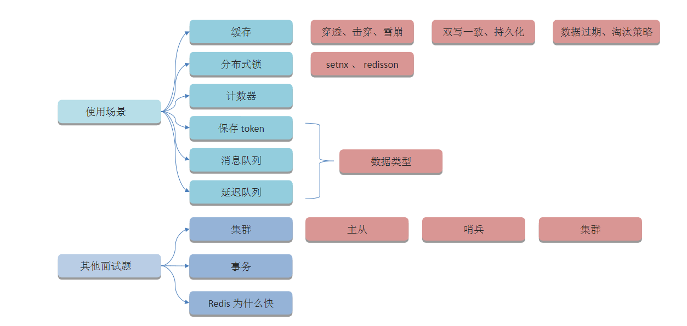

## 一 、Redis使用场景

结合业务回答，缓存。

### 1、什么是缓存穿透 ? 怎么解决 ?

1、**缓存穿透**：是指查询一个一定**不存在**的数据，如果从存储层查不到数据则不写入缓存，这将导致这个不存在的数据每次请求都要到 DB 去查询，可能导致 DB 挂掉。这种情况大概率是遭到了攻击。

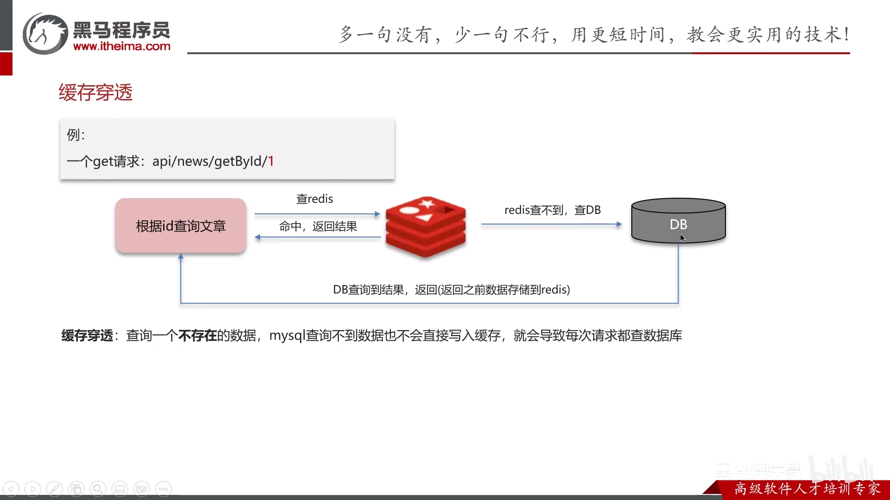

2、解决方案：
1. 缓存空数据：查询返回的数据为空，仍把这个空结果进行缓存。
> 优点：简单。缺点：消耗内存，可能发生不一致问题。

2. **布隆过滤器**，用于检索一个元素是否在一个集合中。

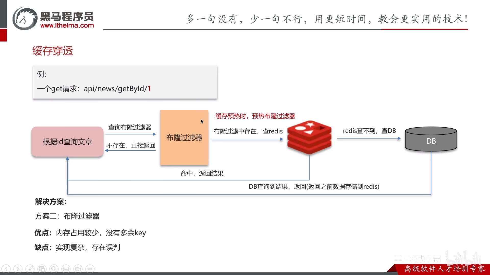

**布隆过滤器**详解：
1、概念
**bitmap (位图)**：相当于是一个以(bit) 位为单位的数组，数组中每个单元只能存储二进制数0或1
**布隆过滤器作用**：布隆过滤器可以用于检索一个元素是否在一个集合中。

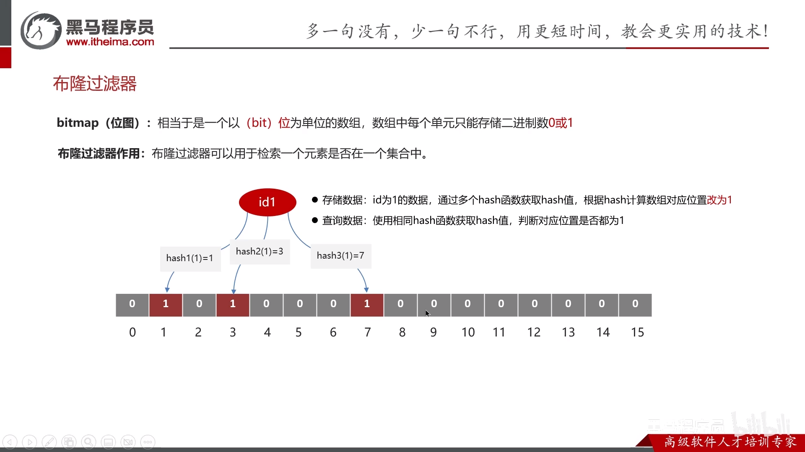

2、存在误判问题

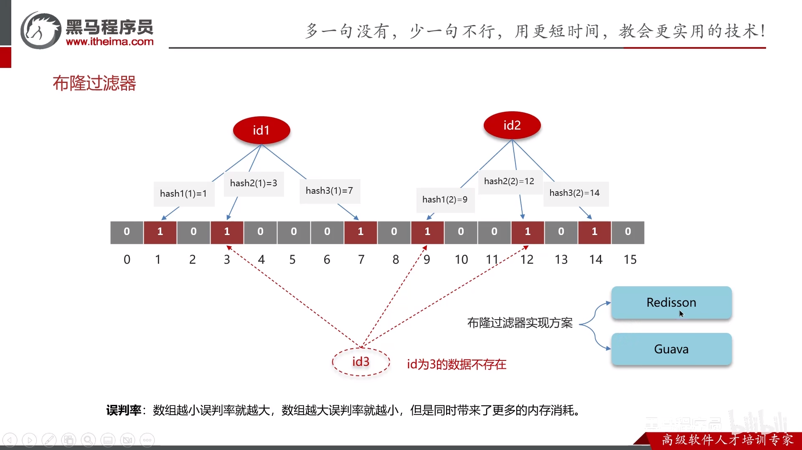

总结：

缓存穿透:查询一个不存在的数据，mysql查询不到数据也不会直接写入缓存，就会导致每次请求都查数据库
解决方案一：缓存空数据

解决方案二：布隆过滤器

- 布隆过滤器主要是用于检索一个元素是否在一个集合中。我们当时使用的是redisson实现的布隆过滤器。
- 它底层主要是先去初始化一个比较大数组，里面存放的二进制0或1。在一开始都是0，当一个key来了之后经过3次hash计算，模于数组长度找到数据的下标然后把数组中原来的0改为1，这样的话，三个数组的位置就能标明一个key的存在。查找的过程也是一样的。
- 当然是有缺点的，布隆过滤器有可能会产生一定的误判，我们一般可以设置这个误判率，大概不会超过`5%`，其实这个误判是必然存在的，要不就得增加数组的长度，其实已经算是很合适了，`5%`以内的误判率一般的项目也能接受，不至于高并发下压倒数据库。

### 2、缓存击穿

1、**缓存击穿**：给`某一个key`设置了过期时间，当key过期的时候，恰好这时间点对这个key有大量的并发请求过来，这些并发的请求可能会瞬间把DB压垮。

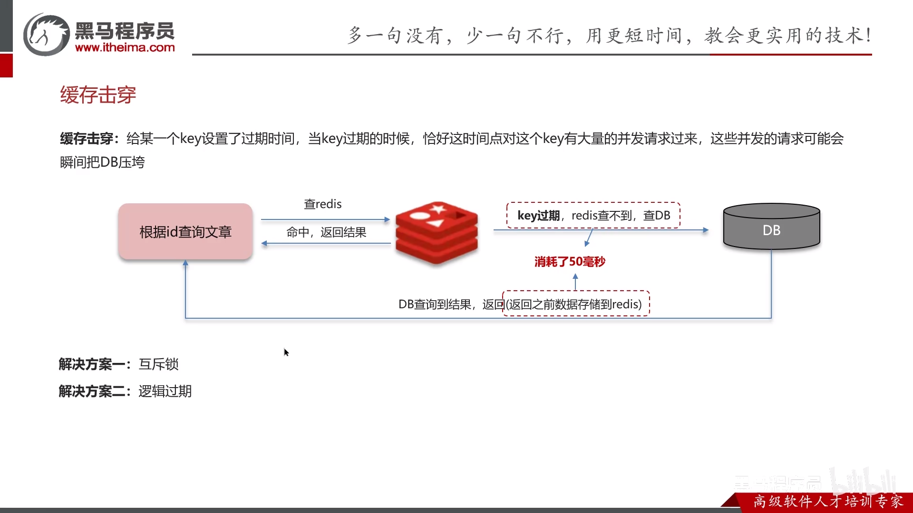

2、解决方案：
互斥锁、逻辑过期

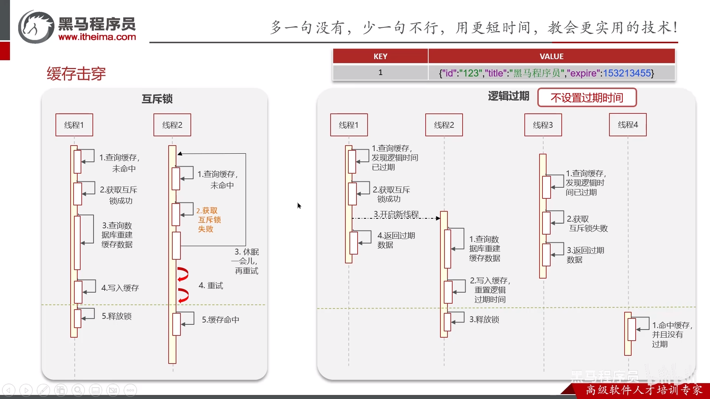
1. 互斥锁
   **强一致性、性能差**

2. 逻辑过期
   **高可用、性能优**

总结：

缓存击穿：是对于设置了过期时间的key，缓存在某个时间点过期的时候，恰好这时间点对这个Key有大量的并发请求过来，这些请求发现缓存过期一般都会从后端 DB 加载数据并回设到缓存，这个时候大并发的请求可能会瞬间把 DB 压垮。

解决方案有两种方式：
（1）使用互斥锁：当缓存失效时，不立即去load db，先使用如 `Redis` 的 `setnx` 去设置一个互斥锁，当操作成功返回时再进行 load db的操作并回设缓存，否则重试get缓存的方法
（2）设置当前key逻辑过期：大概是思路如下：
- ①：在设置key的时候，设置一个过期时间字段一块存入缓存中，不给当前key设置过期时间
- ②：当查询的时候，从redis取出数据后判断时间是否过期
- ③：如果过期则开通另外一个线程进行数据同步，当前线程正常返回数据，这个数据不是最新

当然两种方案各有利弊：
* 如果选择数据的强一致性，建议使用分布式锁的方案，性能上可能没那么高，锁需要等，也有可能产生死锁的问题
* 如果选择key的逻辑删除，则优先考虑的高可用性，性能比较高，但是数据同步这块做不到强一致。

### 3、缓存雪崩
定义：缓存雪崩是指在同一时段 **大量的缓存key同时失效** 或者 **Redis服务宕机**，导致大量请求到达数据库，带来巨大压力。

原因以及解决方案：

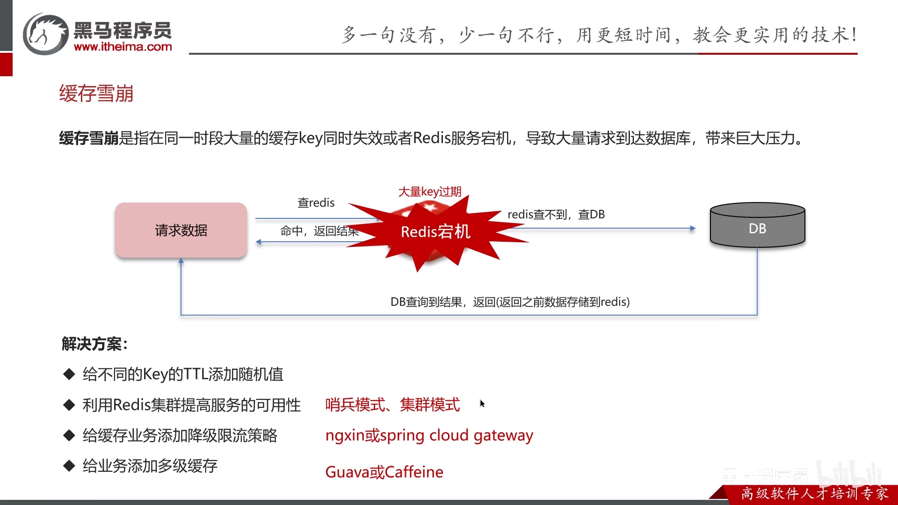

总结：
> `TTL` (Time To Live)是指键值对的过期时间

1. 缓存雪崩是指在同一时段大量的缓存key同时失效或者Redis服务宕机，导致大量请求到达数据库，带来巨大压力。

2. 解决方案
- 给不同的 Key 的 TTL 添加随机值
- 利用Redis集群提高服务的可用性
- 给缓存业务添加降级限流策略 (降级可作为系统的保底策略，适用于穿透、击穿、雪崩)
- 给业务添加多级缓存

### 4、双写一致性【Redis作为缓存，MySQL的数据如何与Redis进行同步呢？】

1. **双写一致性**：当修改了数据库的数据也要同时更新缓存的数据，缓存和数据库的数据要保持一致。
- 读操作：缓存命中，直接返回；缓存未命中查询数据库，写入缓存，设定超时时间
- 写操作：**延迟双删**

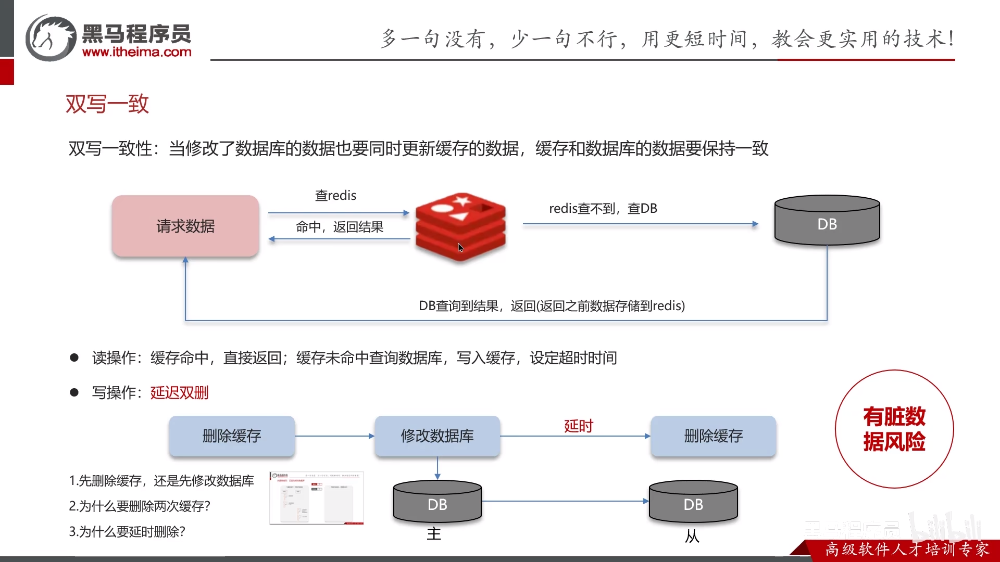

2. 延迟双删（先删除缓存，还是先删除数据库？**都不对**）
   都会造成脏数据：

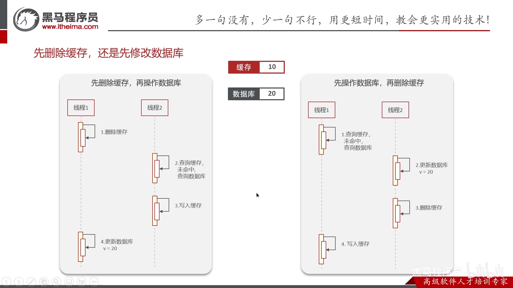

解决方法：
1. 采用分布式锁（读写锁）。【强一致性，性能差】

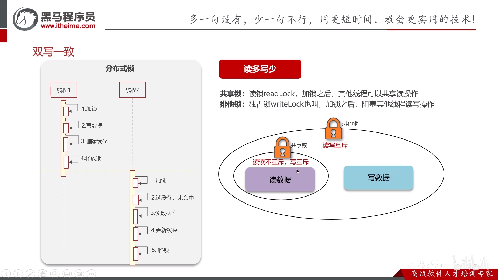
代码：

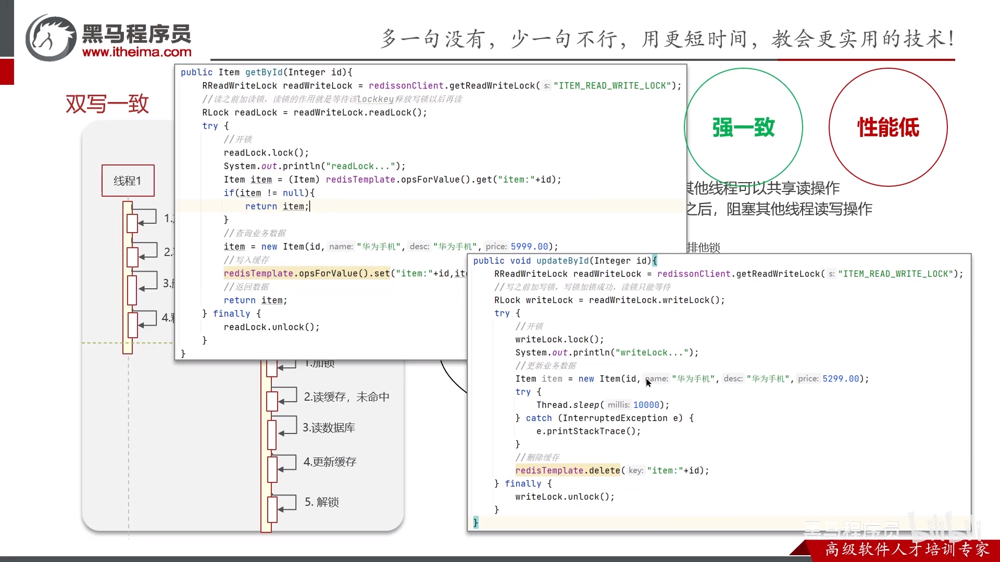

2. 异步通知
   （1） MQ

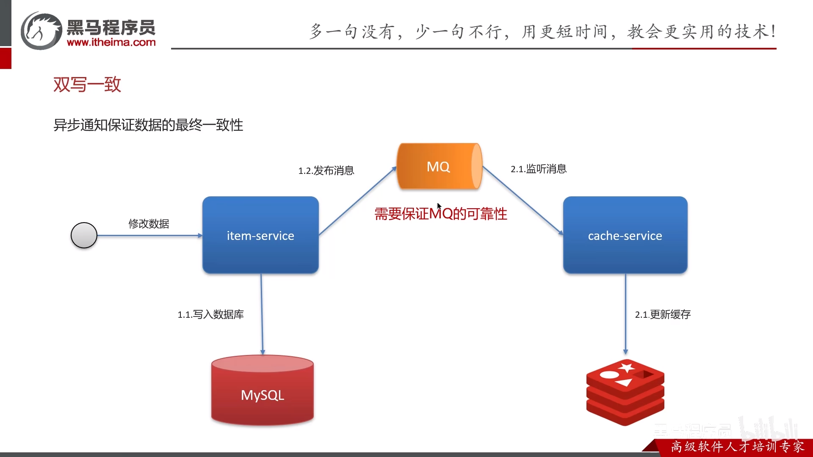

（2） 基于Canal的异步通知。【无代码嵌入】

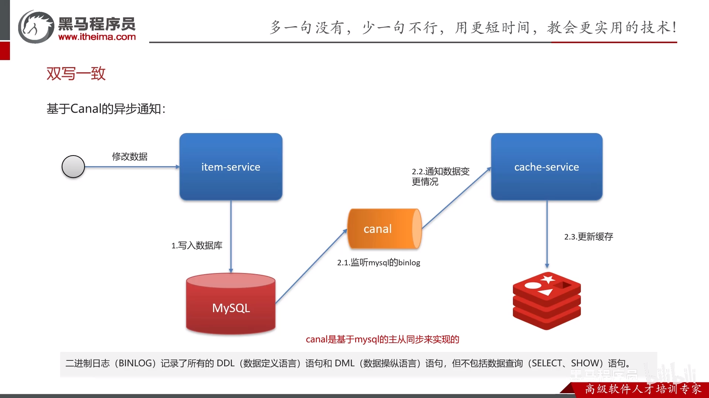

总结：

Redis作为缓存，MySQL的数据如何与Redis进行同步呢？

1. 介绍自己简历上的业务，我们当时是把文章的热点数据存入到了缓存中，虽然是热点数据，但是实时要求性并没有那么高，所以，我们当时采用的是异步的方案同步的数据。
2. 我们当时是把抢券的库存存入到了缓存中，这个需要实时的进行数据同步，为了保证数据的强一致我们当时采用的是redisson提供的读写锁来保证数据的同步.

介绍一下异步的方案？（你来介绍一下redisson读写锁的这种方案）

**允许延时一致的业务**，采用异步通知
① 使用MQ中间中间件，更新数据之后，通知缓存删除
② 利用canal中间件，不需要修改业务代码，伪装为mysql的一个从节点，canal通过读取binlog数据更新缓存

**强一致性的**，采用Redisson提供的读写锁
① 共享锁: 读锁readLock，加锁之后，其他线程可以共享读操作
② 排他锁:独占锁writeLock也叫，加锁之后，阻塞其他线程读写操作

### 5、持久化 - Redis作为缓存个，数据点持久化是怎么做的？

在Redis中提供了两种持久化的方法：RDB、AOF

1. RDB
   RDB全称Redis Database Backup file (Redis数据备份文件)，也被叫做Redis数据快照。简单来说就是把内存中的所有数据都记录到磁盘中。当Redis实例故障重启后，从磁盘读取快照文件，恢复数据
   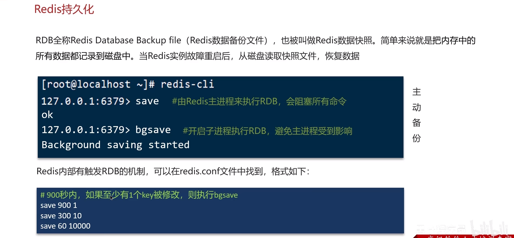

- RDB执行原理？
  bgsave开始时会fork主进程得到子进程，子进程**共享**主进程的内存数据。完成fork后读取内存数据并写入 RDB文件。

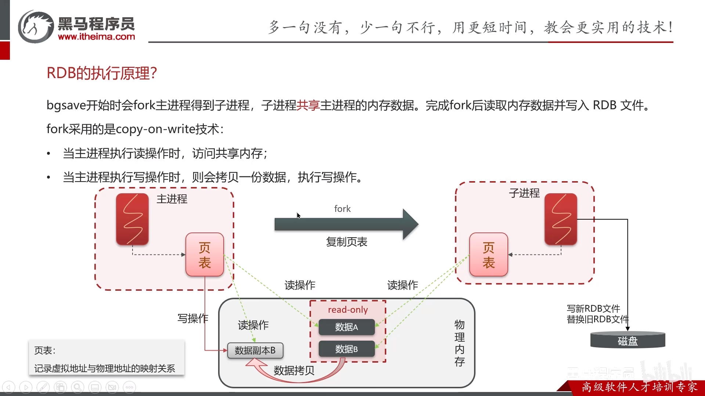

2. AOF
   AOF全称为Append Only File(追加文件)。Redis处理的每一个写命令都会记录在AOF文件，可以看做是命令日志文件。

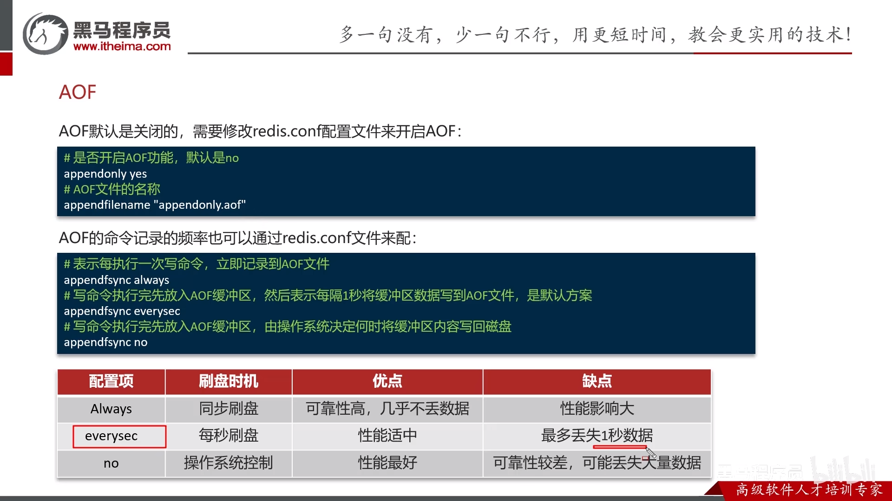

特点：
因为是记录命令，AOF文件会比RDB文件大的多。而且AOF会记录对同一个key的多次写操作，但只有最后一次写操作才有意义。通过执行**bgrewriteaof**命令，可以让AOF文件执行重写功能，用最少的命令达到相同效果。

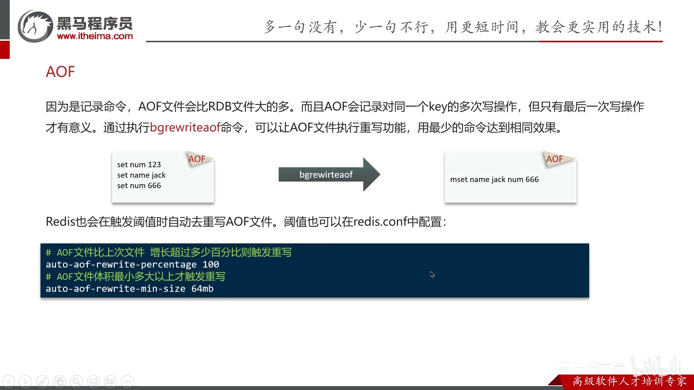

3. RDB与AOF对比

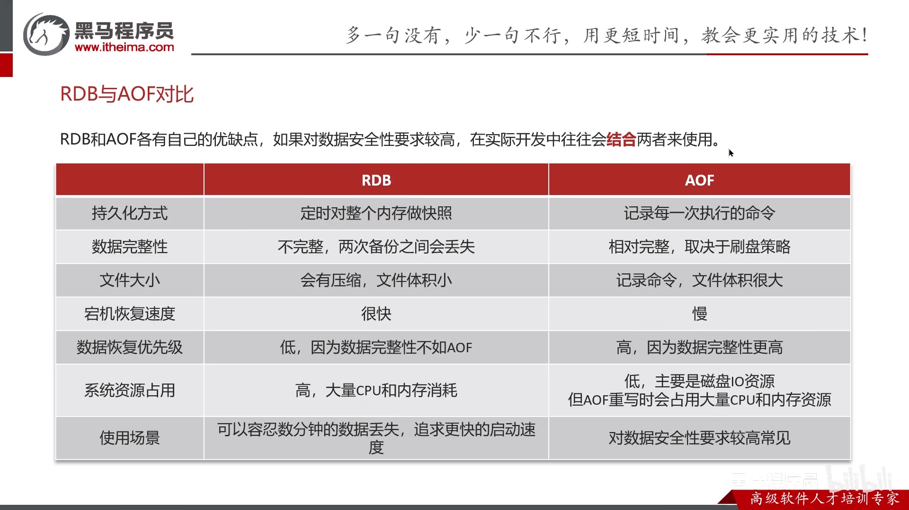

总结：

1. 在Redis中提供了两种数据持久化的方式：1、RDB  2、AOF
2. RDB是一个快照文件，它是把redis内存存储的数据写到磁盘上，当redis实例宕机恢复数据的时候，方便从RDB的快照文件中恢复数据。
3. AOF的含义是追加文件，当redis操作写命令的时候，都会存储这个文件中，当redis实例宕机恢复数据的时候，会从这个文件中再次执行一遍命令来恢复数据
4. RDB因为是二进制文件，在保存的时候体积也是比较小的，它恢复的比较快，但是它有可能会丢数据，我们通常在项目中也会使用AOF来恢复数据，虽然AOF恢复的速度慢一些，但是它丢数据的风险要小很多，在AOF文件中可以设置刷盘策略，我们当时设置的就是每秒批量写入一次命令。

### 6、数据过期（删除）策略（假如Redis的key删除过后，会立即删除吗？）
Redis对数据设置数据的有效时间，数据过期以后，就需要将数据从内存中删除掉。可以按照不同的规则进行删除，这种删除规则就被称之为数据的删除策略 (数据过期策略)。**惰性删除**、**定期删除**。

1. **Redis数据删除策略 - 惰性删除**

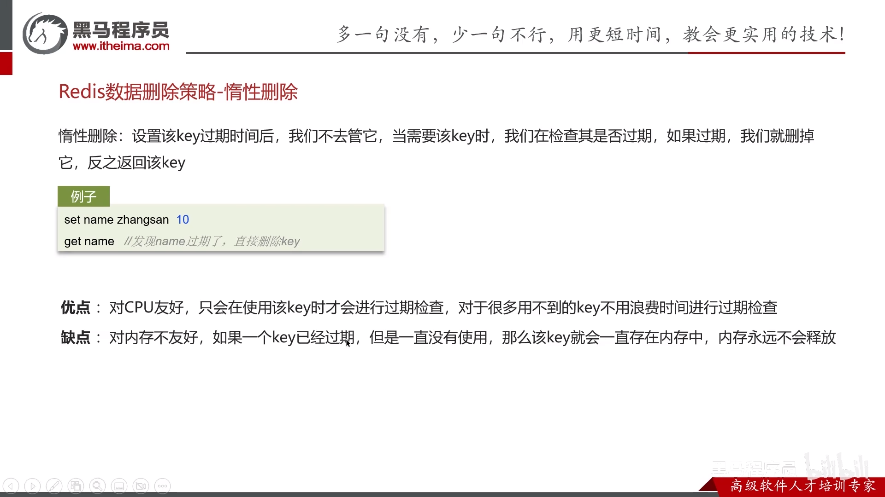

2. **Redis数据删除策略 - 定期删除**

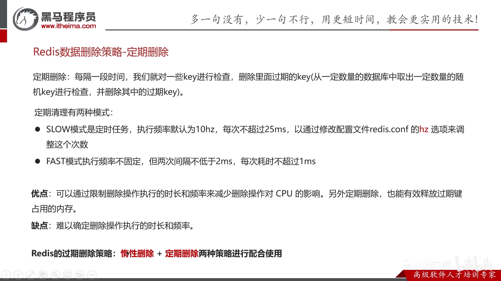

总结：

**Redis的数据过期策略**
1. **惰性删除**：访问key的时候判断是否过期，如果过期，则删除
2. **定期删除**：定期检查一定量的key是否过期(SLOW模式+ FAST模式
3. Redis的过期删除策略: 惰性删除 + 定期删除 两种策略进行配合使用

### 7、数据淘汰策略（假如数据过多，内存有限，内存被占满了怎么办呢？）

**数据的淘汰策略**：当Redis中的内存不够用时，此时在向Redis中添加新的key，那么Redis就会按照某一种规则将内存中的数据删除掉，这种数据的删除规则被称之为内存的淘汰策略。

Redis支持8中不同策略来选择需要删除的key：

1. noeviction：不淘汰任何key，但是内存满时不允许写入新数据，**默认就是这种策略**
2. volatile-ttl：对设置了TTL的key，比较key的剩余TTL值，TTL越小越先被淘汰
3. allkeys-random：对全体key，随机进行淘汰。
4. volatile-random: 对设置了TTL的key ，随机进行淘汰。
5. allkeys-lru: 对全体key，基于LRU算法进行淘汰。
6. volatile-lru: 对设置了TTL的key，基于LRU算法进行淘汰。
7. allkeys-lfu: 对全体key，基于LFU算法进行淘汰。
8. volatile-lfu: 对设置了TTL的key，基于LFU算法进行淘汰。

关键词语：
**LRU(Least Recently Used) 最近最少使用** 。用当前时间减去最后一次访问时间，这个值越大则淘汰优先级越高。
**LFU(Least Frequently Used) 最少频率使用** 。会统计每个key的访问频率，值越小淘汰优先级越高。

**淘汰策略 - 使用建议**：
1. 优先使用 allkeys-lru 策略。充分利用 LRU 算法的优势，把最近最常访问的数据留在缓存中。如果业务有明显的冷热数据区分，建议使用。
2. 如果业务中数据访问频率差别不大，没有明显冷热数据区分，建议使用 allkeys-random，随机选择淘汰。
3. 如果业务中有置顶的需求，可以使用 volatile-lru 策略，同时置顶数据不设置过期时间，这些数据就一直不被删除，会淘汰其他设置过期时间的数据
4. 如果业务中有短时高频访问的数据，可以使用 allkeys-lfu 或 volatile-lfu 策略。

其他问题：
1. 数据库有1000万数据Redis只能缓存20w数据如何保证Redis中的数据都是热点数据?

使用allkeys-lru(挑选最近最少使用的数据淘汰)淘汰策略，留下来的都是经常访问的热点数据。

2. Redis的内存用完了会发生什么?

主要看数据淘汰策略是什么?如果是默认的配置 (noeviction )，会直接报错。

总结：

数据的淘汰策略

1. Redis提供了8种不同的数据淘汰策略，默认是noeviction不删除任何数据，内存不足直接报错。
2. LRU:最少最近使用。用当前时间减去最后一次访问时间，这个值越大则淘汰优先级越高。
3. LFU: 最少频率使用。会统计每个key的访问频率，值越小淘汰优先级越高。

**平时开发过程中用的比较多的就是allkeys-lru （结合自己的业务场景）**

## 二 、Redis 分布式锁

### 8、使用场景

集群情况下的定时任务、抢单、幂等性场景
抢券：

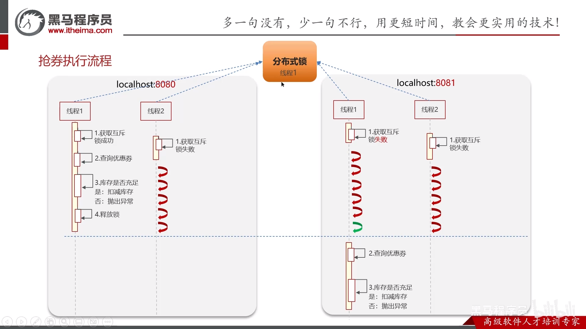

**Redis的分布式锁**
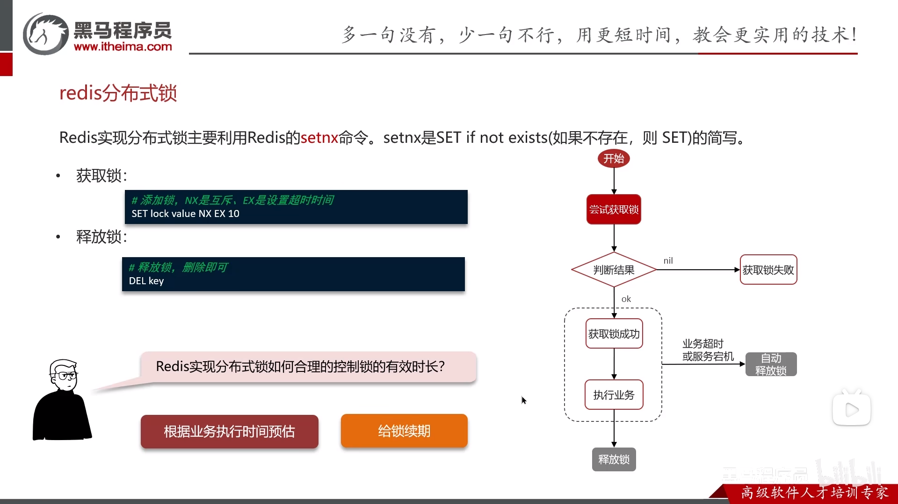

1. **redisson实现的分布式锁-执行流程**

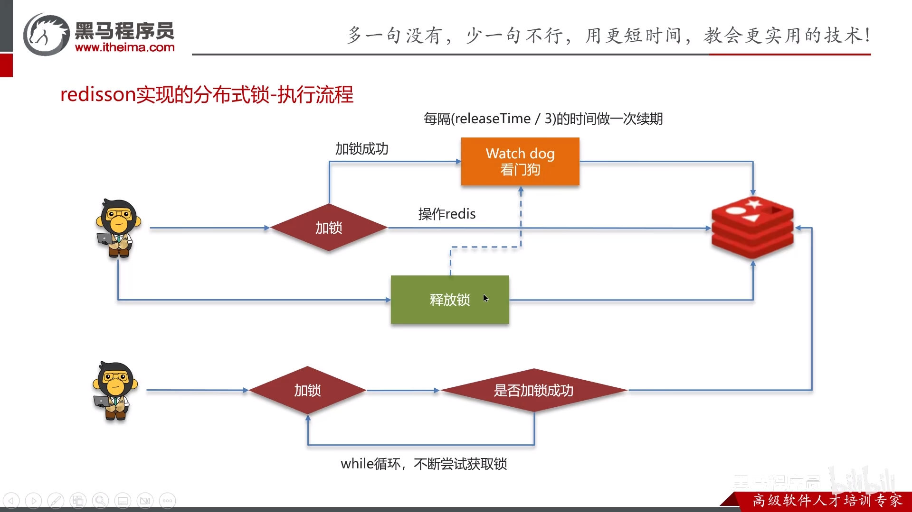

2. redisson实现的分布式锁-可重入
   利用**hash结构**记录**线程id**和**重入次数**。

3. redisson实现的分布式锁-主从一致性

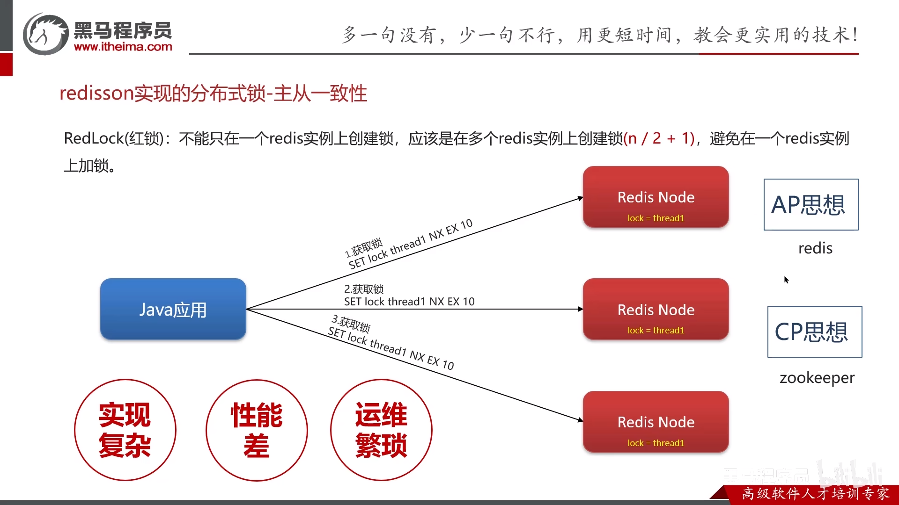

总结：

1. Redis分布式锁，是如何实现的？
- 先按照自己简历上的业务进行描述分布式锁使用的场景
- 我们当使用的redisson实现的分布式锁，底层是**setnx**和**lua脚本**（保证原子性）

2. Redis分布式锁如何合理的控制锁的有效时长？

在redisson的分布式锁中，提供了一个**WatchDog(看门狗)**个线程获取锁成功以后，WatchDog会给持有锁的线程**续期 (默认是每隔10秒续期一次)**。

3. Redisson实现的分布式锁,是可重入的吗?
   可以重入。这样做是为了避免死锁的产生。这个重入其实在内部就是判断是否是当前线程持有的锁，如果是当前线程持有的锁就会计数，如果释放锁就会在计算上减一。在存储数据的时候采用的**hash结构**，大key可以按照自己的业务进行定制，其中小key是当前线程的唯一标识，value是当前线程重入的次数。

4. Redisson实现的分布式锁能解决主从一致性的问题吗？
   不能解决，但是可以使用redisson提供的**红锁**来解决，但是这样的话，性能就太低了、如果业务中非要保证数据的强一致性，建议采用**zookeeper**实现的分布式锁。

## 三、Redis 其他面试题

### 9、Redis的集群方案有哪些？
- 主从复制
- 哨兵模式
- 分片集群

### 10、Redis 的集群方案 - 主从复制  （保证不了高可用）

1. 概念：

建立集群、读写分离

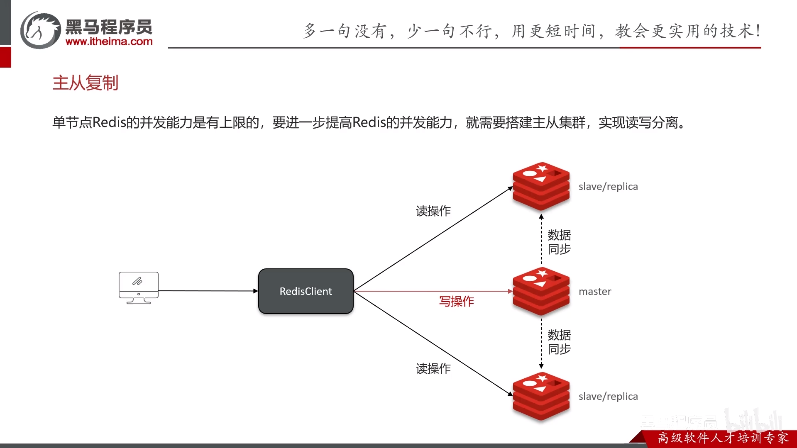

2. 主从数据同步原理：

- 主从**全量同步**

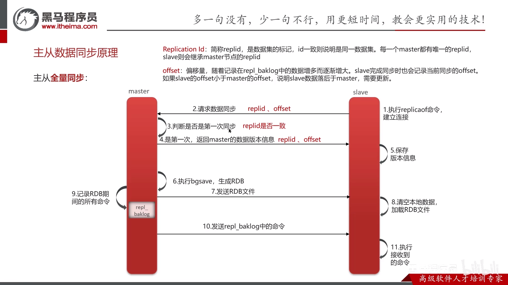

- 主从**增量同步**（slave重启或者后期数据变化）

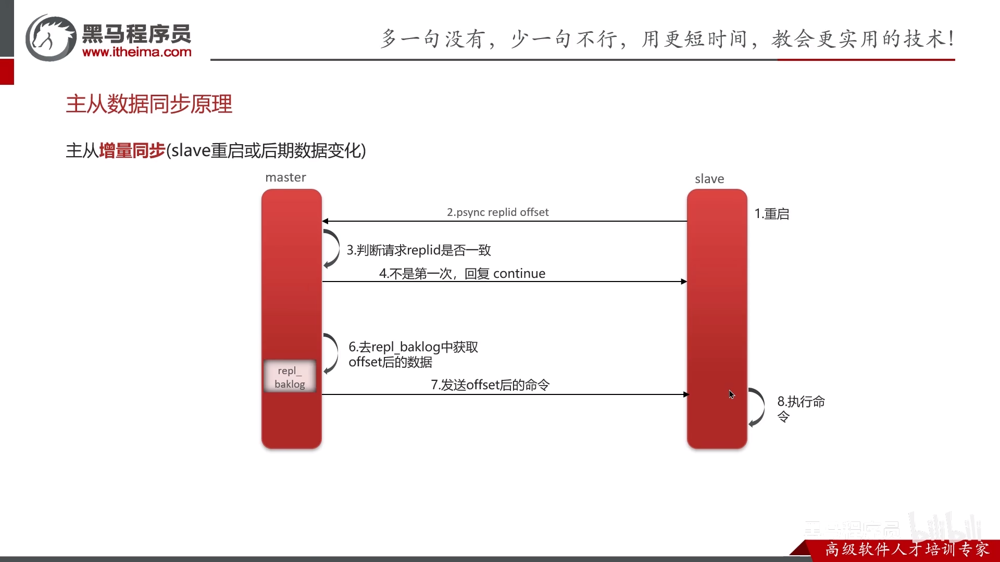

总结：

1、 介绍一下redis的主从同步
单节点Redis的并发能力是有上限的，要进一步提高Redis的并发能力，就需要搭建主从集群，实现读写分离。一般都是一主多从，主节点负责写数据，从节点负责读数据

2、 能说一下，主从同步数据的流程吗？

**全量同步**
1. 从节点请求主节点同步数据 (replication id、offset)
2. 主节点判断是否是第一次请求，是第一次就与从节点同步版本信息 (replication id和offset)
3. 主节点执行bgsave，生成rdb文件后，发送给从节点去执行
4. 在rdb生成执行期间，主节点会以命令的方式记录到缓冲区(一个日志文件)
5. 把生成之后的命令志文件发送给从节点进行同步

**增量同步**
1. 从节点请求主节点同步数据，主节点判断不是第一次请求，不是第一次就获取从节点的offset值
2. 主节点从命令日志中获取offset值之后的数据，发送给从节点进行数据同步

### 12、Redis 的集群方案 - 哨兵模式、

**哨兵的作用**：

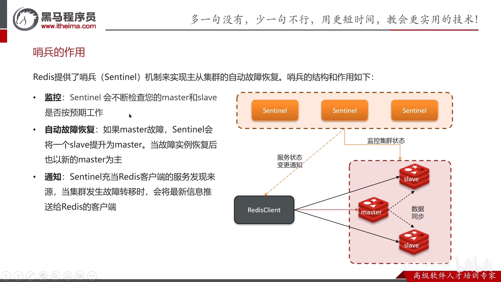

**服务状态监控**：

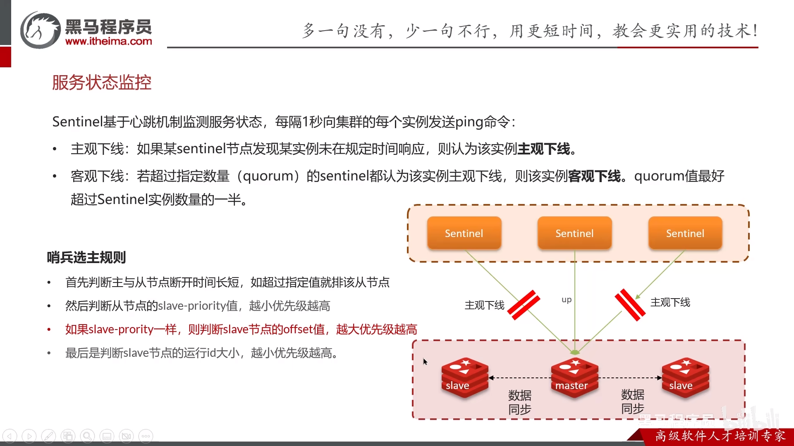

**Redis的集群 （哨兵模式）脑裂问题，以及解决方案**

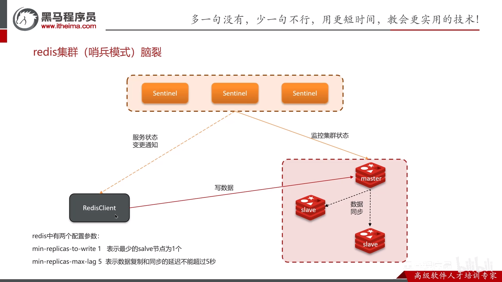

总结：

1. 怎么保证Redis的高并发高可用
   哨兵模式:实现主从集群的自动故障恢复(监控、自动故障恢复、通知)

2. 你们使用redis是单点还是集群，哪种集群
   主从(1主1从)+哨兵就可以了。单节点不超过10G内存，如果Redis内存不足则可以给不同服务分配独立的Redis主从节点

3. redis集群脑裂是什么，该怎么解决呢?
   **集群脑裂**是由于主节点和从节点和sentinel处于不同的网络分区，使得sentinel没有能够心跳感知到节点，所以通过选举的方式提升了一个从节点为主，这样就存在了两个master，就像大脑分裂了一样，这样会导致客户端还在老的主节点那里写入数据，新节点无法同步数据，当网络恢复后，sentinel会将老的主节点降为从节点，这时再从新master同步数据，就会导致数据丢失。
   解决:我们可以修改redis的配置，可以设置最少的从节点数量以及缩短主从数据同步的延迟时间，达不到要求就拒绝请求就可以避免大量的数据丢失

### 12、Redis 的集群方案 - 分片集群模式

分片集群结构：

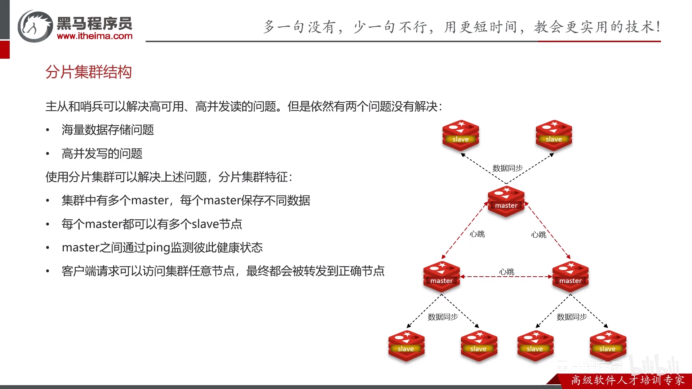

分片集群结构 - 数据读写（数据读写流程）：

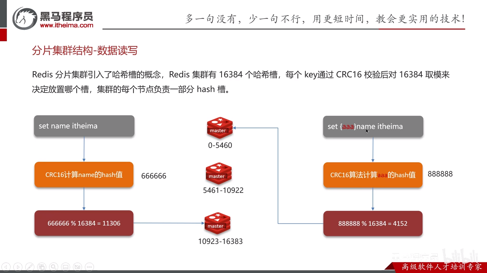

总结：
1. redis的分片集群有什么作用
- 集群中有多个master，每个master保存不同数据
- 每个master都可以有多个slave节点
- master之间通过ping监测彼此健康状态
- 客户端请求可以访问集群任意节点，最终都会被转发到正确节点

2. Redis分片集群中数据是怎么存储和读取的?
- Redis 分片集群引入了哈希槽的概念，Redis 集群有16384个哈希槽
- 将16384个插槽分配到不同的实例
    - 读写数据:根据key的**有效部分**计算哈希值，对16384取余(有效部分，如果key前面有太括号，大括号的内容就是有效部分，如果没有，则以key本身做为有效部分)余数做为插槽，寻找插槽所在的实例

### 15、Redis 是单线程，为什么还那么快呢？
因为：

- Redis是纯内存操作，执行速度非常快
- 采用单线程，避免不必要的上下文切换可竞争条件，多线程还要考虑线程安全问题
- 使用I/O多路复用模型，非阻塞IO

一、 解释一下I/O多路复用模型？

Redis是纯内存操作，执行速度非常快，它的性能瓶颈是**网络延迟**而不是执行速度，1/0多路复用模型主要就是实现了高效的网络请求。

1. 用户控件和内核空间

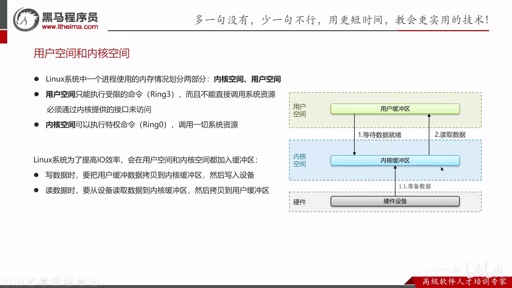

2. 阻塞IO

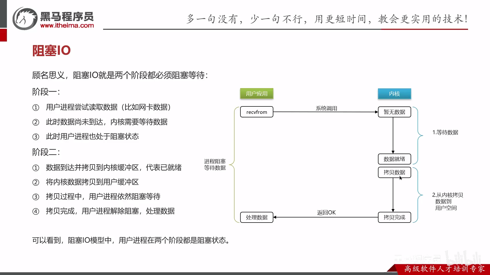

3. 非阻塞IO

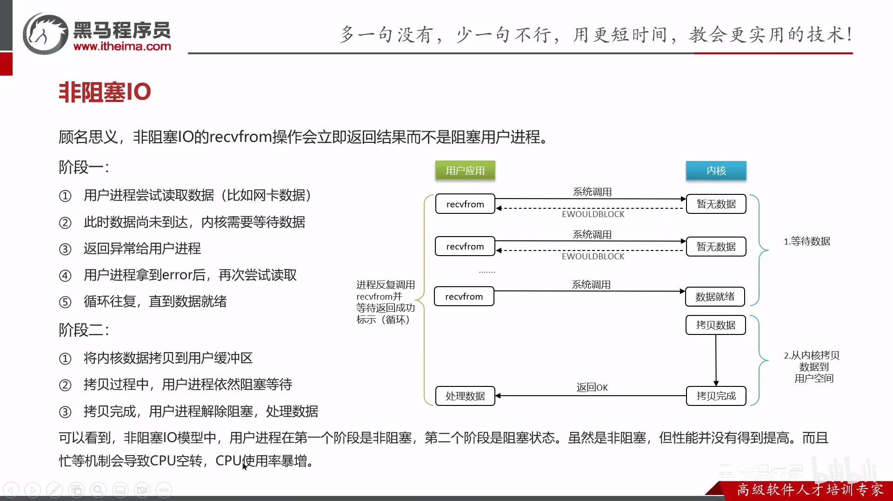

4. IO多路复用

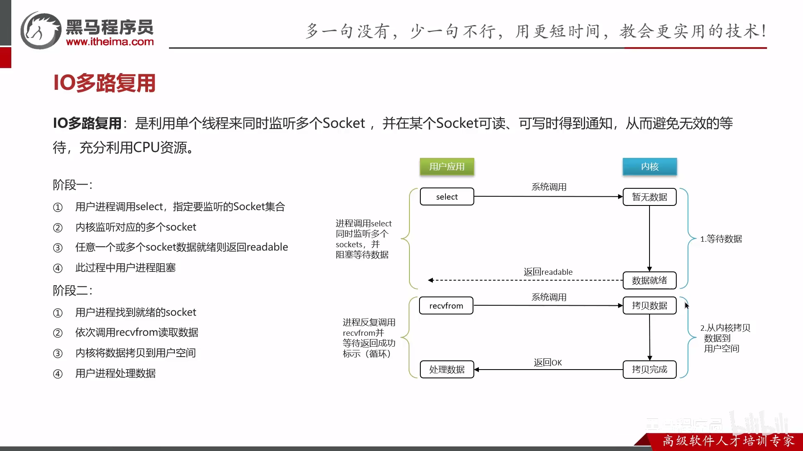

IO多路复用的实现方式：

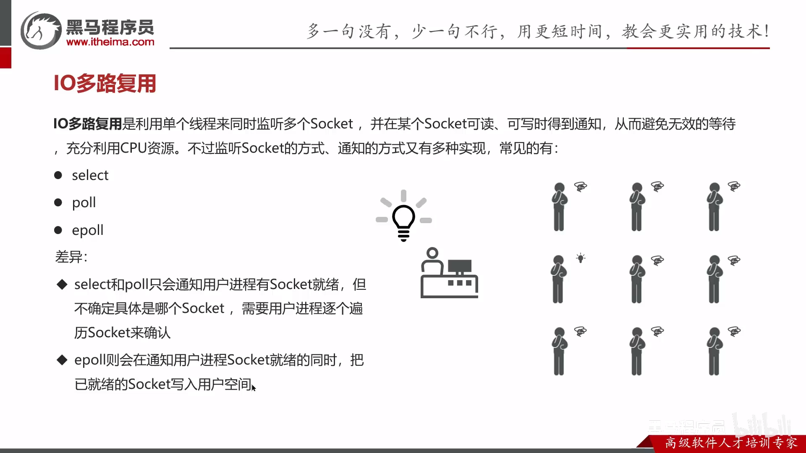

5. Redis网络模型
   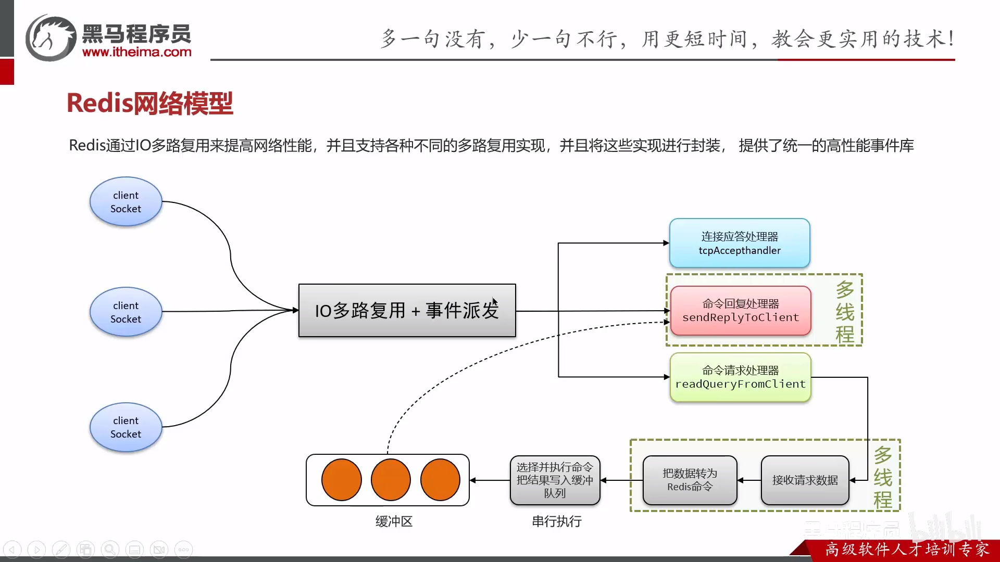

总结：

能解释一下IO多路复用吗？

1. I/O多路复用
   是指利用单个线程来同时监听多个Socket，并在某个Socket可读、可写时得到通知，从而避免无效的等待，充分利用CPU资源。目前的I/0多路复用都是采用的epoll模式实现，它会在通知用户进程Socket就绪的同时，把已就绪的Socket写入用户空间，不需要挨个遍历Socket来判断是否就绪，提升了性能

2. Redis网络模型

就是使用I/0多路复用结合事件的处理器来应对多个Socket请求

- 连接应答处理器
- 命令回复处理器，在Redis6.0之后，为了提升更好的性能，使用了多线程来处理回复事件
- 命令请求处理器，在Redis6.0之后，将命令的转换使用了多线程，增加命令转换速度，在命令执行的时候，依然是单线程
