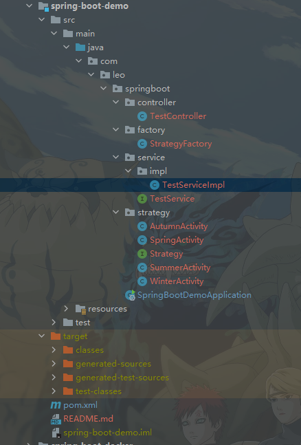

## 策略模式 + 工厂模式



1、策略类工厂  `StrategyFactory`
```java

/**
 * StrategyFactory
 * @description 策略类工厂
 * @author jiangyunfei
 * @date 2023/11/16 10:54
 * @version 1.0
 */
public class StrategyFactory {

    /**
     * 私有构造函数，防止实例化
     */
    private StrategyFactory() {}

    public static Strategy execute(Integer levelCode){
        Strategy strategy = null;
        switch (levelCode){
            case 1:
                strategy = new SpringActivity();
                break;
            case 2:
                strategy = new SummerActivity();
                break;
            case 3:
                strategy = new AutumnActivity();
                break;
            case 4:
                strategy = new WinterActivity();
                break;
            default:
                throw new IllegalArgumentException("活动编号错误:"+levelCode);
        }
        return strategy;
    }
}


```

2、策略接口 Strategy

```java
/**
 * Strategy
 * @description 策略接口
 * @author jiangyunfei
 * @date 2023/11/16 10:47
 * @version 1.0
 */
public interface Strategy {

    /**
     * 处理各种活动
     * @return
     */
    String dealActivity();
}

```

4、N个策略实现类
```java
/**
 * AutumnActivity
 * @description 策略实现类
 * @author jiangyunfei
 * @date 2023/11/16 10:53
 * @version 1.0
 */
public class AutumnActivity implements Strategy{
    /**
     * 处理各种活动
     * @return
     */
    @Override
    public String dealActivity() {
        return "秋季活动处理！";
    }
}

```

5、使用
```java
@Service
public class TestServiceImpl implements TestService {
    /**
     *
     * TestService
     *
     * @description
     * @return java.lang.String
     * @date 2023/11/16 11:09
     * @author jiangyunfei
     * @version 1.0
     */
    @Override
    public String test(Integer code) {
        Strategy strategy = StrategyFactory.execute(code);
        return strategy.dealActivity();
    }
}

```

6、 总结

其实 If else与switch case  差距并不大。当每种情况对应的业务逻辑复杂时，建议使用策略+工厂模式。代码如上。
这样实现根据不同的条件去掉用不同的策略类。同时如果不同的策略类还有相同的方法，还可以和模板方法结合使用。
缺点：如果情况比这多，那么策略类会越来越多，也就是所谓的策略类膨胀，并且没有一个地方可以俯视整个业务逻辑。

## Map + 函数式接口

针对上述缺点，可以使用Map+函数式接口优化的方法。

1、 定义需要不同实现的逻辑方法

```java
@Service
public class ActivityStrategyService {

    public String dealSpringActivity(){
        return "春季活动逻辑,参数";
    }

    public String dealSummerActivity() {
        return "夏季活动逻辑";
    }

    public String dealAutumnActivity() {
        return "秋季活动逻辑";
    }

    public String dealWinterActivity() {
        return "冬季活动逻辑";
    }
}
```
2、使用

```java
@Service
public class TestServiceImpl implements TestService {

    @Resource
    private ActivityStrategyService activityStrategyService;


    @Override
    public String test(Integer code){
        ActivityFunction<Integer> function = strategyMap.get(code);
        //这里防止活动编号没匹配上，可以使用断言来判断从而抛出统一异常
        return function.dealActivity();
    }


    @FunctionalInterface
    interface ActivityFunction<A>{
        String dealActivity();
    }

    private final Map<Integer, ActivityFunction> strategyMap = new HashMap<>();

    /**
     * 初始化策略
     */
    @PostConstruct
    public void initDispatcher(){
        strategyMap.put(1, activityStrategyService::dealSpringActivity);
        strategyMap.put(2, activityStrategyService::dealSummerActivity);
        strategyMap.put(3, activityStrategyService::dealAutumnActivity);
        strategyMap.put(4, activityStrategyService::dealWinterActivity);
    }


}
```

3、 总结
 这里就涉及到理解函数式接口。

```java
 strategyMap.put(1, activityStrategyService::dealSpringActivity);
//  等同于
strategyMap.put(1, new ActivityFunction<Integer>() {
    @Override
    public String dealActivity() {
        return activityStrategyService.dealSpringActivity();
    }
});
```

### 总结

策略模式通过接口、实现类、逻辑分派来完成，把 if语句块的逻辑抽出来写成一个类，更好维护。

Map+函数式接口通过Map.get(key)来代替 if-else的业务分派，能够避免策略模式带来的类增多、难以俯视整个业务逻辑的问题。

> 参考：

> https://mp.weixin.qq.com/s/2saZAv72clj1WGYtLDzYxQ  

> https://mp.weixin.qq.com/s?__biz=MzI4Njc5NjM1NQ==&mid=2247544923&idx=1&sn=c8b8a690c51727983bcad8d3d9062da4&chksm=ebd50f77dca28661714cf9ac2874ddfd7a4993b066127a92840ba4567c31367d5c3cca1580f7&scene=21#wechat_redirect


## 函数是接口

