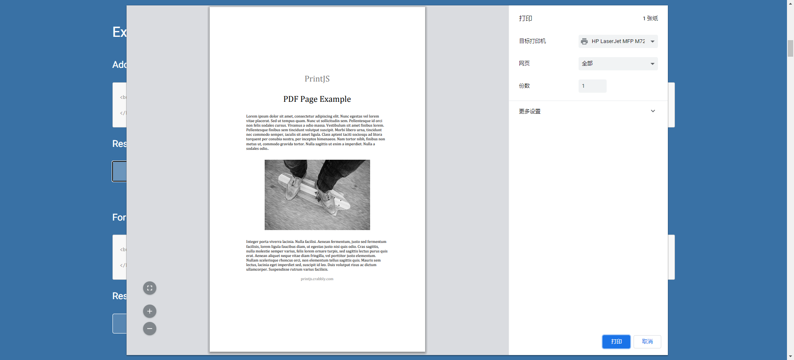

### 1、背景
   需要根据选中的列表数据，获取其对应的附件信息（PDF文件），合并成一个PDF文件并可以打印。

### 2、开发过程
因为项目是一个老项目，且是高度封装的框架，一般请求不合适。采用原始的Ajax请求，后台是servelet定义接口。
开始是想用框架自带的请求方式，发相不行。而且框架自动生成的方法，无法使用HttpServletResponse作为方法参数。
所以摒弃框架自带的方式，使用原始的Ajax请求，后台是servelet定义接口，后台通过调试，Ajax不行，直接使用printJS即可。

### 3、外部插件
前端：https://printjs.crabbly.com/    
后端：pdfbox PDFMergerUtility （https://iowiki.com/pdfbox/pdfbox_quick_guide.html）
### 4、代码示例
```js
    // 后台文件流地址
 	var url = baseUrl+'/fjxx?ywids='+jkids;
 	printJS({
 		printable: url,
 		type: 'pdf',
 		showModal: true,
 		onLoadingEnd: function () {
 			window.parent.postMessage(JSON.stringify({cmd: 'modal-mark-finish'}), '*');
 		},
 		onError: function () {
 			console.error('printJS 打印失败！' );
 		},
 		onPrintDialogClose: function() {
 			// 清空选中
 			console.log('打印对话框关闭');
 		},
 	});
```

```java
@Slf4j
public class GetAkFjxxServlet extends HttpServlet {

    @Override
    protected void doGet(HttpServletRequest req, HttpServletResponse resp) throws ServletException, IOException {
        this.doPost(req, resp);
    }

    @Override
    protected void doPost(HttpServletRequest req, HttpServletResponse response) throws ServletException, IOException {
        String ids = req.getParameter("ywids");
       
        List<String> pdfWsljList = new ArrayList<>();
        for (TAkxtFjxx tAkxtFjxx : tAkxtFjxxes) {
            pdfWsljList.add(tAkxtFjxx.getCFtpurl());
        }

        response.setContentType("application/pdf");
        response.setCharacterEncoding("UTF-8");
        try {
            OutputStream outputStream = new BufferedOutputStream(response.getOutputStream());
            //创建存放文件内容的数组
            byte[] pdfData = merge(pdfWsljList);
            response.setContentLength(pdfData.length);
            //将字节数组的数据全部写入到输出流中
            outputStream.write(pdfData,0,pdfData.length);
            //强制将缓存区的数据进行输出
            outputStream.flush();
            //关流
            outputStream.close();

        } catch (IOException e) {
            e.printStackTrace();
        }
    }

    /**
     *
     * GetAkFjxxServlet
     *
     * @description 合并PDF
     * @param pdfWsljList
     * @return byte[]
     * @date 2023/8/9 9:34
     * @author jiangyunfei
     * @version 1.0
     */
    public byte[] merge(List<String> pdfWsljList) throws IOException {
        log.info("进入批量打印中的合并方法");
        if (CollectionUtils.isEmpty(pdfWsljList)) {
            return new byte[0];
        }
        long startTime = System.currentTimeMillis();

        // 1. pdf合并
        PDFMergerUtility mergerUtility = new PDFMergerUtility();
        ByteArrayOutputStream result = new ByteArrayOutputStream();

        for (String url : pdfWsljList) {
            // 根据后台地址获取文件流 
            InputStream inpStrOfUplFil = StorageUtil.getInpStrOfUplFil(url);
            mergerUtility.addSource(inpStrOfUplFil);
        }

        mergerUtility.setDestinationStream(result);
        mergerUtility.mergeDocuments();

        byte[] bytes = result.toByteArray();
        log.info("离开批量打印中的合并方法，共计耗时{}ms", System.currentTimeMillis() - startTime);
        return bytes;
    }
}

```

```xml
        <dependency>
            <groupId>org.apache.pdfbox</groupId>
            <artifactId>pdfbox</artifactId>
            <version>2.0.27</version>
        </dependency>
```

### 5、类似效果



### 6、总结
核心思想就是后端返回文件流，前端用printJS就好。


### 7、后续

功能没问题了，但是要兼容ie，从其他项目找到打印预览的代码，始终不行，打开是空白的PDF，经过搜索，实践得以解决。
后台优化代码，仅仅是代码优化
```java
protected void doPost(HttpServletRequest req, HttpServletResponse response) throws ServletException, IOException {
        String ids = req.getParameter("ywids");
        String[] id = ids.split(",");
        StringJoiner bh = new StringJoiner("','", "'", "'");
        for (String s : id) {
            bh.add(s);
        }
        StringBuilder hql = new StringBuilder();
        hql.append("select new TAkxtFjxx(CId,CFjmc,DCjsj,CFtpurl) from TAkxtFjxx where CYwidBh in (");
        hql.append(bh).append(") and NType=? order by DCjsj desc");
        List<TAkxtFjxx> tAkxtFjxxes = (List<TAkxtFjxx>) (ArteryUtil.getArteryDao().getHibernateTemplate()
                .find(hql.toString(), new Object[]{YhpzUtil.N_AKXT_YHPZ_TYPE}));

        List<String> pdfWsljList = new ArrayList<>();
        for (TAkxtFjxx tAkxtFjxx : tAkxtFjxxes) {
            pdfWsljList.add(tAkxtFjxx.getCFtpurl());
        }


        try (OutputStream outputStream = new BufferedOutputStream(response.getOutputStream())) {
            byte[] pdfData = merge(pdfWsljList);
            response.setContentType("application/pdf");
            response.setContentLength(pdfData.length);

            response.setHeader("Accept-Ranges", "bytes");
            response.setHeader("Cache-Control", "no-cache");
            response.setHeader("Pragma", "no-cache");
            response.setHeader("Expires", "0");

            outputStream.write(pdfData,0,pdfData.length);
            outputStream.flush();
        } catch (IOException e) {
            e.printStackTrace();
        }

    }
```

重点前端代码：
```js

 function getPicture (jkids) {
	// 获取后台文件流
 	var url = baseUrl+'xxx/fjxx?ywids='+jkids;

	 // 如果是ie浏览器
	 if (window.navigator && window.navigator.msSaveOrOpenBlob) {
		 $.ajax({
			 type: 'get',
			 url: url,
			 //jq ajax请求文件流的方式  （起作用的重点）
			 mimeType: 'text/plain; charset=x-user-defined',
			 responseType: 'arraybuffer',
			 success: function (response) {
			     
			     // 此段代码是解决PDF空白的关键，直接转数组还不行
				 var rawLength = response.length;
				 var array = new Uint8Array(new ArrayBuffer(rawLength));
				 for (i = 0; i < rawLength; i++) {
					 array[i] = response.charCodeAt(i) & 0xff;
				 }
				 //上面是把后台请求到的文件流进行转化为符合的流
				 var blob = new Blob([array],{type: 'application/pdf;charset-UTF-8'});


                 // 在这里可以使用生成的printableUrl来打印或显示PDF  (pdfjs 文件放在相应目录下)
				 var pdfUrl = window.URL.createObjectURL(blob);
				 var openUrl = baseUrl+"/printjs/pdfjs/ie/web/viewer.html?file="+pdfUrl;
				 window.open(openUrl);

			 },
			 error: function (xhr, status, error) {
				 // 处理请求错误情况
				 console.error('Ajax 请求错误：' + error);
			 }

		 });
	 }else{
		 printJS({
		 	printable: url,
		 	type: 'pdf',
		 	showModal: true,
		 	onLoadingEnd: function () {
		 		window.parent.postMessage(JSON.stringify({cmd: 'modal-mark-finish'}), '*');
		 	},
		 	onError: function () {
		 		console.error('printJS 打印失败！' );
		 	},
		 	onPrintDialogClose: function() {
		 		// 清空选中
		 		console.log('打印对话框关闭');

		 		Artery.get("jkListArea").clearDataStatus();
		 	},
		 });
	 }


 }
```
