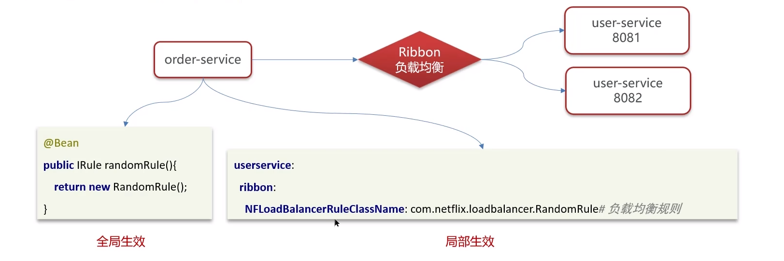

::: tip

视频来源：
[新版Java面试专题视频教程，java八股文面试全套真题+深度详解（含大厂高频面试真题）](https://www.bilibili.com/video/BV1yT411H7YK/?vd_source=7138dfc78c49f602f8d3ed8cfbf0513d)

:::

## 总览

## SpringCloud

### 1、**Spring Cloud 5 大组件有哪些？**【基础、重要】

通常情况下：
- Eureka : 注册中心
- Ribbon : 负载均衡
- Feign : 远程调用
- Hystrix : 服务熔断
- Zuul/Gateway : 网关

随着 SpringCloudAlibba 在国内兴起 , 我们项目中使用了一些阿里巴巴的组 件
- 注册中心 / 配置中心 Nacos
- 负载均衡 Ribbon
- 服务调用 Feign
- 服务保护 sentinel
- 服务网关 Gateway

### 2、服务注册和发现是什么意思？ Spring Cloud 如何实现服务注册发现

#### Eureka 的作用

#### 总结：

- 我们当时项目采用的 eureka 作为注册中心，这个也是 spring cloud 体系中的一个核心组件。
- **服务注册**：服务提供者需要把自己的信息注册到 eureka ，由 eureka 来保存这些信息，比如服务名称、 ip 、端口 等等。
- **服务发现**：消费者向 eureka 拉取服务列表信息，如果服务提供者有集群，则消费者会利用负载均衡算法，选择一 个发起调用。
- **服务监控**：服务提供者会每隔 30 秒向 eureka 发送心跳，报告健康状态，如果 eureka 服务 90 秒没接收到心跳， 从 eureka 中剔除。

#### 与 Nacos 的区别

- Nacos 与 eureka 的共同点（注册中心）
    ① 都支持服务注册和服务拉取
    ② 都支持服务提供者心跳方式做健康检测

- Nacos 与 Eureka 的区别（注册中心）
    ① Nacos 支持服务端主动检测提供者状态：临时实例采用心跳模式，非临时实例采用主动检测模式
    ② 临时实例心跳不正常会被剔除，非临时实例则不会被剔除
    ③ Nacos 支持服务列表变更的消息推送模式，服务列表更新更及时
    ④ Nacos 集群默认采用 AP 方式，当集群中存在非临时实例时，采用 CP 模式； Eureka 采用 AP 方式

- Nacos 还支持了配置中心， eureka 则只有注册中心，也是选择使用 nacos 的一个重要原因

### 3、你们项目负载均衡如何实现的 ?

- 负载均衡 Ribbon ，发起远程调用 feign 就会使用 Ribbon
- Ribbon 负载均衡策略有哪些 ?
- 如果想自定义负载均衡策略如何实现 ?

#### Ribbon 负载均衡流程

#### Ribbon 负载均衡策略有哪些 ?

-  RoundRobinRule ：简单轮询服务列表来选择服务器。
-  WeightedResponseTimeRule ：按照权重来选择服务器，响应时间越长，权重越小。
-  RandomRule ：随机选择一个可用的服务器。
- BestAvailableRule ：忽略那些短路的服务器，并选择并发数较低的服务器。
- RetryRule ：重试机制的选择逻辑。
- AvailabilityFilteringRule ：可用性敏感策略，先过滤非健康的，再选择连接数较小的实例
-  ZoneAvoidanceRule ：以区域可用的服务器为基础进行服务器的选择。使用 Zone 对服务器进行分类，这个 Zone 可以理解为一个机房、一个机架等。而后再对 Zone 内的多个服务做轮询。

#### 如果想自定义负载均衡策略如何实现 ?

可以自己创建类实现 `IRule` 接口 , 然后再通过配置类或者配置文件配置即可 ，通过定义 `IRule` 实现可以修改负载均衡规则。
，有两种方式：

总结：

- 你们项目负载均衡如何实现的 ?

微服务的负载均衡主要使用了一个组件 Ribbon ，比如，我们在使用 feign 远程调用的过程中，底层的负载均衡就是使用了 ribbon

- Ribbon 负载均衡策略有哪些 ?

- RoundRobinRule ：简单轮询服务列表来选择服务器
- WeightedResponseTimeRule ：按照权重来选择服务器，响应时间越长，权重越小
- RandomRule ：随机选择一个可用的服务器
- ZoneAvoidanceRule ：区域敏感策略，以区域可用的服务器为基础进行服务器的选择。使用 Zone 对服
务器进行分类，这个 Zone 可以理解为一个机房、一个机架等。而后再对 Zone 内的多个服务做轮询 ( 默提供了两种方式，如下）

- 如果想自定义负载均衡策略如何实现 ?

1. 创建类实现 IRule 接口，可以指定负载均衡策略（全局）
2. 在客户端的配置文件中，可以配置某一个服务调用的负载均衡策略（局部）

### 4、什么是服务雪崩，怎么解决这个问题？

## 业务相关

### 1、

