::: tip

视频来源：[新版Java面试专题视频教程，java八股文面试全套真题+深度详解（含大厂高频面试真题）](https://www.bilibili.com/video/BV1yT411H7YK/?vd_source=7138dfc78c49f602f8d3ed8cfbf0513d)

:::


## 总体介绍：
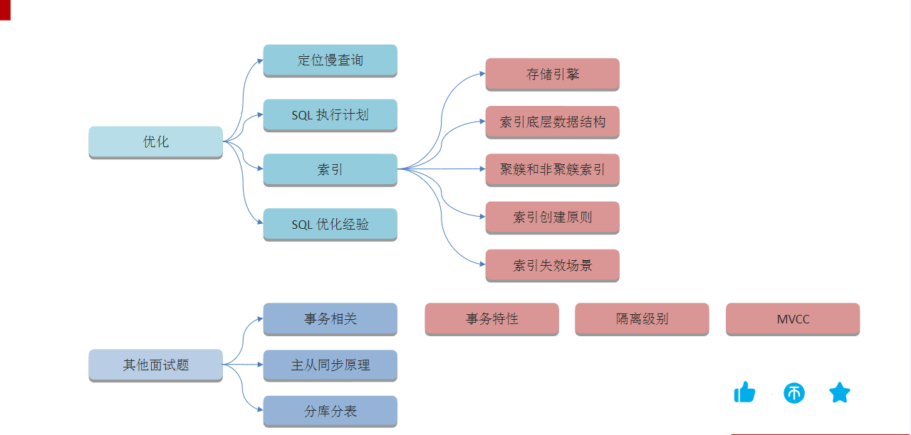


## 一、优化

### 1、如何定位慢查询
（页面加载过慢，接口压力测试时间过长，超过1s）

1. 通过开源工具
* 调试工具：Arthas
* 运维工具：Skywalking

2. MySQL自带慢日志.【调试阶段】
在`/etc/my.cnf`中配置,若产生日志可在`/var/lib/mysql/localhost-slow.log`查看。
```shell
#开肩MYSQL漫日志查询开关
slow_query_log=1
# 设置漫日志的时阿为2秒，SQL语句执行时阿超过2秒，就会视为慢查询，记录慢查询日志
long_query_time=2
```
日志例子：
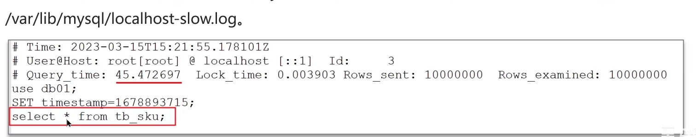


### 2、SQL语句执行很慢，如何分析（优化）

- 聚合查询
- 多表查询
- 表数据量过大
- 深度分页查询

前三个可以通过SQL执行计划（找到慢的原因）。

mysql自带的执行计划explain来去查看这条sql的执行情况。具体执行计划操作如下：

1. explain执行计划操作

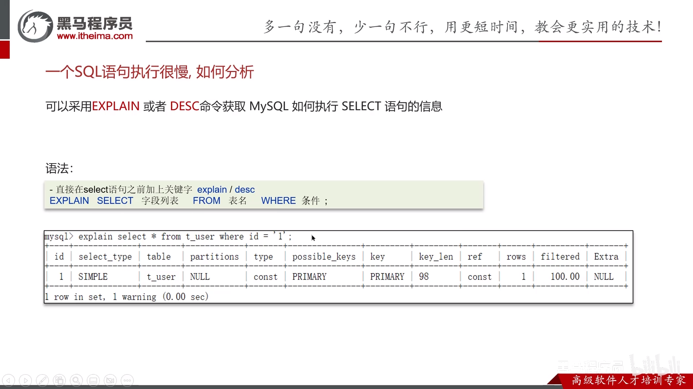

2. explain执行计划分析
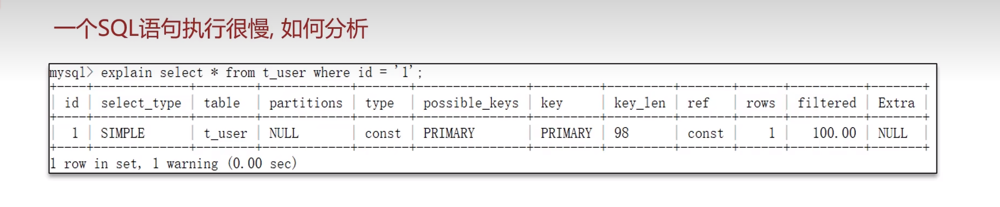

- possible key 当前sql可能会使用到的索引

- key 当前sql实际命中的索引
- key_len 索引占用的大小
>通过它们两个查看是否可能会命中索引

- Extra 额外的优化建议

| <font color=Red>Extra</font>                 | <font color=Red>含义</font>                                         |
|-------------------------|----------------------------------------------|
| Using where; Using Index| 查找使用了索引，需要的数据都在索引列中能找到，不需要回表查询数据 |
| Using index condition   | 查找使用了索引，但是需要回表查询数据         |

- **type**  这条sql的连接的类型，性能由好到差为NULL、system、**const**、eq ref、ref、range、 index、all
  - system:查询系统中的表
  - const:根据主键查询
  - `eq_ref:主键索引查询或唯一索引查询ref:索引查询`
  - `range:范围查询`
  - index:索引树扫描  【需要优化】
  - all:全盘扫描   【需要优化】

最后回答：
可以采用MySQL自带的分析工具 EXPLAIN
- 通过key和key_len检查是否命中了索(索引本身存在是否有失效的情况)
- 通过type字段查看sql是否有进一步的优化空间，是否存在全索引扫描或全盘扫描
- 通过extra建议判断，是否出现了回表的情况，如果出现了，可以尝试添加索引或修改返回字段来修复


### 3、了解过索引吗（什么是索引）？ 

1. 索引（Index）是帮助MySQL`高效获取数据`的数据结构（有序）
2. 提高数据检索的效率，降低数据库的IO成本（不需要全表扫描）
3. 通过索引列对数据进行排序，降低数据排序的成本，也能降低了CPU的消耗

### 4、索引的底层数据结构了解过吗？ 【扩展：其他索引】
MySQL的默认的存储引擎InnoDB采用的B+树的数据结构来存储索引，选择B+树的主要的原因是：  

1. 第一阶数更多，路径更短
2. 磁盘读写代价B+树更低，非叶子节点只存储指针，叶子阶段存储数据
3. B+树便于扫库和区间查询，叶子节点是一个双向链表

### 5、B树 和 B+树的区别是什么呢？
1. 在B树中，非叶子节点和叶子节点都会存放数据，而B+树的所有的数据都会出现在叶子节点，在查询的时候，B+树查找效率更加稳定
2. 在进行范围查询的时候，B+树效率更高，因为B+树都在叶子节点存储，并且叶子节点是一个双向链表

### 6、什么是聚簇（聚集）索引，什么是非聚簇索引（二级索引）？

* 聚簇索引主要是指数据与索引放到一块，B+树的叶子节点保存了整行数据，有且只有一个，一般情况下主键在作为聚簇索引的
* 非聚簇索引值的是数据与索引分开存储，B+树的叶子节点保存对应的主键，可以有多个，一般我们自己定义的索引都是非聚簇索引

|<font color=Red>分类</font>|<font color=Red>含义</font>| <font color=Red>特点</font> |
|-|-|---------------------------|
|聚集索引 (Clustered Index) 【聚簇索引】|将数据存储与索引放到了一块，索引结构的叶子节点保存了行数据| 必须有 , 而且只有一个              |
|二级索引 (Secondary Index) 【非聚簇索引】|将数据与索引分开存储，索引结构的叶子节点关联的是对应的主键| 可以存在多个                    |

### 7、什么是回表查询

回表的意思就是通过二级索引找到对应的主键值，然后再通过主键值找到聚集索引中所对应的整行数据，这个过程就是回表

### 8、什么叫覆盖索引？

覆盖索引是指查询使用了索引，返回的列，必须在索引中全部能够找到

 使用 id 查询，直接走聚集索引查询，一次索引扫描，直接返回数据，性能高。
 如果返回的列中没有创建索引，有可能会触发回表查询，尽量避免使用 select *

如果我们使用id查询，它会直接走聚集索引查询，一次索引扫描，直接返回数据，性能高。

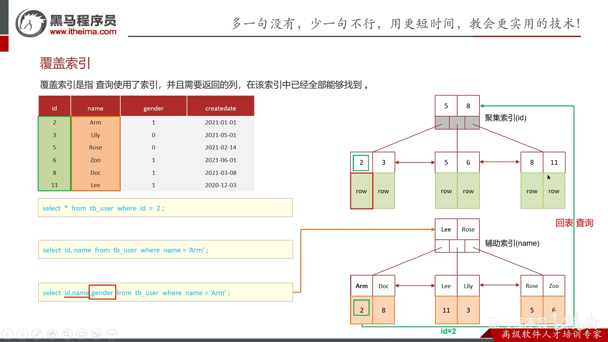

### 9、 MYSQL超大分页怎么处理 ?

1. 问题，什么是超大分页？
>超大分页一般都是在**数据量比较大时**，我们使用了limit分页查询，并且需要对数据进行排序，这个时候效率就很低，我们可以采用**覆盖索引**和**子查询**来解决

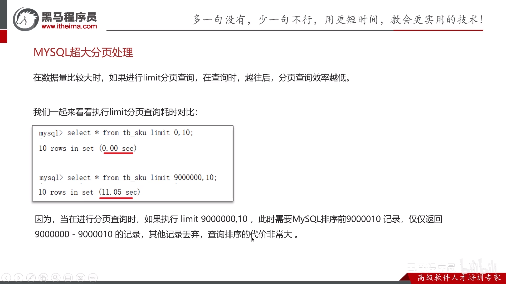

2. 处理：
>先分页查询数据的id字段，确定了id之后，再用子查询来过滤，只查询这个id列表中的数据就可以了。因为查询id的时候，走的覆盖索引，所以效率可以提升很多
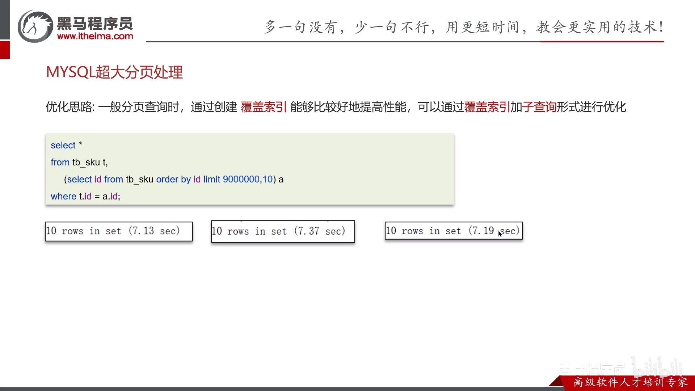

### 9、 索引创建的原则有哪些 ?
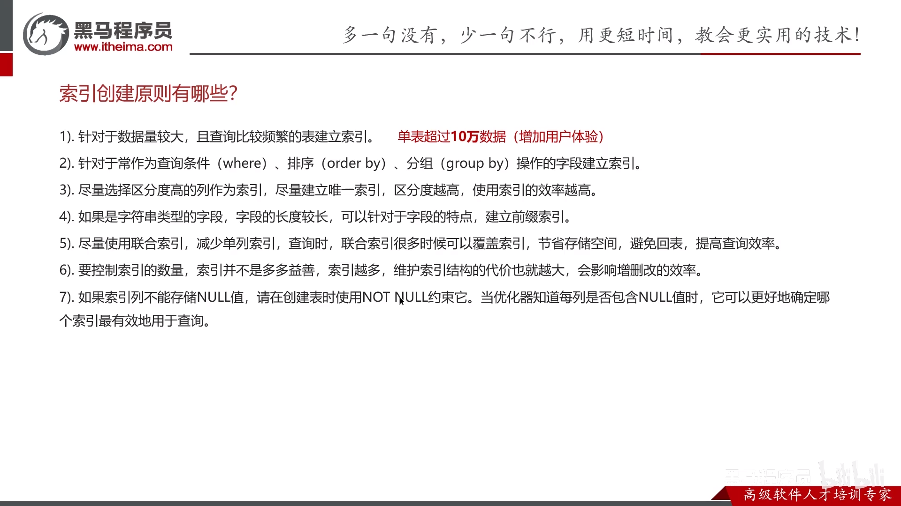
1. **数据量较大，且查询比较频繁的表**
2. **常作为查询条件、排序、分组的字段**
3. 字段内容区分度高
4. 内容较长，使用前缀索引
5. **尽量联合索引**
6. **要控制索引的数量**
7. 如果索引列不能存储NULL值，请在创建表时使用NOT NULL约束它

### 10、 什么情况下索引会失效 ? 【结合实际情况】

可以通过执行计划分析。
1. 违反最左前缀法则
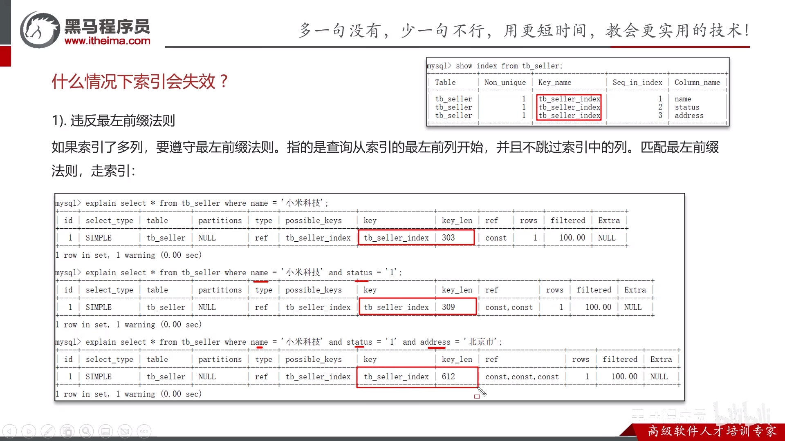
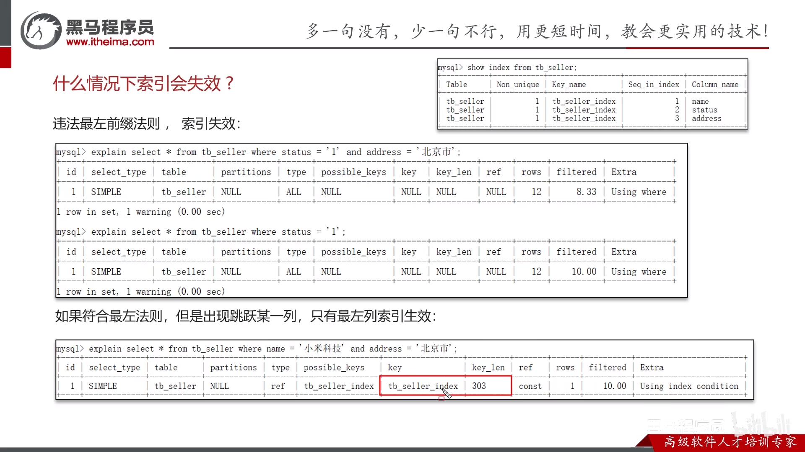
2. 范围查询右边的列，不能使用索引
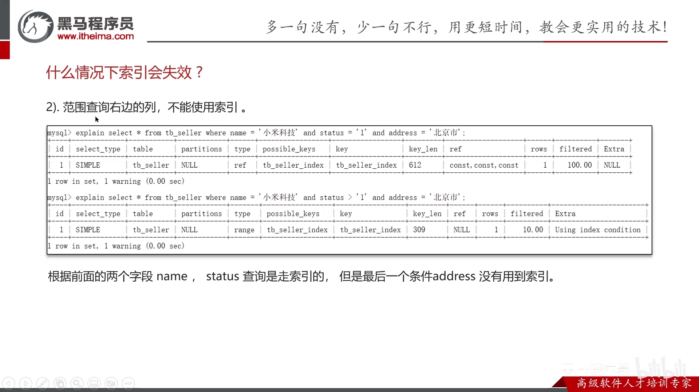
3. 不要在索引列上进行运算操作，索引将时效。
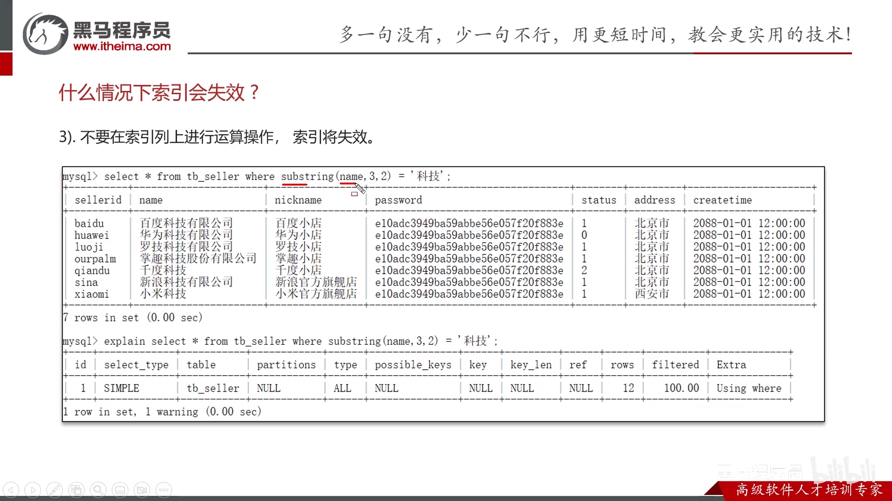
4. 字符串不加单引号，可能造成索引失效。【类型转换】
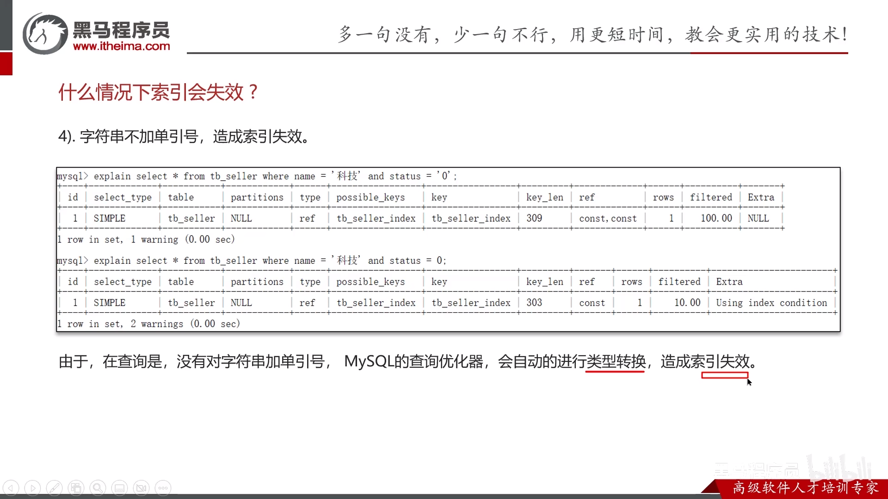
5. 以`%`号开头的`like`模糊查询，会导致索引失效
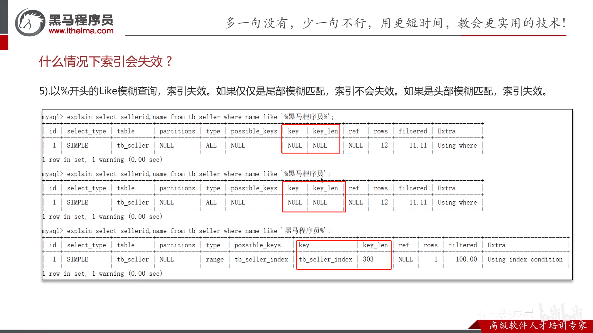

最终答案（精简一点）：
1. 违反最左前缀法则
2. 范围查询右边的列，不能使用索引
3. 不要在索引列上进行运算操作，索引将失效
4. 字符串不加单引号，造成索引失效。(类型转换)
5. 以`%`号开头的`like`模糊查询，会导致索引失效

### 11、 谈一谈你对SQL优化的经验
5点：
- 表的设计优化
- 索引优化  **<font color=Red>参考优化创建原则和索引时效</font>**
- SQL语句优化
- 主从复制，读写分离
- 分库分表  （后面将）

- **表的设计优化(参考阿里开发手册《嵩山版》)**
（1）比如设置合适的数值 (`tinyint` `int` `bigint`)，要根据实际情况选择
（2）比如设置合适的字符串类型 (`char`和`varchar`) `char`定长效率高，`varchar`可变长度，效率稍低
- **SQL语句优化**
（1）SELECT语句务必指明字段名称 (避免直接使用select * )
（2）SQL语句要避免造成索引失效的写法
（3）尽量用`union all`代替`union`, `union`会多一次过滤，效率低.[将重复的数据过滤掉]
（4）避免在where子句中对字段进行表达式操作
（5）Join优化 能用`inner join` 就不用`left join`、`right join`，如必须使用,一定要`以小表为驱动`。内连接会对两个表进行优化，优先把小表放到外边，把大表放到里边。`left join` 或 `right join`，不会重新调整顺序
- **主从复制，读写分离**

## 二、事务

### 12、 事务的特性是什么？可以详细说一下吗？

事务是一组操作的集合，它是一个不可分割的工作单位，事务会把所有的操作作为一个整体一起向系统提交或撤销操作请求，即这些操作要么**同时成功，要么同时失败**。

1. ACID是什么？可以详细说一下吗？
- 原子性(Atomicity): 事务是不可分割的最小操作单元，要么全部成功，要么全部失败
- 一致性(Consistency): 事务完成时，必须使所有的数据都保持一致状态。
- 隔离性(lsolation): 数据库系统提供的隔离机制，保证事务在不受外部并发操作影响的独立环境下运行
- 持久性(Durability): 事务一旦提交或回滚，它对数据库中的数据的改变就是永久的。

### 13、并发事务带来哪些问题？怎么解决这些问题？MySQL的默认隔离级别是？

1. 并发事务问题

| <font color=Red>问题</font>    | <font color=Red>描述</font>                              |
|------------------------------|--------------------------------------------------------|
| <font color=Red>脏读</font>    | 一个事务读到另外一个事务还没有提交的数据。                                  |
| <font color=Red>不可重复读</font> | 一个事务先后读取同一条记录，但两次读取的数据不同，称之为不可重复读                      |
| <font color=Red>幻读</font>    | 一个事务按照条件查询数据时，没有对应的数据行，但是在插入数据时，又发现这行数据已经存在，好像出现了“幻影”。 |

2. 怎么解决并发事务问题呢？

解决方案：对事物进行隔离。

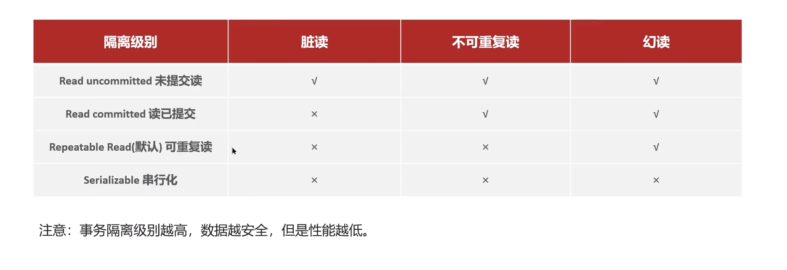

总结：

并发事务带来哪些问题？怎么解决这些问题？MySQL的默认隔离级别是？

1. **并发事务的问题**:
- 脏读:一个事务读到另外一个事务还没有提交的数据
- 不可重复读:一个事务先后读取同一条记录，但两次读取的数据不同
- 幻读:一个事务按照条件查询数据时，没有对应的数据行，但是在插入数据时，又发现这行数据已经3存在，好像出现了”幻影”。

2. **隔离级别**:
- READ UNCOMMITTED 未提交读。【不能解决  脏读、不可重复读、幻读】
- READ COMMITTED 读已提交。 【不能解决 不可重复读、幻读】 
- REPEATABLE READ 可重复读。 【不能解决 幻读         **【默认隔离级别】**】
- SERIALIZABLE 串行化。  【都能解决】


### 14、`undo log`  和  `redo log` 的区别？

前提概念：

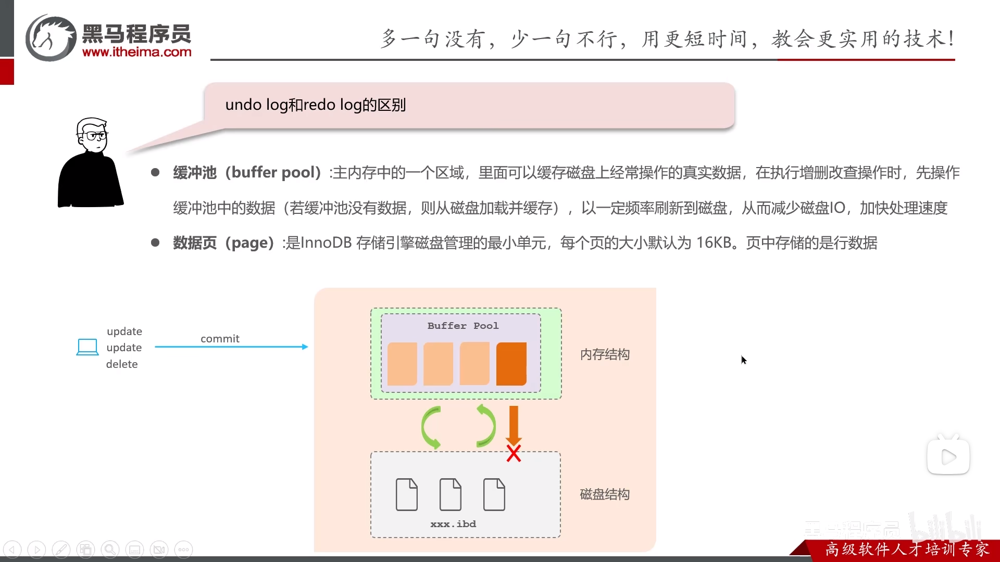

1. `redo log`

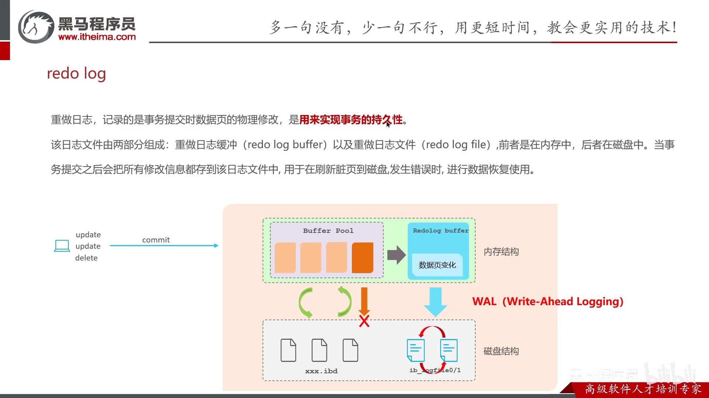 

2. `undo log`
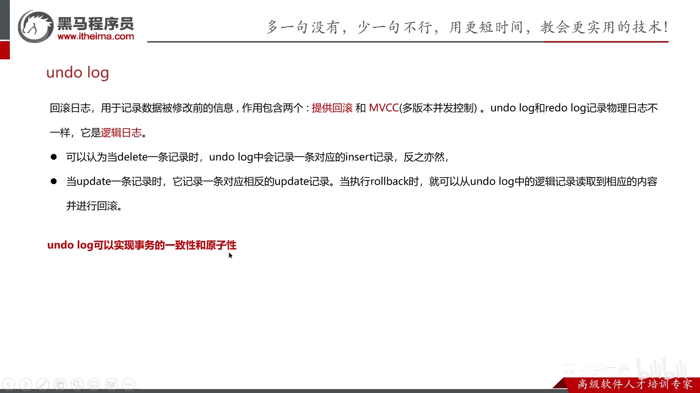

总结：

`undo log`  和  `redo log` 的区别？
- `redo log`：记录的是数据页的物理变化，服务宕机可用来同步数据。
- `undo log`：记录的是逻辑日志，当事务回滚时，通过逆操作恢复原来的数据
- `redo log`：保证了事务的持久性，`undo log`保证了事务的原子性和一致性

### 15、事务中的隔离性如何保证的？

锁：排他锁(如一个事务获取了一个数据行的排他锁，其他事务就不能再获取该行的其他锁)。
MVCC：多版本并发控制。

1. 解释一下 MVCC
  
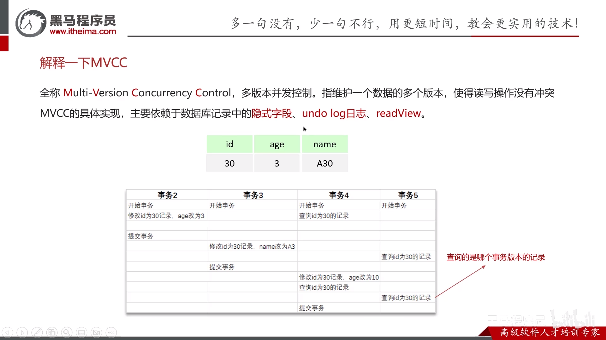

2. MVCC 实现原理

- 隐藏字段：

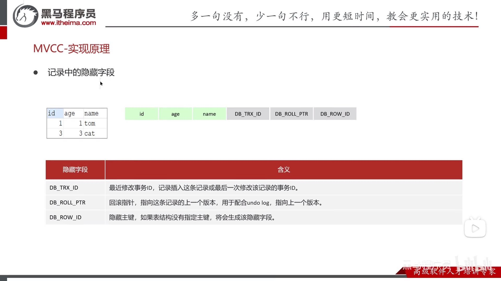

- `undo log`

回滚日志，在insert、update、delete的时候产生的便于数据回滚的日志。
当insert的时候，产生的undo log日志只在回滚时需要，在事务提交后，可被立即删除。
而update、delete的时候，产生的undo log日志不仅在回滚时需要，mvcc版本访问也需要，不会立即被删除.

- `undo log`版本链

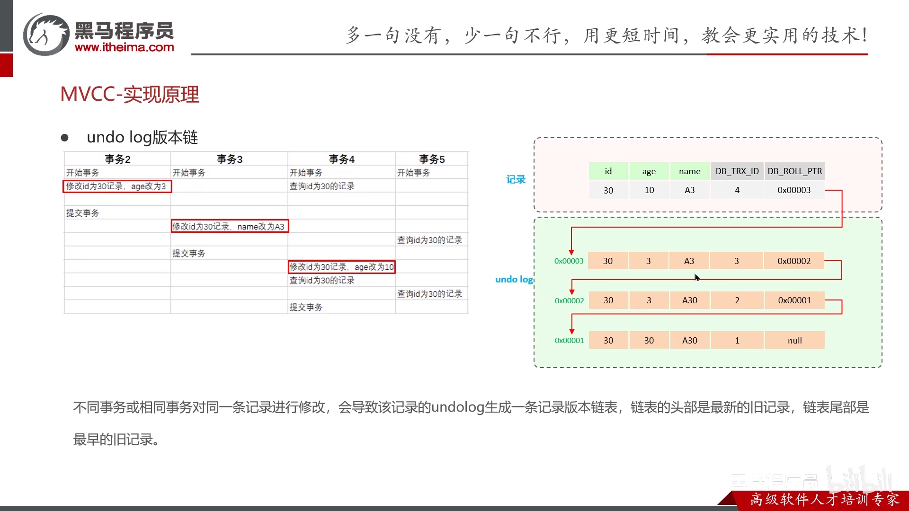

- readview

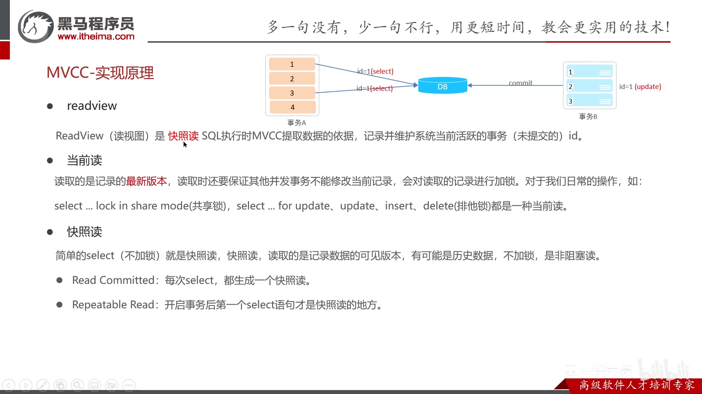

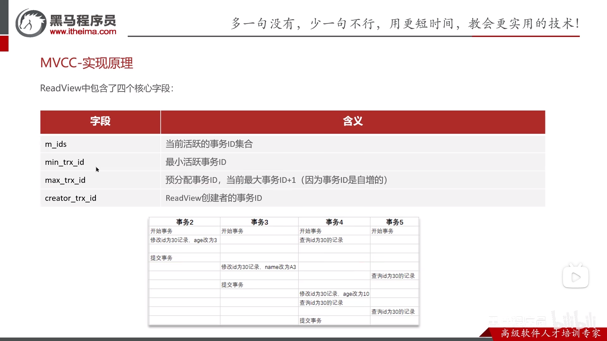

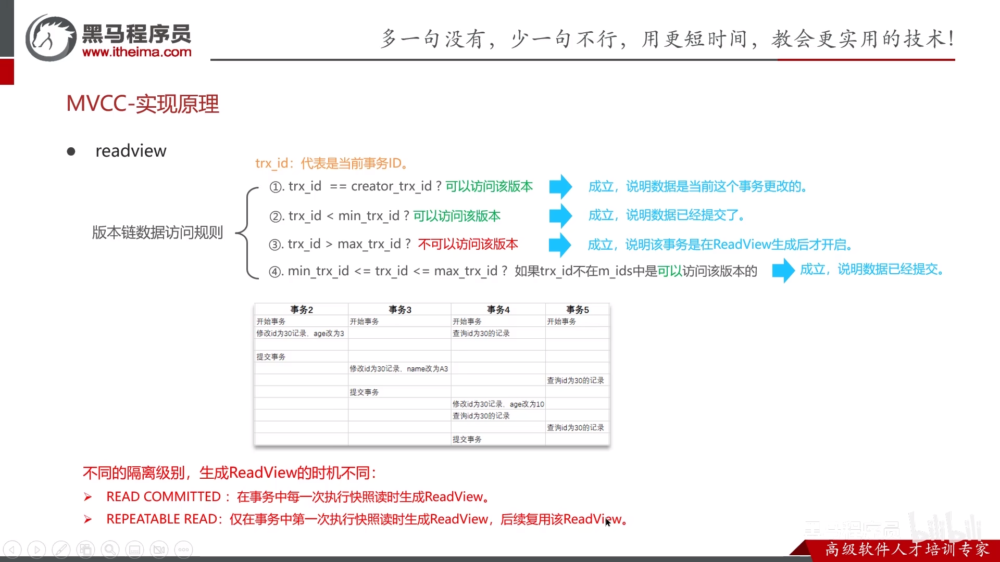

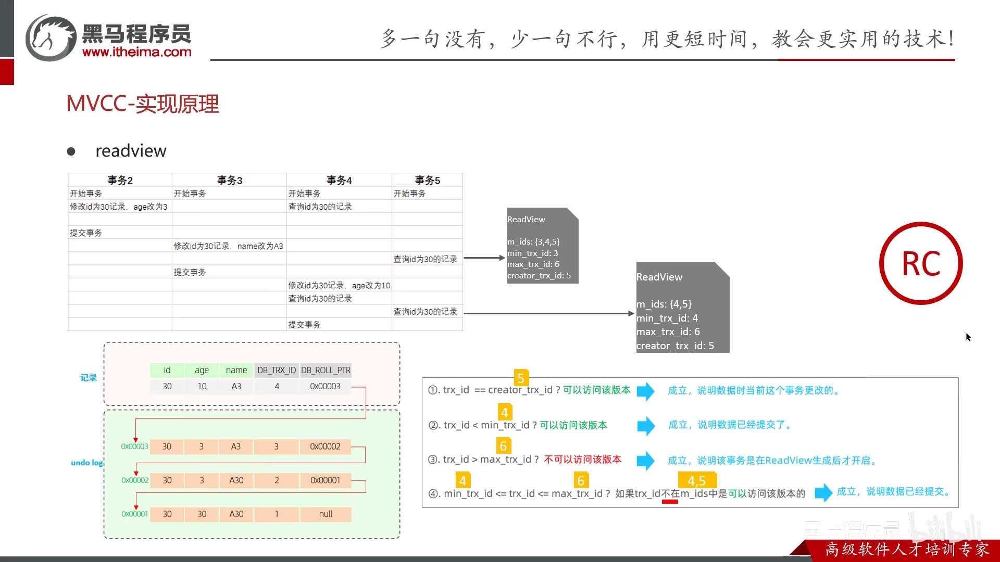

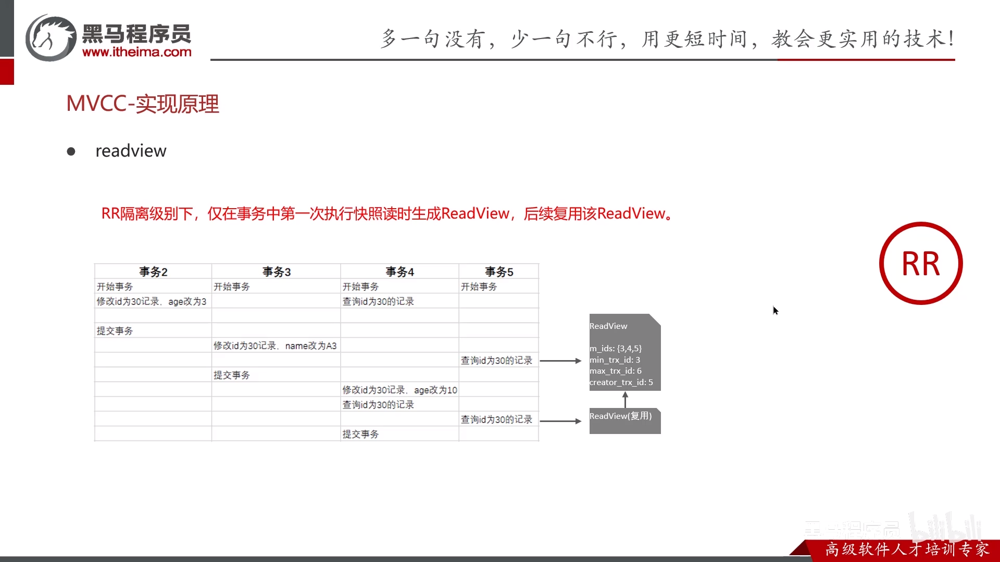


总结：

事务中的隔离性如何保证的？（你解释一下MVCC）

MySQL中的多版本并发控制。指维护一个数据的多个版本，使得读写操作没有冲突。

- **隐藏字段**:
① `trx_id`(事务id)，记录每一次操作的事务id，是自增的
② `roll_pointer`(回滚指针)，指向上一个版本的事务版本记录地址

- **`undo log`**:
① 回滚日志，存储老版本数据
② 版本链:多个事务并行操作某一行记录，记录不同事务修改数据的版本，通过roll pointer指针形成一个链表

- **`readView`** 解决的是一个事务查询选择版本的问题
① 根据readView的匹配规则和当前的一些事务id判断该访问那个版本的数据
② 不同的隔离级别快照读是不一样的，最终的访问的结果不一样

>RC:每一次执行快照读时生成ReadView
>RR:仅在事务中第一次执行快照读时生成ReadView，后续复用


## 三、主从同步

### 16、MySQL主从同步原理？

主从复制：
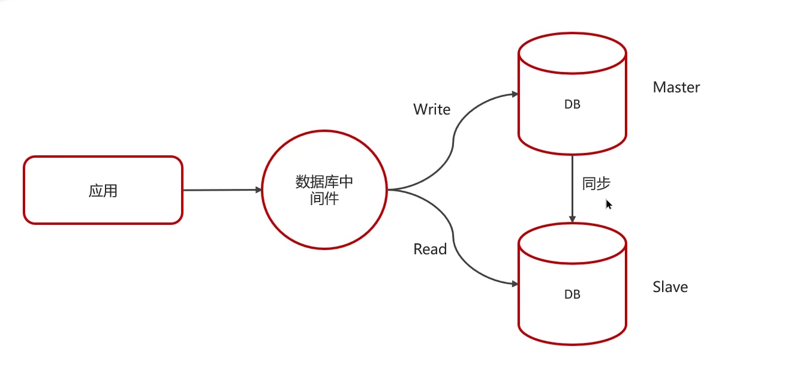

从同步原理：

MySQL主从复制的核心就是二进制日志

> 进制志(BINLOG)记录了所有的 DDL(数据定义语言)语和 DML(数操纵语言)语，但不包括数据查询SELECT、SHOW)语。

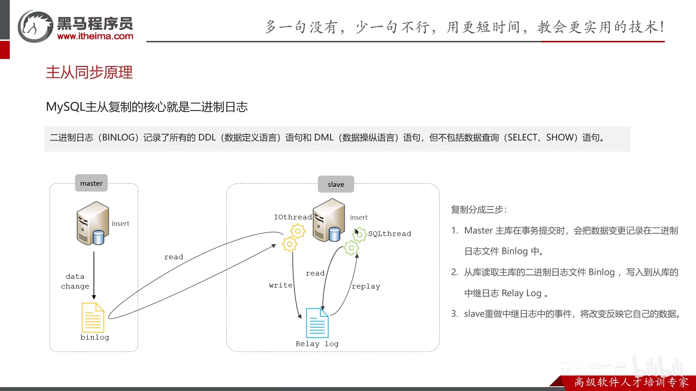


总结：

主从同步原理：

MySQL主从复制的核心就是二进制日志binlog(DDL(数据定义语言)语和 DML(数据操纵语言)语句)
① 主库在事务提交时，会把数据变更记录在二进制日志文件 Binlog 中。
② 从库读取主库的二进制日志文件 Binlog，写入到从库的中继日志 `Relay Log`。
③ 从库重做中继日志中的事件，将改变反映它自己的数据


## 四、分库分表 

### 拆分策略