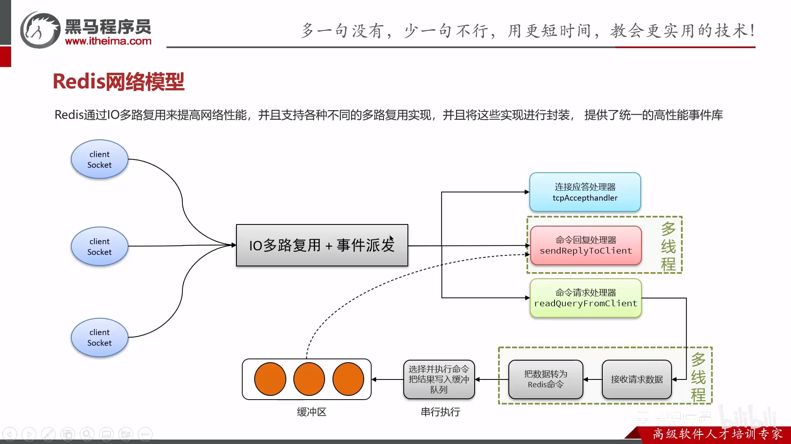

::: tip

视频来源：[新版Java面试专题视频教程，java八股文面试全套真题+深度详解（含大厂高频面试真题）](https://www.bilibili.com/video/BV1yT411H7YK/?vd_source=7138dfc78c49f602f8d3ed8cfbf0513d)

Redis更多详细整体知识：https://www.bilibili.com/video/BV1cr4y1671t/?spm_id_from=333.337.search-card.all.click

:::

## 总览

## 一 、Redis使用场景

结合业务回答，缓存。

### 1、什么是缓存穿透 ? 怎么解决 ?

1、**缓存穿透**：是指查询一个一定**不存在**的数据，如果从存储层查不到数据则不写入缓存，这将导致这个不存在的数据每次请求都要到 DB 去查询，可能导致 DB 挂掉。这种情况大概率是遭到了攻击。

2、解决方案：
1. 缓存空数据：查询返回的数据为空，仍把这个空结果进行缓存。
> 优点：简单。缺点：消耗内存，可能发生不一致问题。

2. **布隆过滤器**，用于检索一个元素是否在一个集合中。

**布隆过滤器**详解：
1、概念
**bitmap (位图)**：相当于是一个以(bit) 位为单位的数组，数组中每个单元只能存储二进制数0或1
**布隆过滤器作用**：布隆过滤器可以用于检索一个元素是否在一个集合中。

2、存在误判问题

总结：

缓存穿透:查询一个不存在的数据，mysql查询不到数据也不会直接写入缓存，就会导致每次请求都查数据库
解决方案一：缓存空数据

解决方案二：布隆过滤器

- 布隆过滤器主要是用于检索一个元素是否在一个集合中。我们当时使用的是redisson实现的布隆过滤器。
- 它底层主要是先去初始化一个比较大数组，里面存放的二进制0或1。在一开始都是0，当一个key来了之后经过3次hash计算，模于数组长度找到数据的下标然后把数组中原来的0改为1，这样的话，三个数组的位置就能标明一个key的存在。查找的过程也是一样的。
- 当然是有缺点的，布隆过滤器有可能会产生一定的误判，我们一般可以设置这个误判率，大概不会超过`5%`，其实这个误判是必然存在的，要不就得增加数组的长度，其实已经算是很合适了，`5%`以内的误判率一般的项目也能接受，不至于高并发下压倒数据库。

### 2、缓存击穿

1、**缓存击穿**：给`某一个key`设置了过期时间，当key过期的时候，恰好这时间点对这个key有大量的并发请求过来，这些并发的请求可能会瞬间把DB压垮。

2、解决方案：
互斥锁、逻辑过期

1. 互斥锁
**强一致性、性能差**

2. 逻辑过期
**高可用、性能优**

总结：

缓存击穿：是对于设置了过期时间的key，缓存在某个时间点过期的时候，恰好这时间点对这个Key有大量的并发请求过来，这些请求发现缓存过期一般都会从后端 DB 加载数据并回设到缓存，这个时候大并发的请求可能会瞬间把 DB 压垮。

解决方案有两种方式：
（1）使用互斥锁：当缓存失效时，不立即去load db，先使用如 `Redis` 的 `setnx` 去设置一个互斥锁，当操作成功返回时再进行 load db的操作并回设缓存，否则重试get缓存的方法
（2）设置当前key逻辑过期：大概是思路如下：
- ①：在设置key的时候，设置一个过期时间字段一块存入缓存中，不给当前key设置过期时间
- ②：当查询的时候，从redis取出数据后判断时间是否过期
- ③：如果过期则开通另外一个线程进行数据同步，当前线程正常返回数据，这个数据不是最新

当然两种方案各有利弊：
* 如果选择数据的强一致性，建议使用分布式锁的方案，性能上可能没那么高，锁需要等，也有可能产生死锁的问题
* 如果选择key的逻辑删除，则优先考虑的高可用性，性能比较高，但是数据同步这块做不到强一致。

### 3、缓存雪崩
定义：缓存雪崩是指在同一时段 **大量的缓存key同时失效** 或者 **Redis服务宕机**，导致大量请求到达数据库，带来巨大压力。

原因以及解决方案：

总结：
> `TTL` (Time To Live)是指键值对的过期时间

1. 缓存雪崩是指在同一时段大量的缓存key同时失效或者Redis服务宕机，导致大量请求到达数据库，带来巨大压力。

2. 解决方案
- 给不同的 Key 的 TTL 添加随机值
- 利用Redis集群提高服务的可用性
- 给缓存业务添加降级限流策略 (降级可作为系统的保底策略，适用于穿透、击穿、雪崩)
- 给业务添加多级缓存

### 4、双写一致性【Redis作为缓存，MySQL的数据如何与Redis进行同步呢？】

1. **双写一致性**：当修改了数据库的数据也要同时更新缓存的数据，缓存和数据库的数据要保持一致。
- 读操作：缓存命中，直接返回；缓存未命中查询数据库，写入缓存，设定超时时间
- 写操作：**延迟双删**

2. 延迟双删（先删除缓存，还是先删除数据库？**都不对**）
都会造成脏数据：

解决方法：
1. 采用分布式锁（读写锁）。【强一致性，性能差】

代码：

 

2. 异步通知
（1） MQ

（2） 基于Canal的异步通知。【无代码嵌入】

总结：

Redis作为缓存，MySQL的数据如何与Redis进行同步呢？

1. 介绍自己简历上的业务，我们当时是把文章的热点数据存入到了缓存中，虽然是热点数据，但是实时要求性并没有那么高，所以，我们当时采用的是异步的方案同步的数据。
2. 我们当时是把抢券的库存存入到了缓存中，这个需要实时的进行数据同步，为了保证数据的强一致我们当时采用的是redisson提供的读写锁来保证数据的同步.

介绍一下异步的方案？（你来介绍一下redisson读写锁的这种方案）

**允许延时一致的业务**，采用异步通知
① 使用MQ中间中间件，更新数据之后，通知缓存删除
② 利用canal中间件，不需要修改业务代码，伪装为mysql的一个从节点，canal通过读取binlog数据更新缓存

**强一致性的**，采用Redisson提供的读写锁
① 共享锁: 读锁readLock，加锁之后，其他线程可以共享读操作
② 排他锁:独占锁writeLock也叫，加锁之后，阻塞其他线程读写操作

### 5、持久化 - Redis作为缓存个，数据点持久化是怎么做的？

在Redis中提供了两种持久化的方法：RDB、AOF

1. RDB
RDB全称Redis Database Backup file (Redis数据备份文件)，也被叫做Redis数据快照。简单来说就是把内存中的所有数据都记录到磁盘中。当Redis实例故障重启后，从磁盘读取快照文件，恢复数据

- RDB执行原理？
bgsave开始时会fork主进程得到子进程，子进程**共享**主进程的内存数据。完成fork后读取内存数据并写入 RDB文件。

2. AOF
AOF全称为Append Only File(追加文件)。Redis处理的每一个写命令都会记录在AOF文件，可以看做是命令日志文件。

特点：
因为是记录命令，AOF文件会比RDB文件大的多。而且AOF会记录对同一个key的多次写操作，但只有最后一次写操作才有意义。通过执行**bgrewriteaof**命令，可以让AOF文件执行重写功能，用最少的命令达到相同效果。

3. RDB与AOF对比

总结：

1、在Redis中提供了两种数据持久化的方式：1、RDB  2、AOF
2、RDB是一个快照文件，它是把redis内存存储的数据写到磁盘上，当redis实例宕机恢复数据的时候，方便从RDB的快照文件中恢复数据。
3、AOF的含义是追加文件，当redis操作写命令的时候，都会存储这个文件中，当redis实例宕机恢复数据的时候，会从这个文件中再次执行一遍命令来恢复数据
4、RDB因为是二进制文件，在保存的时候体积也是比较小的，它恢复的比较快，但是它有可能会丢数据，我们通常在项目中也会使用AOF来恢复数据，虽然AOF恢复的速度慢一些，但是它丢数据的风险要小很多，在AOF文件中可以设置刷盘策略，我们当时设置的就是每秒批量写入一次命令。

### 6、数据过期（删除）策略（假如Redis的key删除过后，会立即删除吗？）
Redis对数据设置数据的有效时间，数据过期以后，就需要将数据从内存中删除掉。可以按照不同的规则进行删除，这种删除规则就被称之为数据的删除策略 (数据过期策略)。**惰性删除**、**定期删除**。

1. **Redis数据删除策略 - 惰性删除**

2. **Redis数据删除策略 - 定期删除**

总结：

**Redis的数据过期策略**
1. **惰性删除**：访问key的时候判断是否过期，如果过期，则删除
2. **定期删除**：定期检查一定量的key是否过期(SLOW模式+ FAST模式
3、Redis的过期删除策略: 惰性删除 + 定期删除 两种策略进行配合使用

### 7、数据淘汰策略（假如数据过多，内存有限，内存被占满了怎么办呢？）

**数据的淘汰策略**：当Redis中的内存不够用时，此时在向Redis中添加新的key，那么Redis就会按照某一种规则将内存中的数据删除掉，这种数据的删除规则被称之为内存的淘汰策略。

Redis支持8中不同策略来选择需要删除的key：

1. noeviction：不淘汰任何key，但是内存满时不允许写入新数据，**默认就是这种策略**
2. volatile-ttl：对设置了TTL的key，比较key的剩余TTL值，TTL越小越先被淘汰
3. allkeys-random：对全体key，随机进行淘汰。 
4. volatile-random: 对设置了TTL的key ，随机进行淘汰。 
5. allkeys-lru: 对全体key，基于LRU算法进行淘汰。
6. volatile-lru: 对设置了TTL的key，基于LRU算法进行淘汰。
7. allkeys-lfu: 对全体key，基于LFU算法进行淘汰。
8. volatile-lfu: 对设置了TTL的key，基于LFU算法进行淘汰。

关键词语：
**LRU(Least Recently Used) 最近最少使用** 。用当前时间减去最后一次访问时间，这个值越大则淘汰优先级越高。
**LFU(Least Frequently Used) 最少频率使用** 。会统计每个key的访问频率，值越小淘汰优先级越高。

**淘汰策略 - 使用建议**：
1. 优先使用 allkeys-lru 策略。充分利用 LRU 算法的优势，把最近最常访问的数据留在缓存中。如果业务有明显的冷热数据区分，建议使用。
2. 如果业务中数据访问频率差别不大，没有明显冷热数据区分，建议使用 allkeys-random，随机选择淘汰。
3. 如果业务中有置顶的需求，可以使用 volatile-lru 策略，同时置顶数据不设置过期时间，这些数据就一直不被删除，会淘汰其他设置过期时间的数据
4. 如果业务中有短时高频访问的数据，可以使用 allkeys-lfu 或 volatile-lfu 策略。

其他问题：
1. 数据库有1000万数据Redis只能缓存20w数据如何保证Redis中的数据都是热点数据?

使用allkeys-lru(挑选最近最少使用的数据淘汰)淘汰策略，留下来的都是经常访问的热点数据。

2. Redis的内存用完了会发生什么?

主要看数据淘汰策略是什么?如果是默认的配置 (noeviction )，会直接报错。

总结：

数据的淘汰策略

1. Redis提供了8种不同的数据淘汰策略，默认是noeviction不删除任何数据，内存不足直接报错。
2. LRU:最少最近使用。用当前时间减去最后一次访问时间，这个值越大则淘汰优先级越高。 
3. LFU: 最少频率使用。会统计每个key的访问频率，值越小淘汰优先级越高。

**平时开发过程中用的比较多的就是allkeys-lru （结合自己的业务场景）**

## 二 、Redis 分布式锁

### 8、使用场景

集群情况下的定时任务、抢单、幂等性场景
抢券：

**Redis的分布式锁**

1. **redisson实现的分布式锁-执行流程**

2. redisson实现的分布式锁-可重入
   利用**hash结构**记录**线程id**和**重入次数**。

3. redisson实现的分布式锁-主从一致性

总结：

1. Redis分布式锁，是如何实现的？
- 先按照自己简历上的业务进行描述分布式锁使用的场景
- 我们当使用的redisson实现的分布式锁，底层是**setnx**和**lua脚本**（保证原子性）

2. Redis分布式锁如何合理的控制锁的有效时长？

在redisson的分布式锁中，提供了一个**WatchDog(看门狗)**个线程获取锁成功以后，WatchDog会给持有锁的线程**续期 (默认是每隔10秒续期一次)**。

3. Redisson实现的分布式锁,是可重入的吗?
可以重入。这样做是为了避免死锁的产生。这个重入其实在内部就是判断是否是当前线程持有的锁，如果是当前线程持有的锁就会计数，如果释放锁就会在计算上减一。在存储数据的时候采用的**hash结构**，大key可以按照自己的业务进行定制，其中小key是当前线程的唯一标识，value是当前线程重入的次数。

4. Redisson实现的分布式锁能解决主从一致性的问题吗？
不能解决，但是可以使用redisson提供的**红锁**来解决，但是这样的话，性能就太低了、如果业务中非要保证数据的强一致性，建议采用**zookeeper**实现的分布式锁。

   
## 三、Redis 其他面试题

### 9、Redis的集群方案有哪些？
- 主从复制
- 哨兵模式
- 分片集群

### 10、Redis 的集群方案 - 主从复制  （保证不了高可用）

1. 概念：

建立集群、读写分离

2. 主从数据同步原理：

- 主从**全量同步**

- 主从**增量同步**（slave重启或者后期数据变化）

总结：

1、 介绍一下redis的主从同步
单节点Redis的并发能力是有上限的，要进一步提高Redis的并发能力，就需要搭建主从集群，实现读写分离.般都是一主多从，主节点负责写数据，从节点负责读数据

2、 能说一下，主从同步数据的流程吗？

**全量同步**
1. 从节点请求主节点同步数据 (replication id、offset)
2. 主节点判断是否是第一次请求，是第一次就与从节点同步版本信息 (replication id和offset)
3. 主节点执行bgsave，生成rdb文件后，发送给从节点去执行
4. 在rdb生成执行期间，主节点会以命令的方式记录到缓冲区(一个日志文件)
5. 把生成之后的命令志文件发送给从节点进行同步

**增量同步**
1. 从节点请求主节点同步数据，主节点判断不是第一次请求，不是第一次就获取从节点的offset值
2. 主节点从命令日志中获取offset值之后的数据，发送给从节点进行数据同步

### 12、Redis 的集群方案 - 哨兵模式、

**哨兵的作用**：

**服务状态监控**：

**Redis的集群 （哨兵模式）脑裂问题，以及解决方案**

总结：

1. 怎么保证Redis的高并发高可用
哨兵模式:实现主从集群的自动故障恢复(监控、自动故障恢复、通知)

2. 你们使用redis是单点还是集群，哪种集群
主从(1主1从)+哨兵就可以了。单节点不超过10G内存，如果Redis内存不足则可以给不同服务分配独立的Redis主从节点

3. redis集群脑裂是什么，该怎么解决呢?
**集群脑裂**是由于主节点和从节点和sentinel处于不同的网络分区，使得sentinel没有能够心跳感知到节点，所以通过选举的方式提升了一个从节点为主，这样就存在了两个master，就像大脑分裂了一样，这样会导致客户端还在老的主节点那里写入数据，新节点无法同步数据，当网络恢复后，sentinel会将老的主节点降为从节点，这时再从新master同步数据，就会导致数据丢失。
解决:我们可以修改redis的配置，可以设置最少的从节点数量以及缩短主从数据同步的延迟时间，达不到要求就拒绝请求就可以避免大量的数据丢失

   
### 12、Redis 的集群方案 - 分片集群模式

分片集群结构：

分片集群结构 - 数据读写（数据读写流程）：

总结：
1. redis的分片集群有什么作用
- 集群中有多个master，每个master保存不同数据
- 每个master都可以有多个slave节点
- master之间通过ping监测彼此健康状态
- 客户端请求可以访问集群任意节点，最终都会被转发到正确节点

2. Redis分片集群中数据是怎么存储和读取的?
- Redis 分片集群引入了哈希槽的概念，Redis 集群有16384个哈希槽
- 将16384个插槽分配到不同的实例
  - 读写数据:根据key的**有效部分**计算哈希值，对16384取余(有效部分，如果key前面有太括号，大括号的内容就是有效部分，如果没有，则以key本身做为有效部分)余数做为插槽，寻找插槽所在的实例

### 15、Redis 是单线程，为什么还那么快呢？
因为：

- Redis是纯内存操作，执行速度非常快
- 采用单线程，避免不必要的上下文切换可竞争条件，多线程还要考虑线程安全问题
- 使用I/O多路复用模型，非阻塞IO

一、 解释一下I/O多路复用模型？

Redis是纯内存操作，执行速度非常快，它的性能瓶颈是**网络延迟**而不是执行速度，1/0多路复用模型主要就是实现了高效的网络请求。

1. 用户控件和内核空间

2. 阻塞IO

3. 非阻塞IO

4. IO多路复用

IO多路复用的实现方式：

5. Redis网络模型

总结：

能解释一下IO多路复用吗？

1. I/O多路复用
是指利用单个线程来同时监听多个Socket，并在某个Socket可读、可写时得到通知，从而避免无效的等待，充分利用CPU资源。目前的I/0多路复用都是采用的epoll模式实现，它会在通知用户进程Socket就绪的同时，把已就绪的Socket写入用户空间，不需要挨个遍历Socket来判断是否就绪，提升了性能
   
2. Redis网络模型

就是使用I/0多路复用结合事件的处理器来应对多个Socket请求

- 连接应答处理器
- 命令回复处理器，在Redis6.0之后，为了提升更好的性能，使用了多线程来处理回复事件
- 命令请求处理器，在Redis6.0之后，将命令的转换使用了多线程，增加命令转换速度，在命令执行的时候，依然是单线程
