::: tip

[多线程相关面试题视频](https://www.bilibili.com/video/BV1yT411H7YK?p=86&spm_id_from=pageDriver&vd_source=7138dfc78c49f602f8d3ed8cfbf0513d)

[代码资源](https://pan.baidu.com/disk/main?from=homeFlow&login_type=weixin&_at_=1697339186893#/index?category=all&path=%2F%E9%BB%91%E9%A9%AC%E9%9D%A2%E8%AF%952023%2F08-%E5%B9%B6%E5%8F%91%E7%BC%96%E7%A8%8B%E7%AF%87%2F%E4%BB%A3%E7%A0%81)

[代码地址【经过整理组合】](https://gitee.com/cuckoocry/heima-demo)

:::

## 总览
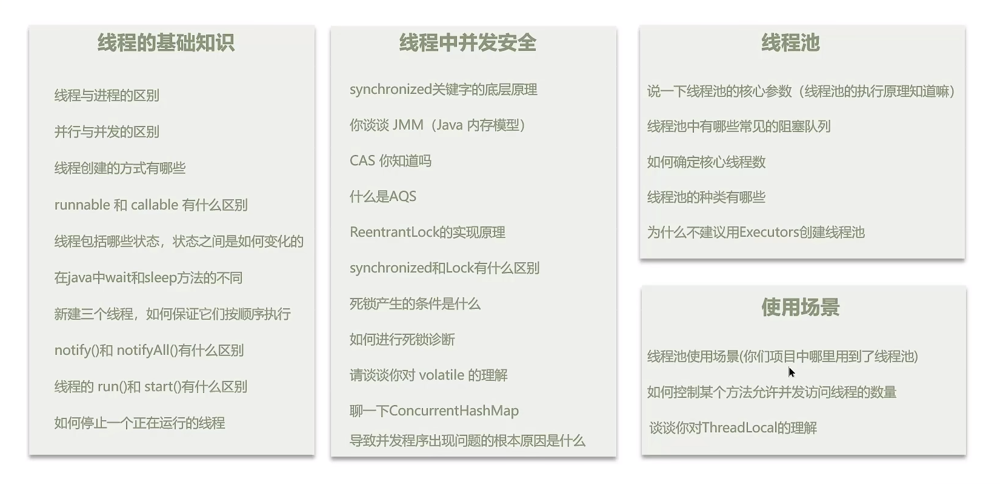

## 线程的基础知识

### 1、线程和进程的区别？
二者对比
- 进程是正在运行程序的实例，进程中包含了线程，每个线程执行不同的任务
- 不同的进程使用不同的内存空间，在当前进程下的所有线程可以共享内存空间
- 线程更轻量，线程上下文切换成本一般上要比进程上下文切换低 ( 上下文切换指的是从一个线程切换到另一个线程 )


### 2、并行与并发有什么区别？

**并发**：两个及两个以上的作业在同一 **时间段** 内执行。
**并行**：两个及两个以上的作业在同一 **时刻** 执行。

最关键的点是：是否是**同时**执行

另一种说法：
现在都是多核 CPU ，在多核 CPU 下
- 并发是同一时间应对多件事情的能力，多个线程轮流使用一个或多个 CPU
- 并行是同一时间动手做多件事情的能力， 4 核 CPU 同时执行 4 个线程

### 3、**创建线程的方式有哪些**？

共有四种方式可以创建线程，分别是：
- 继承 Thread 类
- 实现 Runnable 接口
- 实现 Callable 接口
- 线程池创建线程

1. 继承Thread类，重写run()方法，调用start()方法启动线程

```java
public class MyThread extends Thread {
    @Override
    public void run() {
        System.out.println("MyThread...run...");
    }
    public static void main(String[] args) {
        // 创建 MyThread 对象
        MyThread t1 = new MyThread() ;
        MyThread t2 = new MyThread() ;
        // 调用 start 方法启动线程
        t1.start();
        t2.start();
    }
}


```

2. 实现 Runnable 接口，重写run()方法，调用start()方法启动线程

```java
public class RunnableTask implements Runnable {
    
   @Override
   public void run() {
      System.out.println("Runnable!");
   }

   public static void main(String[] args) {
       // 创建RunnableTask对象
      RunnableTask task = new RunnableTask();
      
      // 创建Thread对象
      Thread thread = new Thread(task);
      
      // 启动调用
      thread.start();
   }
}


```

3. 实现Callable接口，重写`call()`方法，这种方式可以通过`FutureTask`获取任务执行的返回值。需要使用ExecutorService来提交Callable任务。

```java
public class CallerTask implements Callable<String> {

   @Override
   public String call() throws Exception {
      System.out.println(Thread.currentThread().getName());
      return "Hello,i am running!";
   }

   public static void main(String[] args) {
       // 创建 CallerTask 对象
       CallerTask callerTask =  new CallerTask()
       //创建异步任务 FutureTask
       FutureTask<String> task = new FutureTask<>(callerTask);
       // 创建Thread对象
       Thread thread = new Thread(task);
       
       // 调用 start 方法启动线程
       thread.start();
       
      try {
         // 等待执行完成，并获取返回结果
         String result = task.get();
         System.out.println(result);
      } catch (InterruptedException e) {
         e.printStackTrace();
      } catch (ExecutionException e) {
         e.printStackTrace();
      }
   }
}
```

4. 线程池 (http://localhost:8099/xiaofeipeng/study-notes/%E5%A4%A7%E5%8E%82%E9%9D%A2%E8%AF%95%E7%AC%AC%E4%BA%8C%E5%AD%A3/10_%E7%BA%BF%E7%A8%8B%E6%B1%A0/)
```java
public class Main {

    public static void main(String[] args) {

        // 手写线程池
        final Integer corePoolSize = 2;
        final Integer maximumPoolSize = 5;
        final Long keepAliveTime = 1L;

        // 自定义线程池，只改变了LinkBlockingQueue的队列大小
        ExecutorService executorService = new ThreadPoolExecutor(
                corePoolSize,
                maximumPoolSize,
                keepAliveTime,
                TimeUnit.SECONDS,
                new LinkedBlockingQueue<>(3),
                Executors.defaultThreadFactory(),
                new ThreadPoolExecutor.AbortPolicy());

        try {

            // 循环十次，模拟业务办理，让5个线程处理这10个请求
            for (int i = 0; i < 10; i++) {
                final int tempInt = i;
                //executorService.submit(() -> Thread.currentThread().getName());

                executorService.execute(() -> {
                    System.out.println(Thread.currentThread().getName() + "\t 给用户:" + tempInt + " 办理业务");
                });
            }
        } catch (Exception e) {
            e.printStackTrace();
        } finally {
            executorService.shutdown();
        }

    }
}


```

#### Runnable 和 Callable 有什么区别？

1. Runnable 接口 run 方法没有返回值
2. Callable 接口 call 方法有返回值，是个泛型，和 Future 、 FutureTask 配合可以用来获取异步执行的结果
3. Callable 接口的 `call()` 方法允许抛出异常；而 Runnable 接口的 run() 方法的异常只能在内部消化，不能继续上抛

#### 线程的 run() 和 start() 有什么区别？

start(): 用来启动线程，通过该线程调用 run 方法执行 run 方法中所定义的逻辑代码。 start 方法只能被调用一次。
run(): 封装了要被线程执行的代码，可以被调用多次。

#### 总结

1. 创建线程的方式有哪些？
- 继承 Thread 类
- 实现 runnable 接口
- 实现 Callable 接口
- 线程池创建线程 ( 项目中使用方式 )

2. runnable 和 callable 有什么区别

- Runnable 接口 run 方法没有返回值
- Callable 接口 call 方法有返回值，需要 FutureTask 获取结果
- Callable 接口的 call() 方法允许抛出异常；而 Runnable 接口的 run() 方法的异常只能在内部消化，不能继续上抛

3. run() 和 start() 有什么区别？

- start(): 用来启动线程，通过该线程调用 run 方法执行 run 方法中所定义的逻辑代码。 start 方法只能被调用一次。
- run(): 封装了要被线程执行的代码，可以被调用多次。

### 4、线程包括哪些状态，状态之间是如何变化的

参考:[线程的生命周期](https://javaguide.cn/java/concurrent/java-concurrent-questions-01.html#%E8%AF%B4%E8%AF%B4%E7%BA%BF%E7%A8%8B%E7%9A%84%E7%94%9F%E5%91%BD%E5%91%A8%E6%9C%9F%E5%92%8C%E7%8A%B6%E6%80%81)

线程的状态可以参考 JDK 中的 Thread 类中的枚举 State 。
```java
public enum State {
    // 尚未启动的线程的线程状态
    NEW,
    // 可运行线程的线程状态。
    RUNNABLE,
    // 线程阻塞等待监视器锁的线程状态。
    BLOCKED,
    // 等待线程的线程状态
    WAITING,
    // 具有指定等待时间的等待线程的线程状态
    TIMED_WAITING,// 已终止线程的线程状态。线程已完成执行
    TERMINATED;
}
```

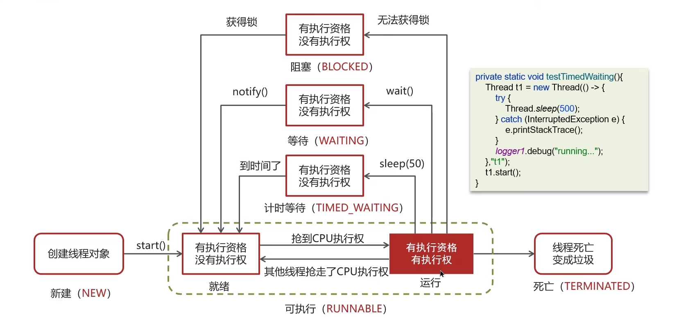

#### 总结


1. 线程包括哪些状态

新建（ NEW ）
可运行（ RUNNABLE ）
阻塞（ BLOCKED ）
等待 （ WAITING ）
时间等待（ TIMED_WALTING ）
终止（ TERMINATED ）

2. 线程状态之间是如何变化的
 
- 创建线程对象是新建状态
- 调用了 start() 方法转变为可执行状态
- 线程获取到了 CPU 的执行权，执行结束是终止状态
- 在可执行状态的过程中，如果没有获取 CPU 的执行权，可能会切换其他状态
  - 如果没有获取锁（ synchronized 或 lock ）进入阻塞状态，获得锁再切换为可执行状态
  - 如果线程调用了 wait() 方法进入等待状态，其他线程调用 notify() 唤醒后可切换为可执行状态
  - 如果线程调用了 sleep(50) 方法，进入计时等待状态，到时间后可切换为可执行状态


### 5、新建 T1 、 T2 、 T3 三个线程，如何保证它们按顺序执行？

可以使用线程中的 join 方法解决。

```
join() 等待线程运行结束。

小例子：
t.join()
阻塞调用此方法的线程进入 timed_waiting
直到线程 t 执行完成后，此线程再继续执行
```
```java
public class Test {
    public static void main(String[] args) {

        Thread t1 = new Thread(()->{
            System.out.println("t1");
        });

        Thread t2 = new Thread(()->{
            try {
                t1.join();
            } catch (InterruptedException e) {
                throw new RuntimeException(e);
            }
            System.out.println("t2");
        });

        Thread t3 = new Thread(()->{
            try {
                t2.join();
            } catch (InterruptedException e) {
                throw new RuntimeException(e);
            }
            System.out.println("t3");
        });
        // 虽然先启动t3，但是 必须先等t2完成，她t2必须先等t1完成
        t3.start();
        t2.start();
        t1.start();
    }
}

```
结果：
```shell
C:\myJava2\Java\jdk1.8.0_201\bin\java.exe "-javaagent:C:\Program Files\JetBrains\IntelliJ IDEA 2022.3.2\lib\idea_rt.jar=13847:C:\Program Files\JetBrains\IntelliJ IDEA 2022.3.2\bin" -Dfile.encoding=UTF-8 -classpath C:\myJava2\Java\jdk1.8.0_201\jre\lib\charsets.jar;C:\myJava2\Java\jdk1.8.0_201\jre\lib\deploy.jar;C:\myJava2\Java\jdk1.8.0_201\jre\lib\ext\access-bridge-64.jar;C:\myJava2\Java\jdk1.8.0_201\jre\lib\ext\cldrdata.jar;C:\myJava2\Java\jdk1.8.0_201\jre\lib\ext\dnsns.jar;C:\myJava2\Java\jdk1.8.0_201\jre\lib\ext\jaccess.jar;C:\myJava2\Java\jdk1.8.0_201\jre\lib\ext\jfxrt.jar;C:\myJava2\Java\jdk1.8.0_201\jre\lib\ext\localedata.jar;C:\myJava2\Java\jdk1.8.0_201\jre\lib\ext\nashorn.jar;C:\myJava2\Java\jdk1.8.0_201\jre\lib\ext\sunec.jar;C:\myJava2\Java\jdk1.8.0_201\jre\lib\ext\sunjce_provider.jar;C:\myJava2\Java\jdk1.8.0_201\jre\lib\ext\sunmscapi.jar;C:\myJava2\Java\jdk1.8.0_201\jre\lib\ext\sunpkcs11.jar;C:\myJava2\Java\jdk1.8.0_201\jre\lib\ext\zipfs.jar;C:\myJava2\Java\jdk1.8.0_201\jre\lib\javaws.jar;C:\myJava2\Java\jdk1.8.0_201\jre\lib\jce.jar;C:\myJava2\Java\jdk1.8.0_201\jre\lib\jfr.jar;C:\myJava2\Java\jdk1.8.0_201\jre\lib\jfxswt.jar;C:\myJava2\Java\jdk1.8.0_201\jre\lib\jsse.jar;C:\myJava2\Java\jdk1.8.0_201\jre\lib\management-agent.jar;C:\myJava2\Java\jdk1.8.0_201\jre\lib\plugin.jar;C:\myJava2\Java\jdk1.8.0_201\jre\lib\resources.jar;C:\myJava2\Java\jdk1.8.0_201\jre\lib\rt.jar;C:\IdeaProjectMyself\RuoYi-Vue-Jiang\ruoyi-admin\target\classes;C:\Users\jiang\.m2\repository\org\springframework\boot\spring-boot-devtools\2.5.14\spring-boot-devtools-2.5.14.jar;C:\Users\jiang\.m2\repository\org\springframework\boot\spring-boot\2.5.14\spring-boot-2.5.14.jar;C:\Users\jiang\.m2\repository\org\springframework\spring-core\5.3.20\spring-core-5.3.20.jar;C:\Users\jiang\.m2\repository\org\springframework\spring-jcl\5.3.20\spring-jcl-5.3.20.jar;C:\Users\jiang\.m2\repository\org\springframework\spring-context\5.3.20\spring-context-5.3.20.jar;C:\Users\jiang\.m2\repository\org\springframework\spring-beans\5.3.20\spring-beans-5.3.20.jar;C:\Users\jiang\.m2\repository\org\springframework\spring-expression\5.3.20\spring-expression-5.3.20.jar;C:\Users\jiang\.m2\repository\org\springframework\boot\spring-boot-autoconfigure\2.5.14\spring-boot-autoconfigure-2.5.14.jar;C:\Users\jiang\.m2\repository\com\github\xiaoymin\knife4j-spring-boot-starter\3.0.3\knife4j-spring-boot-starter-3.0.3.jar;C:\Users\jiang\.m2\repository\com\github\xiaoymin\knife4j-spring-boot-autoconfigure\3.0.3\knife4j-spring-boot-autoconfigure-3.0.3.jar;C:\Users\jiang\.m2\repository\com\github\xiaoymin\knife4j-spring\3.0.3\knife4j-spring-3.0.3.jar;C:\Users\jiang\.m2\repository\com\github\xiaoymin\knife4j-annotations\3.0.3\knife4j-annotations-3.0.3.jar;C:\Users\jiang\.m2\repository\io\swagger\swagger-annotations\1.5.22\swagger-annotations-1.5.22.jar;C:\Users\jiang\.m2\repository\io\swagger\core\v3\swagger-annotations\2.1.2\swagger-annotations-2.1.2.jar;C:\Users\jiang\.m2\repository\com\github\xiaoymin\knife4j-core\3.0.3\knife4j-core-3.0.3.jar;C:\Users\jiang\.m2\repository\org\javassist\javassist\3.25.0-GA\javassist-3.25.0-GA.jar;C:\Users\jiang\.m2\repository\io\springfox\springfox-swagger2\3.0.0\springfox-swagger2-3.0.0.jar;C:\Users\jiang\.m2\repository\io\springfox\springfox-spi\3.0.0\springfox-spi-3.0.0.jar;C:\Users\jiang\.m2\repository\io\springfox\springfox-schema\3.0.0\springfox-schema-3.0.0.jar;C:\Users\jiang\.m2\repository\io\springfox\springfox-swagger-common\3.0.0\springfox-swagger-common-3.0.0.jar;C:\Users\jiang\.m2\repository\io\springfox\springfox-spring-web\3.0.0\springfox-spring-web-3.0.0.jar;C:\Users\jiang\.m2\repository\io\github\classgraph\classgraph\4.8.83\classgraph-4.8.83.jar;C:\Users\jiang\.m2\repository\io\springfox\springfox-spring-webflux\3.0.0\springfox-spring-webflux-3.0.0.jar;C:\Users\jiang\.m2\repository\org\mapstruct\mapstruct\1.3.1.Final\mapstruct-1.3.1.Final.jar;C:\Users\jiang\.m2\repository\io\springfox\springfox-spring-webmvc\3.0.0\springfox-spring-webmvc-3.0.0.jar;C:\Users\jiang\.m2\repository\io\springfox\springfox-core\3.0.0\springfox-core-3.0.0.jar;C:\Users\jiang\.m2\repository\net\bytebuddy\byte-buddy\1.10.22\byte-buddy-1.10.22.jar;C:\Users\jiang\.m2\repository\io\springfox\springfox-oas\3.0.0\springfox-oas-3.0.0.jar;C:\Users\jiang\.m2\repository\io\swagger\core\v3\swagger-models\2.1.2\swagger-models-2.1.2.jar;C:\Users\jiang\.m2\repository\io\springfox\springfox-bean-validators\3.0.0\springfox-bean-validators-3.0.0.jar;C:\Users\jiang\.m2\repository\io\swagger\swagger-models\1.5.22\swagger-models-1.5.22.jar;C:\Users\jiang\.m2\repository\io\swagger\swagger-core\1.5.22\swagger-core-1.5.22.jar;C:\Users\jiang\.m2\repository\com\fasterxml\jackson\dataformat\jackson-dataformat-yaml\2.12.6\jackson-dataformat-yaml-2.12.6.jar;C:\Users\jiang\.m2\repository\javax\validation\validation-api\2.0.1.Final\validation-api-2.0.1.Final.jar;C:\Users\jiang\.m2\repository\io\springfox\springfox-boot-starter\3.0.0\springfox-boot-starter-3.0.0.jar;C:\Users\jiang\.m2\repository\io\springfox\springfox-data-rest\3.0.0\springfox-data-rest-3.0.0.jar;C:\Users\jiang\.m2\repository\com\fasterxml\classmate\1.5.1\classmate-1.5.1.jar;C:\Users\jiang\.m2\repository\org\springframework\plugin\spring-plugin-core\2.0.0.RELEASE\spring-plugin-core-2.0.0.RELEASE.jar;C:\Users\jiang\.m2\repository\org\springframework\plugin\spring-plugin-metadata\2.0.0.RELEASE\spring-plugin-metadata-2.0.0.RELEASE.jar;C:\Users\jiang\.m2\repository\com\github\xiaoymin\knife4j-spring-ui\3.0.3\knife4j-spring-ui-3.0.3.jar;C:\Users\jiang\.m2\repository\mysql\mysql-connector-java\8.0.29\mysql-connector-java-8.0.29.jar;C:\IdeaProjectMyself\RuoYi-Vue-Jiang\ruoyi-framework\target\classes;C:\Users\jiang\.m2\repository\org\springframework\boot\spring-boot-starter-web\2.5.14\spring-boot-starter-web-2.5.14.jar;C:\Users\jiang\.m2\repository\org\springframework\boot\spring-boot-starter\2.5.14\spring-boot-starter-2.5.14.jar;C:\Users\jiang\.m2\repository\org\springframework\boot\spring-boot-starter-logging\2.5.14\spring-boot-starter-logging-2.5.14.jar;C:\Users\jiang\.m2\repository\ch\qos\logback\logback-classic\1.2.11\logback-classic-1.2.11.jar;C:\Users\jiang\.m2\repository\ch\qos\logback\logback-core\1.2.11\logback-core-1.2.11.jar;C:\Users\jiang\.m2\repository\org\apache\logging\log4j\log4j-to-slf4j\2.17.2\log4j-to-slf4j-2.17.2.jar;C:\Users\jiang\.m2\repository\org\apache\logging\log4j\log4j-api\2.17.2\log4j-api-2.17.2.jar;C:\Users\jiang\.m2\repository\org\slf4j\jul-to-slf4j\1.7.36\jul-to-slf4j-1.7.36.jar;C:\Users\jiang\.m2\repository\jakarta\annotation\jakarta.annotation-api\1.3.5\jakarta.annotation-api-1.3.5.jar;C:\Users\jiang\.m2\repository\org\springframework\boot\spring-boot-starter-json\2.5.14\spring-boot-starter-json-2.5.14.jar;C:\Users\jiang\.m2\repository\com\fasterxml\jackson\datatype\jackson-datatype-jdk8\2.12.6\jackson-datatype-jdk8-2.12.6.jar;C:\Users\jiang\.m2\repository\com\fasterxml\jackson\datatype\jackson-datatype-jsr310\2.12.6\jackson-datatype-jsr310-2.12.6.jar;C:\Users\jiang\.m2\repository\com\fasterxml\jackson\module\jackson-module-parameter-names\2.12.6\jackson-module-parameter-names-2.12.6.jar;C:\Users\jiang\.m2\repository\org\springframework\spring-web\5.3.20\spring-web-5.3.20.jar;C:\Users\jiang\.m2\repository\org\springframework\spring-webmvc\5.3.20\spring-webmvc-5.3.20.jar;C:\Users\jiang\.m2\repository\org\springframework\boot\spring-boot-starter-jetty\2.5.14\spring-boot-starter-jetty-2.5.14.jar;C:\Users\jiang\.m2\repository\jakarta\servlet\jakarta.servlet-api\4.0.4\jakarta.servlet-api-4.0.4.jar;C:\Users\jiang\.m2\repository\jakarta\websocket\jakarta.websocket-api\1.1.2\jakarta.websocket-api-1.1.2.jar;C:\Users\jiang\.m2\repository\org\apache\tomcat\embed\tomcat-embed-el\9.0.63\tomcat-embed-el-9.0.63.jar;C:\Users\jiang\.m2\repository\org\eclipse\jetty\jetty-servlets\9.4.46.v20220331\jetty-servlets-9.4.46.v20220331.jar;C:\Users\jiang\.m2\repository\org\eclipse\jetty\jetty-continuation\9.4.46.v20220331\jetty-continuation-9.4.46.v20220331.jar;C:\Users\jiang\.m2\repository\org\eclipse\jetty\jetty-http\9.4.46.v20220331\jetty-http-9.4.46.v20220331.jar;C:\Users\jiang\.m2\repository\org\eclipse\jetty\jetty-util\9.4.46.v20220331\jetty-util-9.4.46.v20220331.jar;C:\Users\jiang\.m2\repository\org\eclipse\jetty\jetty-io\9.4.46.v20220331\jetty-io-9.4.46.v20220331.jar;C:\Users\jiang\.m2\repository\org\eclipse\jetty\jetty-webapp\9.4.46.v20220331\jetty-webapp-9.4.46.v20220331.jar;C:\Users\jiang\.m2\repository\org\eclipse\jetty\jetty-xml\9.4.46.v20220331\jetty-xml-9.4.46.v20220331.jar;C:\Users\jiang\.m2\repository\org\eclipse\jetty\jetty-servlet\9.4.46.v20220331\jetty-servlet-9.4.46.v20220331.jar;C:\Users\jiang\.m2\repository\org\eclipse\jetty\jetty-security\9.4.46.v20220331\jetty-security-9.4.46.v20220331.jar;C:\Users\jiang\.m2\repository\org\eclipse\jetty\jetty-server\9.4.46.v20220331\jetty-server-9.4.46.v20220331.jar;C:\Users\jiang\.m2\repository\org\eclipse\jetty\jetty-util-ajax\9.4.46.v20220331\jetty-util-ajax-9.4.46.v20220331.jar;C:\Users\jiang\.m2\repository\org\eclipse\jetty\websocket\websocket-server\9.4.46.v20220331\websocket-server-9.4.46.v20220331.jar;C:\Users\jiang\.m2\repository\org\eclipse\jetty\websocket\websocket-common\9.4.46.v20220331\websocket-common-9.4.46.v20220331.jar;C:\Users\jiang\.m2\repository\org\eclipse\jetty\websocket\websocket-api\9.4.46.v20220331\websocket-api-9.4.46.v20220331.jar;C:\Users\jiang\.m2\repository\org\eclipse\jetty\websocket\websocket-client\9.4.46.v20220331\websocket-client-9.4.46.v20220331.jar;C:\Users\jiang\.m2\repository\org\eclipse\jetty\jetty-client\9.4.46.v20220331\jetty-client-9.4.46.v20220331.jar;C:\Users\jiang\.m2\repository\org\eclipse\jetty\websocket\websocket-servlet\9.4.46.v20220331\websocket-servlet-9.4.46.v20220331.jar;C:\Users\jiang\.m2\repository\org\eclipse\jetty\websocket\javax-websocket-server-impl\9.4.46.v20220331\javax-websocket-server-impl-9.4.46.v20220331.jar;C:\Users\jiang\.m2\repository\org\eclipse\jetty\jetty-annotations\9.4.46.v20220331\jetty-annotations-9.4.46.v20220331.jar;C:\Users\jiang\.m2\repository\org\eclipse\jetty\jetty-plus\9.4.46.v20220331\jetty-plus-9.4.46.v20220331.jar;C:\Users\jiang\.m2\repository\org\ow2\asm\asm\9.2\asm-9.2.jar;C:\Users\jiang\.m2\repository\org\ow2\asm\asm-commons\9.2\asm-commons-9.2.jar;C:\Users\jiang\.m2\repository\org\ow2\asm\asm-tree\9.2\asm-tree-9.2.jar;C:\Users\jiang\.m2\repository\org\ow2\asm\asm-analysis\9.2\asm-analysis-9.2.jar;C:\Users\jiang\.m2\repository\org\eclipse\jetty\websocket\javax-websocket-client-impl\9.4.46.v20220331\javax-websocket-client-impl-9.4.46.v20220331.jar;C:\Users\jiang\.m2\repository\org\springframework\boot\spring-boot-starter-aop\2.5.14\spring-boot-starter-aop-2.5.14.jar;C:\Users\jiang\.m2\repository\org\springframework\spring-aop\5.3.20\spring-aop-5.3.20.jar;C:\Users\jiang\.m2\repository\org\aspectj\aspectjweaver\1.9.7\aspectjweaver-1.9.7.jar;C:\Users\jiang\.m2\repository\com\alibaba\druid-spring-boot-starter\1.2.16\druid-spring-boot-starter-1.2.16.jar;C:\Users\jiang\.m2\repository\com\alibaba\druid\1.2.16\druid-1.2.16.jar;C:\Users\jiang\.m2\repository\org\slf4j\slf4j-api\1.7.36\slf4j-api-1.7.36.jar;C:\Users\jiang\.m2\repository\pro\fessional\kaptcha\2.3.3\kaptcha-2.3.3.jar;C:\Users\jiang\.m2\repository\com\jhlabs\filters\2.0.235-1\filters-2.0.235-1.jar;C:\Users\jiang\.m2\repository\javax\servlet\servlet-api\2.5\servlet-api-2.5.jar;C:\Users\jiang\.m2\repository\com\github\oshi\oshi-core\6.4.0\oshi-core-6.4.0.jar;C:\Users\jiang\.m2\repository\net\java\dev\jna\jna\5.12.1\jna-5.12.1.jar;C:\Users\jiang\.m2\repository\net\java\dev\jna\jna-platform\5.12.1\jna-platform-5.12.1.jar;C:\IdeaProjectMyself\RuoYi-Vue-Jiang\ruoyi-system\target\classes;C:\IdeaProjectMyself\RuoYi-Vue-Jiang\ruoyi-quartz\target\classes;C:\Users\jiang\.m2\repository\org\quartz-scheduler\quartz\2.3.2\quartz-2.3.2.jar;C:\Users\jiang\.m2\repository\com\mchange\mchange-commons-java\0.2.15\mchange-commons-java-0.2.15.jar;C:\IdeaProjectMyself\RuoYi-Vue-Jiang\ruoyi-common\target\classes;C:\Users\jiang\.m2\repository\org\projectlombok\lombok\1.18.24\lombok-1.18.24.jar;C:\Users\jiang\.m2\repository\io\minio\minio\8.2.1\minio-8.2.1.jar;C:\Users\jiang\.m2\repository\com\carrotsearch\thirdparty\simple-xml-safe\2.7.1\simple-xml-safe-2.7.1.jar;C:\Users\jiang\.m2\repository\com\google\guava\guava\29.0-jre\guava-29.0-jre.jar;C:\Users\jiang\.m2\repository\com\google\guava\failureaccess\1.0.1\failureaccess-1.0.1.jar;C:\Users\jiang\.m2\repository\com\google\guava\listenablefuture\9999.0-empty-to-avoid-conflict-with-guava\listenablefuture-9999.0-empty-to-avoid-conflict-with-guava.jar;C:\Users\jiang\.m2\repository\com\google\code\findbugs\jsr305\3.0.2\jsr305-3.0.2.jar;C:\Users\jiang\.m2\repository\org\checkerframework\checker-qual\2.11.1\checker-qual-2.11.1.jar;C:\Users\jiang\.m2\repository\com\google\errorprone\error_prone_annotations\2.3.4\error_prone_annotations-2.3.4.jar;C:\Users\jiang\.m2\repository\com\google\j2objc\j2objc-annotations\1.3\j2objc-annotations-1.3.jar;C:\Users\jiang\.m2\repository\com\squareup\okhttp3\okhttp\3.14.9\okhttp-3.14.9.jar;C:\Users\jiang\.m2\repository\com\squareup\okio\okio\1.17.2\okio-1.17.2.jar;C:\Users\jiang\.m2\repository\com\fasterxml\jackson\core\jackson-annotations\2.12.6\jackson-annotations-2.12.6.jar;C:\Users\jiang\.m2\repository\com\fasterxml\jackson\core\jackson-core\2.12.6\jackson-core-2.12.6.jar;C:\Users\jiang\.m2\repository\org\springframework\spring-context-support\5.3.20\spring-context-support-5.3.20.jar;C:\Users\jiang\.m2\repository\org\springframework\boot\spring-boot-starter-security\2.5.14\spring-boot-starter-security-2.5.14.jar;C:\Users\jiang\.m2\repository\org\springframework\security\spring-security-config\5.5.8\spring-security-config-5.5.8.jar;C:\Users\jiang\.m2\repository\org\springframework\security\spring-security-core\5.5.8\spring-security-core-5.5.8.jar;C:\Users\jiang\.m2\repository\org\springframework\security\spring-security-crypto\5.5.8\spring-security-crypto-5.5.8.jar;C:\Users\jiang\.m2\repository\org\springframework\security\spring-security-web\5.5.8\spring-security-web-5.5.8.jar;C:\Users\jiang\.m2\repository\com\github\pagehelper\pagehelper-spring-boot-starter\1.4.6\pagehelper-spring-boot-starter-1.4.6.jar;C:\Users\jiang\.m2\repository\org\mybatis\spring\boot\mybatis-spring-boot-starter\2.2.2\mybatis-spring-boot-starter-2.2.2.jar;C:\Users\jiang\.m2\repository\org\mybatis\spring\boot\mybatis-spring-boot-autoconfigure\2.2.2\mybatis-spring-boot-autoconfigure-2.2.2.jar;C:\Users\jiang\.m2\repository\org\mybatis\mybatis\3.5.9\mybatis-3.5.9.jar;C:\Users\jiang\.m2\repository\org\mybatis\mybatis-spring\2.0.7\mybatis-spring-2.0.7.jar;C:\Users\jiang\.m2\repository\com\github\pagehelper\pagehelper-spring-boot-autoconfigure\1.4.6\pagehelper-spring-boot-autoconfigure-1.4.6.jar;C:\Users\jiang\.m2\repository\com\github\pagehelper\pagehelper\5.3.2\pagehelper-5.3.2.jar;C:\Users\jiang\.m2\repository\com\github\jsqlparser\jsqlparser\4.5\jsqlparser-4.5.jar;C:\Users\jiang\.m2\repository\org\springframework\boot\spring-boot-starter-validation\2.5.14\spring-boot-starter-validation-2.5.14.jar;C:\Users\jiang\.m2\repository\org\hibernate\validator\hibernate-validator\6.2.3.Final\hibernate-validator-6.2.3.Final.jar;C:\Users\jiang\.m2\repository\jakarta\validation\jakarta.validation-api\2.0.2\jakarta.validation-api-2.0.2.jar;C:\Users\jiang\.m2\repository\org\jboss\logging\jboss-logging\3.4.3.Final\jboss-logging-3.4.3.Final.jar;C:\Users\jiang\.m2\repository\org\apache\commons\commons-lang3\3.12.0\commons-lang3-3.12.0.jar;C:\Users\jiang\.m2\repository\com\fasterxml\jackson\core\jackson-databind\2.12.6.1\jackson-databind-2.12.6.1.jar;C:\Users\jiang\.m2\repository\com\baomidou\dynamic-datasource-spring-boot-starter\3.5.2\dynamic-datasource-spring-boot-starter-3.5.2.jar;C:\Users\jiang\.m2\repository\org\springframework\boot\spring-boot-starter-jdbc\2.5.14\spring-boot-starter-jdbc-2.5.14.jar;C:\Users\jiang\.m2\repository\com\zaxxer\HikariCP\4.0.3\HikariCP-4.0.3.jar;C:\Users\jiang\.m2\repository\org\springframework\spring-jdbc\5.3.20\spring-jdbc-5.3.20.jar;C:\Users\jiang\.m2\repository\com\alibaba\fastjson2\fastjson2\2.0.25\fastjson2-2.0.25.jar;C:\Users\jiang\.m2\repository\commons-io\commons-io\2.11.0\commons-io-2.11.0.jar;C:\Users\jiang\.m2\repository\org\yaml\snakeyaml\1.28\snakeyaml-1.28.jar;C:\Users\jiang\.m2\repository\io\jsonwebtoken\jjwt\0.9.1\jjwt-0.9.1.jar;C:\Users\jiang\.m2\repository\javax\xml\bind\jaxb-api\2.3.1\jaxb-api-2.3.1.jar;C:\Users\jiang\.m2\repository\javax\activation\javax.activation-api\1.2.0\javax.activation-api-1.2.0.jar;C:\Users\jiang\.m2\repository\org\springframework\boot\spring-boot-starter-data-redis\2.5.14\spring-boot-starter-data-redis-2.5.14.jar;C:\Users\jiang\.m2\repository\org\springframework\data\spring-data-redis\2.5.11\spring-data-redis-2.5.11.jar;C:\Users\jiang\.m2\repository\org\springframework\data\spring-data-keyvalue\2.5.11\spring-data-keyvalue-2.5.11.jar;C:\Users\jiang\.m2\repository\org\springframework\data\spring-data-commons\2.5.11\spring-data-commons-2.5.11.jar;C:\Users\jiang\.m2\repository\org\springframework\spring-tx\5.3.20\spring-tx-5.3.20.jar;C:\Users\jiang\.m2\repository\org\springframework\spring-oxm\5.3.20\spring-oxm-5.3.20.jar;C:\Users\jiang\.m2\repository\io\lettuce\lettuce-core\6.1.8.RELEASE\lettuce-core-6.1.8.RELEASE.jar;C:\Users\jiang\.m2\repository\io\netty\netty-common\4.1.77.Final\netty-common-4.1.77.Final.jar;C:\Users\jiang\.m2\repository\io\netty\netty-handler\4.1.77.Final\netty-handler-4.1.77.Final.jar;C:\Users\jiang\.m2\repository\io\netty\netty-resolver\4.1.77.Final\netty-resolver-4.1.77.Final.jar;C:\Users\jiang\.m2\repository\io\netty\netty-buffer\4.1.77.Final\netty-buffer-4.1.77.Final.jar;C:\Users\jiang\.m2\repository\io\netty\netty-codec\4.1.77.Final\netty-codec-4.1.77.Final.jar;C:\Users\jiang\.m2\repository\io\netty\netty-transport\4.1.77.Final\netty-transport-4.1.77.Final.jar;C:\Users\jiang\.m2\repository\io\projectreactor\reactor-core\3.4.18\reactor-core-3.4.18.jar;C:\Users\jiang\.m2\repository\org\reactivestreams\reactive-streams\1.0.3\reactive-streams-1.0.3.jar;C:\Users\jiang\.m2\repository\org\apache\commons\commons-pool2\2.9.0\commons-pool2-2.9.0.jar;C:\Users\jiang\.m2\repository\eu\bitwalker\UserAgentUtils\1.21\UserAgentUtils-1.21.jar;C:\Users\jiang\.m2\repository\javax\servlet\javax.servlet-api\4.0.1\javax.servlet-api-4.0.1.jar;C:\IdeaProjectMyself\RuoYi-Vue-Jiang\ruoyi-generator\target\classes;C:\Users\jiang\.m2\repository\org\apache\velocity\velocity-engine-core\2.3\velocity-engine-core-2.3.jar;C:\Users\jiang\.m2\repository\commons-collections\commons-collections\3.2.2\commons-collections-3.2.2.jar;C:\IdeaProjectMyself\RuoYi-Vue-Jiang\ruoyi-dishes\target\classes;C:\IdeaProjectMyself\RuoYi-Vue-Jiang\ruoyi-paperwork\target\classes;C:\Users\jiang\.m2\repository\com\deepoove\poi-tl\1.12.1\poi-tl-1.12.1.jar;C:\Users\jiang\.m2\repository\org\apache\xmlgraphics\batik-transcoder\1.14\batik-transcoder-1.14.jar;C:\Users\jiang\.m2\repository\org\apache\xmlgraphics\batik-anim\1.14\batik-anim-1.14.jar;C:\Users\jiang\.m2\repository\org\apache\xmlgraphics\batik-css\1.14\batik-css-1.14.jar;C:\Users\jiang\.m2\repository\org\apache\xmlgraphics\batik-ext\1.14\batik-ext-1.14.jar;C:\Users\jiang\.m2\repository\org\apache\xmlgraphics\batik-parser\1.14\batik-parser-1.14.jar;C:\Users\jiang\.m2\repository\org\apache\xmlgraphics\batik-svg-dom\1.14\batik-svg-dom-1.14.jar;C:\Users\jiang\.m2\repository\org\apache\xmlgraphics\batik-awt-util\1.14\batik-awt-util-1.14.jar;C:\Users\jiang\.m2\repository\org\apache\xmlgraphics\xmlgraphics-commons\2.6\xmlgraphics-commons-2.6.jar;C:\Users\jiang\.m2\repository\org\apache\xmlgraphics\batik-bridge\1.14\batik-bridge-1.14.jar;C:\Users\jiang\.m2\repository\org\apache\xmlgraphics\batik-script\1.14\batik-script-1.14.jar;C:\Users\jiang\.m2\repository\org\apache\xmlgraphics\batik-dom\1.14\batik-dom-1.14.jar;C:\Users\jiang\.m2\repository\xml-apis\xml-apis\1.4.01\xml-apis-1.4.01.jar;C:\Users\jiang\.m2\repository\org\apache\xmlgraphics\batik-gvt\1.14\batik-gvt-1.14.jar;C:\Users\jiang\.m2\repository\org\apache\xmlgraphics\batik-shared-resources\1.14\batik-shared-resources-1.14.jar;C:\Users\jiang\.m2\repository\org\apache\xmlgraphics\batik-svggen\1.14\batik-svggen-1.14.jar;C:\Users\jiang\.m2\repository\org\apache\xmlgraphics\batik-util\1.14\batik-util-1.14.jar;C:\Users\jiang\.m2\repository\org\apache\xmlgraphics\batik-constants\1.14\batik-constants-1.14.jar;C:\Users\jiang\.m2\repository\org\apache\xmlgraphics\batik-i18n\1.14\batik-i18n-1.14.jar;C:\Users\jiang\.m2\repository\org\apache\xmlgraphics\batik-xml\1.14\batik-xml-1.14.jar;C:\Users\jiang\.m2\repository\xml-apis\xml-apis-ext\1.3.04\xml-apis-ext-1.3.04.jar;C:\Users\jiang\.m2\repository\org\apache\xmlgraphics\batik-codec\1.14\batik-codec-1.14.jar;C:\Users\jiang\.m2\repository\org\apache\poi\poi-ooxml\4.1.2\poi-ooxml-4.1.2.jar;C:\Users\jiang\.m2\repository\org\apache\poi\poi\4.1.2\poi-4.1.2.jar;C:\Users\jiang\.m2\repository\commons-codec\commons-codec\1.15\commons-codec-1.15.jar;C:\Users\jiang\.m2\repository\org\apache\commons\commons-collections4\4.4\commons-collections4-4.4.jar;C:\Users\jiang\.m2\repository\org\apache\commons\commons-math3\3.6.1\commons-math3-3.6.1.jar;C:\Users\jiang\.m2\repository\com\zaxxer\SparseBitSet\1.2\SparseBitSet-1.2.jar;C:\Users\jiang\.m2\repository\org\apache\poi\poi-ooxml-schemas\4.1.2\poi-ooxml-schemas-4.1.2.jar;C:\Users\jiang\.m2\repository\org\apache\xmlbeans\xmlbeans\3.1.0\xmlbeans-3.1.0.jar;C:\Users\jiang\.m2\repository\org\apache\commons\commons-compress\1.19\commons-compress-1.19.jar;C:\Users\jiang\.m2\repository\com\github\virtuald\curvesapi\1.06\curvesapi-1.06.jar;C:\Users\jiang\.m2\repository\com\itextpdf\itextpdf\5.5.13.2\itextpdf-5.5.13.2.jar;C:\Users\jiang\.m2\repository\org\im4java\im4java\1.4.0\im4java-1.4.0.jar;C:\Users\jiang\.m2\repository\com\github\sarxos\webcam-capture\0.3.12\webcam-capture-0.3.12.jar;C:\Users\jiang\.m2\repository\com\nativelibs4java\bridj\0.7.0\bridj-0.7.0.jar;C:\Users\jiang\.m2\repository\org\apache\pdfbox\pdfbox\2.0.24\pdfbox-2.0.24.jar;C:\Users\jiang\.m2\repository\org\apache\pdfbox\fontbox\2.0.24\fontbox-2.0.24.jar;C:\Users\jiang\.m2\repository\commons-logging\commons-logging\1.2\commons-logging-1.2.jar;C:\Users\jiang\.m2\repository\com\github\jai-imageio\jai-imageio-core\1.4.0\jai-imageio-core-1.4.0.jar com.ruoyi.web.controller.tool.Test
t1
t2
t3

Process finished with exit code 0

```

### 6、notify() 和 notifyAll() 有什么区别？

- notifyAll ：唤醒所有 wait 的线程
- notify ：只随机唤醒一个 wait 线程

### 7、java 中 wait 和 sleep 方法的不同？

> **更多参考**：[sleep() 方法和 wait() 方法对比](https://javaguide.cn/java/concurrent/java-concurrent-questions-01.html#sleep-%E6%96%B9%E6%B3%95%E5%92%8C-wait-%E6%96%B9%E6%B3%95%E5%AF%B9%E6%AF%94)

**共同点**
wait() ， wait(long) 和 sleep(long) 的效果都是让当前线程暂时放弃 CPU 的使用权，进入阻塞状态。

**不同点**
1. 方法归属不同 
- sleep(long) 是 Thread 的静态方法
- 而 wait() ， wait(long) 都是 Object 的成员方法，每个对象都有

2. 醒来时机不同
- 执行 sleep(long) 和 wait(long) 的线程都会在等待相应毫秒后醒来
- wait(long) 和 wait() 还可以被 notify 唤醒， wait() 如果不唤醒就一直等下去
- 它们都可以被打断唤醒

3. **锁特性不同（重点）**
- wait 方法的调用必须先获取 wait 对象的锁，而 sleep 则无此限制
- <font color=BrulyWood> wait 方法执行后会释放对象锁</font>，允许其它线程获得该对象锁（我放弃 cpu ，但你们还可以用）
- 而 sleep 如果在 synchronized 代码块中执行， <font color=BrulyWood> 并不会释放对象锁</font>（我放弃 cpu ，你们也用不了）

### 8、如何停止一个正在运行的线程？

[更多参考：Java中如何停止线程](http://localhost:8099/xiaofeipeng/interview-related/video-one/#java%E4%B8%AD%E5%A6%82%E4%BD%95%E5%81%9C%E6%AD%A2%E7%BA%BF%E7%A8%8B)

有三种方式可以停止线程

- 使用退出标志，使线程正常退出，也就是当 run 方法完成后线程终止

```java
public class MyInterrupt1 extends Thread {

    // 线程执行的退出标记
    volatile boolean flag = false ;

    @Override
    public void run() {
        while(!flag) {
            System.out.println("MyThread...run...");
            try {
                Thread.sleep(3000);
            } catch (InterruptedException e) {
                e.printStackTrace();
            }
        }
    }

    public static void main(String[] args) throws InterruptedException {
        // 创建MyThread对象
        MyInterrupt1 t1 = new MyInterrupt1() ;
        t1.start();
        // 主线程休眠6秒
        Thread.sleep(6000);
        // 更改标记为true
        t1.flag = true ;
    }
}
```

- 使用 stop 方法强行终止（不推荐，方法已作废）

- 使用 interrupt 方法中断线程
  - 打断阻塞的线程（ sleep ， wait ， join ）的线程，线程会抛出 InterruptedException 异常
  - 打断正常的线程，可以根据打断状态来标记是否退出线程

```java
public class MyInterrupt3 {

    public static void main(String[] args) throws InterruptedException {

        //1.打断阻塞的线程
/*        Thread t1 = new Thread(()->{
            System.out.println("t1 正在运行...");
            try {
                Thread.sleep(5000);
            } catch (InterruptedException e) {
                e.printStackTrace();
            }
        }, "t1");
        t1.start();
        Thread.sleep(500);
        t1.interrupt();
        System.out.println(t1.isInterrupted());*/


        //2.打断正常的线程
        Thread t2 = new Thread(()->{
            while(true) {
                Thread current = Thread.currentThread();
                boolean interrupted = current.isInterrupted();
                if(interrupted) {
                    System.out.println("打断状态："+interrupted);
                    break;
                }
            }
        }, "t2");
        t2.start();
        Thread.sleep(500);
        t2.interrupt();
    }

}
```

#### 总结

有三种方式可以停止线程
1. 使用退出标志，使线程正常退出，也就是当 run 方法完成后线程终止
2. 使用 stop 方法强行终止（不推荐，方法已作废）
3. 使用 interrupt 方法中断线程
- 打断阻塞的线程（ sleep ， wait ， join ）的线程，线程会抛出 InterruptedException 异常。
- 打断正常的线程，可以根据打断状态来标记是否退出线程。


## 线程中并发安全

### 1、synchronized 关键字的底层原理
::: tip
[**二哥的Java进阶之路**](https://javabetter.cn/sidebar/sanfene/javathread.html#_25-synchronized%E7%9A%84%E5%AE%9E%E7%8E%B0%E5%8E%9F%E7%90%86)
[JavaGuide](https://javaguide.cn/java/concurrent/java-concurrent-questions-02.html#synchronized-%E5%85%B3%E9%94%AE%E5%AD%97)
[我的学习笔记](../../../study-notes/%E5%A4%A7%E5%8E%82%E9%9D%A2%E8%AF%95%E7%AC%AC%E4%B8%89%E5%AD%A3/04_%E5%8F%AF%E9%87%8D%E5%85%A5%E9%94%81%E7%90%86%E8%AE%BA/)
:::


`synchronized` 是 `Java` 中的一个关键字，翻译成中文是同步的意思，主要解决的是多个线程之间访问资源的同步性，可以保证被它修饰的方法或者代码块在任意时刻只能有一个线程执行。

#### Monitor
> [synchronized 底层原理](https://javaguide.cn/java/concurrent/java-concurrent-questions-02.html#synchronized-%E5%BA%95%E5%B1%82%E5%8E%9F%E7%90%86%E4%BA%86%E8%A7%A3%E5%90%97)

通过 JDK 自带的 javap 命令查看类的相关字节码信息:
```shell
javap -v xxx.class
```

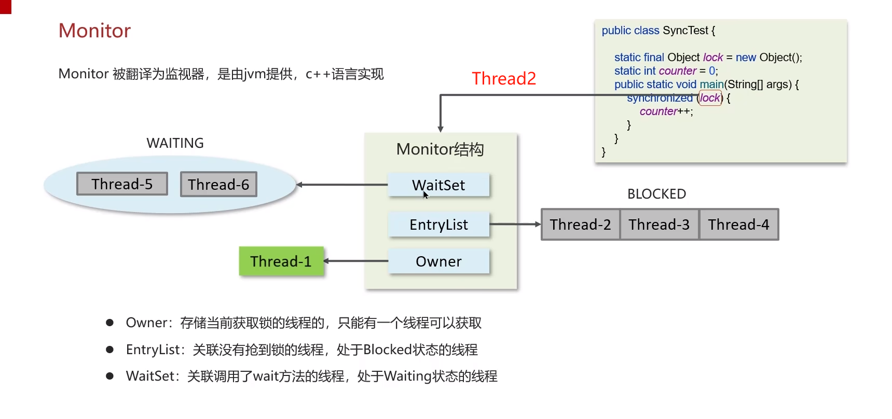

#### 总结

**synchronized 关键字的底层原理**

- Synchronized 【对象锁】采用互斥的方式让同一时刻至多只有一个线 程能持有【对象锁】
- 它的底层由 ·monitor· 实现的， ·monitor· 是 jvm 级别的对象（ C++ 实 现），线程获得锁需要使用对象（锁）关联 monitor
- 在 monitor 内部有三个属性，分别是 owner 、 entrylist 、 waitset
- 其中 owner 是关联的获得锁的线程，并且只能关联一个线程；entrylist 关联的是处于阻塞状态的线程； waitset 关联的是处于Waiting 状态的线程


#### synchronized 关键字的底层原理 - 进阶

Monitor 实现的锁属于重量级锁，你了解过锁升级吗？

- Monitor 实现的锁属于重量级锁，里面涉及到了用户态和内核态的切换、进程的上下文切换，成本较高，性能比较低
- 在DK 1.6 引入了两种新型锁机制: <font color=BrulyWood> 偏向锁和轻量级锁 </font> 。它们的引入是为了解决在没有多线程竞争或基本没有竞争的场景下因使用传统锁机制带来的性能开销问题。

#### Monitor 重量级锁

##### 对象的内存结构

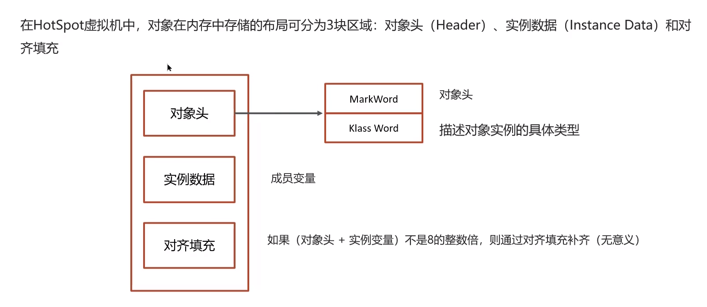

##### MarkWord

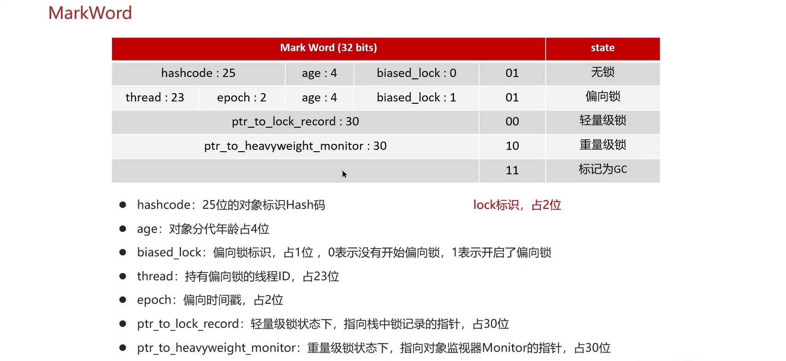

对象是怎样关联上Monitor的呢？

每个 Java 对象都可以关联一个 Monitor 对象，如果使用 synchronized 给对象上锁（重量级）之后，该对象头的 Mark Word 中就被设置指向 Monitor 对象的指针

#### 轻量级锁

在很多的情况下，在 Java 程序运行时，同步块中的代码都是不存在竞争的，不同的线程交替的执行同步块中的代码。这种情况下，用重量级锁是没必要的。因此 JVM 引入了轻量级锁的概念。

重入的时候，不存在竞争关系。

```java
static final Object obj = new Object();
public static void method1() {
    synchronized( obj ) {
      // 同步块 A
      method2();
    }
}
public static void method2() {
  synchronized( obj ) {
    // 同步块 B
  }
}
```
##### 加锁流程

1. 在线程栈中创建一个 Lock Record ，将其 obi字段指向锁对象。
2. 通过 CAS 指令将Lock Record 的地址存储在对象头的 mark word 中，如果对象处于无锁状态则修改成功，代表该线程获得了轻量级锁。
3. 如果是当前线程已经持有该锁了，代表这是一次锁重入。设置 Lock Record 第一部分为 null ，起到了一个重入计数器的作用。
4. 如果 CAS 修改失败，说明发生了竞争，需要膨胀为重量级锁。
   
##### 解锁过程

1. 遍历线程栈 , 找到所有 obj 字段等于当前锁对象的 Lock Record 。
2. 如果 Lock Record 的 Mark Word 为 null ，代表这是一次重入，将 obj 设置为 null 后 continue 。
3. 如果 Lock Record 的 Mark Word 不为 null ，则利用 CAS 指令将对象头的 mark word 恢复成为无锁状态。如果失败则膨胀为重量级锁。

#### 偏向锁

轻量级锁在没有竞争时（就自己这个线程），每次重入仍然需要执行 CAS 操作。
Java 6 中引入了偏向锁来做进一步优化：只有第一次使用 CAS 将线程 ID 设置到对象的 Mark Word 头，之后发现这个线程 ID 是自己的就表示没有竞争，不用重新 CAS 。以后只要不发生竞争，这个对象就归该线程所有

```java
static final Object obj = new Object();
public static void m1 () {
  synchronized (obj) {
    // 同步块 A
    m2();
  }
}
public static void m2 () {
  synchronized (obj) {
    // 同步块 B
    m3();
  }
}
public static void m3 () {
  synchronized (obj) {
  }
}
```

#### 总结

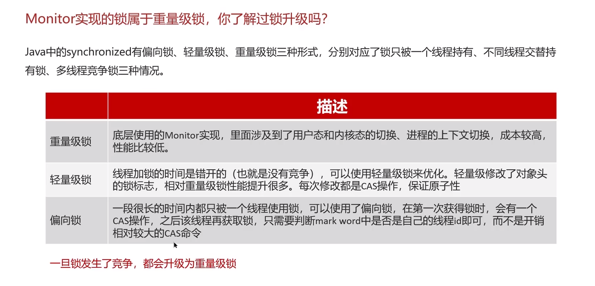

### 2、谈谈JMM（Java内存模型）

::: tip
[我的学习笔记 - JMM(Java 内存模型)](../../../study-notes/%E5%A4%A7%E5%8E%82%E9%9D%A2%E8%AF%95%E7%AC%AC%E4%BA%8C%E5%AD%A3/1_%E8%B0%88%E8%B0%88Volatile/1_Volatile%E5%92%8CJMM%E5%86%85%E5%AD%98%E6%A8%A1%E5%9E%8B%E7%9A%84%E5%8F%AF%E8%A7%81%E6%80%A7/)
[JavaGuide-JMM(Java 内存模型)](https://javaguide.cn/java/concurrent/java-concurrent-questions-02.html#jmm-java-%E5%86%85%E5%AD%98%E6%A8%A1%E5%9E%8B)
[二哥的Java进阶之路 - JMM(Java 内存模型)](https://tobebetterjavaer.com/sidebar/sanfene/javathread.html#java%E5%86%85%E5%AD%98%E6%A8%A1%E5%9E%8B)
:::

JMM(Java Memory Model)Java 内存模型，定义了**共享内存**中**多线程程序读写操作**的行为**规范**，通过这些规则来规范对内存的读写操作从而保证指令的正确性。

#### 总结

- JMM(Java Memory Model)Java 内存模型，定义了共享内存中多线程程序读写操作的行为规范，通过这些规则来规范对内存的读写操作从而保证指令的正确性
- JMM 把内存分为两块，一块是私有线程的工作区域（工作内存），一块是所有线程的共享区域（主内存）
- 线程跟线程之间是相互隔离，线程跟线程交互需要通过主内存


### 3、CAS 你知道吗？

::: tip
[我的学习笔记 - CAS](../../../study-notes/%E5%A4%A7%E5%8E%82%E9%9D%A2%E8%AF%95%E7%AC%AC%E4%BA%8C%E5%AD%A3/2_%E8%B0%88%E8%B0%88CAS/5_CAS%E5%BA%95%E5%B1%82%E5%8E%9F%E7%90%86/)
[JavaGuide- CAS](https://javaguide.cn/java/concurrent/java-concurrent-questions-02.html#%E5%A6%82%E4%BD%95%E5%AE%9E%E7%8E%B0%E4%B9%90%E8%A7%82%E9%94%81)
[二哥的Java进阶之路 - CAS](https://tobebetterjavaer.com/sidebar/sanfene/javathread.html#_32-cas%E5%91%A2-cas%E4%BA%86%E8%A7%A3%E5%A4%9A%E5%B0%91)
:::

CAS 的全称是： Compare And Swap( 比较再交换 ) ，它体现的一种乐观锁的思想，在无锁情况下保证线程操作共享数据的原子性。

在 JUC （ java.util.concurrent ）包下实现的很多类都用到了 CAS 操作
- AbstractQueuedSynchronizer （ AQS 框架）
- AtomicXXX 类

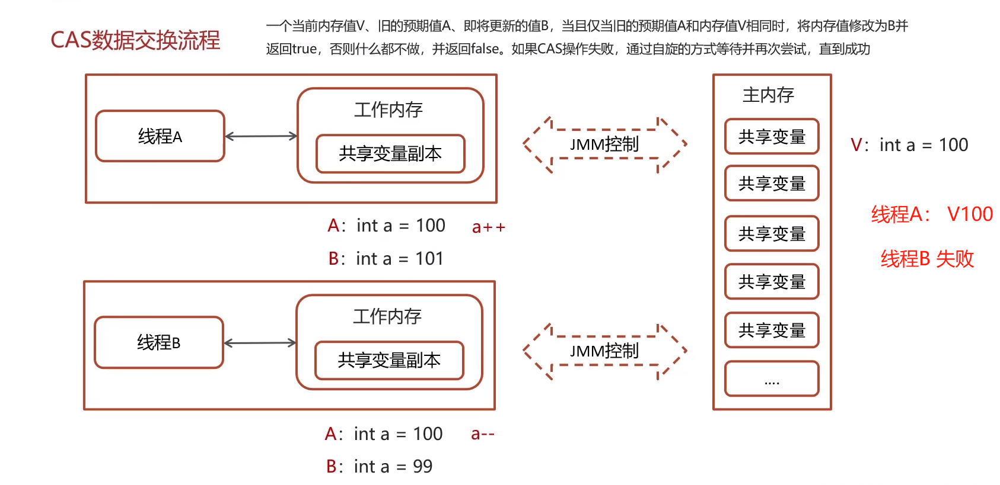

- 因为没有加锁，所以线程不会陷入阻塞，效率较高
- 如果竞争激烈，重试频繁发生，效率会受影响

#### 底层实现

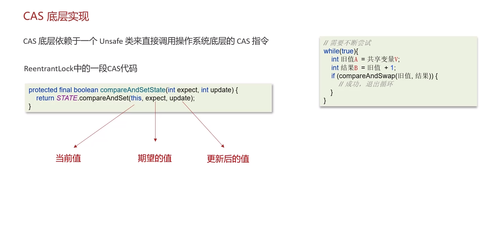

#### 总结

##### CAS 你知道吗？

- CAS 的全称是： Compare And Swap( 比较再交换 ); 它体现的一种乐观锁的思想，在无锁状态下保证线程操作数据的原子性。
- CAS 使用到的地方很多： AQS 框架、 AtomicXXX 类
- 在操作共享变量的时候使用的自旋锁，效率上更高一些
- CAS 的底层是调用的 Unsafe 类中的方法，都是操作系统提供的，其他语言实现

##### 乐观锁和悲观锁的区别

- CAS 是基于乐观锁的思想：最乐观的估计，不怕别的线程来修改共享变量，就算改了也没关系，我吃亏点再重试呗。
- synchronized 是基于悲观锁的思想：最悲观的估计，得防着其它线程来修改共享变量，我上了锁你们都别想改，我改完了解开锁，你们才有机会。


### 4、请谈谈你对 volatile 的理解

::: tip
[我的学习笔记 - volatile](../../../study-notes/大厂面试第二季/1_谈谈Volatile/1_Volatile和JMM内存模型的可见性/)
[JavaGuide- volatile](https://javaguide.cn/java/concurrent/java-concurrent-questions-02.html#volatile-%E5%85%B3%E9%94%AE%E5%AD%97)
[二哥的Java进阶之路 - volatile](https://javabetter.cn/sidebar/sanfene/javathread.html#_23-volatile%E5%AE%9E%E7%8E%B0%E5%8E%9F%E7%90%86%E4%BA%86%E8%A7%A3%E5%90%97)
:::

一旦一个共享变量（类的成员变量、类的静态成员变量）被 volatile 修饰之后，那么就具备了两层语义：

1. <font color=BrulyWood>保证线程间的可见性</font>
2. <font color=BrulyWood>禁止进行指令重排序</font>

#### 保证线程间的可见性

用 volatile 修饰共享变量，能够防止编译器等优化发生，让一个线程对共享变量的修改对另一个线程可见。

com.itheima.lock.ForeverLoop

不加 volatile 也可见。
```java
public class ForeverLoop {
    //static volatile boolean stop = false;
    static boolean stop = false;
    public static void main(String[] args) {

        // static boolean stop = false;  时，也是可见的
        new Thread(() -> {
            try {
                Thread.sleep(100);
            } catch (InterruptedException e) {
                e.printStackTrace();
            }
            stop = true;
            System.out.println(Thread.currentThread().getName()+"：modify stop to true...");
        },"t1").start();

        new Thread(() -> {
            try {
                Thread.sleep(200);
            } catch (InterruptedException e) {
                e.printStackTrace();
            }
            System.out.println(Thread.currentThread().getName()+"："+stop);
        },"t2").start();
        
        new Thread(() -> {
            int i = 0;
            while (!stop) {
                i++;
            }
            System.out.println("stopped... c:"+ i);
        },"t3").start();
    }
}


```
现象：定义`static boolean stop = false;`本身线程是可见的，但是t3确实死循环，为什么？

问题分析：主要是因为在 JVM 虚拟机中有一个 JIT （即时编译器）给代码做了优化。

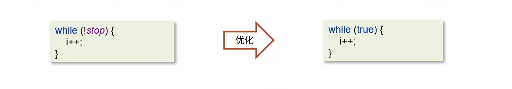

解决方案一：在程序运行的时候加入 vm 参数 `-Xint `表示禁用即时编译器，不推荐，得不偿失（其他程序还要使用）。
解决方案二：在修饰 <font color=BrulyWood>`stop`</font> 变量的时候加上 <font color=BrulyWood> `volatile`</font>, 当前告诉 `jit` ，不要对 `volatile` 修饰的变量做优化。

#### 禁止进行指令重排序

用`volatile`修饰共享变量会在读、写共享变量时加入不同的屏障，阻止其他读写操作越过屏障，从而达到阻止重排序的效果。

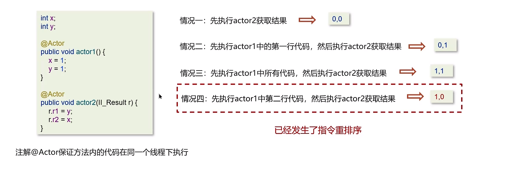

测试代码：ReorderTest

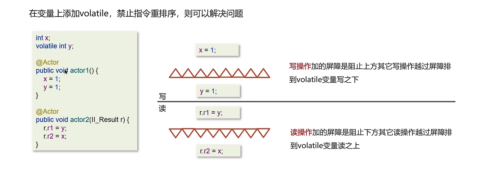

加在 X 上却不行。
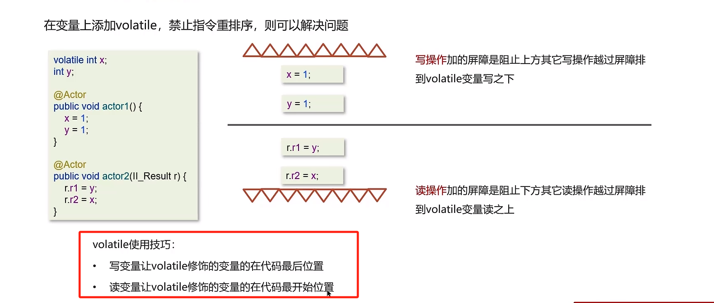

#### 总结

<font color=BrulyWood>请谈谈你对 volatile 的理解</font>       

① <font color=BrulyWood>保证线程间的可见性</font>
用 `volatile` 修饰共享变量，能够防止编译器等优化发生，让一个线程对共享变量的修改对另一个线程可见。
② <font color=BrulyWood>禁止进行指令重排序</font>
指令重排：用` ·`volatile` 修饰共享变量会在读、写共享变量时加入不同的屏障，阻止其他读写操作越过屏障，从而达到阻止重排序的效果

### 5、<font color=BrulyWood>什么是 AQS ？</font>

::: tip
[我的学习笔记 - AQS](../../../study-notes/大厂面试第三季/09_AbstractQueuedSynchronizer之_AQS/)
[JavaGuide- AQS](https://javaguide.cn/java/concurrent/java-concurrent-questions-03.html#aqs)
[二哥的Java进阶之路 - AQS](https://tobebetterjavaer.com/sidebar/sanfene/javathread.html#_29-aqs%E4%BA%86%E8%A7%A3%E5%A4%9A%E5%B0%91)
:::


全称是 <font color=BrulyWood>A</font>bstract<font color=BrulyWood>Q</font>ueued<font color=BrulyWood>S</font>ynchronizer ，即抽象队列同步器。它是构建锁或者其他同步组件的<font color=BrulyWood>基础框架</font>。

#### 总结

什么是 AQS ？
- 是多线程中的队列同步器。是一种锁机制，它是做为一个基础框架使用的，像 ReentrantLock 、 Semaphore 都是基于 AQS 实现的
- AQS 内部维护了一个先进先出的双向队列，队列中存储的排队的线程
- 在 AQS 内部还有一个属性 state ，这个 state 就相当于是一个资源，默认是 0 （无锁状态），如果队列中的有一个线程修改成功了 state 为 1 ，则
- 当前线程就相等于获取了资源
- 在对 state 修改的时候使用的 cas 操作，保证多个线程修改的情况下原子性

### 6、ReentrantLock 的实现原理

::: tip
[我的学习笔记 - AQS](../../../study-notes/大厂面试第二季/6_Java的锁/Java锁之可重入锁和递归锁/)
[JavaGuide- ReentrantLock](https://javaguide.cn/java/concurrent/java-concurrent-questions-02.html#reentrantlock)
[二哥的Java进阶之路 - ReentrantLock](https://javabetter.cn/sidebar/sanfene/javathread.html#_30-reentrantlock%E5%AE%9E%E7%8E%B0%E5%8E%9F%E7%90%86)
:::

ReentrantLock 翻译过来是可重入锁，相对于 synchronized 它具备以下特点：
- 可中断
- 可以设置超时时间
- 可以设置公平锁
- 支持多个条件变量
- 与 synchronized 一样，都支持重入

```java
// 创建非公平锁
ReentrantLock lock = new ReentrantLock();
// 获取锁操作
lock.lock();
try {
        // 执行代码逻辑
} catch (Exception ex) {
   // ...
} finally {
   // 解锁操作
   lock.unlock(); 
}

```

ReentrantLock 主要利用 <font color=BrulyWood>CAS+AQS</font> 队列来实现。它支持公平锁和非公平锁，两者的实现类似 构造方法接受一个可选的公平参数（默认非公平锁），当设置为 true 时，表示公平锁，否则为非公平锁。
公平锁的效率往往没有非公平锁的效率高，在许多线程访问的情况下，公平锁表现出较低的吞吐量。

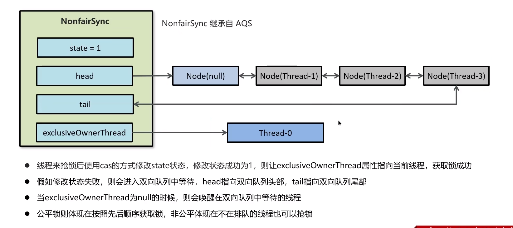

#### 总结

ReentrantLock 的实现原理

- ReentrantLock 表示支持重新进入的锁，调用 lock 方 法获取了锁之后，再次调用 lock ，是不会再阻塞
- ReentrantLock 主要利用 <font color=BrulyWood>CAS+AQS</font> 队列来实现
- 支持公平锁和非公平锁，在提供的构造器的中无参默认是非公平锁，也可以传参设置为公平锁

### 7、synchronized 和 Lock 有什么区别?

::: tip
[我的学习笔记 - synchronized 和 Lock 有什么区别](../../../study-notes/大厂面试第二季/9_Synchronized和Lock的区别与好处/)
[JavaGuide- synchronized 和 Lock 有什么区别](https://javaguide.cn/java/concurrent/java-concurrent-questions-02.html#synchronized-%E5%92%8C-reentrantlock-%E6%9C%89%E4%BB%80%E4%B9%88%E5%8C%BA%E5%88%AB)
:sunny: [二哥的Java进阶之路 - synchronized 和 Lock 有什么区别](https://javabetter.cn/sidebar/sanfene/javathread.html#_28-%E8%AF%B4%E8%AF%B4synchronized%E5%92%8Creentrantlock%E7%9A%84%E5%8C%BA%E5%88%AB)
:::


1. 语法层面
synchronized 是关键字，源码在 jvm 中，用 c++ 语言实现
Lock 是接口，源码由 jdk 提供，用 java 语言实现

2. **功能层面**

二者均属于悲观锁、都具备基本的互斥、同步、锁重入功能
Lock 提供了许多 synchronized 不具备的功能，例如公平锁、可打断、可超时、多条件变量
Lock 有适合不同场景的实现，如 ReentrantLock ， ReentrantReadWriteLock( 读写锁 )

3. 性能层面
在没有竞争时， synchronized 做了很多优化，如偏向锁、轻量级锁，性能不赖
在竞争激烈时， Lock 的实现通常会提供更好的性能

### 8、死锁产生的条件是什么？

::: tip
[JavaGuide- 死锁](https://javaguide.cn/java/concurrent/java-concurrent-questions-01.html#%E4%BB%80%E4%B9%88%E6%98%AF%E7%BA%BF%E7%A8%8B%E6%AD%BB%E9%94%81-%E5%A6%82%E4%BD%95%E9%81%BF%E5%85%8D%E6%AD%BB%E9%94%81)
:sunny: [二哥的Java进阶之路 - 死锁](https://javabetter.cn/sidebar/sanfene/javathread.html#_37-%E7%BA%BF%E7%A8%8B%E6%AD%BB%E9%94%81%E4%BA%86%E8%A7%A3%E5%90%97-%E8%AF%A5%E5%A6%82%E4%BD%95%E9%81%BF%E5%85%8D)
:::

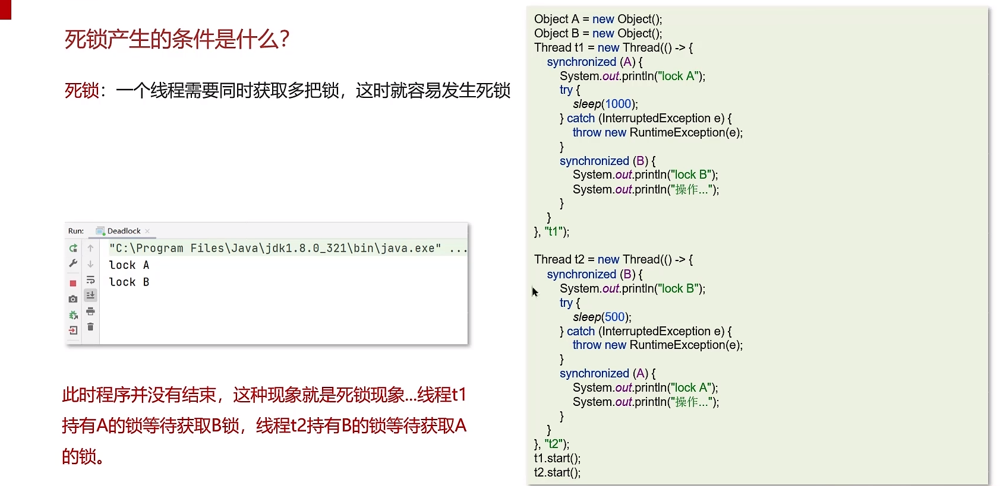

#### 如何进行死锁诊断？

当程序出现了死锁现象，我们可以使用 jdk 自带的工具： jps 和 jstack
- jps ：输出 JVM 中运行的进程状态信息
- jstack ：查看 java 进程内线程的堆栈信息

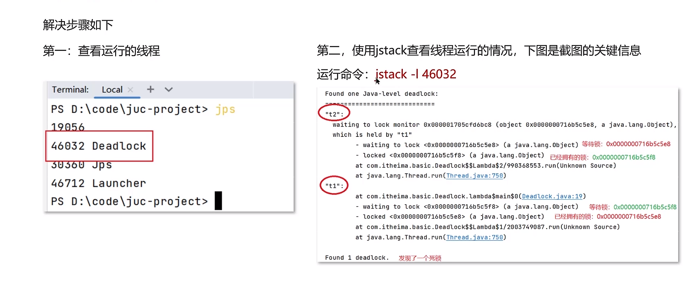

其他解决工具，可视化工具

- jconsole
用于对 jvm 的内存，线程，类 的监控，是一个基于 jmx 的 GUI 性能监控工具
打开方式： java 安装目录 bin 目录下 直接启动 jconsole.exe 就行

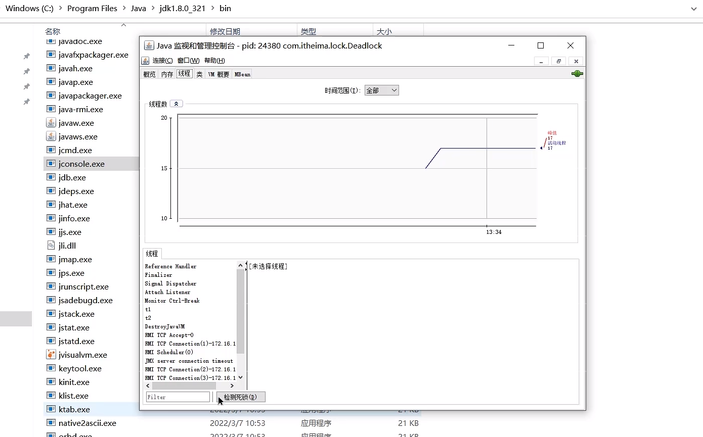


- VisualVM ：故障处理工具
能够监控线程，内存情况，查看方法的 CPU 时间和内存中的对 象，已被 GC 的对象，反向查看分配的堆栈
打开方式： java 安装目录 bin 目录下 直接启动 jvisualvm.exe 就行

#### 总结

1. 死锁产生的条件是什么？

一个线程需要同时获取多把锁，这时就容易发生死锁

2. 如何进行死锁诊断？
  
- 当程序出现了死锁现象，我们可以使用 jdk 自带的工具： jps 和 jstack
- jps ：输出 JVM 中运行的进程状态信息
- jstack ：查看 java 进程内线程的堆栈信息，查看日志，检查是否有死锁。如果有死锁现象，需要查看具体代码分析后，可修复
- 可视化工具 jconsole 、 VisualVM 也可以检查死锁问题


### 8、**聊一下 ConcurrentHashMap**

::: tip
[JavaGuide- ConcurrentHashMap](https://javaguide.cn/java/collection/java-collection-questions-02.html#concurrenthashmap-%E7%BA%BF%E7%A8%8B%E5%AE%89%E5%85%A8%E7%9A%84%E5%85%B7%E4%BD%93%E5%AE%9E%E7%8E%B0%E6%96%B9%E5%BC%8F-%E5%BA%95%E5%B1%82%E5%85%B7%E4%BD%93%E5%AE%9E%E7%8E%B0)
:sunny: [二哥的Java进阶之路 - ConcurrentHashMap](https://javabetter.cn/sidebar/sanfene/collection.html#_26-%E8%83%BD%E5%85%B7%E4%BD%93%E8%AF%B4%E4%B8%80%E4%B8%8Bconcurrenthashmap%E7%9A%84%E5%AE%9E%E7%8E%B0%E5%90%97)
:::

ConcurrentHashMap 是一种线程安全的高效 Map 集合
底层数据结构：
- JDK1.7 底层采用分段的数组 + 链表实现
- JDK1.8 采用的数据结构跟 HashMap1.8 的结构一样，数组 + 链表 / 红黑二叉树。

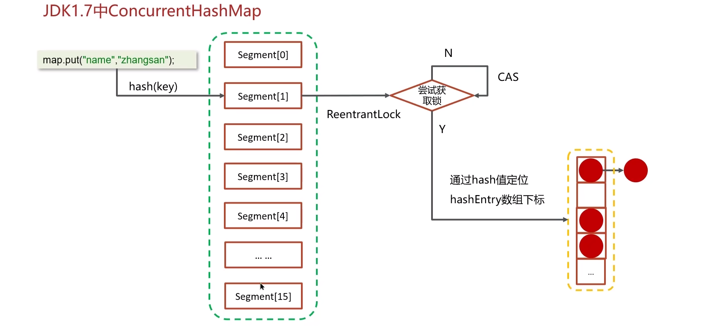

#### JDK1.8 的ConcurrentHashMap

在JDK1.8 中，放弃了 Segment 肿的设计，数据结构跟 HashMap 的数据结构是一样的: 数组 +红黑树 +链表采用 CAS + Synchronized 来保证并发安全进行实现
- CAS 控制数组节点的添加
- synchronized 只锁定当前链表或红黑二又树的首节点，只要 hash 不冲突，就不会产生并发的问题 ，效率得到提升

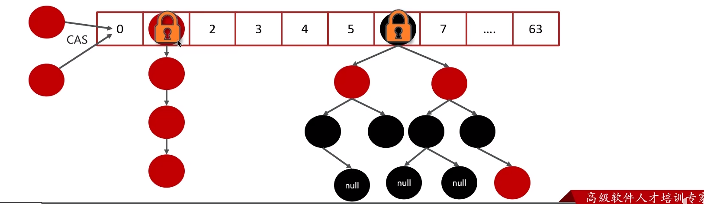

#### 总结： 聊一下 ConcurrentHashMap

1. 底层数据结构：
- JDK1.7 底层采用分段的数组 + 链表实现
- JDK1.8 采用的数据结构跟 HashMap1.8 的结构一样，数组 + 链表 / 红黑二叉树

2. 加锁的方式
- DK1.7 采用 Segment 分段锁，底层使用的是 ReentrantLock
- JDK1.8 采用 CAS 添加新节点，采用 synchronized 锁定链表或红黑二叉树的首节点，相对 Segment 分段锁粒度更细，性能更好

### 9、导致并发程序出现问题的根本原因是什么？(Java 程序中怎么保证多线程的执行安全 )

::: tip
[我的学习笔记 - JMM](../../../study-notes/大厂面试第二季/1_谈谈Volatile/1_Volatile和JMM内存模型的可见性/)
[JavaGuide- JMM](https://javaguide.cn/java/concurrent/java-concurrent-questions-02.html#jmm-java-%E5%86%85%E5%AD%98%E6%A8%A1%E5%9E%8B)
[二哥的Java进阶之路 - JMM](https://javabetter.cn/sidebar/sanfene/javathread.html#java%E5%86%85%E5%AD%98%E6%A8%A1%E5%9E%8B)
:::

1. 原子性 synchronized 、 lock
2. 内存可见性 volatile 、 synchronized 、 lock
3. 有序性 volatile


## 线程池

::: tip
更多:

[我的学习笔记 - JMM](../../../study-notes/大厂面试第二季/10_线程池/)
[JavaGuide- 线程池](https://javaguide.cn/java/concurrent/java-concurrent-questions-03.html#%E7%BA%BF%E7%A8%8B%E6%B1%A0)
[二哥的Java进阶之路 - 线程池](https://javabetter.cn/sidebar/sanfene/javathread.html#%E7%BA%BF%E7%A8%8B%E6%B1%A0)
:::


### 1、说一下线程池的核心参数？线程池的执行原理知道吗？

```java
public ThreadPoolExecutor(int corePoolSize,
                int maximumPoolSize,
                long keepAliveTime,
                TimeUnit unit,
                BlockingQueue<Runnable> workQueue,
                ThreadFactory threadFactory,
                RejectedExecutionHandler handler)
```
- corePoolSize 核心线程数目
- maximumPoolSize 最大线程数目 = ( 核心线程 + 救急线程的最大数目 )
- keepAliveTime 生存时间 - 救急线程的生存时间，生存时间内没有新任务，此线程资源会释放
- unit 时间单位 - 救急线程的生存时间单位，如秒、毫秒等
- workQueue - 当没有空闲核心线程时，新来任务会加入到此队列排队，队列满会创建救急线程执行任务
- threadFactory 线程工厂 - 可以定制线程对象的创建，例如设置线程名字、是否是守护线程等
- handler 拒绝策略 - 当所有线程都在繁忙， workQueue 也放满时，会触发拒绝策略

#### 线程池的执行原理

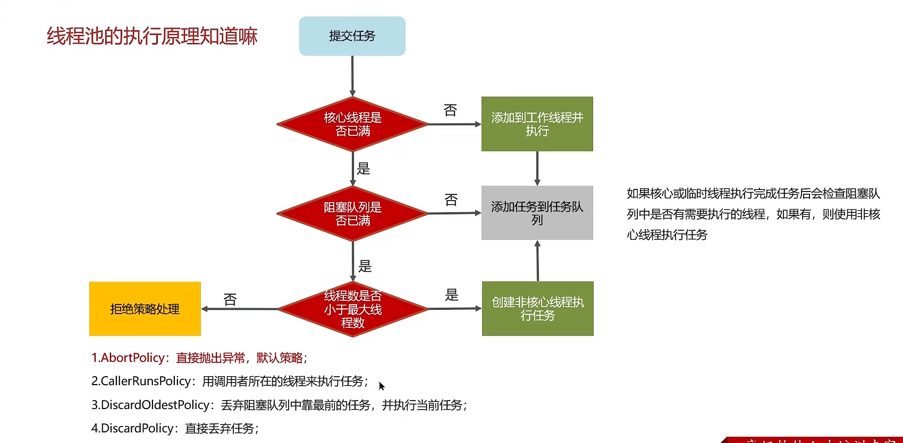

流程测试代码：https://gitee.com/cuckoocry/heima-demo/blob/master/juc-basic/src/main/java/com/itheima/threadpool/TestThreadPoolExecutor.java

### 2、线程池中有哪些常见的阻塞队列

workQueue - 当没有空闲核心线程时，新来任务会加入到此队列排队，队列满会创建救急线程执行任务

1. <font color=BrulyWood> ArrayBlockingQueue ：基于数组结构的有界阻塞队列， FIFO 。</font>
2. <font color=BrulyWood> LinkedBlockingQueue ：基于链表结构的有界阻塞队列， FIFO 。</font>
3. DelayedWorkQueue ：是一个优先级队列，它可以保证每次出队的任务都是当前队列中执行时间最靠前的
4. SynchronousQueue ：不存储元素的阻塞队列，每个插入操作都必须等待一个移出操作。

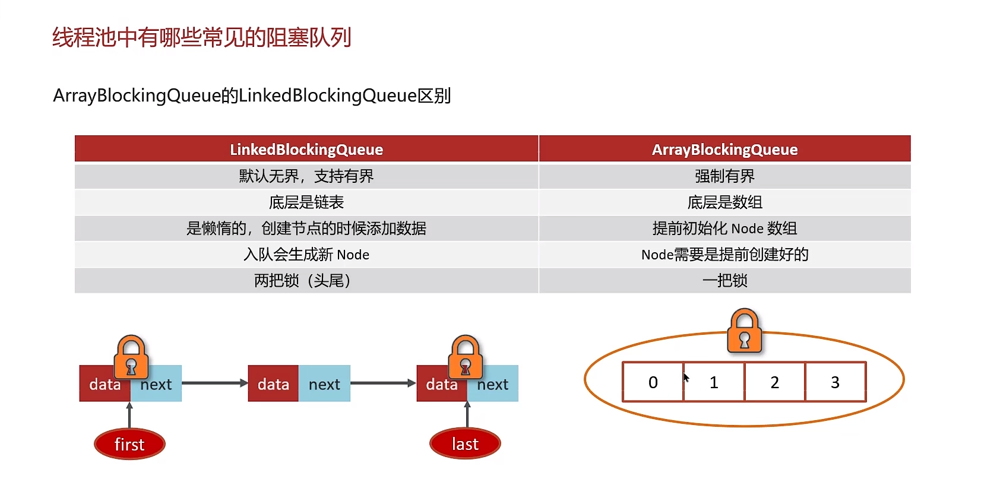


### 3、如何确定核心线程数

- IO 密集型任务
一般来说：文件读写、 DB 读写、网络请求等
```
核心线程数大小设置为 2N+1
```

- CPU 密集型任务
一般来说：计算型代码、 Bitmap 转换、 Gson 转换等
```
核心线程数大小设置为 N+1
```
查看机器的 CPU 核数:

```java
public static void main(String[] args) {
    // 查看机器的 CPU 核数
    System.out.println(Runtime.
    getRuntime().availableProcessors());
}
```

#### 如何确定核心线程数
参考回答：

① 高并发、任务执行时间短 （ CPU 核数 +1 ），减少线程上下文的切换

② 并发不高、任务执行时间长
- IO 密集型的任务  (CPU 核数 * 2 + 1)
- 计算密集型任务 （ CPU 核数 +1 ）

③ 并发高、业务执行时间长，解决这种类型任务的关键不在于线程池而在于整体架构的设计，看看这些业务里面某些数据是否能做缓存是第一步，增加服务器是第二步，至于线程池的设置，设置参考（ 2 ）

### 4、线程池的种类有哪些？

在 java.util.concurrent.Executors 类中提供了大量创建连接池的静态方法，常见就有四种

1. 创建使用固定线程数的线程池
```java
    public static ExecutorService newFixedThreadPool(int nThreads) {
        return new ThreadPoolExecutor(nThreads, nThreads,
                                      0L, TimeUnit.MILLISECONDS,
                                      new LinkedBlockingQueue<Runnable>());
    }
```
- 核心线程数与最大线程数一样，没有救急线程
- 阻塞队列是 LinkedBlockingQueue ，最大容量为 Integer.MAX_VALUE

<font color=BrulyWood>适用于任务量已知，相对耗时的任务</font>

测试code:https://gitee.com/cuckoocry/heima-demo/blob/master/juc-basic/src/main/java/com/itheima/threadpool/FixedThreadPoolCase.java

2. 单线程化的线程池，它只会用唯一的工作线程来执行任 务，保证所有任务按照指定顺序 (FIFO) 执行

```java
    public static ExecutorService newSingleThreadExecutor() {
        return new FinalizableDelegatedExecutorService
            (new ThreadPoolExecutor(1, 1,
                                    0L, TimeUnit.MILLISECONDS,
                                    new LinkedBlockingQueue<Runnable>()));
    }
```
- 核心线程数和最大线程数都是 1
- 阻塞队列是 LinkedBlockingQueue ，最大容量为 Integer.MAX_VALUE

<font color=BrulyWood>适用于按照顺序执行的任务</font>


3. 可缓存线程池

```java
    public static ExecutorService newCachedThreadPool() {
        return new ThreadPoolExecutor(0, Integer.MAX_VALUE,
                                      60L, TimeUnit.SECONDS,
                                      new SynchronousQueue<Runnable>());
    }

```
- 核心线程数为 0
- 最大线程数是 Integer.MAX_VALUE
- 阻塞队列为 SynchronousQueue: 不存储元素的阻塞队列，每个插入操作都必须等待一个移出操作。

<font color=BrulyWood>适合任务数比较密集，但每个任务执行时间较短的情况</font>

code:https://gitee.com/cuckoocry/heima-demo/blob/master/juc-basic/src/main/java/com/itheima/threadpool/CachedThreadPoolCase.java


4. 提供了“延迟”和“周期执行”功能的 ThreadPoolExecutor 。

```java
    public ScheduledThreadPoolExecutor(int corePoolSize,
                                       ThreadFactory threadFactory) {
        super(corePoolSize, Integer.MAX_VALUE, 0, NANOSECONDS,
              new DelayedWorkQueue(), threadFactory);
    }
```

#### 线程池的种类有哪些

① newFixedThreadPool ：创建一个定长线程池，可控制线程最大并发数，超出的线程会在队列中等待

② newSingleThreadExecutor ：创建一个单线程化的线程池，它只会用唯一的工作线程来执行任 务，保证所有任务按照指定顺序 (FIFO) 执行

③ newCachedThreadPool ：创建一个可缓存线程池，如果线程池长度超过处理需要，可灵活回收空闲线程，若无可回收，则新建线程

④ newScheduledThreadPool ：可以执行延迟任务的线程池，支持定时及周期性任务执行

### 5、为什么不建议用 Executors 创建线程池

《阿里巴巴 Java 开发手册》中强制线程池不允许使用 Executors 去创建，而是通过 ThreadPoolExecutor 构造函数的方式，这样的处理方式让写的同学更加明确线程池的运行规则，规避资源耗尽的风险

Executors 返回线程池对象的弊端如下(后文会详细介绍到)：
- **FixedThreadPool 和 SingleThreadExecutor**：使用的是无界的`LinkedBlockingQueue`，任务队列最大长度为 `Integer.MAX_VALU`E,可能堆积大量的请求，从而导致 OOM。
- **CachedThreadPool**：使用的是同步队列`SynchronousQueue`, 允许创建的线程数量为 `Integer.MAX_VALUE` ，如果任务数量过多且执行速度较慢，可能会创建大量的线程，从而导致 OOM。
- **ScheduledThreadPool 和 SingleThreadScheduledExecutor** : 使用的无界的延迟阻塞队列`DelayedWorkQueue`，任务队列最大长度为`Integer.MAX_VALUE`,可能堆积大量的请求，从而导致 OOM。


## 使用场景

### 1、CountDownLatch 、 Future（你们项目哪里用到了多线程）

#### 1、CountDownLatch

CountDownLatch（闭锁/倒计时锁）用来进行线程同步协作，等待所有线程完成倒计时（一个或者多个线程，等待其他多个线程完成某件事情之后才能执行）
- 其中构造参数用来初始化等待计数值
- await() 用来等待计数归零
- countDown() 用来让计数减一

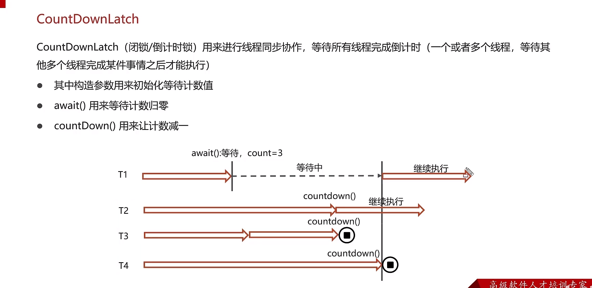

代码：https://gitee.com/cuckoocry/heima-demo/blob/master/juc-basic/src/main/java/com/itheima/application/CountDownLatchDemo.java

#### 2、案例一（es数据批量导入）

在我们项目上线之前，我们需要把数据库中的数据一次性的同步到es索引库中， 但是当时的数据好像是1000万左右，一次性读取数据肯定不行（oom异常），当时我就想到可以使用线程池的方式导入，利用CountDownLatch来控制，就能避免一次性加载过多，防止内存溢出
整体流程就是通过CountDownLatch+线程池配合去执行

详细实现流程： 

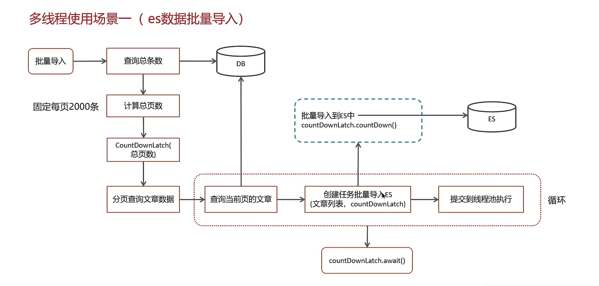

代码：https://gitee.com/cuckoocry/heima-demo/blob/master/thread-cdl-demo/src/main/java/com/itheima/cdl/service/impl/ApArticleServiceImpl.java


#### 3、案例二（数据汇总）

在一个电商网站中，用户下单之后，需要查询数据，数据包含了三部分：订单信息、包含的商品、物流信息；这三块信息都在不同的微服务中进行实现的，我们如何完成这个业务呢？

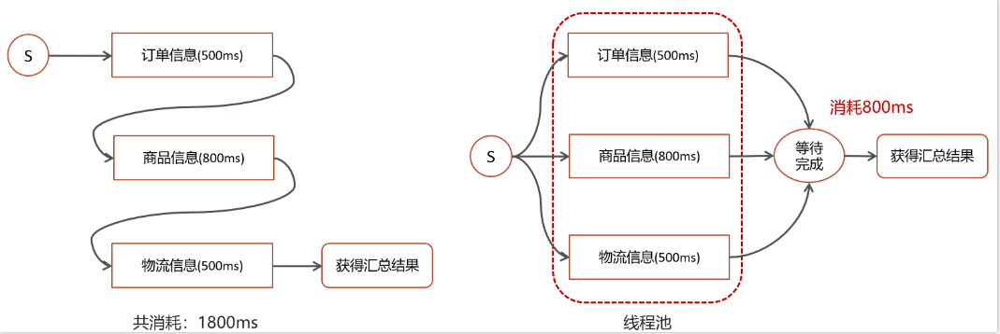

代码： https://gitee.com/cuckoocry/heima-demo/blob/master/thread-cdl-demo/src/main/java/com/itheima/cdl/controller/OrderDetailController.java

总结

- 在实际开发的过程中，难免需要调用多个接口来汇总数据，如果所有接口（或部分接口）的没有依赖关系，就可以使用【线程池+future】来提升性能报表汇总
- 报表汇总

#### 4、案例三（异步调用）

在进行搜索的时候，需要保存用户的搜索记录，而搜索记录不能影响用户的正常搜索，我们通常会开启一个线程去执行历史记录的保存，在新开启的线程在执行的过程中，可以利用线程提交任务

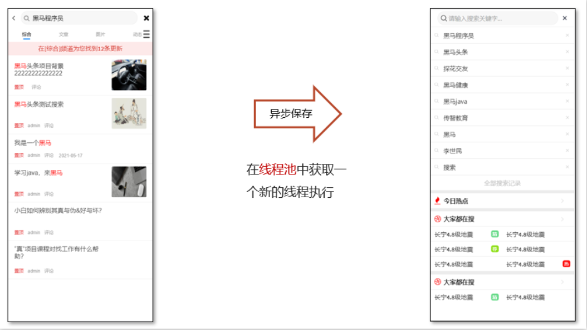

```java
    @Bean("taskExecutor")
    public ExecutorService executorService(){
        AtomicInteger c = new AtomicInteger(1);
        LinkedBlockingQueue<Runnable> queue = new LinkedBlockingQueue<Runnable>(QUEUE_CAPACITY);
        return new ThreadPoolExecutor(
                CORE_POOL_SIZE,
                MAX_POOL_SIZE,
                KEEP_ALIVE_SECONDS,
                TimeUnit.MILLISECONDS,
                queue,
                r -> new Thread(r, "itheima-pool-" + c.getAndIncrement()),
                new ThreadPoolExecutor.DiscardPolicy()
        );
    }
```


```java
    @Async("taskExecutor")
    @Override
    public void insert(Integer userId, String keyword) {

        //保存用户记录  mongodb或mysql
        //执行业务

        log.info("用户搜索记录保存成功,用户id:{},关键字:{}",userId,keyword);

    }
```

#### 总结

- 批量导入: 使用了线程池+CountDownLatch批量把数据库中的数据导入到了ES(任意)中，避免OOM
- 数据汇总: 调用多个接口来汇总数据，如果所有接口(或部分接口)的没有依赖关系，就可以使用线程池+future来提升性能
- 异步线程(线程池):为了避免下一级方法影响上一级方法(性能考虑)，可使用异步线程调用下一个方法(不需要下一级方法返回值)，可以提升方法响应时间

### 2、如何控制某个方法允许并发访问线程的数量？

::: tip

难易程度：☆☆☆
出现频率：☆☆

:::

Semaphore `[ˈsɛməˌfɔr]` 信号量，是JUC包下的一个工具类，底层是AQS，我们可以通过其限制执行的线程数量，达到限流的效果。

1. 创建Semaphore对象，可以给一个容量
2. `cquire()`,请求一个信号量，这时候的信号量个数 -1
3. `release()`,释放一个信号量，此时信号量个数+1


当一个线程执行时先通过其方法进行获取许可操作，获取到许可的线程继续执行业务逻辑，当线程执行完成后进行释放许可操作，未获取达到许可的线程进行等待或者直接结束。


```java
public static void main(String[] args) {
        // 1. 创建 semaphore 对象
        Semaphore semaphore = new Semaphore(3);
        // 2. 10个线程同时运行
        for (int i = 0; i < 10; i++) {
            new Thread(() -> {
                try {
                    // 3. 获取许可，计数-1
                    semaphore.acquire();
                } catch (InterruptedException e) {
                    e.printStackTrace();
                }
                try {
                    System.out.println("running...");
                    try {
                        Thread.sleep(1000);
                    } catch (InterruptedException e) {
                        e.printStackTrace();
                    }
                    System.out.println("end...");
                } finally {
                    // 4. 释放许可  计数+1
                    semaphore.release();
                }
            }).start();
        }
    }
```


## 其他

### 1、谈谈你对ThreadLocal的理解

::: tip

难易程度：☆☆☆
出现频率：☆☆☆☆

:::


#### 概述

ThreadLocal是多线程中对于解决线程安全的一个操作类，它会为每个线程都分配一个独立的线程副本从而解决了变量并发访问冲突的问题。ThreadLocal 同时实现了线程内的资源共享。

案例：使用JDBC操作数据库时，会将每一个线程的Connection放入各自的ThreadLocal中，从而保证每个线程都在各自的 Connection 上进行数据库的操 作，避免A线程关闭了B线程的连接。

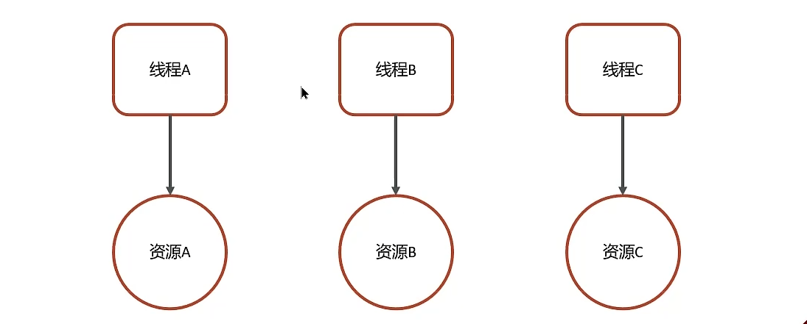


####  ThreadLocal基本使用

三个主要方法：

- set(value) 设置值
- get() 获取值
- remove() 清除值


####  ThreadLocal的实现原理 `&` 源码解析

`ThreadLocal`本质来说就是一个线程内部存储类，从而让多个线程只操作自己内部的值，从而实现线程数据隔离。

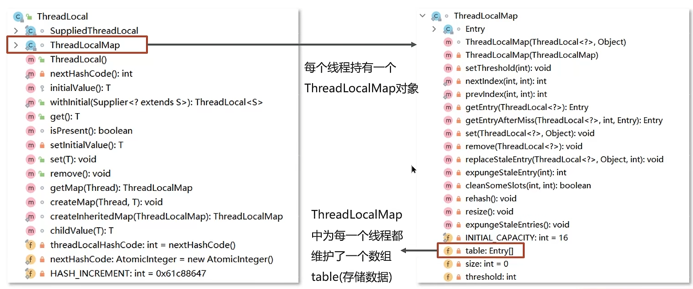

在ThreadLocal中有一个内部类叫做ThreadLocalMap，类似于HashMap。
ThreadLocalMap中有一个属性table数组，这个是真正存储数据的位置。


set 方法：

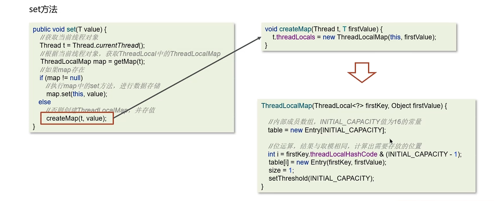


get方法/remove方法


####  ThreadLocal-内存泄露问题

Java对象中的四种引用类型：强引用、软引用、弱引用、虚引用。

每一个Thread维护一个ThreadLocalMap，在ThreadLocalMap中的Entry对象继承了WeakReference。其中key为使用弱引用的ThreadLocal实例，value为线程变量的副本。

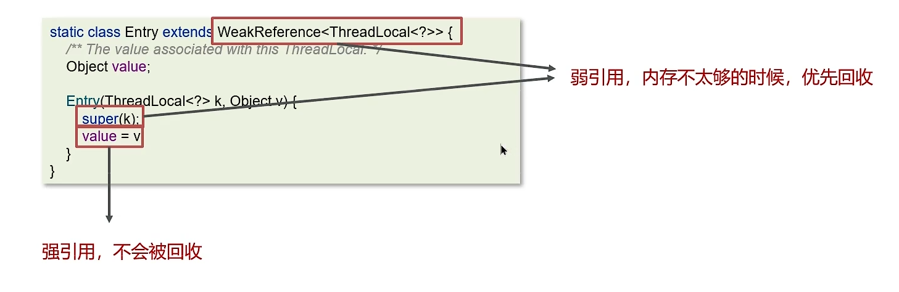

在使用ThreadLocal的时候，强烈建议：`务必手动remove`。