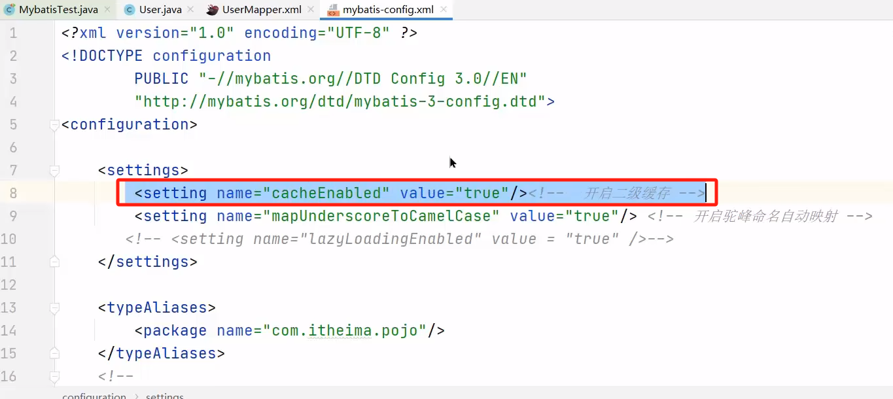

::: tip

视频来源：[新版Java面试专题视频教程，java八股文面试全套真题+深度详解（含大厂高频面试真题）](https://www.bilibili.com/video/BV1yT411H7YK/?vd_source=7138dfc78c49f602f8d3ed8cfbf0513d)


2023-10-08   P44 - P44
2023-10-09   P44 - P46
:::

### 1、MyBatis 执行流程

通过该问题可以：
- 理解了各个组件的关系
- Sql 的执行过程（参数映射、 sql 解析、执行和结果处理）

流程：


总结：MyBatis 执行流程

1. 读取 MyBatis 配置文件： `mybatis-config.xml` 加载运行环境和映射文件
2. 构造会话工厂 `SqlSessionFactory`
3. 会话工厂创建 `SqlSession` 对象（包含了执行 SQL 语句的所有方法）
4. 操作数据库的接口， `Executor` 执行器，同时负责查询缓存的维护
5. `Executor` 接口的执行方法中有一个 `MappedStatement` 类型的参数，封装了映射信息
6. 输入参数映射
7. 输出结果映射

### 2、Mybatis 是否支持延迟加载？

答案：Mybatis 支持延迟记载，但默认没有开启

1、什么叫做延迟加载？


- 查询用户的时候，把用户所属的订单数据也查询出来，这个是立即加载
- 查询用户的时候，暂时不查询订单数据，当需要订单的时候，再查询订单，这个就是延迟加载。(可以局部和全局设置)


2、延迟加载原理？

1. 使用 `CGLIB` 创建目标对象的代理对象
2. 当调用目标方法 `user.getOrderList()` 时，进入拦截器 `invoke` 方法，发现 `user.getOrderList()` 是 null 值，执行 sql 查询 order 列
   表
3. 把 order 查询上来，然后调用 `user.setOrderList(List<Order> orderList)` ，接着完成 `user.getOrderList()` 方法的调用


总结：
Mybatis 是否支持延迟加载？

- 延迟加载的意思是：就是在需要用到数据时才进行加载，不需要用到数据时就不加载数据。
- Mybatis 支持一对一关联对象和一对多关联集合对象的延迟加载。
- 在 Mybatis 配置文件中，可以配置是否启用延迟加载 `lazyLoadingEnabled=true|false` 。默认是关闭的。

延迟加载原理？

1. 使用 `CGLIB` 创建目标对象的代理对象。
2. 当调用目标方法时，进入拦截器 `invoke` 方法，发现目标方法是 null 值，执行 sql 查询。
3. 获取数据以后，调用 set 方法设置属性值，再继续查询目标方法，就有值了。

### 3、Mybatis 的一级、二级缓存用过吗？

缓存：


- 本地缓存，基于 `PerpetualCache` ，本质是一个 HashMap
- 一级缓存：作用域是 `session` 级别
- 二级缓存：作用域是 `namespace` 和 `mapper` 的作用域，不依赖于 `session`

#### 一级缓存

一级缓存 : 基于 PerpetualCache 的 HashMap 本地缓存，其存储作用域为 Session ，当 Session 进行 flush 或 close 之后，该 Session 中的所有 Cache 就将清空。默认打开一级缓存。

以下代码只会**执行一次SQL**。因为他们是同一个 `SqlSession`
```java
//2. 获取 SqlSession 对象，用它来执行 sql
SqlSession sqlSession = sqlSessionFactory.openSession();//3. 执行 sql
        
//3.1 获取 UserMapper 接口的代理对象
UserMapper userMapper1 = sqlSession.getMapper(UserMapper.class);
UserMapper userMapper2 = sqlSession.getMapper(UserMapper.class);

User user = userMapper1.selectById(6);
System.out.println(user);

System.out.println("---------------------");

User user1 = userMapper2.selectById(6);
System.out.println(user1);

```

#### 二级缓存

二级缓存是基于 namespace 和 mapper 的作用域起作用的，不是依赖于 SQL session ，默认也是采用 PerpetualCache ， HashMap 存储


开启步骤：



#### 二级缓存注意事项

1. 对于缓存数据更新机制，当某一个作用域 ( `一级缓存 Session/ 二级缓存 Namespaces`) 的进行了新增、修改、删除操作后，默认该作用域下所有 select 中的缓存将被 clear
2. 二级缓存需要缓存的数据实现 Serializable 接口
3. 只有会话提交或者关闭以后，一级缓存中的数据才会转移到二级缓存中

#### 总结

1. Mybatis 的一级、二级缓存用过吗?

- 一级缓存 : 基于 PerpetualCache 的 HashMap 本地缓存，其存储作用域为 Session ，当 Session 进行 flush 或 close 之后，该 Session 中的所有 Cache 就将清空，默认打开一级缓存
- 二级缓存是基于 namespace 和 mapper 的作用域起作用的，不是依赖于 SQL session ，默认也是采用 PerpetualCache ， HashMap 存储。需要单独开启，一个是核心配置，一个是 mapper 映射文件

2. Mybatis 的二级缓存什么时候会清理缓存中的数据？

当某一个作用域 ( `一级缓存  Session / 二级缓存 Namespaces`) 的进行了**新增、修改、删除操作**后，默认该作用域 下所有 select 中的缓存将被 clear 。