::: tip

视频来源：[新版Java面试专题视频教程，java八股文面试全套真题+深度详解（含大厂高频面试真题）](https://www.bilibili.com/video/BV1yT411H7YK/?vd_source=7138dfc78c49f602f8d3ed8cfbf0513d)

:::


### 1、Spring框架中的单例 bean是线程安全的吗？

**不是线程安全的。**

Spring框架中的单例 bean 是单例的:

```java
@Service
// 默认就是单例的
@Scope("singleton")
public class UserServiceImpl implements UserService{
    
}
```
- `singleton`: bean在每个`Spring lOC`容器中只有一个实例。
- `prototype`: 一个bean的定义可以有多个实例。


总结：
不是线程安全的
Spring框架中有一个`@Scope`注解，默认的值就是`singleton`。单例的。
因为一般在spring的bean的中都是注入无状态的对象，没有线程安全问题，如果在bean中定义了可修改的成员变量，是要考虑线程安全问题的，可以使用多例或者加锁来解决。


### 2、什么是AOP？你们项目中有没有使用到AOP？

AOP称为面向切面编程，用于将那些与业务无关，但却对多个对象产生影响的公共行为和逻辑，抽取并封装为一个可重用的模块，这个模块被命名为“切面” (Aspect)，减少系统中的重复代码，降低了模块间的合度，同时提高了系统的可维护性。

常见的AOP使用场景：
- 记录操作日志
- 缓存处理
- Spring中内置的业务处理

记录操作日志的思路：

> 可以参考若依项目：LogAspect.java

Spring中的事务是如何实现的？

Spring支持**编程式事务**管理和**声明式事务**管理两种方式
- 编程式事务控制:需使用TransactionTemplate来进行实现，对业务代码有侵入性，项目中很少使用
- 声明式事务管理:声明式事务管理建立在AOP之上的。其本质是通过AOP功能，对方法前后进行拦截，将事务处理的功能编织到拦截的方法中，也就是在目标方法开始之前加入一个事务，在执行完目标方法之后根据执行情况提交或者回滚事务。


总结：
1. 什么是AOP？

面向切面编程，用于将那些与业务无关，但却对多个对象产生影响的公共行为和逻辑，抽取公共模块复用，降低耦合。

2. 项目中有没有使用到AOP？

记录操作日志，缓存，spring实现的事务
核心是:使用aop中的环绕通知+切点表达式(找到要记录日志的方法)，通过环绕通知的参数获取请求方法的参数(类、方法、注解、请求方式等)，获取到这些参数以后，保存到数据库


具体实现步骤：具体代码参考若依项目操作日志的实现。
1. 定义一个操作日志切面类。【LogAspect】
2. 定义一个注解。【`public @interface Log`】
3. 使用。


3. Spring中事务是如何实现的？

其本质是通过AOP功能，对方法前后进行拦截，在执行方法之前开启事务，在执行完目标方法之后根据执行情况提交或者回滚事务。


### 2、Spring中事务失效的场景有哪些？【对 Spring框架的深入理解、复杂业务的编码经验】

- 异常捕获处理

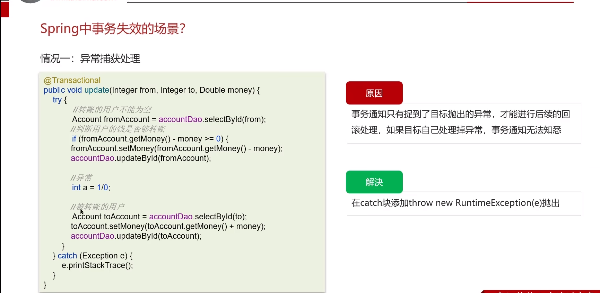

- 抛出检查异常

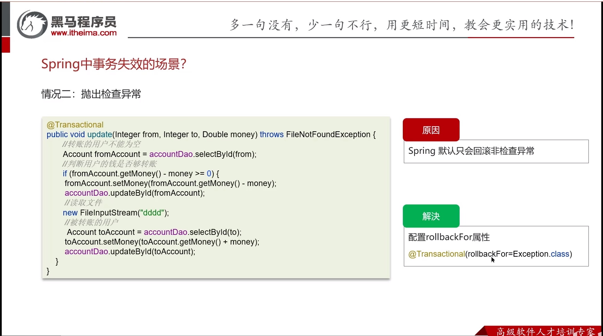

- 非public方法

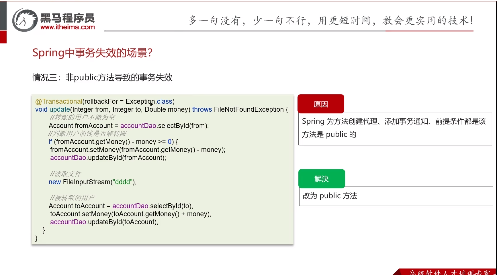

总结：Spring中事务失效的场景有哪些？
1. 异常捕获处理，自己处理了异常，没有抛出，解决:手动抛出。
2. 抛出检查异常，配置`rollbackFor`属性为`Exception`。
3. 非`public`方法导致的事务失效，改为public。


### 3、Spring 的 Bean 的生命周期

1. `BeanDefinition`概念
   Spring 容器在进行实例化时，会将 xml 配置的 `<bean>` 的信息封装成一个 `BeanDefinition` 对象， Spring 根据 BeanDefinition 来创建 Bean 对象，里面有很多的属性用来描述 Bean。

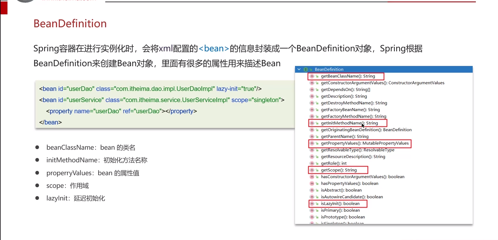

2. bean的生命周期流程图

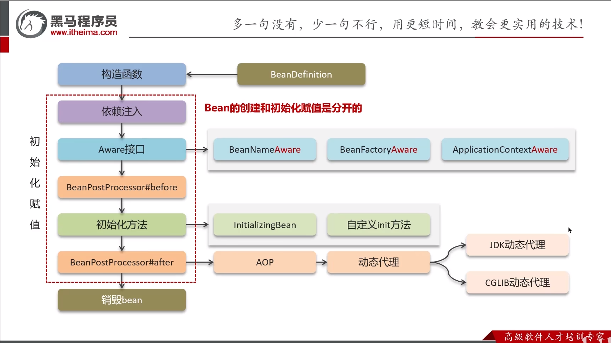

总结：Spring 的 Bean 的生命周期。

① 通过 BeanDefinition 获取 bean 的定义信息
② 调用构造函数实例化 bean
③ bean 的依赖注入
④ 处理 Aware 接口 (BeanNameAware 、 BeanFactoryAware 、 ApplicationContextAware)
⑤ Bean 的后置处理器 BeanPostProcessor- 前置
⑥ 初始化方法 (InitializingBean 、 init-method)
⑦ Bean 的后置处理器 BeanPostProcessor- 后置
⑧ 销毁 bean

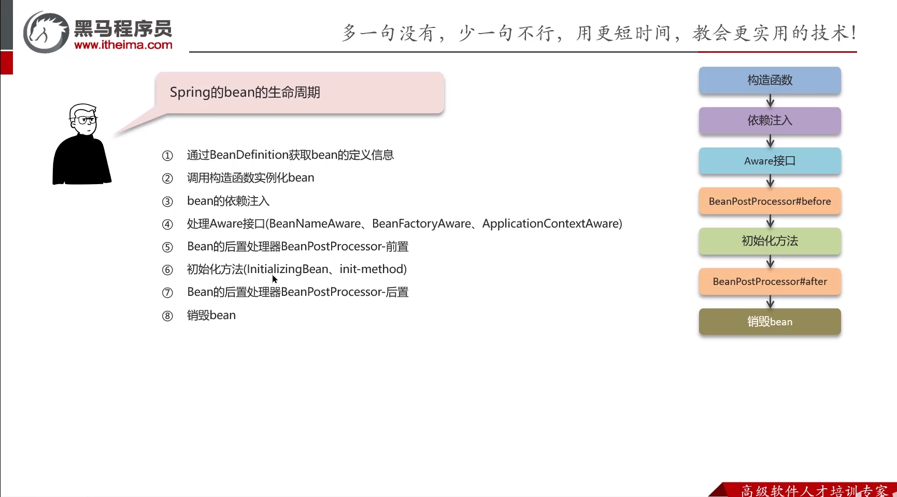

### 4、Spring中的循环引用

1. 什么是循环引用

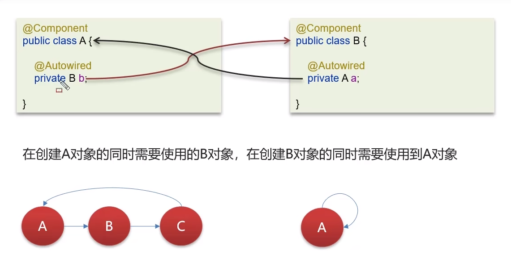
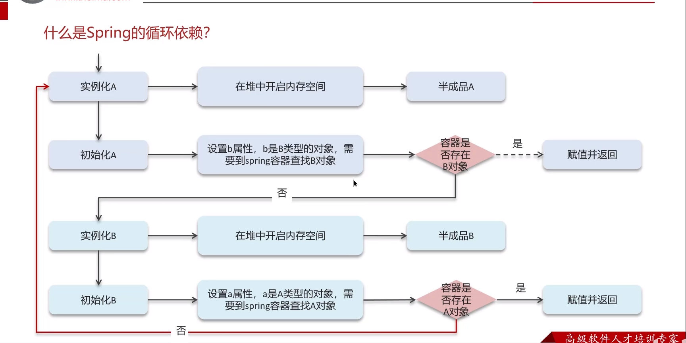

2. Spring中**三级缓存**解决循环依赖

三级缓存概念
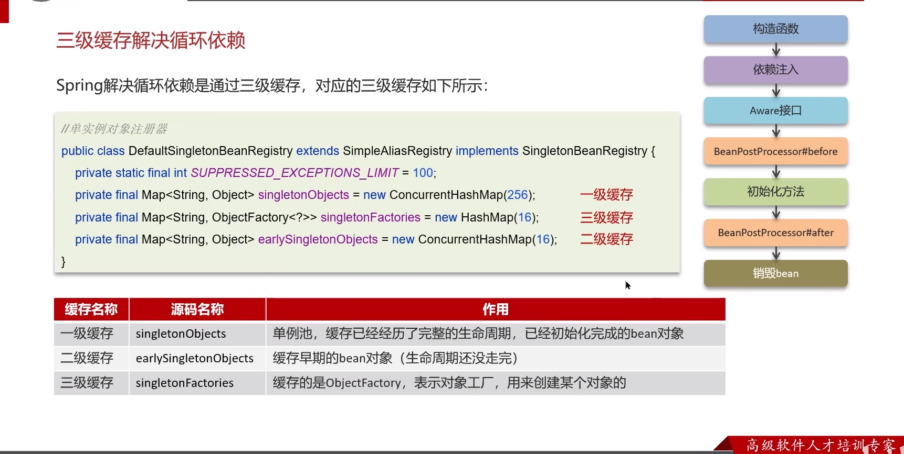

一级缓存：

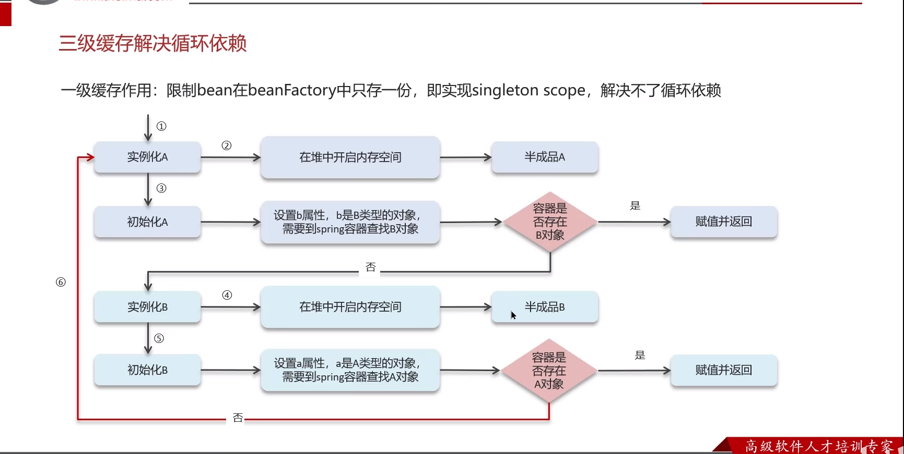

二级缓存：

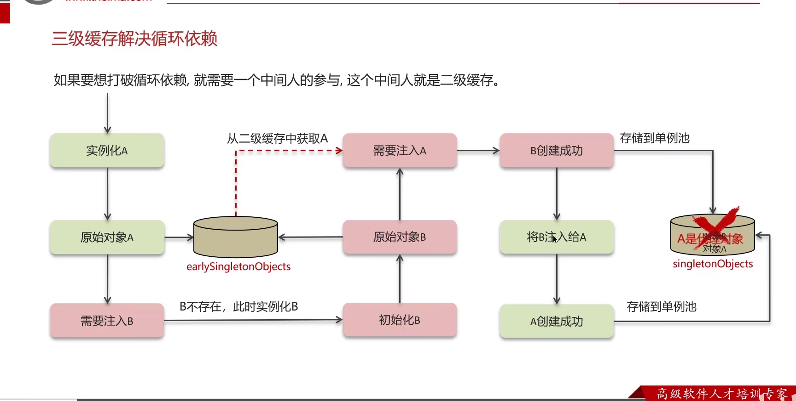

三级缓存：（解决了大部分循环依赖）

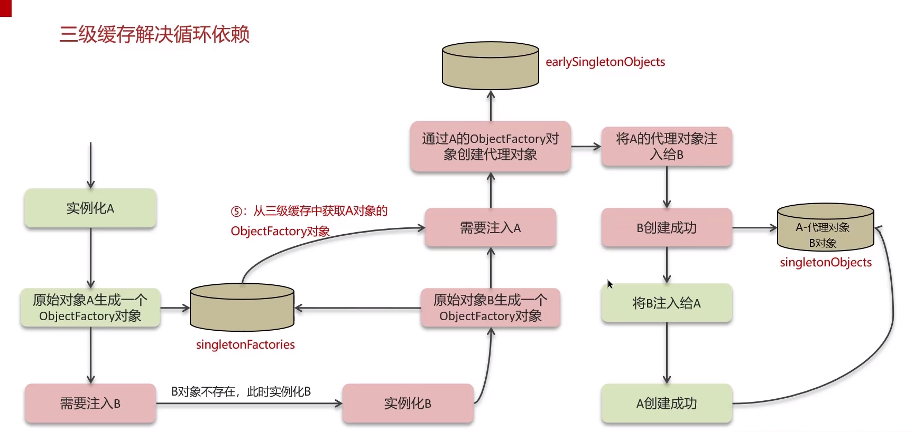

3. 构造方法出现了循环依赖怎么解决？

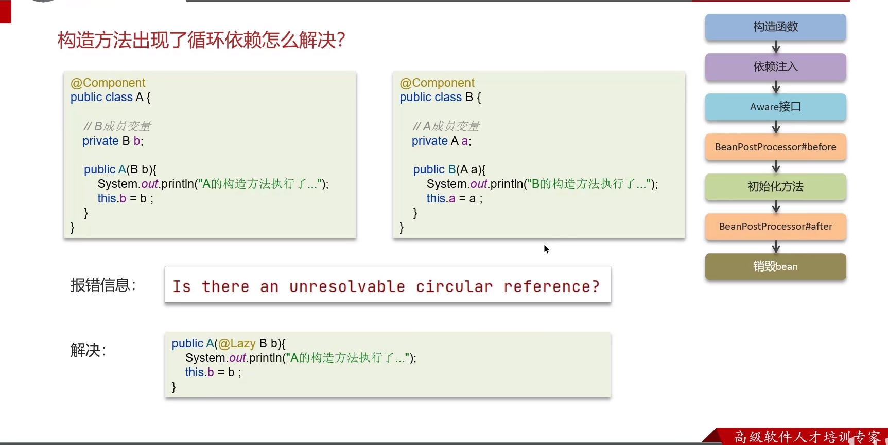

总结：
1. Spring中**三级缓存**解决循环依赖
- 循环依赖：循环依赖其实就是循环引用 , 也就是两个或两个以上的 bean 互相持有对方 , 最终形成闭环。比如 A 依赖于 B,B 依赖于 A。
- 循环依赖在 spring 中是允许存在， spring 框架依据三级缓存已经解决了大部分的循环依赖。

① 一级缓存：单例池，缓存已经经历了完整的生命周期，已经初始化完成的 bean 对象。
② 二级缓存：缓存早期的 bean 对象（生命周期还没走完）。
③ 三级缓存：缓存的是 `ObjectFactory` ，表示对象工厂，用来创建某个对象的。

  

2. 构造方法出现了循环依赖怎么解决？

问题：A 依赖于 B ， B 依赖于 A ，注入的方式是构造函数。

**原因**：由于 bean 的生命周期中构造函数是第一个执行的， spring 框架并不能解决构造函数的依赖注入。
**解决方案**：使用 `@Lazy` 进行懒加载，什么时候需要对象再进行 bean 对象的创建。

```java
public A(@Lazy B b) {
  System.out.println("A 的构造方法执行了 ...");
  this.b = b ;
}
```

### 4、SpringMVC 的执行流程知道嘛？

1. 视图阶段(JSP)

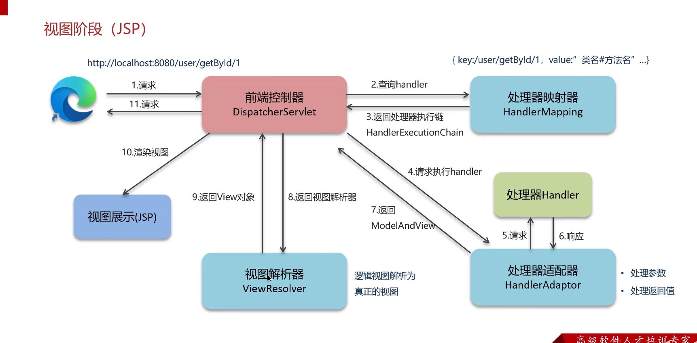

2. 前后端分离阶段（接口开发，异步请求）

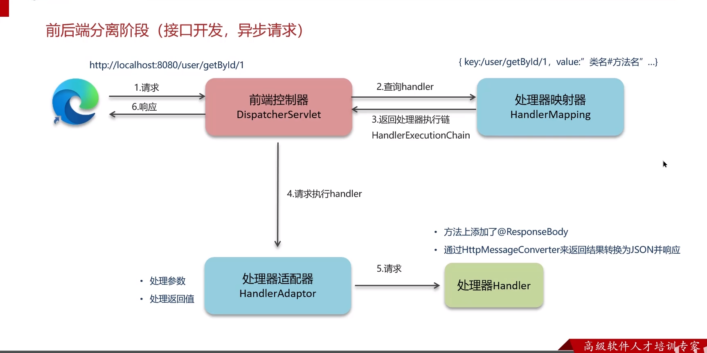

总结：SpringMVC 的执行流程知道嘛？

（版本1：视图版本，JSP）

① 用户发送出请求到前端控制器 DispatcherServlet
② DispatcherServlet 收到请求调用 HandlerMapping （处理器映射器）
③ HandlerMapping 找到具体的处理器，生成处理器对象及处理器拦截器 ( 如果有 ) ，再一起返回给 DispatcherServlet 。
④ DispatcherServlet 调用 HandlerAdapter （处理器适配器）
⑤ HandlerAdapter 经过适配调用具体的处理器（ Handler/Controller ）
⑥ Controller 执行完成返回 ModelAndView 对象
⑦ HandlerAdapter 将 Controller 执行结果 ModelAndView 返回给 DispatcherServlet
⑧ DispatcherServlet 将 ModelAndView 传给 ViewReslover （视图解析器）
⑨ ViewReslover 解析后返回具体 View （视图）
⑩ DispatcherServlet 根据 View 进行渲染视图（即将模型数据填充至视图中）
⑪ DispatcherServlet 响应用户

（版本2：前后端开发，接口开发）

① 用户发送出请求到前端控制器 DispatcherServlet
② DispatcherServlet 收到请求调用 HandlerMapping （处理器映射器）
③ HandlerMapping 找到具体的处理器，生成处理器对象及处理器拦截器 ( 如果有 ) ，再一起返回给 DispatcherServlet 。
④ DispatcherServlet 调用 HandlerAdapter （处理器适配器）
⑤ HandlerAdapter 经过适配调用具体的处理器（ Handler/Controller ）
⑥ 方法上添加了 @ResponseBody
⑦ 通过 `HttpMessageConverter` 来返回结果转换为 JSON 并响应

### 5、**Springboot 自动配置原理？**

**Springboot 中最高频的一道面试题，也是框架最核心的思想。**

先看段代码：

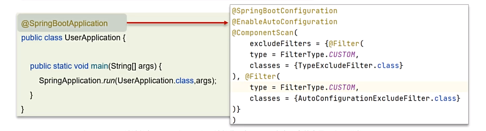

- `@SpringBootConfiguration` ：该注解与 @Configuration 注解作用相同，用来声明当前也是一个配置类。
- `@ComponentScan` ：组件扫描，默认扫描当前引导类所在包及其子包。
- `@EnableAutoConfiguration` ： SpringBoot 实现自动化配置的核心注解。

`@EnableAutoConfiguration`为核心。

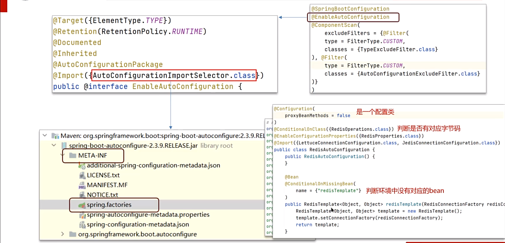

总结：Springboot 自动配置原理

1. 在 Spring Boot 项目中的引导类上有一个注解 `@SpringBootApplication` ，这个注解是对三个注解进行了封装，分别是：
- @SpringBootConfiguration
- @EnableAutoConfiguration
- @ComponentScan

2. 其中 `@EnableAutoConfiguration` 是实现自动化配置的**核心注解**。 该注解通过 `@Import` 注解导入对应的配置选择器。
 内部就是读取了该项目和该项目引用的 Jar 包的的 classpath 路径下 `META-INF/spring.factories` 文件中的所配置的类的全类名。 
 在这些配置类中所定义的 Bean 会根据条件注解**所指定的条件来决定**是否需要将其导入到 Spring 容器中。

3. 条件判断会有像 `@ConditionalOnClass` 这样的注解，判断是否有对应的 class 文件，如果有则加载该类，把这个配置类的所有的 Bean 放入 spring 容器中使用。


### 6、Spring 框架常见注解（ Spring 、 Springboot 、 SpringMVC
三个问题：

- Spring 的常见注解有哪些？
- SpringMVC 常见的注解有哪些？
- Springboot 常见注解有哪些？

1. Spring 的常见注解有哪些？

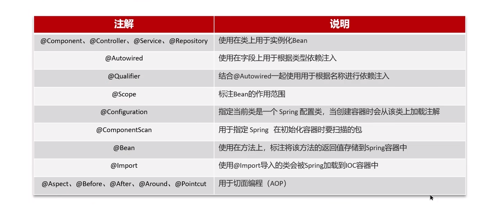

|                       **注解**                       |                **说明**                 |     
|:--------------------------------------------------:|:-------------------------------------:| 
| @Component 、 @Controller 、 @Service 、 @Repository  |            使用在类上用于实例化 Bea             | 
|                     @Autowired                     |           使用在字段上用于根据类型依赖注入            | 
|                     @Qualifier                     |    结合 @Autowired 一起使用用于根据名称进行依赖注入     | 
|                       @Scope                       |             标注 Bean 的作用范围             | 
|                   @Configuration                   |  指定当前类是一个 Spring 配置类，当创建容器时会从该类上加载注解  | 
|                   @ComponentScan                   |       用于指定 Spring 在初始化容器时要扫描的包        | 
|                       @Bean                        |    使用在方法上，标注将该方法的返回值存储到 Spring 容器中    | 
|                      @Import                       | 使用 @Import 导入的类会被 Spring 加载到 IOC 容器中  | 
|  @Aspect 、 @Before 、 @After 、 @Around 、 @Pointcut  |             用于切面编程（ AOP ）             |


2. SpringMVC 常见的注解有哪些？主要是请求和响应

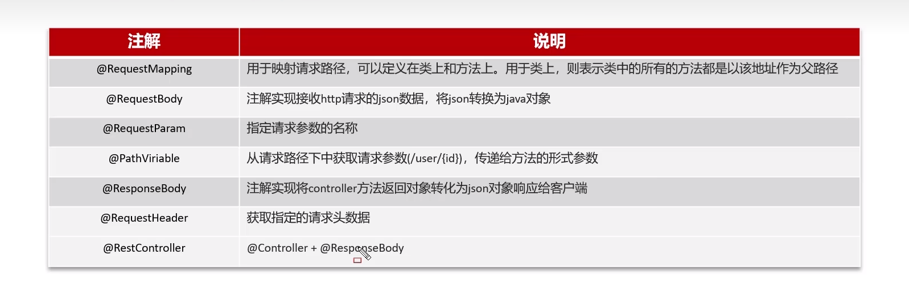

|                           **注解**                            |                                  **说明**                                  |     
|:-----------------------------------------------------------:|:------------------------------------------------------------------------:| 
|                       @RequestMapping                       |             用于映射请求路径，可以定义在类上和方法上。用于类上，则表示类中的所有的方法都是以该地址作为父路径             | 
|                        @RequestBody                         |                注解实现接收 http 请求的 json 数据，将 json 转换为 java 对象                | 
|                        @RequestParam                        |                                指定请求参数的名称                                 | 
|                        @PathViriable                        |                  从请求路径下中获取请求参数 (/user/{id}) ，传递给方法的形式参数                  | 
|                        @ResponseBody                        |                 注解实现将 controller 方法返回对象转化为 json 对象响应给客户端                 | 
|                       @RequestHeader                        |                                获取指定的请求头数据                                | 
|                       @RestController                       |                       @Controller + @ResponseBody                        | 

3. Springboot 常见注解有哪些？

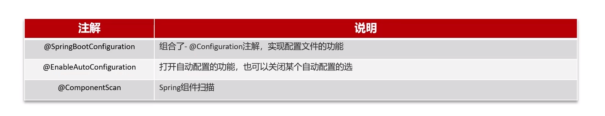
