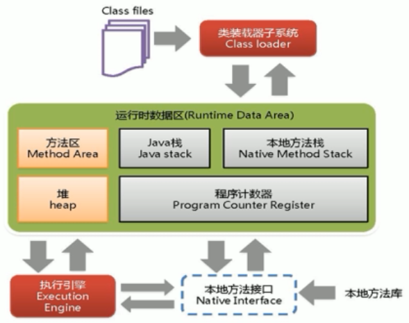
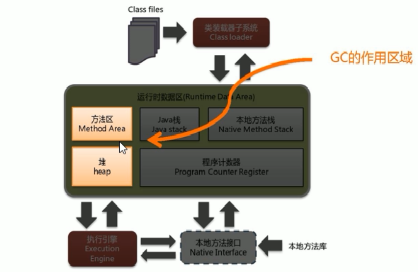
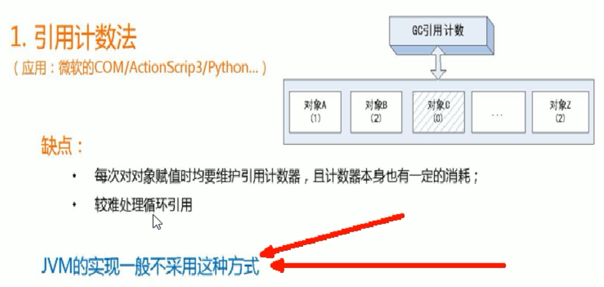
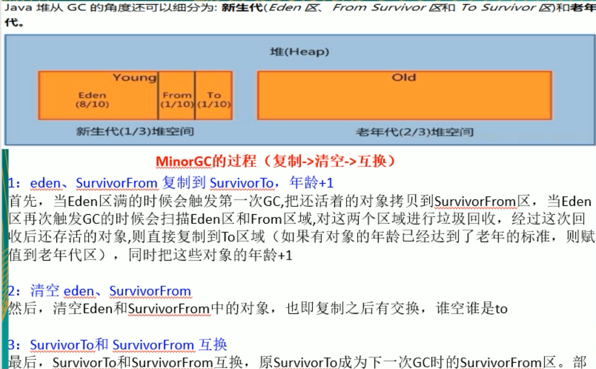
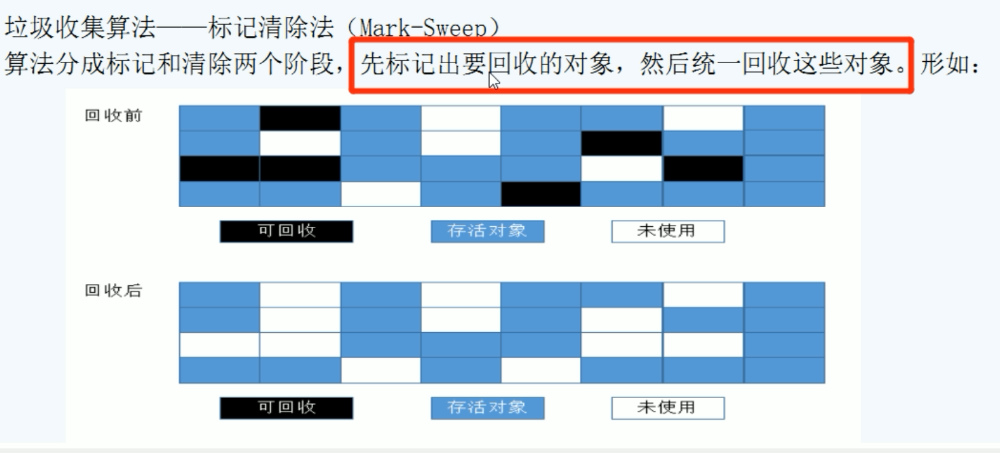
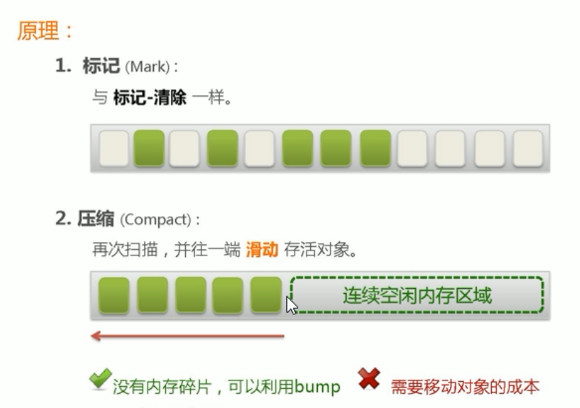

JVM前提学习视频：
https://www.bilibili.com/video/BV1TJ411R75F/?spm_id_from=333.337.search-card.all.click&vd_source=7138dfc78c49f602f8d3ed8cfbf0513d（没了）  
https://www.bilibili.com/video/BV1jJ411t71s/?spm_id_from=333.788.recommend_more_video.4&vd_source=7138dfc78c49f602f8d3ed8cfbf0513d    
相应笔记： https://blog.csdn.net/q961250375/article/details/107499173

> 相关友链（pdai）：https://www.pdai.tech/md/java/jvm/java-jvm-x-overview.html

## 概览

java gc 主要回收的是 方法区 和 堆中的内容

## 类加载器

- 类加载器是什么
- 双亲委派机制
- Java类加载的沙箱安全机制

## 常见的垃圾回收算法

- 引用计数

在双端循环，互相引用的时候，容易报错，目前很少使用这种方式了

- 复制

复制算法在年轻代的时候，进行使用，复制时候有交换

优点：没有产生内存碎片

- 标记清除

先标记，后清除，缺点是会产生内存碎片，用于老年代多一些

- 标记整理

标记清除整理

但是需要付出代价，因为移动对象需要成本