:::tip
北京大学公开课《区块链技术与应用》由肖臻老师讲授,主要讲解区块链的基本概念和实现原理，面向广大对区块链技术和应用感兴趣的同学。通过这门课的学习，能够掌握比特币、以太坊等区块链技术的设计思路并有效解决实际问题。

[课程来源：https://www.bilibili.com/video/BV1Vt411X7JF/?vd_source=7138dfc78c49f602f8d3ed8cfbf0513d](https://www.bilibili.com/video/BV1Vt411X7JF/?vd_source=7138dfc78c49f602f8d3ed8cfbf0513d)

[博客地址：ttp://zhenxiao.com/blockchain/](http://zhenxiao.com/blockchain/)

笔记内容主要是根据老师课程来，笔记内容也博采众长，加上自己的理解和总结。

:::

一些笔记：
- 1、 [https://blog.nowcoder.net/n/30cbdb37108b4d93b3a5a93b8226ae31](https://blog.nowcoder.net/n/30cbdb37108b4d93b3a5a93b8226ae31)
- 2、 [https://cn.leapwhale.com/zh/article/me0uzckk](https://cn.leapwhale.com/zh/article/me0uzckk)

## 课程大纲

**比特币**：

- 密码学基础
- 比特币的数据结构
- 共识协议和系统实现-挖矿算法和难度调整
- 比特币脚本
- 软分叉和硬分叉
- 匿名和隐私保护

**以太坊**：

- 概述:基于帐户的分布式账本-数据结构:状态树、交易树、收据树
- GHOST协议
- 挖矿:memory-hard mining puzzle-挖矿难度调整
- 权益证明
  - Casper the Friendly Finality Gadget(FFG)-智能合约

**总结与展望**

## 第二讲：比特币中的密码学原理

## 哈希

比特币中使用的：Cryptographic Hash Function（密码学哈希函数）

### **哈希算法**

哈希算法是一种**将任意长度的数据**映射为**固定长度的散列值**（也称为哈希值、摘要或指纹）的算法。哈希算法的主要特点：

1. 确定性（Determinism）：相同的输入总是产生相同的输出。
2. 快速计算（高效性）：对于给定的输入，哈希值可以迅速计算出来。
3. **抗碰撞性(Collision resistance)**：很难找到两个不同的输入，它们的哈希值相同（称为哈希碰撞）。
4. 不可逆性（单向性）：根据哈希值不能轻易逆推出原始输入。
5. 扩展性弱：微小的输入变化会导致哈希值的巨大差异（雪崩效应）。
6. **隐藏性（Hiding）**：隐藏性确保了即使知道哈希值，也不能推测出输入值的任何信息
7. **Puzzle-friendly**：在特定条件下找到一个满足要求的哈希值应当是计算上困难的。这个特性在工作量证明等机制中非常关键。

常见的哈希算法包括：

- MD5：产生128位的哈希值，曾经广泛用于数据完整性校验，但由于其抗碰撞性较弱，现在逐渐被弃用。
- SHA-1：产生160位的哈希值，也曾经广泛使用，但由于安全漏洞，已经不再推荐使用。
- **SHA-256**：属于SHA-2家族，产生256位的哈希值，广泛应用于安全性要求较高的场景，如区块链、数字签名等。

哈希算法在密码学、数据完整性校验、数字签名和其他计算机安全领域有着广泛的应用。

### 1、Collision resistance（抗碰撞性）

**Collision resistance（抗碰撞性）** 是哈希算法的重要属性之一。它指的是对于给定的哈希函数，很难找到两个不同的输入，它们的哈希值是相同的。

换句话说，抗碰撞性意味着虽然理论上可能存在两个不同的输入产生相同的哈希值（这种情况称为“碰撞”），但要找到这两个不同的输入是非常困难的。这种难度使得哈希算法在很多应用场景中非常有用，例如密码学、数据完整性校验和数字签名等。

为了更好地理解抗碰撞性，可以将其与其他两个相关的概念作比较：

1. **Preimage resistance（抗原像性）**：给定一个哈希值，很难找到一个输入，使得这个输入的哈希值等于给定的哈希值。

2. **Second preimage resistance（抗第二原像性）**：给定一个输入及其对应的哈希值，很难找到另一个不同的输入，使得这个不同的输入的哈希值与第一个输入的哈希值相同。

抗碰撞性专注于避免发现任何两个不同的输入产生相同的哈希值，从而保证哈希函数的唯一性和可靠性。如果一个哈希算法不具备抗碰撞性，那么它可能会容易受到攻击者的利用，使得算法的安全性受到威胁。

### 2、hiding（隐藏性）

在密码学中，**hiding（隐藏性）** 是指哈希函数的一个属性，通常与承诺方案（commitment schemes）相关。隐藏性确保了即使知道哈希值，也不能推测出输入值的任何信息。这种属性对于某些安全协议和密码学应用至关重要。

具体来说，隐藏性意味着：

1. **信息隐藏**：给定一个哈希值，应该无法推断出可能产生该哈希值的输入是什么。这保证了输入信息的保密性。

2. **不可预测性**：即使攻击者知道哈希值和部分信息，也不能轻易猜测出剩余的隐藏信息。例如，在某些承诺方案中，承诺者可以选择在后续阶段公开或隐藏某些信息，而这种隐藏信息在哈希值生成后是不可预测的。

#### 示例：承诺方案中的隐藏性

假设你想和别人玩一个游戏，你要选择一个值，但你不想在开始时公开这个值（防止对方作弊）。你可以将这个值通过一个哈希函数生成哈希值，然后公开这个哈希值。当游戏结束时，你再公开原始值，对方可以验证这个值的哈希值是否与之前公开的一致。这个过程依赖于哈希函数的隐藏性属性，因为在公开哈希值时，对方无法从中推断出你选择的原始值。

隐藏性在密码学应用中确保了数据的隐私性和不可预测性，是实现安全协议的一种关键机制。

### 3、Puzzle-friendly

**Puzzle-friendly** 是密码学中描述哈希函数特性的一种术语，通常用于讨论在某些加密协议或共识机制中的应用，尤其是在区块链中。具体来说，**puzzle-friendly** 的意思是，给定一个哈希函数，找到一个特定输出（通常具有特定特征，比如以某几个零开头的哈希值）应该是非常困难的，而唯一可行的方法就是通过反复尝试不同的输入来寻找这个特定的输出。

#### Puzzle-friendly 的特性
1. **计算成本高**：要找到满足条件的哈希值，通常需要进行大量的计算。换句话说，这个问题没有捷径，唯一的解决方法是进行暴力搜索，即反复尝试不同的输入，直到找到符合要求的输出。

2. **不可预测性**：由于哈希函数的不可逆性和抗碰撞性，在进行计算之前无法预见哪一个输入会生成所需的哈希值。这意味着每一次尝试都是独立的，无法利用前一次的结果来减少下一次的工作量。

3. **公平性**：由于每个人在解这个“谜题”时都必须做相似的工作量，所以在分布式系统或区块链中，这样的哈希函数可以帮助保证系统的公平性。

#### 示例：工作量证明（Proof of Work）
在区块链系统中，尤其是比特币这样的加密货币中，工作量证明机制依赖于“puzzle-friendly”哈希函数。矿工们必须找到一个区块头的哈希值，使得这个哈希值低于某个目标难度值。由于“puzzle-friendly”特性，矿工们唯一的选择就是反复尝试不同的随机数（称为“nonce”）来进行计算，直到找到一个符合条件的哈希值。

这个过程确保了添加新区块需要大量计算资源，从而维护了区块链网络的安全性和公平性。

### 4、Digital commitment（数字承诺）

**Digital commitment（数字承诺）** 是密码学中用于保证数据隐私性和完整性的一种协议或机制。它允许一个人（承诺者）在不透露特定信息内容的情况下“承诺”某个值，然后在未来的某个时间点“揭示”该值。数字承诺具有以下两个关键属性：

1. **隐藏性（Hiding）**：在承诺阶段，承诺者发布的承诺值不泄露所承诺的原始信息。这意味着在揭示之前，任何人都无法知道承诺的内容。

2. **绑定性（Binding）**：一旦承诺者发布了一个承诺值，他们就无法改变承诺的内容。也就是说，承诺者无法在揭示阶段选择不同的值，这确保了承诺的不可篡改性。

#### 数字承诺的工作过程

数字承诺通常分为两个阶段：

1. **承诺阶段（Commit Phase）**：承诺者选择一个秘密值，然后通过某种加密方式生成一个承诺值，将这个承诺值发布或发送给验证者。

2. **揭示阶段（Reveal Phase）**：在适当的时间点，承诺者揭示最初的秘密值，验证者可以使用之前的承诺值来验证揭示的值是否正确。

#### 示例

想象一下一个投标系统，其中投标者需要在特定时间之前提交投标金额。为了防止其他人知道他们的投标金额并提出更高的投标，投标者可以在提交金额之前生成一个数字承诺。当所有投标者都提交完毕后，他们再揭示各自的投标金额。通过对比揭示的金额与之前的承诺，系统可以验证投标者是否在投标时间内更改了他们的投标。

数字承诺在多种场景中被广泛应用，如电子投票、零知识证明、在线协议等，确保数据的隐私性和完整性。

## 签名

### 公钥（public  key）与私钥（private key）

它们是密码学中非对称加密的一部分，通常用于保护数据的安全性和隐私性。以下是关于公钥和私钥的详细说明：

#### 公钥（Public Key）
- **定义**：公钥是一个公开的密钥，任何人都可以获取和使用。
- **用途**：
  - **加密**：在加密通信中，公钥用于加密消息。因为公钥是公开的，任何人都可以使用它加密数据，但只有与之匹配的私钥可以解密这些数据。
  - **数字签名验证**：**公钥还用于验证数字签名的真实性**。当某人使用其私钥签名一条消息后，其他人可以使用该人的公钥来验证签名是否有效。
- **公开性**：正如名字所示，公钥是可以自由发布和共享的，不需要保密。

#### 私钥（Private Key）
- **定义**：私钥是一个秘密的密钥，必须妥善保管，不得泄露。
- **用途**：
  - **解密**：在加密通信中，私钥用于解密由公钥加密的数据。由于只有拥有私钥的人才能解密数据，因此私钥需要保持绝对的秘密性。
  - **数字签名**：**私钥用于生成数字签名**，以确保信息的真实性和不可否认性。签名后的消息可以通过公钥进行验证，确保它确实由私钥持有者发送。
- **保密性**：私钥必须严格保密，任何泄露都会导致安全风险，因为拥有私钥的人可以解密信息或者冒充私钥持有者进行数字签名。

#### 公钥和私钥的关系
公钥和私钥是一对密钥，它们是通过某种数学算法生成的，具有以下特性：
- 公钥和私钥可以互相配合使用。用公钥加密的信息只能用对应的私钥解密，反之亦然。
- 公钥和私钥之间的数学关系使得公钥能够验证由私钥生成的数字签名。

#### 示例：非对称加密和数字签名
1. **非对称加密**：Alice想给Bob发送一条保密消息。她使用Bob的公钥加密这条消息，然后发送给Bob。由于只有Bob拥有与公钥对应的私钥，所以只有Bob可以解密并阅读这条消息。

2. **数字签名**：Bob想证明他发送的一条消息的真实性和完整性。他用自己的**私钥对消息进行签名**，然后将消息和签名一起发送给Alice。Alice可以用Bob的**公钥验证签名**，以确认这条消息确实来自Bob，并且在传输过程中没有被篡改。

公钥和私钥的使用是现代数字安全的重要组成部分，广泛应用于SSL/TLS协议、电子邮件加密、区块链技术、数字证书等领域。

## 总结

- 哈希的特性以及理解。

- 签名的概念以及原理。

所以BTC包含的密码学原理就是哈希函数以及签名。哈希函数的一些特性以及签名的方式保证了BTC的安全性。

## 第三讲：比特币中的数据结构

### Hash Pointers（哈希指针）

**Hash Pointers（哈希指针）**。哈希指针是一种结合了指针和哈希值的数据结构，广泛应用于区块链、密码学和数据完整性验证等领域。

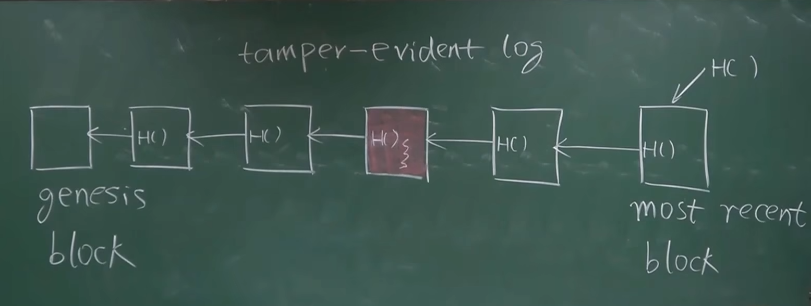

#### Hash Pointer 的概念
- **指针部分**：指向某个数据块或数据对象的存储位置，类似于传统的指针。
- **哈希值部分**：存储指向的数据块的哈希值。

这种组合具有两个重要的特性：
1. **数据定位**：指针部分可以定位到实际的数据位置（通常是内存地址或存储单元）。
2. **数据完整性验证**：哈希值部分用于验证指针所指向的数据是否被篡改。通过重新计算指向数据的哈希值并与存储的哈希值进行对比，可以检测出任何数据的变化。

#### Hash Pointer 的应用

##### 1. 区块链
在区块链中，Hash Pointer 是区块链数据结构的基础。例如，**比特币区块链中，每个区块包含一个指向前一个区块的哈希指针**。这意味着每个区块不仅包含对前一个区块的引用，还包含前一个区块的哈希值，从而确保了区块链的不可篡改性。如果某人试图篡改历史区块中的数据，他们必须修改所有后续区块的哈希值，这几乎是不可能的。

##### 2. Merkle 树
Merkle 树是一种基于哈希指针的数据结构，常用于验证数据的完整性。Merkle 树的叶节点是数据的哈希值，而每个非叶节点是其子节点哈希值的组合哈希。根节点的哈希值称为 Merkle 根，通过这个哈希值可以验证整个树的完整性。Merkle 树广泛应用于区块链、分布式系统和版本控制系统中。

##### 3. 数据版本控制
在版本控制系统中，Hash Pointer 可以用于跟踪文件或数据对象的历史版本。每个版本的对象通过哈希指针指向其前一个版本，从而构建一个链条，这样可以有效地管理和验证不同版本之间的差异和完整性。

#### Hash Pointer 的优点
- **安全性**：通过哈希值的验证，可以确保数据的完整性和防篡改性。
- **高效性**：在数据存储和版本控制中，Hash Pointer 提供了一种高效的数据引用和验证机制。
- **不可篡改性**：一旦数据被记录下来并形成哈希指针链条，任何篡改都会破坏链条的完整性，从而被检测出来。

#### 总结
Hash Pointer 通过将数据指针和哈希值结合，提供了一种强大的数据结构，用于数据完整性验证和防篡改。这种结构在区块链、Merkle 树和版本控制系统中有着广泛的应用。

### Tamper-Evident Log

哈希指针的一个主要优点是它提供了一种不可篡改的日志（tamper-evident log）。

- **完整性验证**：由于每个区块都包含前一个区块的哈希值，任何对某个区块的篡改都会改变该区块的哈希值，从而导致其后所有区块的哈希值发生变化。这样，篡改行为可以很容易地被检测到。
- **防篡改链**：因为每个区块都依赖前一个区块的哈希值，如果某人试图修改一个区块，不仅需要修改该区块，还需要修改其后的所有区块，这几乎是不可能完成的任务。

### Merkle Tree

Merkle Tree （Merkle 树）：是一种用于验证数据完整性的树形结构，广泛应用于分布式系统、区块链和文件系统中。它通过哈希函数确保数据的不可篡改性。

Binary Tree （二叉树）：是一种每个节点最多有两个子节点的数据结构，广泛用于算法设计和计算机科学的各类问题中。二叉树主要用于高效的查找、插入、删除操作。

**Merkle Tree**

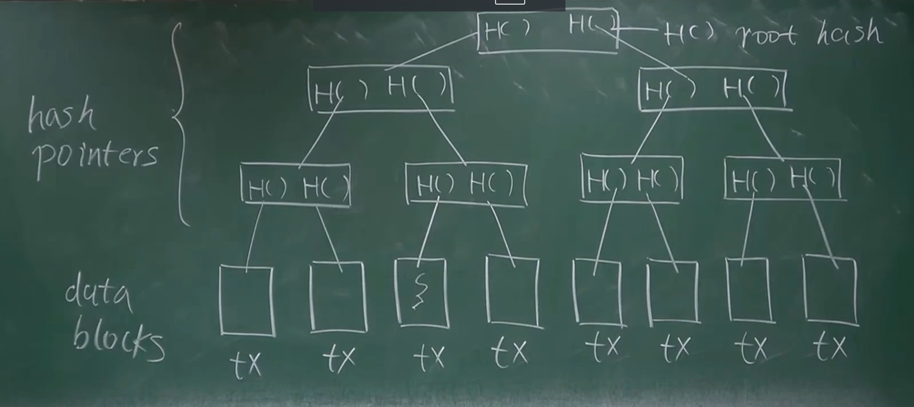

在比特币系统中，Merkle Tree（默克尔树）是用于组织和验证交易数据的一种重要结构。它的基本单元是底层的数据块，这些数据块实际上是一笔笔交易。

每个block有一个默克尔树，树中每个叶子节点是一个交易的hash值（比特币使用双重SHA256哈希）。叶子节点的数量一定是偶数，然后并非每个block都恰好有偶数个交易。当block有奇数个交易时，最后一个交易会被复制一次（复制仅仅发生在默克尔树中而不是block中！）。

默克尔树自下而上的进行组织，叶子节点成对分组后将两个hash值组合后生成新的hash值，形成上层的树节点，重复整个过程直到只有一个树节点为止，也就是所说的根节点。**根节点的hash值是整个交易集的唯一标识，保存在block头信息中，用于PoW过程。根节点（Root Hash）代表了整个树的哈希值，只要记住这个根哈希值，就可以检测到整个树上的任意修改。**

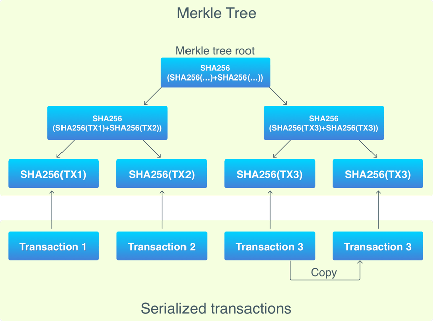

### Merkle Proof

Merkle Tree 的一个重要好处是可以进行 Merkle Proof。Merkle Proof 是一种用于证明某个数据块（交易）存在于一棵给定的 Merkle Tree 中的方法。

#### 全节点与轻节点

- 全节点：保存了整个区块链的所有数据，包括所有的交易和块。
- 轻节点：仅保存区块头（Block Header），而不保存所有交易数据。

#### 轻节点的交易验证

假设你在手机上运行的是一个轻节点，如果我给你做了一笔转账，你需要验证这笔交易已经存在于区块链中，这时就需要用到 Merkle Proof。

从下往上验证。

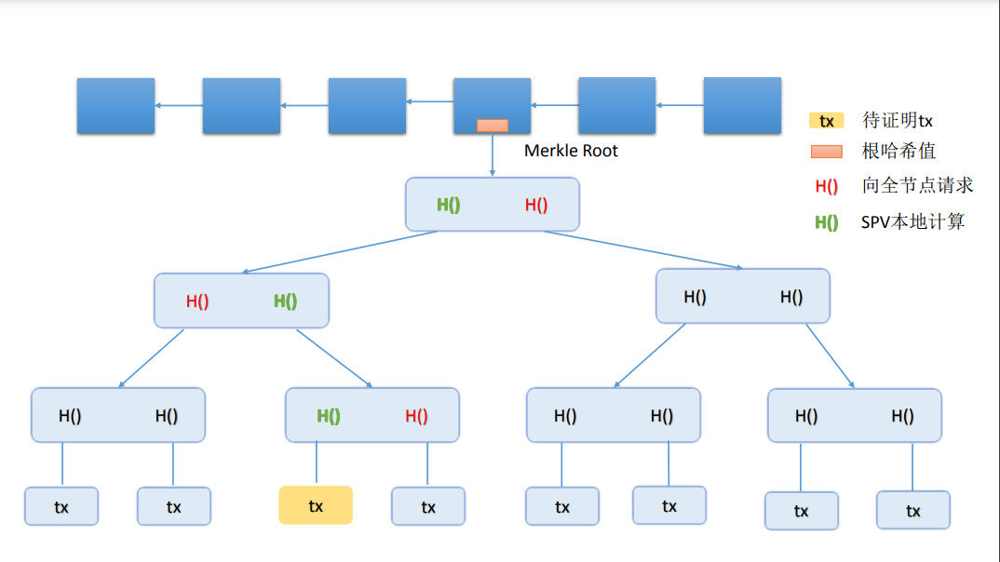

#### 验证过程

- 接收路径（Merkle Proof）：轻节点从全节点或其他来源接收一个路径，这个路径包括从目标交易到根哈希的所有哈希值。
- 验证路径：轻节点使用这个路径验证该分支路径的哈希值与最终的区块头（Block Header）是否一致。如果一致，就证明该交易存在于区块链中。这个过程证明的是`Proof of Membership`，其复杂度是 `O(log⁡n)`。

#### Proof of Non-Membership

如何证明某个交易不在区块链中（Proof of Non-Membership）, 当前没有比较高效的方法，只能一个个查验，其复杂度是 O(n)。

#### Sorted Merkle Tree

如果交易数据是有序的，根据哈希值排序，这种结构被称为 `Sorted Merkle Tree`。这种结构允许快速查找某个交易是否存在。但比特币并没有用这种结构，它不需要这个功能，排序也是需要额外代价的。

## 第四讲：比特币的共识协议

### BTC协议

比特币协议包括铸币、交易过程和防止双花攻击等机制。

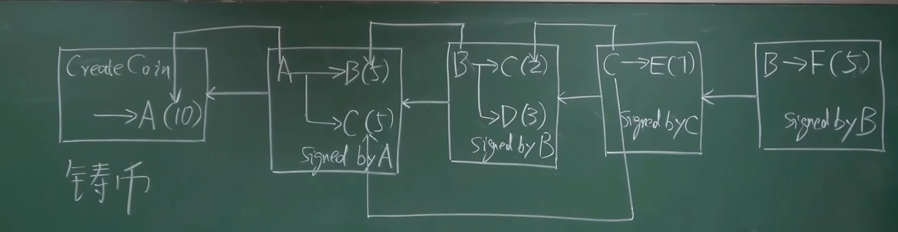

### 铸币和交易过程

每笔交易包含输入和输出部分：

- 输入部分：说明币的来源（即之前的交易）和转账人的公钥。转账人的公钥需要与币来源的公钥相匹配，确保合法性。
- 输出部分：指明收款人的公钥。这次交易需要有发送人的签名，确保交易是由合法的持币人发起的。

哈希指针用于指向之前的某个交易，证明这部分钱的来源，防止凭空捏造币。这个机制也防范了双花攻击。

### Double Spending Attack 双重支付攻击（双花攻击）

是指在网络上的数字货币系统中，攻击者试图在同一时间内将同一笔货币资产花费两次。这种攻击如果成功，会导致同一笔货币被两个不同的接收者接受，从而造成货币的重复使用。

双花攻击是指同一笔比特币被花费两次的情况。比特币通过以下机制防止双花攻击：

- 区块链共识：每笔交易都需要被矿工打包进区块，并通过共识机制确认。
- 交易验证：当一个新的区块被广播时，网络中的所有节点都会验证其中的每笔交易是否合法，检查是否有双花行为。
- 最长链规则：比特币网络会选择最长的合法链。如果双花交易发生在不同的区块中，只有包含在最长链中的交易会被认可。

#### 双花攻击检测示例

假设Alice试图将同一笔比特币分别转给Bob和Charlie：

- 广播两笔交易：Alice向Bob和Charlie分别发起两笔相同输入的交易，并几乎同时广播到网络中。
- 矿工打包：矿工收到这两笔交易，并分别打包进不同的区块中，形成两个分叉。
- 分叉传播：网络中的节点会接收到这两个分叉的区块链，暂时分裂为两个分支。
- 最长链选择：随着时间推移，矿工继续挖矿并生成新区块。当某个分支被延长，形成新的最长链时，另一个分支的区块将被丢弃，成为孤块。
- 交易确认：最终，只有包含在最长链中的交易会被确认和接受。此时，Alice的双花攻击会失败，因为只有一笔交易会被区块链网络接受，另一笔交易会被回滚。

比特币挖矿每十分钟一个区块，其实也是为了防止分叉攻击，不然时间太短，叉太多，就容易被攻击

### 区块结构

每个区块由区块头（Block Header）和区块体（Block Body）组成。

区块头包含以下字段：

- **版本号（version）**：表明区块的版本。
- **前一个区块的哈希值（previous block hash）**：指向前一个区块，确保链条的连续性。
- **Merkle根（Merkle root）**：当前区块中所有交易的哈希值经过Merkle树计算得到的根哈希。
- **时间戳（timestamp）**：记录区块创建的时间。
- **难度目标（nbits）**：当前区块的挖矿难度。
- **随机数（nonce）**：用于挖矿的计数器。

**区块体**包含一个交易列表（transaction list），记录所有包含在该区块中的交易。

### 区块验证

其他节点收到新区块后，会进行一系列验证，以确保区块的合法性：

- 哈希值验证：检查区块头的哈希值是否小于难度目标。
- 前一个区块的哈希：验证前一个区块的哈希值是否与本地链的最后一个区块匹配。
- **交易验证：** 验证区块中的每笔交易是否合法，包括：
  - 签名有效性：检查交易的签名是否由合法的私钥生成。
  - 双花检测：确保每笔输入没有在之前的区块中被花费。
- Merkle根验证：检查交易列表的Merkle根是否与区块头中的Merkle根一致。
  如果区块通过所有验证，它将被添加到本地区块链中，否则将被拒绝。

### 分布式共识

::: info
可否各个节点独立完成区块链构建？
很明显不行，各个节点独立打包交易，形成区块链，必然无法避免区块链内容不一致。从分布式系统角度来说，账本内容需要取得分布式共识，从而保证区块链内容在不同节点上的一致性。
:::

- 根据FLP不可能结论，在一个异步系统中，网络时延无上限，即使只有一个成员是有问题的，也不可能达成共识。
- 根据CAP Theorem（Consistency一致性、Availability可靠性、Partition tolerance容错性），任何一个分布式系统中，最多只能满足其中两个性质。
- 分布式共识中协议Paxos 可以保证Consistency（若达成共识必然一致），但在某些情况下，可能会一直无法达成共识。

::: info
>女巫攻击（Sybil Attack）:在分布式系统中是一种常见的攻击方式,指的是一个恶意节点通过控制多个身份来影响网络中的共识过程。

在比特币的分布式共识机制——工作量证明（Proof of Work，PoW）中，女巫攻击的具体影响如下：
- 身份伪造：攻击者创建大量虚假身份（节点），在网络中伪装成不同的参与者。
- 影响共识：通过控制大量节点，攻击者可以试图影响比特币网络中的共识决策过程，例如在比特币的分叉选择中，攻击者可以使网络认为其伪造的链是合法的，从而尝试推翻真实的区块链。
- 网络分割：攻击者可以利用这些虚假身份对网络进行分割，使得网络中的部分节点无法接收到其他节点的信息，从而破坏网络的去中心化特性。
:::

谈到共识，我们可能会想到投票，但是任何基于投票的共识协议都有一个投票权的问题，可能会存在女巫攻击，在比特币系统中简单的采用投票来确定共识是不行的。比特币网络通过 **工作量证明（Proof of Work, PoW）** 来实现分布式共识，确保所有节点就区块链的状态达成一致。其核心思想是通过消耗计算资源来防止女巫攻击和其他恶意行为。具体过程如下：

- 挖矿过程：矿工竞争性地进行大量的哈希运算，试图找到一个满足特定条件的哈希值（即目标值以下的哈希）。
- 哈希值计算：矿工对区块头进行哈希运算，区块头包括前一个区块的哈希值、当前区块中的交易Merkle根、时间戳、难度目标（nbits）和随机数（nonce）。
- 目标值：难度目标（nbits）决定了哈希值必须小于的目标值。随着网络计算能力的变化，难度调整每2016个区块（大约两周）进行一次。确保新区块生成时间约为每10分钟一次。如果区块生成过快，难度会增加；如果生成过慢，难度会降低。

#### 比特币共识协议

::: info 背景
背景：假设系统中存在部分节点有恶意，但存在比例较小。大多数节点为“好”的节点，在这种情况下进行共识协议设置。
- 想法1：直接投票
某个节点打包交易到区块，将其发给其他节点，其他节点检查该候选区块，检查若正确投赞成票，若票数过半数，加入区块链。

- 存在的问题1——恶意节点不断打包不合法区块，导致一直无法达成共识，时间全花费在投票上。
- 存在的问题2——无强迫投票手段，某些节点不投票（行政不作为）。
- 存在的问题3——网络延迟事先未知，投票需要等多久？效率上会产生问题。

更大的一个问题 —— membership(资格)。
如果是联盟链（hyperledger），对加入成员有要求，可以基于投票。
但比特币系统，任何人都可以加入，且创建账户及其简单，只需要本地产生公私钥对即可。只有转账（交易）时候,比特币系统才能知道该账户的存在。这样，黑客可以使用计算机专门生成大量公私钥对，当其产生大量公私钥对超过系统中一半数目，就可以获得支配地位（女巫攻击`Sybil Attack`）。所以，这种简单的投票方案也是不可行的。
:::

比特币系统中采用了很巧妙的方案解决这个问题。虽然仍然是投票，但并非简单的根据账户数目，而是依据计算力进行投票。

在比特币系统中，每个节点都可以自行组装一个候选区块，而后，尝试各种`nonce`值，这就是挖矿。
`[H(block header)<=target]` 当某个节点找到符合要求的`nonce`，便获得了记账权，从而可以将区块发布到系统中。
其他节点受到区块后，验证区块合法性，如果系统中绝大多数节点验证通过，则接收该区块为最新的区块并加入到区块链中。

> 区块合法，但不一定就能接收。 得满足区块在最长合法（longest valid chain）链上。

### 共识协议和分叉处理

#### 最长链规则

比特币网络采用最长链规则来决定哪条链是合法的。即所有节点选择包含最多工作量（即最长）的合法链。这样确保了网络的一致性和**防止分叉攻击（forking attack）**。

> 如果是等长，怎么办？ 那就看谁先找到下一个区块成为最长区块链了。

#### 分叉处理

如果两个矿工几乎同时找到有效区块，会出现链的分叉。此时：

- 暂时分叉：网络中的节点会临时分裂为两个分支，分别接收其中一个区块。
- 最终选择：当一个分支被后续区块延长并超过另一个分支时，较短分支上的区块将被丢弃，成为孤块（orphan block）。
- 回滚交易：孤块上的交易会被回滚到未确认状态，并可能被包含在后续的区块中。

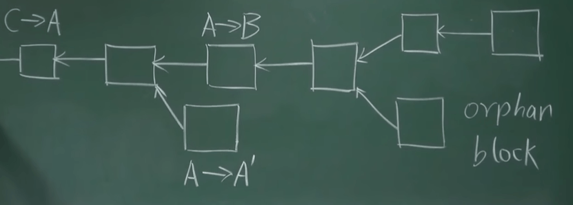

> 那么为什么都要竞争记账权呢？ 会消耗资源，算力和电力成本有什么好处呢？ 我们是期望凡事合法的交易都应该被写到区块链里的。 所以有比特币激励机制`block reward`。

### 比特币激励机制

> 为什么系统中节点要竞争记账权？需要提供算力和电力成本，节点为什么要去做？

比特币系统设计之初便考虑到了这个问题，那就是引入激励机制`block reward`。
比特币通过设置出块奖励来解决该问题，一个获得合法区块的节点，可以在区块中加入一个特殊交易（铸币交易）。事实上，这种方式也是唯一一个产生新比特币的途径。

矿工在成功找到满足条件的哈希值后，获得记账权并将新区块广播到全网。新区块包含一个特殊的交易（**铸币交易 coinbase transaction**），用于奖励矿工：

- 出块奖励：最初的出块奖励为`50 BTC`，每经过210,000个区块（约4年）奖励减半。当前（2024年）奖励为`6.25 BTC`。
- 交易费用：除了出块奖励，矿工还可以获得包含在区块内交易的交易费用。这些费用由交易发起人支付，作为矿工打包交易的激励。

## 第五讲：比特币系统的实现

区块链是一个去中心化的账本，比特币采用了 **基于交易的账本模式 (`transaction-based ledger`)**。
然而，系统中并无显示记录账户包含比特币数，实际上其需要通过交易记录进行推算。在比特币系统中，全节点需要维护一个名为 **`UTXO`(`Unspent Transaction Output`尚未被花掉的交易输出)的数据结构**。

### UTXO 的核心逻辑

UTXO 是比特币中用来记录 未花费的交易输出 的数据结构：

- 当某笔交易的输出未被下一笔交易引用（即未花费），它就会出现在 UTXO 集中。
- 一旦某笔交易的输出被下一笔交易引用（即被花费），它就会从 UTXO 集中移除。

如图，A 转给 B 5 个 BTC，同时转给 C 3 个 BTC。这笔交易的两个输出最初都保存在 UTXO 集中。当 B 将 5 个 BTC 花掉时，该部分交易输出会从 UTXO 集中移除。而 C 的 3 个 BTC 若未花费，则继续保存在 UTXO 集中。

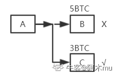

UTXO集合中每个元素要给出产生这个输出的交易的哈希值，以及其在交易中是第几个输出。通过这两个信息，便可以定位到UTXO中的输出。

> 为什么要维护这样一个数据结构？？？  
> 为了防范“双花攻击”，判断一个交易是否合法，要查一下想要花掉的BTC是否在该集合中，只有在集合中才是合法的。如果想要花掉的BTC不在UTXO中，那么说明这个BTC要么根本不存在，要么已经被花过。所以，全节点需要在内存中维护一个UTXO，从而便于快速检测double spending（双花攻击）。

每个交易会消耗输出，但也会产生新的输出。

> 如图，A转给B 5 个BTC，之后B将其转给D，则UTXO中会删掉A->B这一交易记录，同时会添加B->D这一交易记录。  
>
>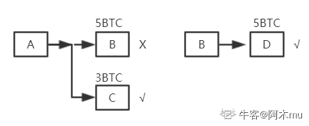
> 
> 假如有人收到BTC转账，但一直不花，那么这个信息会一直保存在UTXO中。这种情况可能是该用户不想花这些BTC(如：中本聪) ，也有可能是忘记了私钥导致无法花掉。所以，UTXO是逐渐增大的，但该数据目前来说，一个普通的服务器硬盘中是可以完全保存这些数据的。

每个交易可以有多个输入，也可以有多个输出，但输入之和要等于输出之和（`total inputs` = `total outputs`）。  

存在一些交易的t`otal inputs` 略大于 `total outputs`，这部分差额便作为交易费，给了获得记账权的节点。在公开课笔记4中最后提及到“区块中保存交易记录，如果仅仅设置出块奖励，那么，会不会存在节点只想发布区块获得出块奖励而不想打包交易？”  

因此，BTC系统设计了`Tranction fee`（交易费），对于获得记账权节点来说，除了出块奖励之外，还可以得到打包交易的交易费。但目前来说，交易费远远小于出块奖励。等到未来出块奖励变少，可能区块链的维护便主要依赖于交易费了。

> BTC系统中每21万个区块，BTC出块奖励减半。根据下图计算，基本上出块奖励每4年减半。
> 
>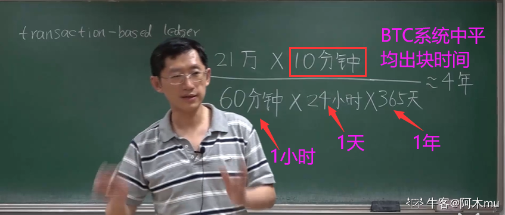
> 
> 比特币是基于交易的模式，与之对应，还有一种基于账户的模式（如：以太坊）。基于账户的模式要求，系统中显示记录账户余额。也就是说，可以直接查询当前账户余额是多少货币。可以看到，比特币这种模式，隐私性较好，但其也付出一定代价。在进行交易时，因为没有账户这一概念，无法知道账户剩余多少BTC,所以必须说明币的来源（防止双花攻击）。而基于账户的模式，则天然地避免了这种缺陷，转账交易就是对一个（多个）账户余额的数字减和另一个（多个）账户余额的数字加

### BTC系统中具体的区块信息
-------------

如下图所示，为一个区块的信息（取自视频中截图，源自`blockchain.info`）

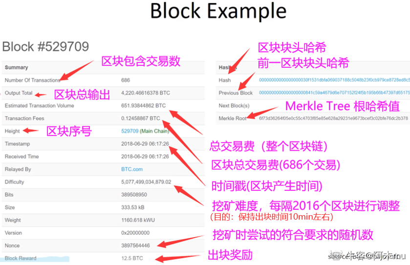

#### 什么是挖矿？  

可以看到，区块哈希与前一区块哈希都是以一长串0开头的，挖矿本身就是尝试各种`nonce`，使得产生的区块哈希值小于等于目标阈值。 该目标阈值，表示成16进制，就是前面含有一长串的0

* * *

下为`block header`的代码中实现的数据结构。 里面的几个域在公开课笔记4中(比特币区块信息)已经解释过了，这里不再赘述。  

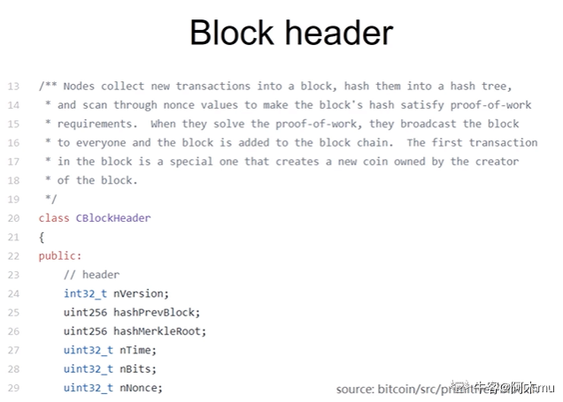

可以看到，`nonce`是一个32位的无符号整型数据，在挖矿时候是通过不断调整`nonce进`行的，但可以看到，`nonce`的取值最多为`2^32`(2的32次方)种。但并非将这些`nonce`全部遍历一遍，就一定能找到符合要求的`nonce`。由于近年来，挖矿人员越来越多，挖矿难度已经调整的比较大了（关于难度调整请关注后续博文，会有专门一篇介绍难度调整），而`2^32`这一搜索空间太小，所以仅调整`nonce`很大可能找不到正确的结果。

> 还有哪些域可以调整呢？

下图为`block header`中对各个域的描述。而仅仅调整`nonce`是不够的，所以这里可以通过修改`Merkle Tree`的 根哈希值 来进行调整。

> 思考：打包的交易和顺序确定了，根哈希值不就确定了吗？这个怎么能修改呢？

### 铸币交易（coinbase交易）
----------------

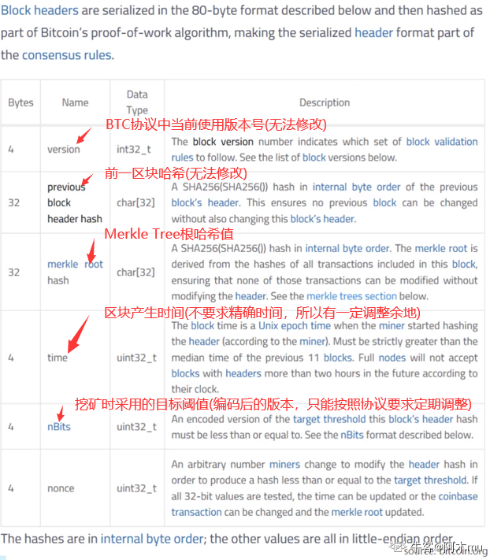

在公开课笔记4中提及，每个发布区块者可以得到出快奖励，也就是可以在区块中发布一个**铸币交易(coinbase交易)**,这也是BTC系统中产生新比特币的唯一方式。下为一个铸币交易的内容：  

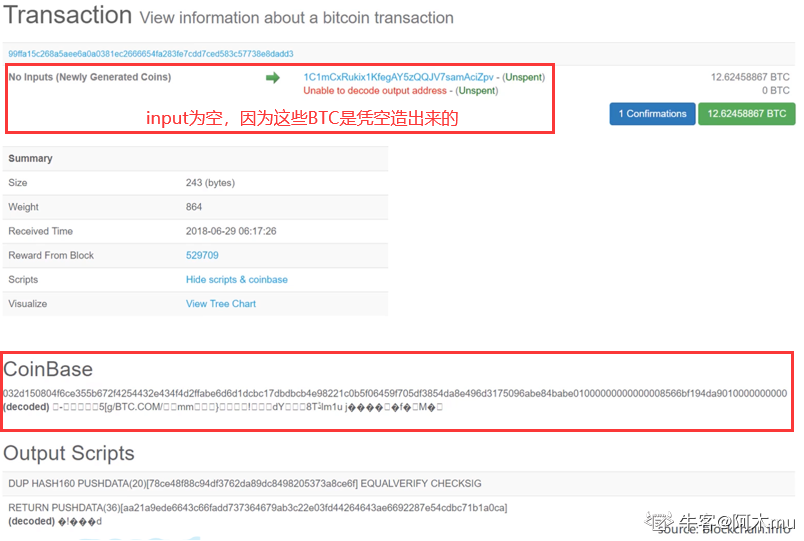

可以看到，有一个`CoinBase`域，其中可以写入任何内容，在这里写什么都没有影响。所以可以在这里添加一些任意信息，便可以实现无法篡改（也无法删除）。（例如：提前写入股票预测结果的哈希值、写入人生感谢，写入爱情誓言（无法删除，想想删不掉十年前发表的QQ空间非主流说说是痛苦吧，嘿嘿嘿））  
所以，只要我们改变了写入内容，便可以改变`Merkle Tree`的根哈希值。

下图为一个小型的区块链，假定左下角交易为`coinbase`交易，可以看到，该交易发生改变会逐级向上传递，最终导致`Merkle Tree`根哈希值发生改变。  

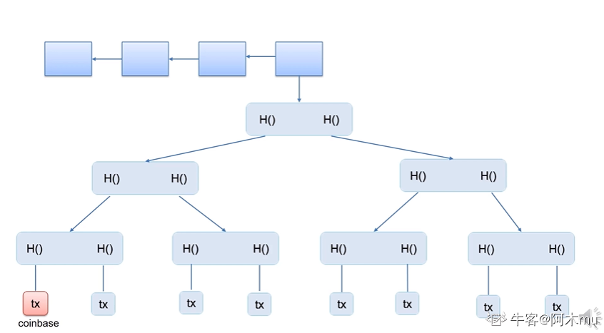

所以，在实际的挖矿中，包含两层循环。外层循环调整`coinbase`域（可以规定只将其中前x个字节作为另一个`nonce`），算出`block header`中根哈希值后，内层循环再调整`nonce`。

### 普通转账交易
------

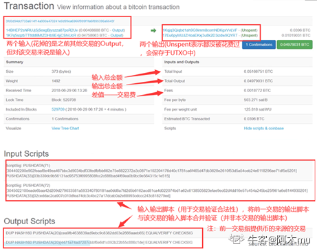

如果将输入脚本和输出脚本拼接起来可以顺利执行不出现错误，则说明交易合法。

### 挖矿过程的概率分析
---------

挖矿本质上是不断尝试各种`nonce`，来求解这样一个`puzzle`。每次尝试`nonce`，可以视为一次伯努利试验。最典型的伯努利试验就是投掷硬币，正面和反面朝上概率为`p`和`1-p`。在挖矿过程中，一次伯努利试验，成功的概率极小，失败的概率极大。挖矿便是多次进行伯努利试验，且每次随机。这些伯努利试验便构成了`a sequence of independent Bernoulli trials`(一系列独立的伯努利试验)。
根据概率论相关知识知道，伯努利试验本身具有无记忆性。也就是说，无论之前做多少大量试验，对后续继续试验没有任何影响。  

对于挖矿来说，便是多次伯努利试验尝试`nonce`，最终找到一个符合要求的`nonce`。在这种情况下，可以采用泊松分布进行近似，由此通过概率论可以推断出，系统出块时间服从指数分布。(需要注意的是，出块时间指的是整个系统出块时间，并非挖矿的个人)  

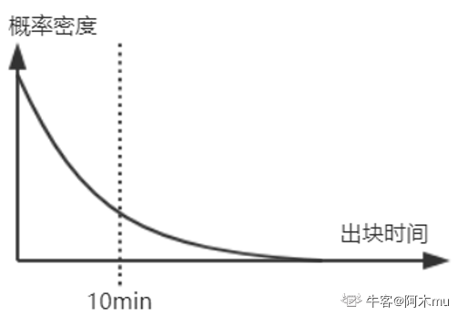

系统平均出块时间为`10min`，该时间为系统本身设计，通过难度调整维护其平均出块时间。  
指数分布本身也具有无记忆性。也就是说，对整个系统而言，已经过去`10min`，仍然没有人挖到区块，那么平均仍然还需要等`10min`（很不符合人的直觉）。也就是说，将来要挖多久和已经挖多久无关。

> 虽然这样看起来是一个冷酷的事情，过去的工作可能都会白做。但实际上这才是挖矿公平性的保障。对算力有优势的矿工来说，其之前所做大量工作仍有可能会白费。

### 比特币总量计算
-------

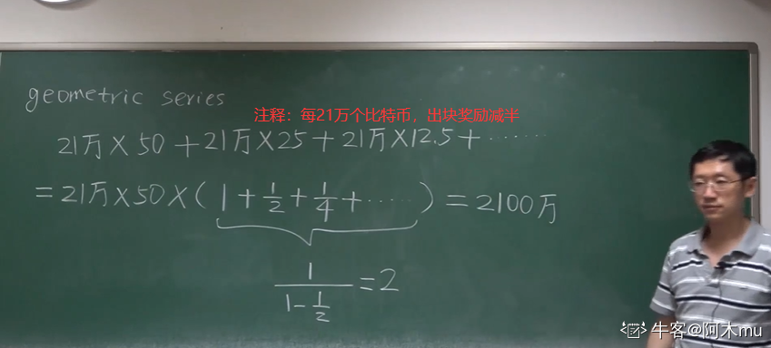

也就是说，比特币系统中已经挖出和未挖出的比特币总数便是`2100`万个。  
实际上，挖矿这一操作并非在解决数学难题，而是单纯的算力比拼。也就是说，挖矿这一过程并没有实际意义，但挖矿这一过程，却是对比特币系统的稳定起到重要维护作用。  
所以，只要大多数算力掌握在好的节点手中，便能够保障比特币系统的稳定。

> 比特币越来越难被挖到，且出块奖励越来越少，是否说明其未来挖矿的动力将越来越低呢？  
> 实际上，恰恰相反。在早期比特币很容易挖到的时候，比特币并不被人们所看好，而后，比特币估值上涨，吸引其他人参与挖矿，又进一步促进了比特币价值上涨，进而又吸引更多人参与进来。  
> 当出块奖励趋于0时，则整个系统将依赖于交易费运行，届时交易费将成为维护比特币系统运行的重要保障。

### 比特币系统安全性分析

----------

> 大多数算力掌握在好的用户手中，能否保障不良交易记录不会被写入区块链？  
> 需要注意的是，算力低的用户并非完全不能获得记账权，仅仅是概率上较低的问题。但实际上，即使拥有少量算力的恶意节点，也有一定概率获得某个区块的记账权。

1.  可否"偷币"？（恶意节点能不能将其他账户上比特币转给自己？）  
        答案：不能。因为转账交易需要签名，恶意节点无法伪造他人签名。加入其获得记账权并硬往区块中写入该交易，大多数用户会认为其是一个非法区块，大多数算力将不认可该区块，从而沿着其他路径挖矿，随着时间推移，拥有大多数算力的诚实的节点将会仍然沿着原来区块挖矿，从而形成一条“最长合法链”，该区块变成孤儿区块。对于攻击者来说，不仅不能偷到其他人的比特币，而且得不到出块奖励，还浪费了挖矿花费的电费等成本。
2.  可否将已经话过的币再花一遍？  
        如下图1，若`M`已经将钱转给`B`，现在想再转给自己，假设其获得记账权，若按照图1方式，很明显为一个非法区块，不会被其他节点承认。  
        所以，`M`只能选择图2方式，将M转账给B的记录回滚掉。这样就有了两条等长合法链，取决于哪一个会胜出。（如果上面交易产生不可逆的外部效果，下面交易回滚便又拿回钱，从而不当获益）

> 需要注意的是，再挖矿之初便要选择上一个区块是谁。也就是说，并不是获得记账权之后才选择插入到哪一个区块之后。  

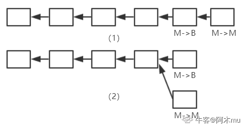

#### 如何防范这种攻击？？？  

如果再`M->`B这个交易之后还延续有几个区块，如下图所示，则大多数诚实节点不会承认下面的链。所以，便变成了恶意节点挖下面的链，其他节点挖上面的链的算力比拼。由于区块链中大多数节点为善意节点，则最终上面链会胜出，而恶意节点的链会不被认可，从而导致投入成本白费。  

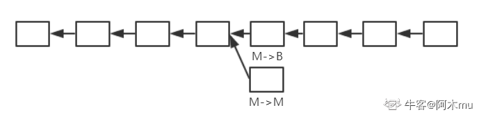

所以，一种简单防范防范便是多等几个确认区块。比特币协议中，缺省需要等6个确认区块，此时才认为该记录是不可篡改的。平均出块时间`10min`，六个确认区块便需要1小时，可见等待时间还是相对较长的。

3.  可否故意不包含合法交易？  
       可以，但是可以等待后续区块包含，所以问题不大。实际运行中，可能由于某段时间实际交易数太多，而一个区块包含交易数存在最大值，导致某些合法交易并未被写入区块链（等待后续区块写入）。
4.  `selfish mining` 
        提前挖到但不发布，继续挖下去，等到想要攻击的交易等了6次确认认为安全之后将整条链发布出去，试图回滚原来记录。这种情况，需要恶意节点掌握系统中半数以上算力才行，否则无法成为最长合法链。

    > selfish mining有好处吗？  
    > 如图所示，假使挖到2号时候先不发布，则其他人仍然需要挖1号区块，若其算力足够强，能保证别人挖出1之后可以挖出3.可以此时将2和3一起发布，从而将1区块所在链最长合法链挤掉（减少了别人和自己竞争挖3号区块）。  
    > 但这样存在风险，如果别人已经挖出1，自己还没挖出3，则需要尽快发布2和别人竞争最长合法链地位。  
    > 
    > 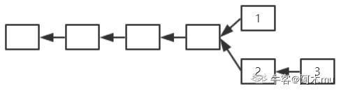

    
需要注意的是，比特币系统中，假如发生以下情况，各个节点以自己先收到的区块所在链为主链，对后收到的合法区块会不予认可（但会先保存起来）。此时便变成了两批算力分布挖1和2，具体哪一个成为主链，取决于哪一条链先挖到下一个区块，使得两个等长合法链出现长短不一致，最终胜者成为最长合法链。  

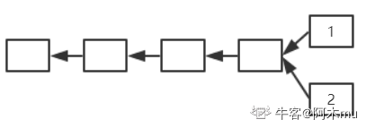

## 第六讲：比特币网络的工作原理

比特币系统的工作过程：
用户将交易发布到比特币网络上，节点收到交易后打包到区块中，然后将区块发布到比特币网络上，那么新发布的交易和区块在比特币网络上是如何传播的呢？

### 比特币网络的工作原理

比特币工作于网络应用层，其底层（网络层）是一个`P2P Overlay network`（P2P覆盖网络）。比特币系统中所有节点完全平等，不像一些其他网络存在超级节点(`super node`)。要加入网络，至少需要知道一个种子节点，通过种子节点告知自己它所知道的节点。节点之间的通信采用了`TCP`协议，便于穿透防火墙。当节点离开时，只需要自行退出即可，其他节点在一定时间后仍然没有收到该节点消息，便会将其删掉。

比特币网络设计原则：简单、鲁棒（最坏情况下能达到最优状况，即健壮性）而非高效。
每个节点维护一个邻居节点集合，消息传播在网络中采用`洪泛法`，某个节点在收到一条消息会将其发送给所有邻居节点并标记，下次再收到便不会再发送该消息。邻居节点选取随机，未考虑网络底层拓扑结构，也与现实世界物理地址无关。该网络具有极强鲁棒性，但牺牲了网络效率。

比特币系统中，每个节点要维护一个等待上链的交易集合。第一次听到交易，若是合法交易，则将其加入该交易集合并转发给邻居节点，以后再收到该交易就不再转发（避免网络上交易无线传输）。假如网络中存在两个冲突交易，如交易1：`A->B`,交易2：`A->C`（假设花费的同一笔钱）。具体接收哪个取决于节点先接收到哪个交易，之后收到另一个交易会将其放弃。

> 假如某个节点先听到A->B，但又听到A->C已经上链，则此时A->B为非法交易，所以要再等待上链交易集合中删除A->B

新发布区块在网络中传播方式与新发布交易传播方式类似，每个节点除检查该区块内容是否合法，还要检查是否位于最长合法链上。区块越大，则网络上传输越慢。BTC协议对于区块大小限制为不大于1M大小。

> 区块大小越大，网络上传播时延越长；区块大小越小，则可以包含的交易数目越少。

此外，比特币网络传播属于`Best effort`（尽力而为），不能保证一定传输成功。以一个交易发布到网络上，未必所有节点都能收到，也未必所有节点收到交易顺序都一致。

## 第七讲：BTC挖矿难度调整

之前有提到过，在比特币系统中，区块链的出块时间保持在平均`10min`左右。毫无疑问的是，伴随着参与挖矿的人增多，系统总算力不断增强，挖矿的难度绝对不能一成不变。
实际上，在比特币系统开发过程中，中本聪便考虑到了这个问题，并设计了一个相应的难度调整算法。这一篇，便了解一下比特币系统中的挖矿难度调整算法。

### 为什么要调整挖矿难度

之前已经提过，挖矿本质上就是不断调整`block header`中的`nonce`值，使整个`block header`的哈希值小于等于给定的目标阈值。即：`H(block header)<=target`.（target便是目标阈值，target越小，目标难度就越大）对于挖矿难度的调整，可以视为调整目标空间在整个输出空间中所占比例大小。

> 之前有提及，比特币系统采用的哈希算法为`SHA-256`，所以整个输出空间大小为`2^256`，调整目标空间所占比例，简单的说需要目标值前需要多少个0。
> 当然，挖矿难度和目标阈值成反比，如下图所示，其中difficulty_1_target为`是挖矿难度为1时候的target，即最小挖矿难度
> 挖矿难度公式可以表示为：

> `difficulty = difficulty_1_target / target`
> 
> 其中：`difficulty_1_target` 是比特币网络中的一个固定值，通常表示为`0x00000000FFFF0000000000000000000000000000000000000000000000000000`。
> 
> `target`是当前区块的目标值，由网络根据算力动态调整。

1. **如果不调整挖矿难度会怎么样？**

系统总算力越来越强，若挖矿难度保持不变，则出块时间会越来越短。

2. **出块时间越来越短是好事吗？**

出块时间缩短，那么交易可以很快便被写入区块链，并且提高了系统响应时间，增加了区块链系统效率。
但是，出块时间并不是越短越好。出块时间太短，也会造成一定的问题。首先，区块在网络上传播具有时延，假如出块时间为1秒，但网络传播需要10秒，则会使得系统中节点经常性处于不一致的状态，增加了系统不稳定性，且系统经常性位于分叉状态（不仅二分叉，乃至多分叉）。分叉过多，则不利于系统达成共识，且会造成算力分散，使得黑客攻击成本大大降低(不再需要整个系统51%的算力)。

4. `10min`的出块间隔是最优吗？

当然不是，但可以确定的是，系统出块时间需要维持在一个定值附近。后续文章中会介绍以太坊，以太坊中平均出块时间仅为15秒左右，但同样在以太坊中也有相应难度调整算法维持其平均出块时间(后续会写文介绍)，当然15s的时间明显会产生经常性的分叉，所以以太坊设计了新的共识协议Ghost（后续文章中会介绍）。

对于一个交易系统来说，10min这样一个交易时间是比较长的。但对于跨国交易来说，这个时间反而大大缩短了交易时间，减少了相应成本。

### BTC系统如何调整挖矿难度

在BTC协议中规定，每隔2016个区块需要调整一次难度，根据10min产生一个新区块可以得到，大概需要14天的时间。具体调整公式如下：

> 可见，如果实际实际比较长，`target`会比较大，相应的挖矿难度会降低；如果实际实际比较短，`target`会比较小，相应的挖矿难度会增大。

当然，上调和下调都是有4倍的限制。例如：实际最近2016个区块出块时间超过8个星期(正常2个星期)，计算也只按照8个星期计算；
实际最近2016个区块出块时间小于0.5个个星期(正常2个星期)，计算也只按照0.5个星期计算.这样是为了防止网络中出现黑天鹅事件。

#### 如何让所有矿工都愿意调整这个挖矿难度呢？

这一调整算法在代码中已经写入，如果有恶意节点故意不调，其所产生的区块不会被大多数诚实的节点承认。
在`block header`中有一个`nbits`的域，它是对`target`的编码存储（`target`为256位，`nbits`为32位，也就是说block header并未直接存储`target`），其他节点在进行合法性验证时候会验证`nbits`域是否合法，不合法则对该区块不予以承认。

#### 思考：比特币出现之后也曾经涌现出一大堆数字货币，为什么偏偏比特币存活了下来？

很大程度上是由于比特币设计本身注重鲁棒性而非高效，使得系统的健壮性极高。可见实际工业应用，不应该一味追逐新技术的应用，实际上来说，哪一种能更好解决我们的实际问题就用哪种。
像区块链技术火起来之后的炒币浪潮，其中又有多少是披着区块链皮的项目呢？更别说火极一时的区块链养狗，养猫之类的项目，实际上根本不需要用上区块链技术！

### 其他

1. 比特币系统总算力变化情况图
> 需要注意的是，之前一段并非直线，而是之后增长太猛导致之前增长趋势看上去太低。

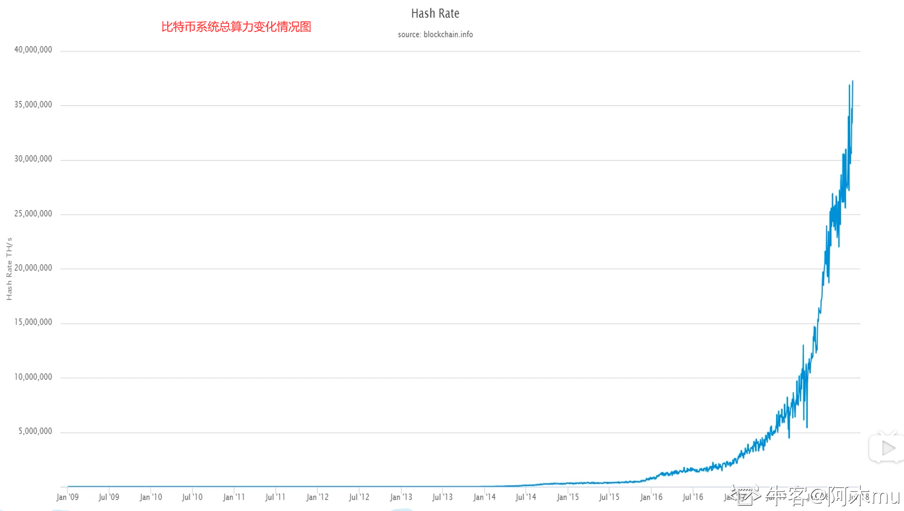

2. 挖矿难度变化图
> 可以看到，和系统算力变化情况基本同步（符合难度调整预期目标）

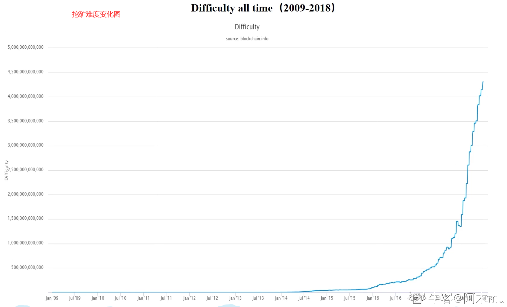

> 思考：挖矿难度变低是好事吗？
> 对于矿工来说，挖矿难度变低，挖矿变得更容易，这也说明大多数人对该币种不再看好，这个币种的价值也会大跳水，这对矿工来说可是一个坏消息。

3. 2010-2018 每天出块时间图
> 可见基本维持在10min左右上下波动，达到预期设计目标

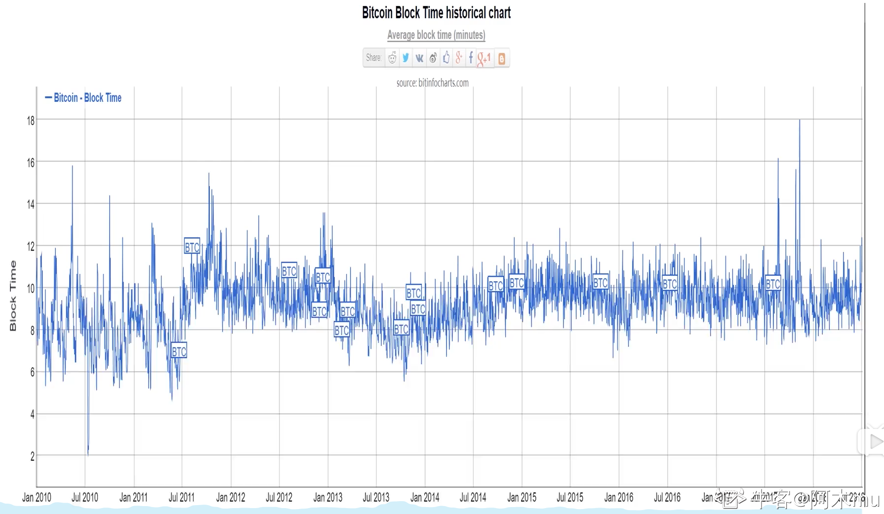

## 第八讲：BTC挖矿篇

> 在之前的文章，已经基本上介绍完了比特币系统的原理。本篇，将对之前内容简单总结并说明目前挖矿出现的趋势。

### 全节点和轻节点

> 之前提到，由于硬件限制，BTC系统中分为轻节点和全节点，下表阐述了全节点和轻节点的区别

| **特性**                          | **全节点**                                   | **轻节点**                                   |
|-----------------------------------|---------------------------------------------|---------------------------------------------|
| **在线状态**                      | 一直在线                                    | 不是一直在线                                |
| **区块链数据存储**                | 在本地硬盘上维护完整区块链信息              | 不保存整个区块链，只需要保存每个区块块头    |
| **UTXO 集合**                     | 在内存中维护 UTXO 集合，以便快速检验交易合法性 | 不保存全部交易，只保存和自己有关的交易      |
| **交易验证**                      | 监听比特币网络中交易内容，验证每个交易合法性 | 无法验证大多数交易合法性，只能检验和自己相关的交易合法性 |
| **区块打包**                      | 决定哪些交易会打包到区块中                  | 无法检测网上发布的区块正确性                |
| **区块验证**                      | 监听其他矿工挖出的区块，验证其合法性        | 可以验证挖矿难度                            |
| **挖矿**                          | 1. 决定沿着哪条链挖下去。 2. 当出现等长分叉，选择哪一个分叉 | 只能检测哪个是最长链，不知道哪个是最长合法链 |

在比特币网络中，大多数节点都是轻节点。如果只是想进行转账操作，不需要挖矿，就无需运行一个全节点。在挖矿过程中，如果监听到别人已经挖出区块延申了最长合法链，此时应该立刻放弃当前区块，在本地重新组装一个指向最后这个新合法区块的候选区块，重新开始挖矿。

#### 1. 这样是不是有些可惜？之前花费好多资源，全部白挖了。

实际上并不可惜。之前文章中提及，挖矿本身具有无记忆性，前面无论挖多久，对后续继续挖矿没有影响。

#### 2. 比特币系统如何安全性？

一是密码学的保证：别人没有自己的私钥，就无法伪造其合法签名，从而无法将其账户上BTC转走。（前提：系统中大多数算力掌握在好人手中）
二是共识机制：保证了恶意交易不被系统承认。

### 挖矿设备演化

目前，挖矿设备逐渐趋于专业化，其经历了三个过程，总体趋势从通用到越来越专用。
普通CPU -> GPU ->ASIC芯片（挖矿专用矿机）

> 实际上，挖矿本身就是计算，对于普通计算机来说，挖矿过程中大多数内存、硬盘、CPU中大多数部件（用到指令较少）等都是闲置的，如果用普通计算机专门用于挖矿是根本不划算的。随着挖矿难度提高，用通用计算机挖矿很快变得无利可图。
> 所以，挖矿设备转入第二代——GPU(主要用于大规模并行计算，如：深度学习)。但是，用GPU挖矿，仍然有一定浪费(GPU为通用并行计算设计，挖矿仍然有很多部件闲置。例如：浮点数运算部件，挖矿过程只使用整数操作，该部分部件根本不会用到)。

GPU价格上涨，仅仅是深度学习火热导致的吗？实际上，很多GPU被用于了挖矿。

> 当然，目前GPU挖矿也已经不划算了（目前一些新开发货币仍然用GPU挖矿）。所以，开始进入第三代设备：ASIC芯片（专门为挖矿设计的芯片），这种芯片专门为挖矿设计，只能用于特定币种的挖矿。
> 但ASIC芯片设计、流片流程很长，假如BTC价格剧烈变化，前期投入很可能会血本无归。所以，ASIC芯片需要提前预订。假如BTC系统中，算力突然很猛烈增加，一般是一个大的厂商生产出新的ASIC矿机。

ASIC芯片只能用于挖矿，一旦其过时，便完全作废。

#### ASIC芯片的出现是好事吗？
很明显，ASIC芯片并不是普通人可以参与的，一定程度上提升了挖矿的门槛，违背了比特币系统去中心化的初衷。理想状态下，所有人用CPU挖矿，这样只要有一台家用计算机便可以参与挖矿。当然，后续有一些货币便考虑到了这个问题，设计了抗ASIC芯片化的解决方案，后续介绍以太坊时会对这种方案进行介绍。
但反过来想，如果大家都用ASIC矿机挖矿，如果有人想要颠覆BTC系统，必然会导致BTC价格跳水，从而导致其所购买ASIC矿机作废，投入成本血本无归。所以，很多人反倒认为ASIC芯片出现，一定程度上并不是坏事。

### 大型矿池出现

> 挖矿另一个趋势便是大型矿池的出现。对于单个矿工来说，即使使用了ASIC矿机，其算力在整个系统中仍然只占据很少一部分，即使从平均收益看有利可图，但收入很不稳定。
> 此外，单个矿工除挖矿还要承担全节点其他责任，造成了算力的消耗。

因此，为了解决这些问题，便引入了**矿池**的概念。
矿池的架构如下图，通常是一个全节点驱动多台矿机。矿工只需要不停计算哈希值，而全节点其他职责由矿主来承担。ASIC芯片只能计算哈希值，不能实现全节点其他功能。此外，矿池出现解决了单个矿工收益不稳定的问题。当获得收益后，所有矿工对收益进行分配，从而保证了收益的稳定性。

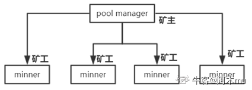

> 所以，必须涉及如何分配的问题。如果分配不公平，挖矿的动力就会减少。

矿池一般具有两种组织形式:
1. 类似大型数据中心（同一机构），集中成千上万矿机进行哈希计算。
2. 分布式。 矿工与矿主不认识(不同机构)，矿工与矿主联系，自愿加入其矿池，矿主分配任务，矿工进行计算，获得收益后整个矿池中所有矿工进行利益分配。

### 矿池利益分配方法

假使第二种情况，矿工来源于五湖四海（非同一机构），收益应该如何分配？

1. 思路一：平均分配，所有人平分出块奖励。

这一点有些类似我国某段历史时期，大家一起"吃大锅饭"，会导致某些矿工懈怠，不干活（挖矿要费电，需要成本）。
所以，这里也需要进行按劳分配，需要一个工作量证明的方案。如何证明每个矿工所作的工作量呢？

2. 思路二：降低挖矿难度（可行方案）。

假设原本挖矿难度要求，计算所得126位的哈希值前70位都必须为0，现在降低要求，只需要前60位为0，这样挖矿会更容易挖到。当然，这个哈希是不会被区块链所承认的，我们将其称为一个share，或almost valid share。矿工每挖到一个share，将其提交给矿主，矿主对其进行记录，作为矿工工作量的证明。等到某个矿工真正挖到符合要求的的区块后，根据所有矿工提交的share数量进行分配。
因为每个矿工尝试的nonce越多，挖到矿的可能性越大，所能得到的share也会越多，所以这种方案作为工作量证明方案是可行的。

::: info 思考
**思考一**：有没有可能，某个矿工平时正常提交share，但真正挖到区块后不提交给矿主而是自己偷偷发布出去，从而避免他人分走挖矿所得到的出块奖励？

事实上，这种情况是不可能的。因为每个矿工挖矿任务是矿主分配的。矿主组装区块，交给矿工计算，而区块中铸币交易的收款人地址是矿主，如果矿工修改该地址，计算的nonce值也会作废。

**思考二**：如果矿工自己刚开始就自己偷偷组装一个区块，自己挖矿，这样就类似于其脱离了该矿池呢?

因为其自己所组织的区块不会被矿主所认可，其提交的share也不会被认可，也就得不到分配的收益。

**思考三**：有没有可能矿工捣乱？平时提交share，等挖到后扔掉区块，不提交？

这种可能是有的，如果矿工本身仅仅想捣乱，是可以这么做的。但扔掉区块后，对其本身来说，也没有相应的奖励获得，看似是损人不利己的情况。
但是，矿池之间存在竞争关系。有可能为了打击竞争对手，会派出矿机加入竞争对手矿池挖矿，从而起到搞破坏的作用。即只参与其他矿工挖矿分红，自己挖到的区块却丢掉不给他人分。

:::

### 关于矿池的一些统计数据（图片源自肖老师课程视频）
- 图1：矿池在各个国家分布比例图(2018年)

> 可见，中国所占矿池比例远远超过其他国家。

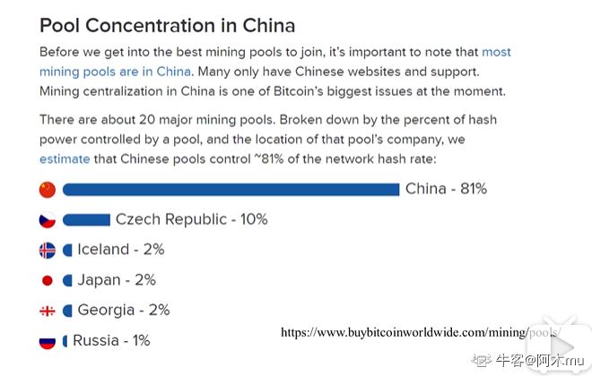

- 图2：2014年图单个矿池算力分布比例图

这个时间，存在一个矿池(GHash.IO)算力比例占据全部算力一半以上，当时引起了恐慌(一个矿池就可以发动51攻击)。之后，该矿池主动降低了矿池算力（化整为零，实际上仍然存在发动51攻击能力），避免动摇人们对比特币信心。

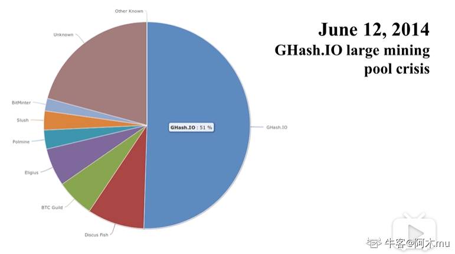

- 图3：2018年图单个矿池算力分布比例图
表面看上去是安全的，但实际实上某个机构如果有超过50%算力，其必然不会将其放入一个矿池中。而是将其分散隐藏，真正需要发动攻击时候再集中起来发动51攻击（注意：矿工转换矿池是很容易的）。

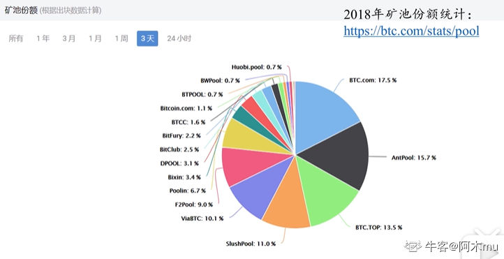

::: info 信息
由这些数据可以得知，矿池本身对BTC系统带来了较大威胁。某个恶意用户如果想发动攻击，以前需要自己达到51%算力，现在自己只需要作为矿主，只需要很少一部分算力就可以了。只要能够吸引到足够多的不明真相的矿工，便可以用较低成本实现51攻击。

当然，矿主经验管理矿池，也需要收取一定比例(出块奖励、交易费)作为管理费用。如果恶意者想要攻击系统，会将管理费降低甚至赔本吸引足够多矿工加入。这便使得发动51%攻击变得容易了起来。
:::

### 51%算力矿池可以发动哪些攻击

1. 分叉攻击
对已经经过6次确认的交易分叉，利用51%算力将交易记录回滚。
> 矿工只能计算哈希值，并不知道区块包含哪些交易，区块链状况是什么。所以，这些“群众”是无知的，容易被利用（《乌合之众》当中提出的观点，大多数人真的就能掌握真理吗？）。
此外，51%攻击只是一个概率问题，并非达到51%算力就能发动攻击，不能达到就无法发动攻击。此外，矿池本身算力也是在不断变化的。

2. 封锁交易
假如攻击者不喜欢某个账户A，不想让A的交易上区块链，在监听到有其他人将A的交易发布到区块链上时，立刻发动分叉攻击，使A所在链无法成为”最长合法链“。这样，便实现了对A账户的封锁。
> 像不像即当裁判又当运动员？”堂下何人状告本官“？

3. 盗币（将他人账户BTC转走）
这个是不可能的，因为其并没有他人账户私钥。如果依仗算力强，强行将没有签名的转账发布到区块链，正常节点不会认为其合法，这样，即使这条链再长，其他人也不会认为其是最长合法链。

### 矿池出现的优劣

- 优点：解决了矿工收入不稳定的问题，减轻了矿工的负担。
- 缺点：威胁到了区块链系统的安全，使得51%攻击变得容易起来（s）。

## 第九讲：BTC脚本篇

### 交易实例

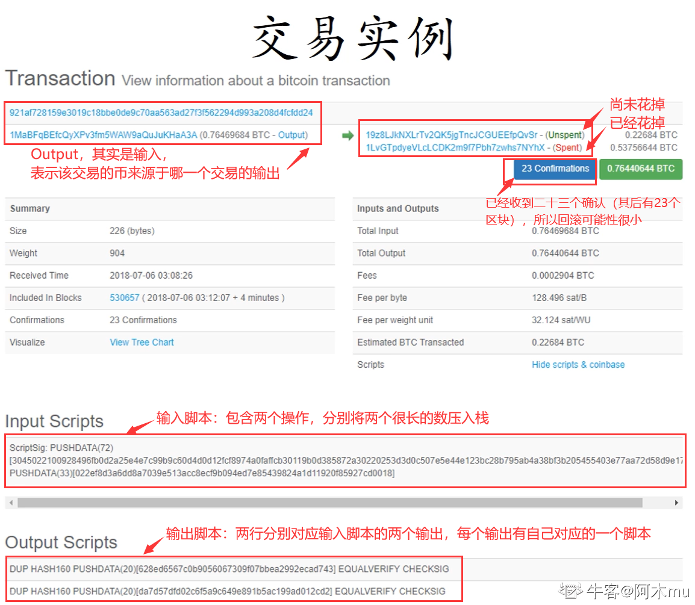

> 比特币系统中使用的脚本语言非常简单，唯一可以访问的内存空间只有栈，所以也被称为“基于栈的语言”

交易的宏观信息：

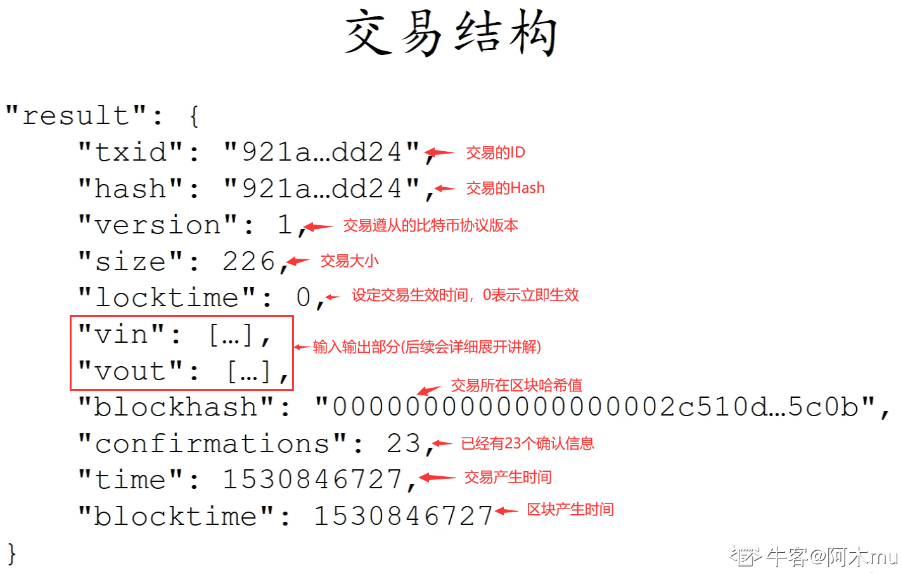

- Vin的内容：

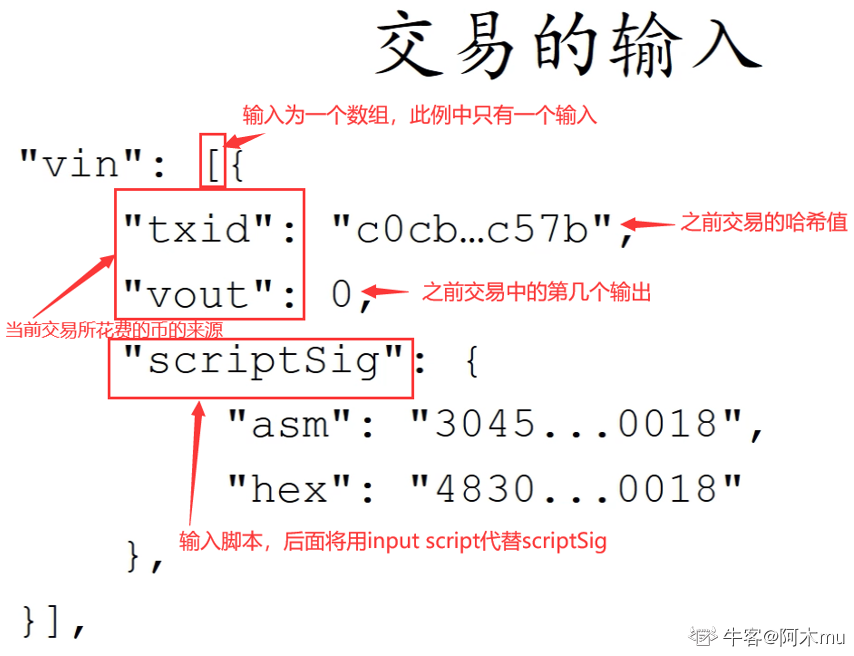

> 如果存在 一个交易有多个输入，那么每个输入都要说明币的来源并给出签名（BTC中一个交易可能需要多个签名）

- Vout的内容：

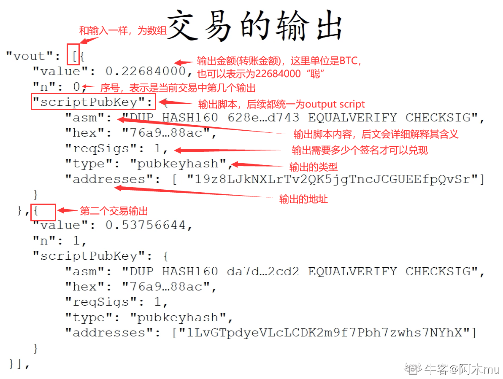

### 输入输出脚本的执行

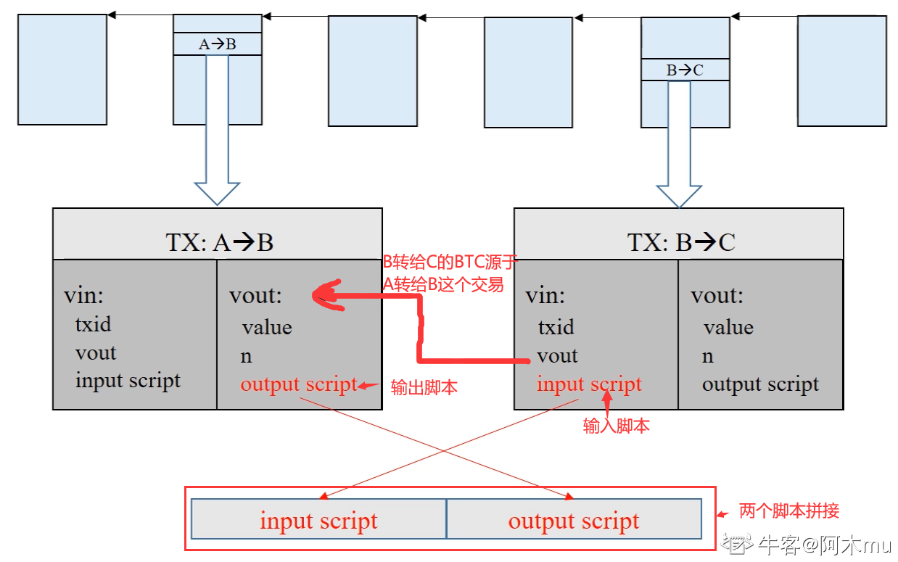

如图所示，为脚本执行流程。在早期，直接将两个脚本按照如图顺序(`input script`在前，`output script`在后) 拼接后执行，后来考虑到安全性问题，两个脚本改为分别执行：先执行`input script`，若无出错，再执行`output script`。
如果脚本可以顺利执行，最终栈顶结果为true，则验证通过，交易合法；如果执行过程中出现任何错误，则交易非法。
如果一个交易有多个输入脚本，则每个输入脚本都要和对应的输出脚本匹配执行，全部验证通过才能说明该交易合法。

### 输入输出脚本的几种形式

- P2PK形式(Pay to public key)

> 特点：输出脚本直接给出收款人公钥。(CHECKSIG为检查签名操作)

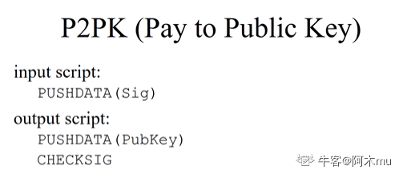

执行过程(将两个脚本拼接起来)：

> 注：实际执行已经不再拼接两个脚本

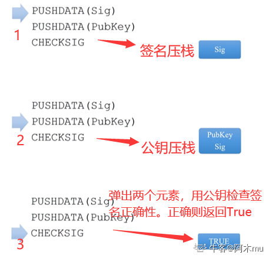

#### 实例：

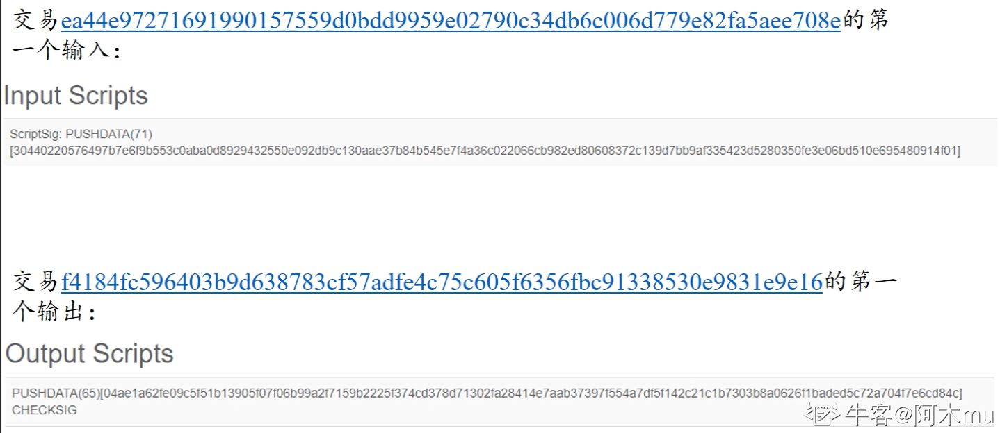

- P2PKH形式(Pay to public key hash)——最常用
> 特点：输出脚本不直接给出收款人公钥，而是公钥的哈希。

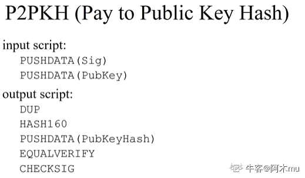

执行过程(将两个脚本拼接起来)：
> 注：实际执行已经不再拼接两个脚本

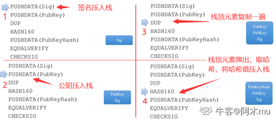
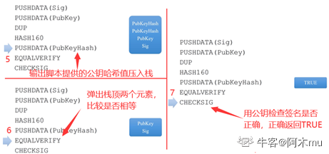

::: info 说明

- 1.图中第5步，两个公钥哈希是不同的。上面一个是输出脚本提供的收款人的哈希，下面一个是要花钱时候输入脚本要给出的公钥通过HASH160操作得到的。
- 2.图中第6步，该操作的目的是为了防止冒名顶替(公钥)。假设比较正确，则两个元素消失（不往栈中压入TRUE或FALSE）。
- 
:::

#### 实例

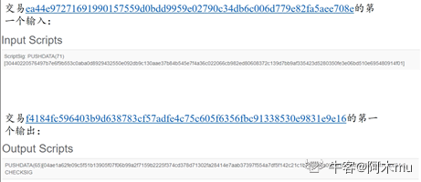

- `P2SH`形式(`Pay to script hash`)

> 特点：输出脚本给出的不是收款人公钥的哈希，而是收款人提供的一个脚本的哈希。该脚本称为`redeemScript`,即赎回脚本。等未来花钱的时候，输入脚本要给出redeemScript的具体内容以及可以使之正确运行需要的签名。

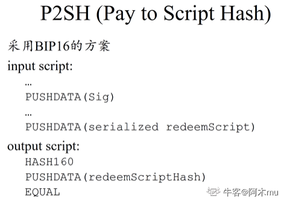

验证过程：
1.验证序列化的`redeemScript`是否与`output script`中哈希值匹配。
2.反序列化并执行`redeemScript`，验证`input script`中给出签名是否正确。（将赎回脚本内容当作操作指令执行一遍）

`redeemScript`的形式：
1.P2PK形式
2.P2PKH形式
3.多重签名形式

实例：

实例1：用P2SH实现P2PK

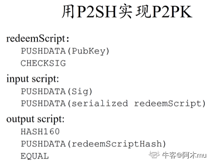

运行过程：

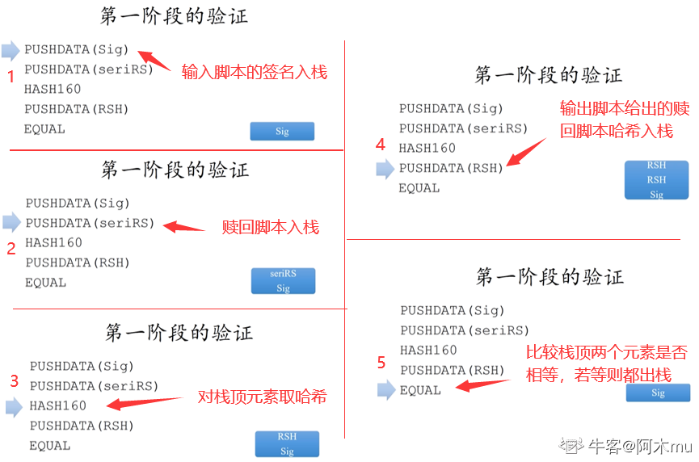
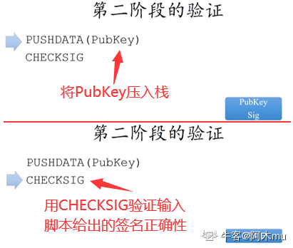

第一阶段执行拼接后的输入和输出脚本。
第二阶段执行反序列化后的赎回脚本（反序列化操作并未展现，因为其是每个节点需要自己执行的）

> 为什么要弄这么复杂？用之前介绍的P2PK不就可以了吗？为什么要将这部分功能嵌入到赎回脚本？
毫无疑问，针对这个例子，这样做确实复杂了。实际上P2SH在BTC系统中起初并没有，后来通过软分叉(后续会有一篇文章专门介绍硬分叉和软分叉)加入了这个功能。实际上，该功能的常见应用场景是对多重签名的支持。
在BTC系统中，一个输出可能需要多个签名才能取出钱来。例如，对于公司账户，可能会要求5个合伙人中任意3个的签名才能取走钱，这样便为私钥泄露和丢失提供了一定程度的保护。

#### 多重签名
下为最早的多重签名实现方法：
该方法通过`CHECKMULTISIG`来实现，其中输入脚本提供N个签名，输 出脚本给出N个公钥和阈值M，表示N个人至少有M个签名即可实现转账(`N>=M`)。输入脚本只需要提供N个公钥中M个合法签名即可。【给出的M个签名顺序要和N个公钥中相对顺序一致】

> 输出脚本最前面有一个红色的X，是因为比特币中`CHECKMULTISIG`的实现存在一个bug，执行时会从堆栈上多弹出一个元素。这个bug现在已经无法修改(去中心化系统中软件升级代价极大，需要硬分叉修改)。所以，实际中采用的方案是往栈中多压入一个无用元素。
> 
> 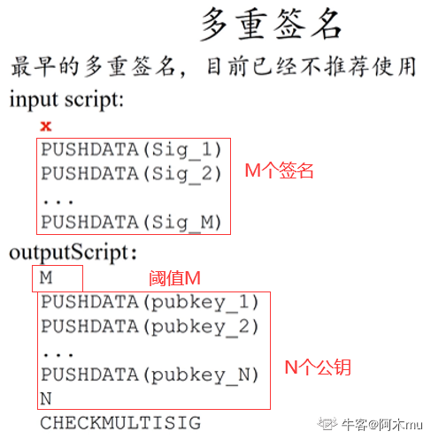
>

执行实例：
如图为一个`N=3，M=2`的多重签名脚本执行过程。其中前三行为输入脚本内容，后续为输出脚本内容。

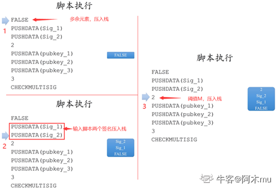
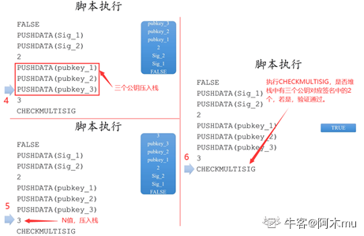

>早期的实际应用中，多重签名就是这样写的。但是，在应用中体现出了一些问题。例如，在网上购物时候，某个电商使用多重签名，要求5个合伙人中任意3个人才能将钱取出。这就要求用户在生成，转账交易时候，要给出五个合伙人的转账公钥以及N个M的值。而对于用户来说，需要购物网站公布出来才能知道这些信息。不同电商对于数量要求不一致，会为用户转账交易带来不便之处(因为这些复杂性全暴露给了用户)。
为了解决这一问题，就需要用到`P2SH`

如图为使用`P2SH`实现多重签名

>本质上是将复杂度从输出脚本转移到输入脚本，可见此时输出脚本只有三行，原本复杂度被转入到赎回脚本redeemScript中。输出脚本只需要给出赎回脚本的哈希值即可。该赎回脚本在输入脚本提供，即收款人提供。
这样做，类似之前提到的电商，收款人只需要公布赎回脚本哈希值即可，用户只要在输出脚本中包含该哈希值，用户无需知道收款人的相关规则(对用户更加友好)

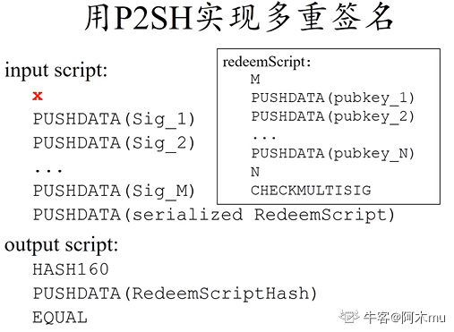

具体运行过程：

第一阶段验证（输入输出脚本）：

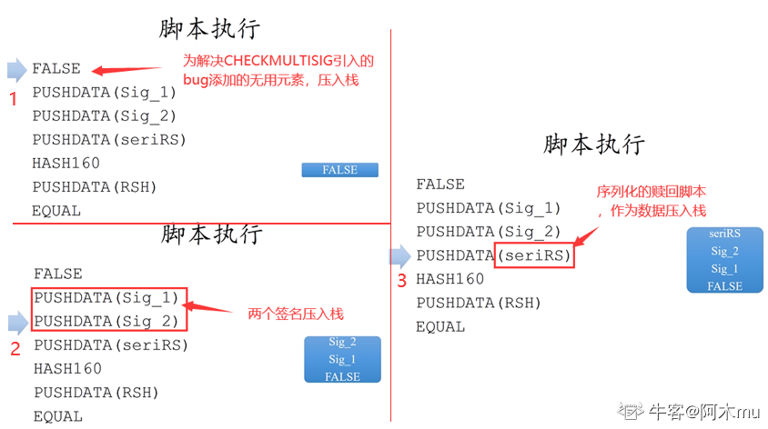
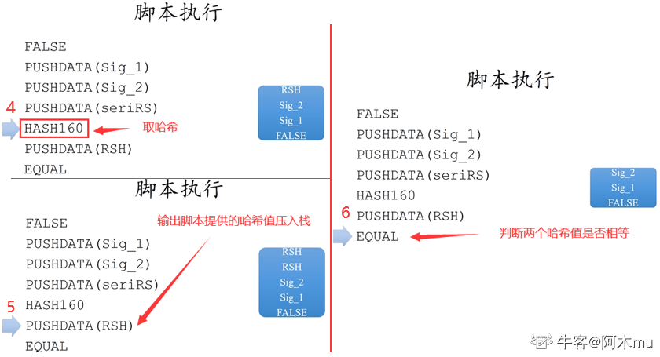

第二阶段验证（赎回脚本）：

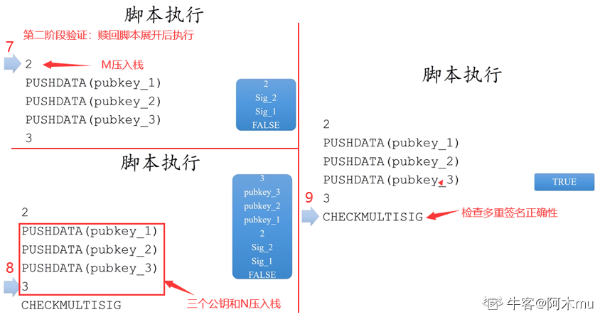

实例：

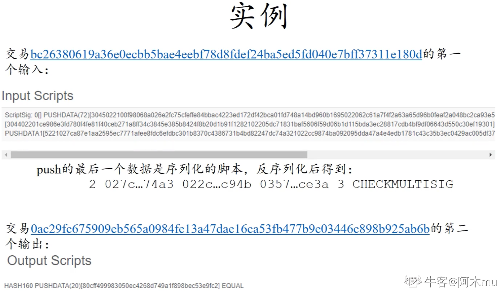

> 现在的多重签名，大多都采用P2SH的形式

### 一个特殊的脚本

以`RETURN开`始，后面可以跟任何内容。
`RETURN`操作，无条件返回错误，所以该脚本永远不可能通过验证。执行到`RETURN`，后续操作不会再执行。
该方法是销毁比特币的一种方法。

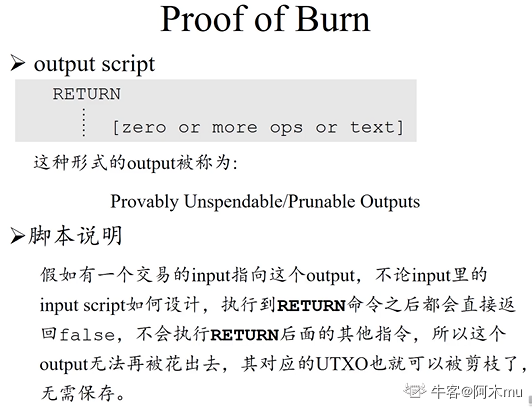

>Q：为什么要销毁比特币？？？现在比特币价值极高，销毁是不是很可惜？
>
> 1.部分小币种(AltCoin)要求销毁部分比特币才能得到该种小币种。例如，销毁一个BTC可以得到1000个小币。即，使用这种方法证明付出了一定代价，才能得到小币种。
> 2.往区块链中写入内容。我们经常说，区块链是不可篡改的账本，有人便利用该特性往其中添加想要永久保存的内容。例如：股票预测情况的哈希、知识产权保护——知识产权的哈希值（防止***）。

有没有觉得第二个应用场景有些熟悉？实际上，之前谈到BTC发行的唯一方法，便是通过铸币交易凭空产生（数据结构篇中）。在铸币交易中，有一个CoinBase域，其中便可以写入任何内容。那么为什么不使用这种方法呢，而且这种方法不需要销毁BTC，可以直接写入。

因为这种方法只有获得记账权的节点才可以写入内容。而上面的方法，可以保证任何一个`BTC`系统中节点乃至于单纯的用户，都可以向区块链上写入想写入的内容。**【发布交易不需要有记账权，发布区块需要有记账权】**
任何用户都可以使用这种方法，通过销毁很小一部分比特币，换取向区块链中写入数据的机会。实际上，很多交易并未销毁BTC，而是支付了交易费。
例如下图为一个铸币交易，其中包含两个交易，第二个交易便是仅仅想要往其中写入内容。

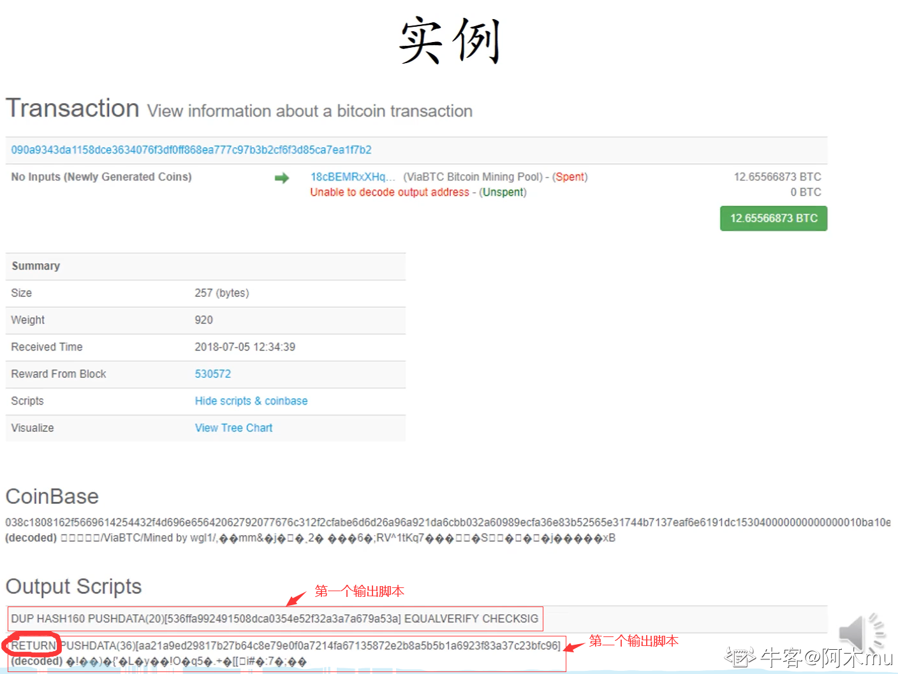

下图为一个普通的转账交易，其就是仅仅为了向区块链写入内容。该交易并未销毁BTC，只是将输入的费用作为交易费给了挖到矿的矿工。
这种交易永远不会兑现，所以矿工不会将其保存在`UTXO`中，对全节点比较友好。

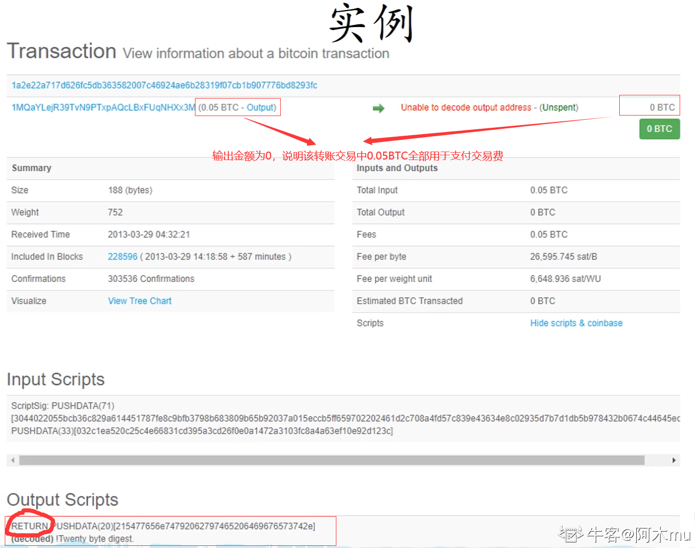

**实际中的脚本，都需要加上OP前缀，如：CHECKSIG应该为OP_CHECKSIG,这里仅仅为了学习友好，就删去了该前缀**

### 总结

`BTC`系统中使用的脚本语言非常简单，简单到没有一个专门的名称，我们就称其为”比特币脚本语言“。而在后文的以太坊的智能合约中，则比此复杂得多。实际上，该脚本语言甚至连一般语言中的循环都不支持，但设计简单却也有其用意。
如果不支持循环，也就永远不会出现死循环，也就不用担心停机问题。而在以太坊中，由于其语言图灵完备，所以要依赖于汽油费机制来防止其陷入死循环。此外，该脚本语言虽然在某些方面功能很有限，但另外一些方面功能却很强大(密码学相关功能很强大，可能中本聪本人擅长于密码学？？？)
例如，前文提到的`CHECKMULTISIG`用一条语句便实现了检查多重签名的功能。这一点与很多通用编程语言相比，是很强大的。

## 第十讲：BTC分叉篇

::: info  介绍

本节介绍比特币系统中的分叉(`fork`)

分叉指的是，原来的系统中为一条链，但分成了两条链。分叉形成的原因可能有多种，例如：挖矿时两个节点差不多同时挖出矿，都会发布区块(对比特币系统当前状态产生分歧导致的分叉——`state fork`)；分叉攻击，同样也会导致分叉(`forking attack`，人为故意造成)；比特币协议改变，在分布式系统中不能保证所有节点同时升级软件，假设存在少数节点未升级，导致出现分叉(`protocal fork`)；

根据对比特币协议修改的不同，可以将分叉分为硬分叉和软分叉。

很多人都听说过硬分叉和软分叉，但对其实际含义并不了解，本篇便专门介绍比特币系统中的分叉。

:::

### 硬分叉(`hard fork`)

>什么情况会出现硬分叉？
>
> 对比特币协议增加新协议，扩展新功能，未升级软件的旧节点会不认可这些修改，会认为这些特性是非法的。这也就是对比特币协议内容产生分歧，从而导致分叉。
> 硬分叉的一个典型例子，就是对比特币区块大小的修改（之前有提到过，BTC区块大小限制1MB，但是否合适存在争议）

在BTC系统中，区块大小最大为1MB，可以包含的交易最大数量为4000笔左右。而一个区块产生大概需要10min左右，也就是说，整个比特币系统，平均每10分钟最多只能处理4000笔交易(平均每秒7笔交易)，相比目前银行等金融机构每秒数十万数百万的交易量来说，根本不在一个数量级上，严重影响吞吐率和交易处理(即上链)时间(因为交易太多，无法写入只能等待下一个区块)。
所以，有人便认为可以增大区块大小，使得一个区块中可以包含的交易数量增多，在此，**我们假设将区块大小从1MB增大至4MB**。

>假设系统中大多数节点更新了软件，少数节点仍然遵从1MB限制的协议(注意，这里大多数和少数是按照算力来区分的，和账户数量无关)。即：新节点认为区块大小最大4MB，旧节点认为区块大小最大1MB，且新节点占据大多数。**

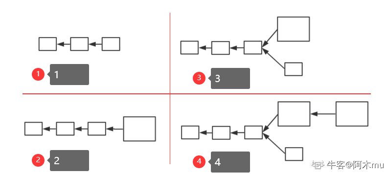

假设1为当前区块链，此时软件更新，有一个新节点挖出了一个区块如2。但对于旧节点来说，该区块为一个非法区块，旧节点不会对其认可，从而，旧节点仍然从其前一个区块开始挖矿，如3.
需要注意的是，旧节点挖出的区块，新节点是认可的(并未超过4MB限制)，所以对旧节点来说，3中下面的链才是合法链，而对新节点来说，这两条链都是合法的链。因为新节点算力强，所以出现4中情况可能性大。对于新节点来说，上面的为最长合法链，新节点便都会沿着上面的链继续挖；对于旧节点来说，上面的链无论多么长，都是一条非法链，不会认可该链，所以旧节点就会沿着下面的链继续挖矿。

此时，就出现了新节点永远沿着上面的链挖矿，旧节点永远沿着下面的链挖矿，由于新节点算力足够强，所以形成两条永远都在延伸且平行的链。当然，上面的链，也有可能会挖出大小在1MB内的小区块，但对旧节点来说，该链上存在非法区块，不会认可该链。可见，这种分叉是持久性的。

只要这部分旧节点永远不更新软件，下面的链便永远不会消失。

> 1.BTC社区中有些人很保守，不愿意加大区块大小 2.区块大小并非越大越好，在网络篇中提到，比特币网络传输为"尽力而为"，区块加大会造成传输变慢等问题。 3.单纯增加区块大小，对交易数量的增加远不能达到数量级的提升。

出现`hard fork`后，便变成了两条平行的链，也就造成了社区分裂。社区中有一部分人，会认为下面的链才是”正统“(根正苗红)，各个链上的货币独立。

>实际上，这个事情真正出现过。后续会介绍以太坊，以太坊历史上的一件大事就是硬分叉事件。以太坊称为ETH，但目前看到的ETH已经不是最初的ETH了，以太坊在历史上发生过硬分叉，另一个链称为ETC（和过高速公路那个ETC可半毛钱关系都没有呀）。实际上，ETC才是以太坊设计原本的协议，而ETH是黑客攻击ETH上一个智能合约THE DAO后进行回滚的协议链(将黑客攻击偷取的以太币采用硬分叉方式回滚回到另一智能合约，然后退还给真正拥有者)。
但是这次硬分叉的后果，由于有人不愿意这么做，造成了以太坊社区的分裂。实际上，虽然ETC不如ETH又名，但实际它也是目前一种主流货币。
分叉之初，由于两个链分叉造成了互相影响，产生了很多麻烦。比如：在ETH链上有一笔转账B->C，有人便在ETC链上回放，将ETC链上的货币页转给了C(C收到两笔钱)。后来，对两条链各添加了一个chainID，将两个链区分开，才使得这两条链真正分开。

### 软分叉（soft fork）

如果对BTC协议添加限制，使得原本合法交易在新交易中不合法，便会形成软分叉。

同样，有人想将区块大小调大，也就会有人思考调小的好处。在这里，我们假设将区块大小从1MB减小至0.5MB(实际中，1MB已经足够小，不会调小了).

> 需要注意的是，区块链中区块大小调整并非简单修改一个参数，调改大小便很有可能会引发分叉，由于参数修改方式不同，有可能会是硬分叉，也有可能是软分叉。。

> 假设系统中大多数节点更新了软件，少数节点仍然遵从1MB限制的协议(注意，这里大多数和少数是按照算力来区分的，和账户数量无关)。即：**新节点认为区块大小最大0.5MB，旧节点认为区块大小最大1MB，且新节点占据大多数。

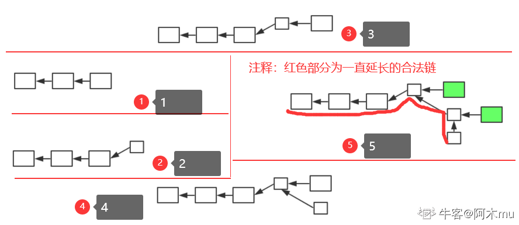

假设1为当前区块链，此时软件更新，有一个新节点挖出了一个区块如2。但对于旧节点来说，该区块符合1MB大小限制，旧节点对其认可，从而旧节点会沿着该新的小区块开始挖矿，如3.
但是新节点会认为该旧节点挖出区块超过0.5MB限制，为一个非法区块，不会认可该区块，会从其前一个小区块开始挖矿。如4所示。
而旧节点认可新区块，最终会造成5中的效果(绿色大节点为旧节点)，旧节点挖出的区块一直被抛弃，无法得到出块奖励(不在最长合法链上)。这就倒逼旧节点升级软件，最终会实现区块链上的所有矿工共同认可新协议，实现软件协议的升级。

需要注意的是，旧节点如果不升级软件，挖出的区块可能就白挖了(大于0.5MB)，但对于系统来说，不会存在永久性分叉。

### 系统中可能出现软分叉的情况及其实例

1. 给某些目前协议中未规定的域赋予新的含义或规则。
最经典的就是，铸币交易中`CoinBase`域。在`CoinBase`域中写入任何内容都可以，没有任何规定。之前，在介绍挖矿时，提到挖矿本质是调整`block header`中的`nonce`，但其本身只有4个字节，搜索空间太小。所以实际使用中，将`CoinBase`域前8个自己作为另一个`extra nonce`，此时搜索空间从原本2^32 增长到2^96，对于目前挖矿难度来说已经足够。
但CoinBase中并不是只有8个字节，还剩下很多空间。有人便提出将其作为UTXO(当前还没花掉的交易结合，在数据结构篇中有详细介绍，还记得吗？)集合的根哈希值。目前UTXO是全节点自己在本地为了方便查询自行维护的，但UTXO内容并未写入区块链（还记得Merkle proof吗？Merkle proof用于验证某个交易是否在区块中，Merkle proof的交易信息是写入区块链的。）
由于UTXO存在本地，如果查询某账户余额，轻节点便需要询问全节点，全节点根据UTXO中信息可以计算得到账户余额，但如何确保全节点给的数据可信？由于直接修改block header会造成硬分叉，有人便提出了以上的方案(该域刚好无人用)。
可以看到，旧节点认可新节点的区块，但新节点对于旧节点CoinBase域检查时候，发行并没有这个UTXO的根哈希值，不会认可其发布的区块，所以这是软分叉。

2. `P2SH：Pay to Script Hash`
还记得上一篇比特币脚本中该功能吗？上一篇中提到过，最初比特币版本中没有该功能，后来通过软分叉方法加入了进去。

### 总结

- soft fork
特点：只要系统中拥有半数以上算力节点更新软件，系统就不会产生永久性分叉

- hard fork
特点：必须系统中所有节点更新软件，系统才不会产生永久性分叉

## 第十一讲：BTC回顾问答篇

### 一些问题及其解答

1. 转账交易时候，如果接收者不在线(没有连在比特币网络上)怎么办？
转账交易只需要在区块链上记录，将某账户比特币转到另一账户，而接收方是否在线并无影响。

2. 假设某全节点收到某个转账交易，会不会有可能转账交易中收款人地址该全节点从未听过。
可能，因为比特币账户只需要本地产生即可。只有该账户第一次收到钱时，其他节点才能知道该节点的存在。

3. 如果账户私钥丢失怎么办？
没有办法。因为比特币是去中心化货币，没有第三方中心机构可以重置密码，所以账户上的钱也就变成了死钱。
通过加密货币交易所(中心化机构)，一般需要提供身份证明，如果忘记私钥可以找交易所申请追回私钥。但目前这类货币的交易所，尚且处于缺少监管的状态，并不一定具有可信力。而且，其本身仅起到“中介”作用，与该提问的回答“私钥丢失无法追回里面的比特币”并不冲突。
在历史上，有很多次交易所被黑客攻击偷走大量加密货币的事情，其中最著名的为Mt. GOX（中文译为：门头沟）事件。该交易所曾经为全球最大比特币交易所，交易量占到全球比特币交易量的70%左右，设于日本。后来由于被攻击丢失大量比特币，导致交易所破产，其CEO被判刑入狱。
此外，也有交易所监守自盗，工作人员卷款跑路(有点类似 rm -rf */ 删库跑路)。

4. 私钥泄露怎么办？
尽快将剩余BTC转到其他安全账户上，没有第三方中心机构重置密码或冻结账户，只能自己对自己负责。
BTC系统中账户便是公私钥对，密码就是私钥，无法更改。

5. 转账写错地址怎么办？
没有办法，只能自认倒霉，无法取消已经发布的交易。如果转入不存在地址，则该部分比特币便成为了死钱。当然，比特币系统中UTXO会永久保存该交易，记录该并不存在的地址。因此，对全节点来说，这是不友好的。

6. 之前在BTC脚本中介绍了OP_RETURN指令，我们提到，这种方法为普通用户提供了一个向比特币网络中写入想要一直保存的内容。但OP_RETURN执行结果是无条件返回错误，而交易返回错误，区块又怎么会包含它？区块链又如何会接收这个区块？

> 思想1：特殊机制，该脚本即使返回错误，仍然写入区块链。（实际并不是）
思想2：即使返回失败，仍然写入区块链，只是具体处理时候不计算其即可。(恶意节点大量抛出失败交易，攻击区块链怎么办？上一篇中提到，每秒平均只能处理7笔交易)
>

实际上，这里需要想清楚一个细节
要想清楚，`OP_RETURN`是写在哪里的。`OP_RETURN`实际写在当前交易的输出脚本中，而验证交易合法性时，使用的当前交易的输入脚本和前一个交易(币来源的交易)的输出脚本进行验证。
也就是说，验证当前交易合法性时，并不会执行该语句。只有在有人想花这笔钱时候，才会执行该语句。

7. BTC系统挖矿，会不会有矿工“偷”答案？例如：某个矿工发现其他矿工发布了nonce，收到后验证该区块合法，将该nonce作为自己找到的nonce发布出去。
   实际上这是不可能的。发布的区块中包含铸币交易，其收款人地址为挖到矿的矿工地址，如果要偷答案，需要修改该收款地址，而地址改变，铸币交易内容也发生改变，从而引发Merkle Tree根哈希值改变。从而导致原本的nonce作废。也就是说，不可能会“偷”答案。

8. 交易费是交易者为了自己交易可以上链而给出的“小费”，那么如何得知哪个矿工可以挖到矿？
   事先无需知道谁会挖到矿，交易中总输入和总输出差额就是交易费。哪个矿工挖到矿，在打包交易时，可以将这些交易费收集起来作为自己获得的交易费。

### BTC的统计数据

- 图1：BTC区块链大小变化情况(至2018年)
因为区块链只能添加，不能删除。对于当前硬盘内容来说，保存其没有问题。

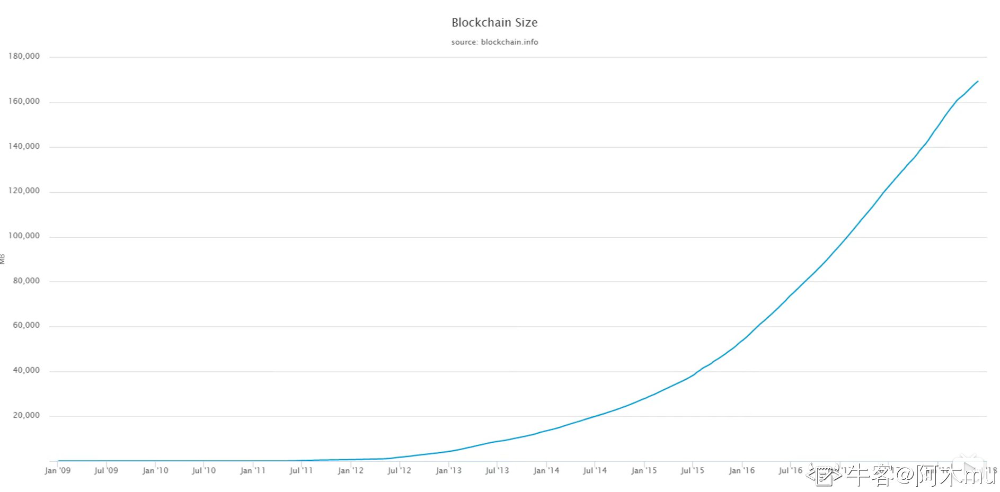

- 图2：UTXO集合大小变化情况(至2018年)
交易增多，私钥丢失等都会导致UTXO增大。

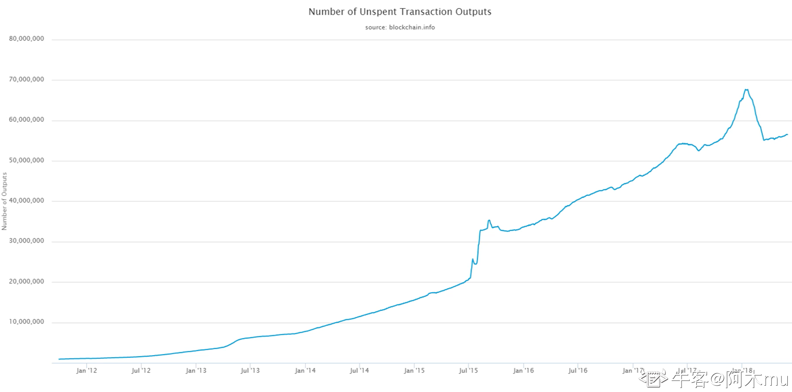

- 图3：BTC矿池挖矿情况(至2018年)
集中化趋势严重！

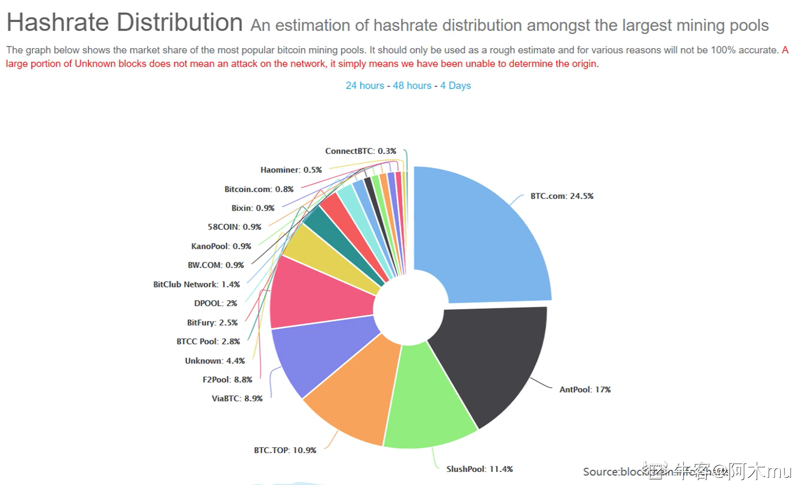

- 图4：BTC价格变化情况(至2018年)

- 图5：BTC市值变化情况(至2018年)
和图4基本保持一致

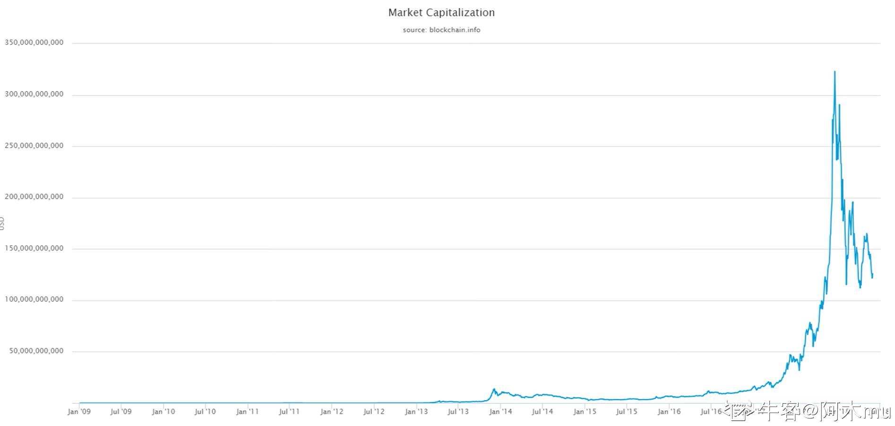

- 图6：BTC交易量变化情况(至2018年)——按照美元、价格计算得到
 
 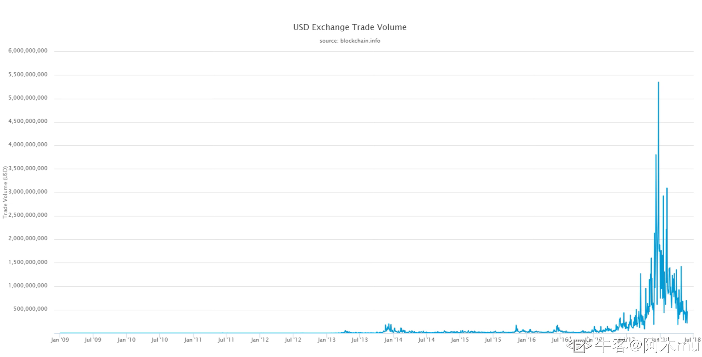

- 图7：BTC交易数目变化情况(至2018年)

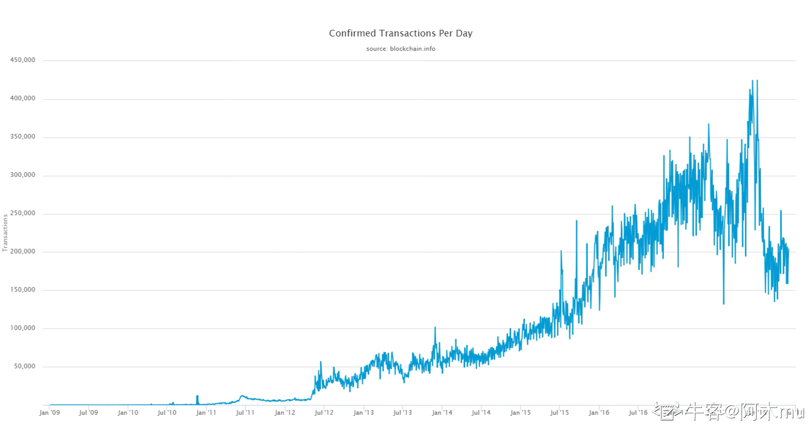

- 图8：每个区块交易数目变化情况(至2018年)
每天产生区块数量基本差不多，所以交易数目变化基本和区块包含交易数目变化趋势一致。  
可以看到，理论上限为每个区块可包含4000个交易，而该图中并远未达到上限。所以很多人说到的1MB区块太小，另一方面实际中很多区块没有装满。

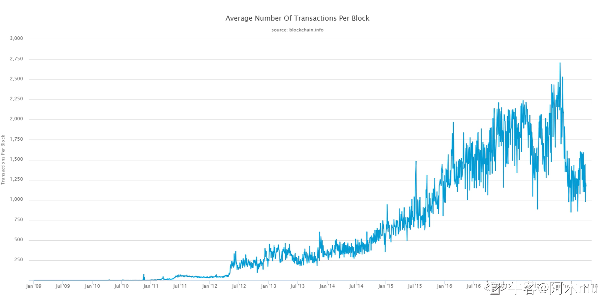

## 第十二讲：BTC匿名性篇1(匿名性分析)

::: info  说明

一般来说,匿名性多与隐私保护相关。但实际上，比特币中的匿名并非真正的匿名，而是假的匿名。实际上，比特币与纸币相比，纸币的匿名性更好，因为其并没有对个人信息的标记。也正是因为其匿名性，很多非法交易采用现金交易(银行风控系统了解一下？)。但现金存在保管、运输等各个方面的不便。

实际上，比特币中的数据是完全公开的，而网上的交易是要与实体世界进行交易的，所以大大破坏了其匿名性。假如银行允许用假名(以前的存折时代)，由于银行数据并非公开，所以银行系统的匿名性是要比比特币更好的。

:::

### BTC系统中什么情况会破坏其匿名性？

1. 用户可以生成多个地址账户，但这些地址账户可以被关联起来
   表面上看，每次交易可以更换公私钥对，从而每次都是新的账户，具有很强的匿名性。但实际上，这些账户在一定情况下，是可以被关联起来的。

例如下图，针对这样一个交易：

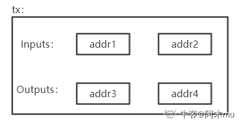

在图中可以看到该交易有2个输入和两个输出，所以addr1和addr2很可能是同一个人所持有的账户，因为该人同时拥有这两个私钥的地址。(一个账户中的钱可能不够)

而在输出中，很有可能有一个地址是属于找零钱的地址，即花掉之后剩余的钱。在某些情况下，也是可以分析出来的。

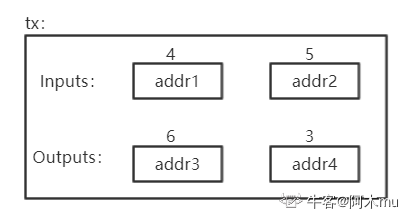

如上图，针对该交易，账户上面数字表示BTC，可以指导addr4很明显是找零钱的地址，而非addr3(支付6个比特币，单个账户不够用，所以用两个账户)。

2. 地址账户与个人在真实社会中的身份也可能会产生关联。
   任何使得BTC和实体世界中关联的操作都有可能泄露用户真实身份，其中最明显的就是资金的转入转出。要得到BTC，如果用钱买，就会与实体世界进行交互。想要将BTC转为现实中的货币，也同样需要与实体世界交互。

> 在很多国家，都有防洗钱法。如何防范不法分子采用BTC进行洗钱呢？其实很简单，只需要盯住资金转入转出链即可。对于大额资金转入BTC或将大量BTC转为现实货币，很难逃避司法金融机构的监管。

3. BTC支付时候
   例如某些商家接受用BTC进行支付，例如可以用BTC购买咖啡、蛋糕等。(这种场景信用卡已经解决的很好了，用BTC交易延迟高，交易费贵，并非一个好的idea)
   在进行支付时候，便和个人账户建立了联系，从而会泄露掉个人信息。

也就是说，BTC并不是具有很好的匿名信。实际中，很多人保持有较好的匿名性。保持最好的便是其开发者中本聪，其参与BTC时间最长，全世界都想知道他是谁。但实际上，中本聪的比特币并非有花出去，这也使得我们难以发现他具体是谁。

>以前美国有一个skil road网站，主要用于匿名支付，采用各类可以躲避监管的方法(因为售卖的都是违禁品)。但运行没有几年就被查封，其老板当时赚取了许多比特币，从纸面上看，已经实现了小目标(一个亿)。但由于其担心被发现，这些钱实际中一个都不敢花，在美国仍然过的是非常简朴的生活(《人民的名义》赵德汉：“我一个都没敢花.”)。最终据说由于在同一电脑上登录现实社会账户和非法网站上账户，从而被抓(具体原因未公开)。
skil road被查封后，有人开通了skil road2，运行没有几年又被查封。

因此，可见互联网并非法外之地。如果想要干坏事，基本都能被查到。

### BTC匿名性有多好？如何提高匿名性？

匿名的本质是不想要暴露身份。而对于普通人来说，BTC的现有机制已经足够保持个人隐私了。但如果涉及违法，行政机关想要获得真实身份，其实很容易。
那么可以采取哪些方法尽可能提高匿名性？

>从应用层看，可以将各个不同用户的BTC混合在一起，使得追查变得混乱(Coin mixing)；从网络层看，可以采用多路径转发的方法，数据不直接发送出去，而是经过很多跳(洋葱路由的基本思想)。

实际上，暴露用户隐私正是由于区块链的公开性和不可篡改性。不可篡改性对于隐私保护，实际上是灾难性的。

## BTC匿名性篇2(零知识证明)

### 零知识证明
**零知识证明：一方（证明者）向另一方（验证者）证明某一个陈述是正确的，但不需要透露除该陈述是正确的之外的任何信息。**

例如：A想要向B证明某一账户属于A，这说明A知道该账户的私钥。但不可能通过A公布私钥的方法来证明，该账户确实属于A。因此，A可以产生一个账户签名，B通过公钥对签名进行验证。(实际上该证明是否属于零知识证明存在争议，因为泄露了用私钥产生的签名)

### 同态隐藏

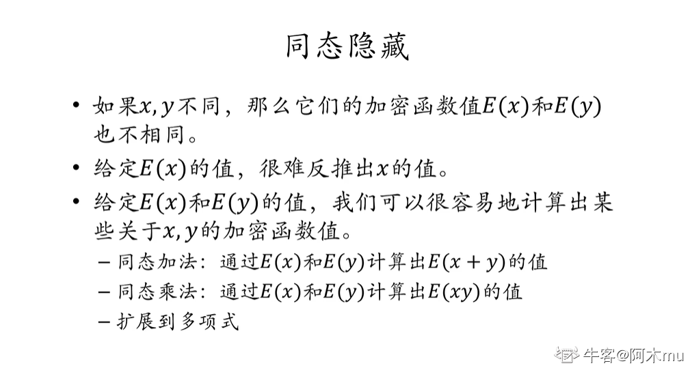

零知识证明的数学基础便是同态隐藏。上图为同态隐藏的三个性质。
- 第一个性质，说明如果有E(X)=E(y)，则必然有x=y。(无碰撞)
- 第二个性质，说明加密函数不可逆。知道加密值，无法反推出密码值。
- 第三个性质，最为重要，称为同态运算。说明对加密后的函数值进行某些代数运算，等价于对输入直接进行代数运算再加密。

>例子：

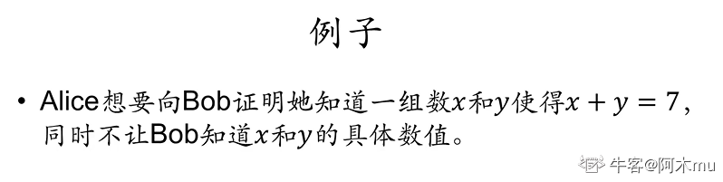

>其中证明者为Alice，验证者为Bob。最简单的证明版本如下：
1.Alice将E(x)、E(y)发给Bob。（性质2，不可逆）
2.Bob通过收到的E(x)、E(y)计算得到E(X+Y)。（性质3，同态加法）
3.Bob进行验证E(x+y)和E(7)是否相等。若相等则验证通过，否则验证失败。（性质1，无碰撞）
缺陷：Bob可以暴力获取x与y的值。

### 盲签

盲签名是一种特殊的数字签名技术。盲签名因签名的人看不到所签署文件的具体内容而闻名，它有两个显著的特点：一是签名者对消息的内容是不可见的 ;二是签名被公开后，签名者不能追踪签名。

>为什么要这么做呢？
例如电子交易中，我们的交易信息依赖于银行等第三方机构。第三方机构需要防范双花攻击等，就需要对电子货币进行签名。而签名的过程中，必然会导致其了解到交易内容。如果想要银行等第三方机构负责相应工作，但不知道交易具体内容，就可以采用盲签的方法。

例如A向B转账。

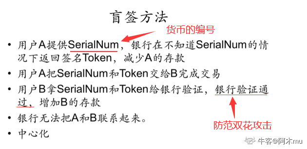

>既然了解到BTC提供了较好匿名性，但其无法完全消除关联性，那么如果想要这样一种货币怎么办？这就涉及了零币和零钞。

### 零币和零钞——专门为匿名性设计的货币

**零币和零钞**
- 零币和零钞在协议层就融合了匿名化处理，其匿名属性来自密码学保证。
- 零币(`zerocoin`)系统中存在基础币和零币，通过基础币和零币的来回转换，消除旧地址和新地址的关联性，其原理类似于混币服务。
- 零钞(`zerocash`)系统使用`zk-SNARKs`协议，不依赖一种基础币，区块链中只记录交易的存在性和矿工用来验证系统正常运行所需要关键属性的证明。区块链上既不显示交易地址也不显示交易金额，所有交易通过零知识验证的方式进行。

零币在花费的时候，只需要用零知识证明来证明所花掉的币是系统中存在的某一个合法的币，但不用透露具体花掉的是系统中哪一个币。这样就破坏了关联性。
当然，这类货币并非主流加密货币，因为其为了设计匿名性，付出了一定代价，而且，需要强匿名性的用户并不多。

从数学上看，零币和零钞是安全的。但其并不是百分之百的匿名，其并未解决与系统外部实体发生交互时对匿名性的破坏。

## 第十四讲：BTC思考篇

### 哈希指针

BTC系统中很多地方使用到了哈希指针。指针保存的本地内存地址，只有在本地计算机上才具有意义，如果发送给其他计算机就没有意义了。那么在区块发布时候，哈希指针如何通过网络进行传播？

> 所谓哈希指针，只是系统中一种形象化的方法。实际应用时候，只有哈希而没有指针。回顾之前提过的Block header数据结构：
> 
> 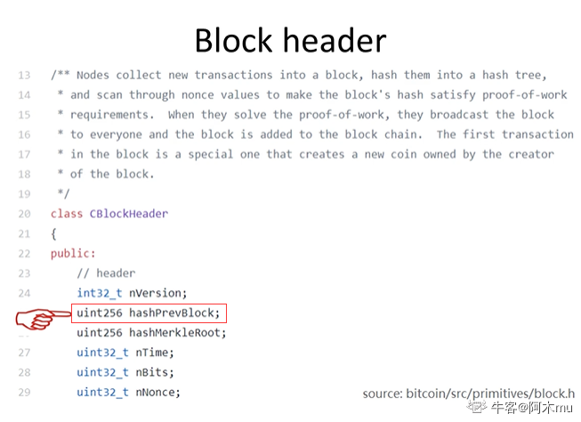
>
> 如图该处便为前一个区块的哈希值。

因此可见，在`block header`中只有hash值，没有指针。那么如何查找到前一个区块的内容？

全节点一般将区块存储于一个key-value数据库中，key为哈希，value为区块内容。常用的key-value数据库为levelDB，只要掌握到最后一个区块的哈希值即可依据哈希值一直往前找到区块链所有内容。  
有些节点只保存区块链部分信息，如果需要用到前面的区块，可以问其他节点要。哈希指针性质保证了整个区块链内容是不可篡改的。

### 区块“恋”

有情侣一起买BTC，将私钥从中截断，每人保留其中一部分。如果未来两人依旧感情很好，就可以将钱取出；如果分手，这部分钱就会永久锁死，谁也无法取出，通过区块链的不可篡改性作为两人的爱情见证。这样做有什么问题？
如此下来，N个人怎么办？
如果按照这种方法，将私钥分为N份。但这样会有一系列问题。一. 如果N个人中任意一个人忘记私钥，则无法将钱取出。二.截断私钥长度，会降低安全性，因为私钥长度会直接影响破解难度(2^256远远大于2^128)，之间难度差距远远不止一倍。【可见，对于多个人账户，应该使用多重签名，而非截断私钥的方法。】三.如果分手，该钱变成死钱，一直保存在UTXO集合中，对矿工不友好。

### 分布式共识
之前有提及，理论上来说，分布式系统不可能达成共识。但实际中为何变成可能了？严格来说，BTC系统***识随时可能被推翻，例如分叉攻击导致系统回滚。
此外，理论和实际存在差异。不可能结论针对特定模型，实际中对模型稍微修改或添加线下方法即可将不可能变为可能。

**知识改变命运，这句话本身没有错，但是对知识的一知半解可能让你的命运变得更差，搞科研是很有意义的，但是不要给学术界的思维限制头脑，不要为程序员的思维限制想象力。**

### BTC的稀缺性

为什么要挖矿？因为有收益，且收益大于开销。早期BTC难度低且出块奖励高，从而吸引矿工。  
之前有提到，BTC总量固定，有人认为其是一个精妙的设计。但实际上，总量固定的东西并不适合作为货币，这也就决定了BTC并不能在未来完全颠覆现有货币体系。以太坊中便没有BTC中出块奖励定期减半的做法，此外，某些新型货币会自带通货膨胀的功能。  
对个人来说，通货膨胀并非好事，因为钱不值钱了。但人类每年创造的价值，如果用总量固定的东西作为货币，则其只会越来越值钱，而这会导致拥有者不断看着其升值，其他没有的人无论如何奋斗都赶不上（房市也是如此，炒房使一部分人靠房租便可大赚特赚，个人奋斗却很难买房。这也是我国目前存在的较大的问题，社会财富的分配不公，最终引发各种社会矛盾，需要政府解决）。

### 量子计算

会不会BTC这种建立在密码学上的加密货币，在量子计算出来后会不会变得不安全。

- 一. 量子计算距离使用仍然有很长距离（人工智能也是，目前仍然处于弱人工智能阶段。其实很多技术都是如此，炒的情况很严重，但距离实用很远。但是不炒便不会有资本流入进行研究，这也是一个非常相悖的地方）。
- 二. 量子计算若真正使用到破坏现有加密算法，对传统金融业的破坏仍然是最大的。
- 三. 实际中使用的并非公钥，而是可以用公钥哈希。而哈希函数一般都是不可逆的，所以即使量子计算也无法反推私钥。

BTC中用的SHA-256，无论输入多大，最终结果都为256位，必然会导致信息丢失，无法反推原本数据。

总结：
- 加密可逆、哈希不可逆；
- 加密不损失信息、哈希破坏信息（加密和哈希的区别）