order: 4

:::tip
北京大学公开课《区块链技术与应用》由肖臻老师讲授,主要讲解区块链的基本概念和实现原理，面向广大对区块链技术和应用感兴趣的同学。通过这门课的学习，能够掌握比特币、以太坊等区块链技术的设计思路并有效解决实际问题。

[课程来源：https://www.bilibili.com/video/BV1Vt411X7JF/?vd_source=7138dfc78c49f602f8d3ed8cfbf0513d](https://www.bilibili.com/video/BV1Vt411X7JF/?vd_source=7138dfc78c49f602f8d3ed8cfbf0513d)

[博客地址：ttp://zhenxiao.com/blockchain/](http://zhenxiao.com/blockchain/)

笔记内容主要是根据老师课程来，笔记内容也博采众长，加上自己的理解和总结。

:::

一些笔记：
- 1、 [https://blog.nowcoder.net/n/30cbdb37108b4d93b3a5a93b8226ae31](https://blog.nowcoder.net/n/30cbdb37108b4d93b3a5a93b8226ae31)
- 2、 [https://cn.leapwhale.com/zh/article/me0uzckk](https://cn.leapwhale.com/zh/article/me0uzckk)

## 一、ETH概述篇

::: info  概述
`BTC`和`ETH`为最主要的两种加密货币，BTC称为区块链1.0，以太坊称为区块链2.0。之前文章中提出了比特币设计中存在某些不足，以太坊便对其进行了改进。例如：出块时间、共识协议、`mining puzzle`（对内存要求高，反ASIC芯片使用）
未来，以太坊还将会用权益证明(POS)替代工作量证明(POW)
此外，以太坊增加了对智能合约（`smart contract`）的支持。

:::

### 为什么要弄“智能合约”

BTC本身是一个去中心化的货币，在比特币取得成功之后，很多人就开始思考：除了货币可以去中心化，还有什么可以去中心化？以太坊的一个特性就是增加了对去中心化的合约的支持。  
如果说比特币系统本身是一个货币应用，以太坊则由于智能合约，升级成为了一个平台，用户可以依据该平台自行开发业务应用。

### 关于BTC和ETH
`BTC`的发明人为中本聪(疑似日本人)，`ETH`为`Vitalik Buterin`收到`BTC`启发发明出来的““下一代加密货币与去中心化应用平台””。BTC中货币最小单位为“聪”，最少的钱为一聪；ETH中货币最小单位为“Wei”，最少的钱为一Wei。

### 去中心化的合约

首先，讨论去中心化货币。货币本身由政府发行，政府公信力为其背书，BTC通过技术手段取代了政府的职能。
现实生活中，我们经常提到“契约”或“合约”。合约的有效性也是需要政府进行维护的，如果产生，需要针对合法性合同进行判决。ETH的设计目的就是，通过技术手段来实现取代政府对于合约的职能。
那么，去中心化的合约有什么好处？
若合同签署方并非一个国家，没有统一的司法部门（如：众筹）。如果可以编写无法修改的合约，所有人只能按照相关参与方执行，无法违约。

### 后续内容

后续内容会涉及到以太坊的数据结构、共识机制、挖矿算法(POW和POS)、智能合约。
具体内容，请关注后续文章。

## 二、ETH账户

BTC系统是基于交易的账本，系统中并未显示记录账户有多少钱，只能通过UTXO进行推算。但实际中，使用起来较为别扭。
A转给B钱的时候，需要说明币的来源。实际中只需要存钱说明来源，花钱则不用。此外，账户中的钱在花的时候，必须一次性全部花出去。

如图1，B收到A的10个BTC，他想要给C3个BTC，如果按照1中方式，其余7个比特币会以交易费的形式给挖出区块的矿工。  
因此，为了避免这种情况，便吸引采用2中方式，将3个BTC转给C，将剩余7个BTC转到自己的另一账户D上面。

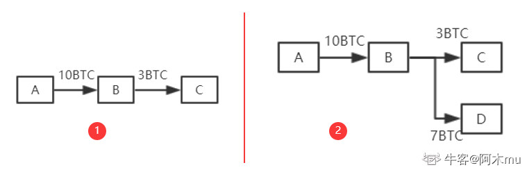

以太坊系统则采用了基于账户的模型，与现实中银行账户相似。系统中显示记录每个账户以太币的数量，转账是否合法只需要查看转账者账户中以太币是否足够即可，同时也不需要每次全部转账。同时，这也也天然地防范了双花攻击。
当然，以太坊发这种模式也存在缺点，这种模式存在重放攻击的缺陷。A向B转账，过一段时间，B将A的交易重新发布，从而导致A账户被扣钱两次。

>为了防范重放攻击，给账户交易添加计数器记录该账户交易过多少次，转账时候将转账次数计入交易的内容中。
系统中全节点维护账户余额和该计数器的交易数，从而防止本地篡改余额或进行重放攻击。

以太坊系统中存在两类账户：外部账户和合约账户。

1. 外部账户：类似于BTC系统中公私钥对。存在账户余额`balance`和计数器`nonce`
2. 合约账户：并非通过公私钥对控制。(不能主动发起交易，只能接收到外部账户调用后才能发起交易或调用其他合约账户)其除了`balance`和`nonce`之外还有`code`(代码)、`storage`(相关状态-存储)  
   创建合约时候会返回一个地址，就可以对其调用。调用过程中，代码不变但状态会发生改变。

为什么要做以太坊，换基于账户的模型？  
比特币中支持每次更换账户，但以太坊是为了支持智能合约，而合约签订双方是需要明确且较少变化的。尤其是对于合约账户来说，需要保持稳定状态。

## 三、ETH数据结构篇1(状态树1)

::: info 

在以太坊中，有三棵树的说法，分别是状态树、收据树和交易树。了解了这三棵树，就弄清楚了以太坊的基础数据结构设计。
而以太坊实现的是一个"平台性"的应用，其复杂性必然较高。因此，其内部数据结构设计也存在一定复杂度。对此，ETH数据结构篇将花费较多篇幅进行编写，请继续关注后续内容。

:::

前一篇文章中有提过，以太坊采用基于账户的模式，系统中显式记录每个账户的余额。而以太坊这样一个大型分布式系统中，是采用的什么样的数据结构来实现对这些数据的管理的。

### 引入

首先，我们要实现从账户地址到账户状态的映射。在以太坊中，账户地址为160字节，表示为40个16进制数额。状态包含了余额(`balance`)、交易次数(`nonce`),合约账户中还包含了code(代码)、存储(stroge)。  

- 直观地来看，其本质上为`Key-value`键值对，所以直观想法便用哈希表实现。若不考虑哈希碰撞，查询直接为常数级别的查询效率。
  但采用哈希表，难以提供`Merkle proof`(BTC数据结构篇中有对`Merkle proof`的介绍，还记得是什么吗？)。

> 需要记住的是，在BTC和以太坊中，交易保存在区块内部，一个区块可以包含多个交易。通过区块构成区块链，而非交易。

### 思考如何组织账户的数据结构

1. 我们能否像BTC中，将哈希表的内容组织为`Merkle Tree`？
但当新区块发布，哈希表内容会改变，再次将其组织为新的`Merkle Tree`?如果这样，每当产生新区块(ETH中新区块产生时间为10s左右)，都要重新组织`Merkle Tree`，很明显这是不现实的。
需要注意的是，比特币系统中没有账户概念，交易由区块管理，而区块包含上限为4000个交易左右，所以`Merkle Tree`不是无限增大的。而`ETH中`，`Merkle Tree`来组织账户信息，很明显其会越来越庞大。
实际中，发生变化的仅仅为很少一部分数据，我们每次重新构建`Merkle Tree`代价很大
2. 那我们不要哈希表了，直接使用`Merkle Tree`，每次修改只需要修改其中一部分即可，这个可以吗？
实际中，`Merkle Tree`并未提供一个高效的查找和更新的方案。此外，将所有账户构建为一个大的`Merkle Tree`，为了保证所有节点的一致性和查找速度，必须进行排序。
3. 那么经过排序，使用`Sorted Merkle Tree`可以吗？
新增账户，由于其地址随机，插入`Merkle Tree`时候很大可能在`Tree`中间，发现其必须进行重构。所以`Sorted Merkle Tree`插入、删除(实际上可以不删除)的代价太大。
既然哈希表和`Merkle Tree`都不可以，那么我们看一下实际中以太坊采取的数据结构：`MPT`。

> 注意：BTC系统中，虽然每个节点构建的Merkle Tree不一致（不排序），但最终是获得记账权的节点的Merkle Tree才是有效的。

### 一个简单的数据结构——trie(字典树、前缀树)
如下为一个通过5个单词组成的trie数据结构（只画出key，未画出value）

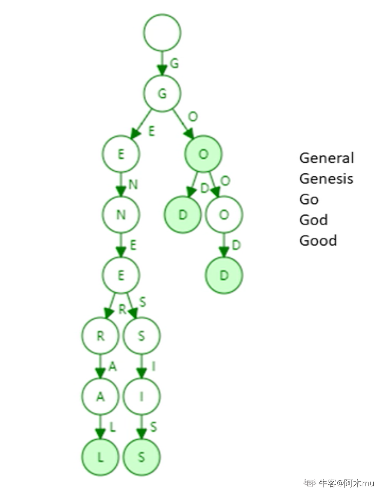

#### 特点：

1. trie中每个节点的分支数目取决于Key值中每个元素的取值范围(图例中最多26个英文字母分叉+一个结束标志位)。
2. trie查找效率取决于key的长度。实际应用中（以太坊地址长度为160byte）。
3. 理论上哈希会出现碰撞，而trie上面不会发生碰撞。
4. 给定输入，无论如何顺序插入，构造的trie都是一样的。
5. 更新操作局部性较好
   那么trie有缺点吗？当然有：
   trie的存储浪费。很多节点只存储一个key，但其“儿子”只有一个，过于浪费。因此，为了解决这一问题，我们引入**Patricia tree/trie**

### Patricia trie(Patricia tree)

`Patricia trie`就是进行了路径压缩的`trie`。如上图例子，进行路径压缩后如下图所示：

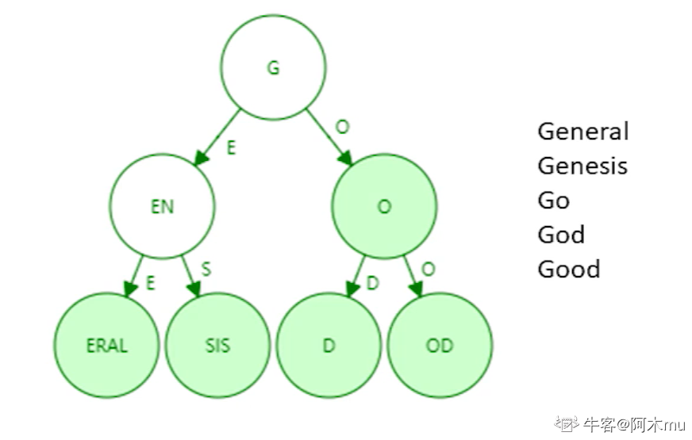

需要注意的是，如果新插入单词，原本压缩的路径可能需要扩展开来。那么，需要考虑什么情况下路径压缩效果较好？树中插入的键值分布较为稀疏的情况下，可见路径压缩效果较好。
在以太坊系统中，160位的地址存在2^160 种，该数实际上已经非常大了，和账户数目相比，可以认为地址这一键值非常稀疏。  
**因此，我们可以在以太坊账户管理种使用Patricia tree这一数据结构！但实际上，在以太坊种使用的并非简单的PT(Patricia tree),而是MPT(Merkle Patricia tree)。** 关于MPT的内容，我们将在下一篇以太坊数据结构篇1——状态树2中进行介绍

## 四、ETH数据结构篇2(状态树2)

`Merkle Tree` 和 `Balance Tree`
区块链和链表的区别在于区块链使用普通指针，链表使用哈希指针。
同样，`Merkle Tree` 相比 `Balance Tree`，也是普通指针换成了哈希指针。

所以，以太坊系统中可如此，将所有账户组织为一个经过路径压缩和排序的Merkle Tree，其根哈希值存储于block header中。

>BTC系统中只有一个交易组成的Merkle Tree，而以太坊中有三个(三棵树)。
也就是说，在以太坊的block header中，存在有三个根哈希值。

根哈希值的用处：

1. 防止篡改。
2. 提供Merkle proof，可以证明账户余额，轻节点可以进行验证。
3. 证明某个发生了交易的账户是否存在

### MPT(`Modified Patricia tree`)

>以太坊中针对MPT(Merkle Patricia tree)进行了修改，我们称其为MPT(Modified Patricia tree)

下图为以太坊中使用的MPT结构示意图。右上角表示四个账户(为直观，显示较少)和其状态(只显示账户余额)。（需要注意这里的指针都是哈希指针）

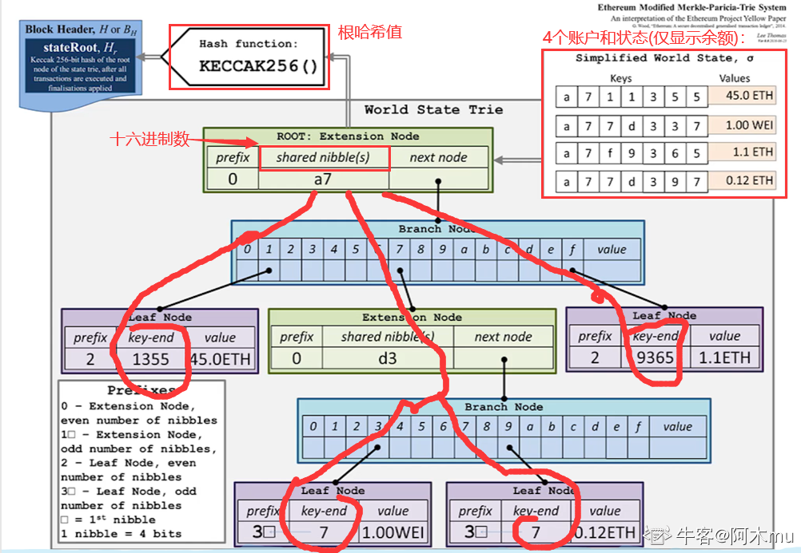

每次发布新区块，状态树中部分节点状态会改变。但改变并非在原地修改，而是新建一些分支，保留原本状态。如下图中，仅仅有新发生改变的节点才需要修改，其他未修改节点直接指向前一个区块中的对应节点。

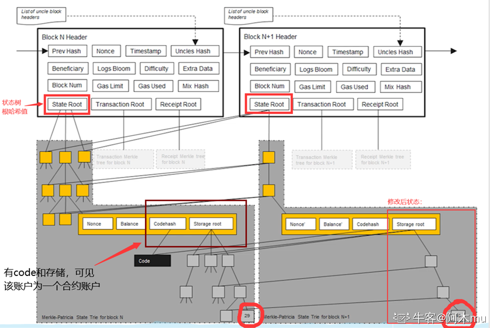

所以，系统中全节点并非维护一棵MPT，而是每次发布新区块都要新建MPT。只不过大部分节点共享。

>为什么要保存原本状态？为何不直接修改？
>为了便于回滚。如下1中产生分叉，而后上面节点胜出，变为2中状态。那么，下面节点中状态的修改便需要进行回滚。因此，需要维护这些历史记录。
> 
>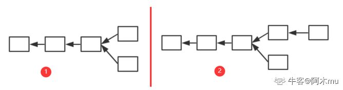
>

### 通过代码看以太坊中的数据结构

1. `block header` 中的数据结构

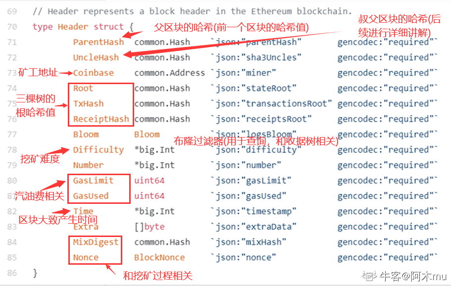

2. 区块结构

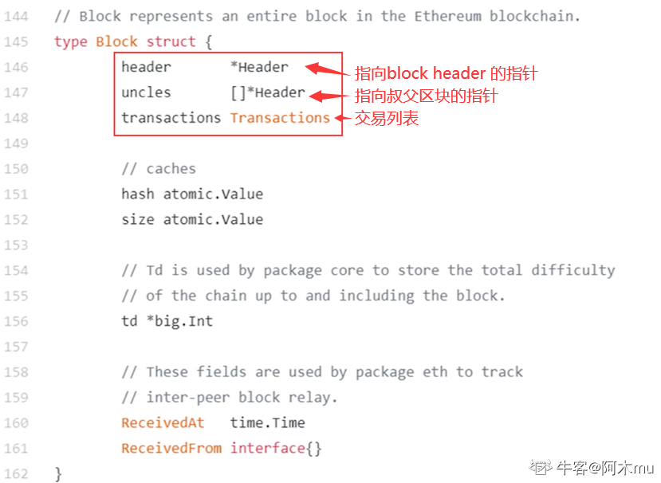

3. 区块在网上真正发布时的信息

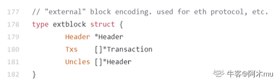

>最后说明
>状态树中保存Key-value对，key就是地址，而value状态通过RLP(`Recursive Length Prefix`，一种进行序列化的方法)编码序列号之后再进行存储。
>

## 五、ETH数据结构篇3(交易树和收据树)

## 交易树和收据树

每次发布一个区块时，区块中的交易会形成一颗Merkle Tree，即交易树。此外，以太坊还添加了一个收据树，每个交易执行完之后形成一个收据，记录交易相关信息。也就是说，交易树和收据树上的节点是一一对应的。
由于以太坊智能合约执行较为复杂，通过增加收据树，便于快速查询执行结果。
交易树和收据树都是M(Merkle)PT，而BTC中都采用普通的MT(Merkle Tree)。（可能就仅仅是为了三棵树代码复用好所以这样设计的）
MPT的好处是支持查找操作，通过键值沿着树进行查找即可。对于状态树，查找键值为账户地址；对于交易树和收据树，查找键值为交易在发布的区块中的序号。

交易树和收据树只将当前区块中的交易组织起来，而状态树将所有账户的状态都包含进去，无论这些账户是否与当前区块中交易有关系。
多个区块状态树共享节点，而交易树和收据树依照区块独立。

交易树和收据树的用途：
  
1. 向轻节点提供Merkle Proof。
2. 更加复杂的查找操作(例如：查找过去十天的交易；过去十天的众筹事件等)

## Bloom filter(布隆过滤器)

支持较为高效查找某个元素是否在某个集合中  
最笨：元素遍历，复杂度为O(n)——轻节点不能用  
方法：给一个大的集合，计算出一个紧凑的“摘要”

>例：如下图，给定一个数据集，其中含义元素a、b、c，通过一个哈希函数H()对其进行计算，将其映射到一个其初始全为0的128位的向量的某个位置，将该位置置为1。将所有元素处理完，就可以得到一个向量，则称该向量为原集合的“摘要”。可见该“摘要”比原集合是要小很多的。
假定想要查询一个元素d是否在集合中，假设H(d)映射到向量中的位置处为0，说明d一定不在集合中；假设H(d)映射到向量中的位置处为1，有可能集合中确实有d，也有可能因为哈希碰撞产生误报。
> 
> 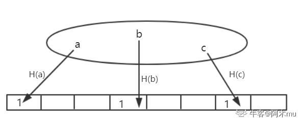
>

`Bloom filter`特点：有可能出现误报，但不会出现漏报。
`Bloom filter`变种：采用一组哈希函数进行向量映射，有效避免哈希碰撞

如果集合中删除元素该怎么操作？
无法操作。也就是说，简单的Bloom filter不支持删除操作。如果想要支持删除操作，需要将记录数不能为0和1，需要修改为一个计数器(需要考虑计数器是否会溢出)。

### 以太坊中`Bloom filter`的作用

每个交易完成后会产生一个收据，收据包含一个`Bloom filter`记录交易类型、地址等信息。在区块`block header`中也包含一个`Bloom filter`，其为该区块中所有交易的`Bloom filter`的一个并集。 

所以，查找时候先查找块头中的`Bloom filter`，如果块头中包含。再查看区块中包含的交易的`Bloom filter`，如果存在，再查看交易进行确认；如果不存在，则说明发生了“碰撞”。

好处是通过`Bloom filter`这样一个结构，快速大量过滤掉大量无关区块，从而提高了查找效率。

### 补充
以太坊的运行过程，可以视为**交易驱动的状态机**，通过执行当前区块中包含的交易，驱动系统从当前状态转移到下一状态。当然，BTC我们也可以视为交易驱动的状态机，其状态为UTXO。
对于给定的当前状态和给定一组交易，可以确定性的转移到下一状态(保证系统一致性)。

#### 问题1：A转账到B，有没有可能收款账户不包含再状态树中？
可能。因为以太坊中账户可以节点自己产生，只有在产生交易时才会被系统知道。

#### 问题2：可否将每个区块中状态树更改为只包含和区块中交易相关的账户状态？(大幅削减状态树大小，且和交易树、收据树保持一致)
不能。首先，这样设计要查找账户状态很不方便，因为不存在某个区块包含所有状态。其次，如果要向一个新创建账户转账，因为需要知道收款账户的状态，才能给其添加金额，但由于其是新创建的账户，所有需要一直找到创世纪块才能知道该账户为新建账户，系统中并未存储，而区块链是不断延长的。

### 代码中具体数据结构

交易树和收据树的创建过程

>根据此大致demo可以看到其创建流程。在肖老师视频中，还有针对bloom filter等具体结构的分析，这里不赘述，感兴趣可以直接观看肖老师视频。代码分析从该视频29：00开始，直接点击本篇最上方链接即可直接到达。
>
> 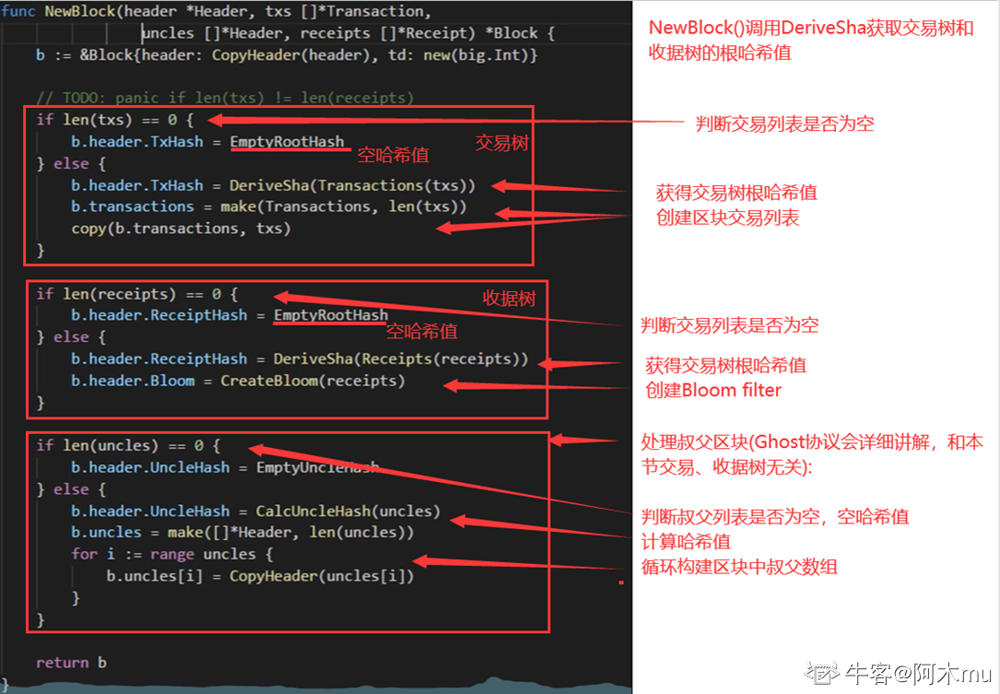
> 

## ETH中GHOST协议篇

BTC系统中出块时间为10min，而以太坊中出块时间被降低到15s左右，虽然有效提高了系统反应时间和吞吐率，却也导致系统临时性分叉变成常态，且分叉数目更多。这对于共识协议来说，就存在很大挑战。在BTC系统中，不在最长合法链上的节点最后都是作废的，但如果在以太坊系统中，如果这样处理，由于系统中经常性会出现分叉，则矿工挖到矿很大可能会被废弃，这会大大降低矿工挖矿积极性。而对于个人矿工来说，和大型矿池相比更是存在天然劣势。
对此，以太坊设计了新的公式协议——**`GHOST协议`**(该协议并非原创，而是对原本就有的`Ghost`协议进行了改进)。

### GHOST协议

#### GHOST协议最初版本

如图，假定以太坊系统存在以下情况，A、B、C、D在四个分支上，最后，随着时间推移B所在链成为最长合法链，因此A、C、D区块都作废，但为了补偿这些区块所属矿工所作的工作，给这些区块一些“补偿”，并称其为"`Uncle Block`"（叔父区块）。
规定E区块在发布时可以将A、C、D叔父区块包含进来，A、C、D叔父区块可以得到出块奖励的7/8，而为了激励E包含叔父区块，规定E每包含一个叔父区块可以额外得到1/32的出块奖励。为了防止E大量包含叔父区块，规定一个区块只能最多包含两个叔父区块，因此E在A、C、D中最多只能包含两个区块作为自己的出块奖励

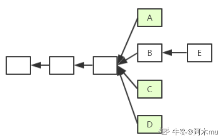

>假定一个矿工挖出了B，此时他沿着其所在链继续挖，而他知道A是和自己“同辈”，则可以将A包含进区块挖矿，若挖矿过程中又听到C也是“同辈”，则可以停止挖矿，将C包含进来重新组织成一个新区块重新挖矿，实际中，由于挖矿过程的`无记忆性`，这样并不会降低成功挖到矿的概率。

#### 最初版本缺陷：

1. 因为叔父区块最多只能包含两个，如图出现3个怎么办？
2. 矿工自私，故意不包含叔父区块，导致叔父区块7/8出块奖励没了，而自己仅仅损失1/32。如果甲、乙两个大型矿池存在竞争关系，那么他们可以采用故意不包含对方的叔父区块，因为这样对自己损失小而对对方损失大。

### Ghost协议新的版本
如下图中1为对上面例子的补充，F为E后面一个新的区块。因为规定E最多只能包含两个叔父区块，所以假定E包含了C和D。此时，F也可以将A认为自己的的叔父区块(实际上并非叔父辈的，而是爷爷辈的)。如果继续往下挖，F后的新区块仍然可以包含B同辈的区块(假定E、F未包含完)。这样，就有效地解决了上面提到的最初Ghost协议版本存在的缺陷。

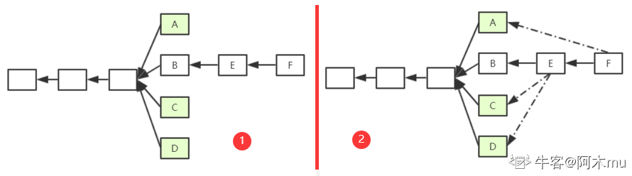

但这样仍然存在一定的问题。
我们将“叔父”这个概念进行了扩展，但问题在于，**“叔父”这一定义隔多少代才好呢？**  
如下图所示，M为该区块链上一个区块，F为其严格意义上的叔父，E为其严格意义上的“爷爷辈”。以太坊中规定，如果M包含F辈区块，则F获得7/8出块奖励；如果M包含E辈区块，则F获得6/8出块奖励，以此类推向前。直到包含A辈区块，A获得2/8出块奖励，再往前的“叔父区块”，对于M来说就不再认可其为M的"叔父"了。  
对于M来说，无论包含哪个辈分的“叔父”，得到的出块奖励都是1/32出块奖励。  
也就是说，叔父区块的定义是和当前区块在七代之内有共同祖先才可（合法的叔父只有6辈）。  

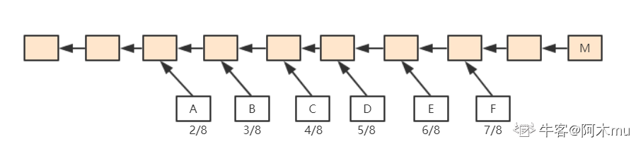

这样，就方便了全节点进行记录，此外，也从协议上鼓励一旦出现分叉马上进行合并。

### 以太坊中的奖励：

- BTC：静态奖励(出块奖励)+动态奖励(交易费，占据比例很小)  
- ETH：静态奖励(出块奖励+包含叔父区块的奖励)+动态奖励(汽油费，占据比例很小，叔父区块没有)
- BTC中为了人为制造稀缺性，比特币每隔一段时间出块奖励会降低，最终当出块奖励趋于0后会主要依赖于交易费运作。而以太坊中并没有人为规定每隔一段时间降低出块奖励。

以太坊中包含了叔父区块，要不要包含叔父区块中的交易？  
不应该，叔父区块和同辈的主链上区块有可能包含有冲突的交易。而且我们前文也提到，叔父区块是没有动态奖励的。因此，一个节点在收到一个叔父区块的时候，只检查区块合法性而不检查其中交易的合法性。  

当然，对于分叉后的堂哥区块怎么办？例如下图所示，A->F该链并非一个最长合法链，所以B->F这些区块怎么办？该给挖矿补偿吗？
如果规定将下面整条链作为一个整体，给予出块奖励，这一定程度上鼓励了分叉攻击(降低了分叉攻击的成本，因为即使攻击失败也有奖励获得)。因此，ETH系统中规定，只认可A区块为叔父区块，给予其补偿，而其后的区块全部作废。

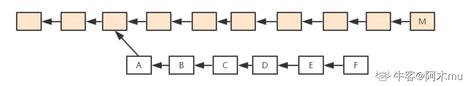

#### 以太坊真实数据

> [Etherscan网站](https://cn.etherscan.com/)

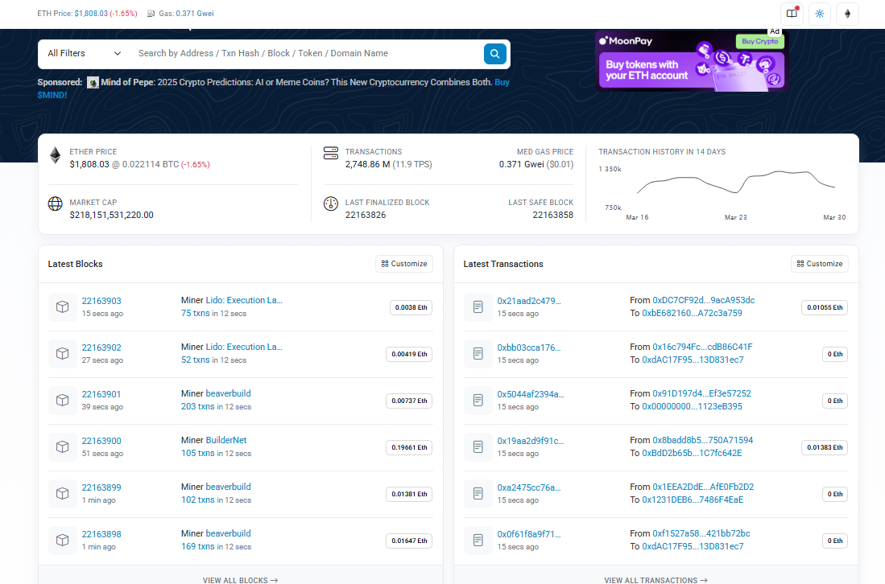

## ETH挖矿难度调整篇

::: info 概述

在之前的BTC篇中，介绍了比特币系统中使用的挖矿算法。挖矿这一过程，虽然并没有创造什么实际价值，但挖矿本身维持了比特币系统的稳定。总体来说，比特币系统中的挖矿算法较为成功，并未发现大的漏洞。   
当然，比特币系统的挖矿算法也存在一定问题，其中最为突出的就是导致了挖矿设备的专业化，普通计算机用户难以参与进去，导致了挖矿中心化的局面产生，而这与“去中心化”这一理念相违背。   
因此，在比特币之后包括以太坊在内的许多加密货币针对该缺陷进行改进，希图做到ASIC Resistance(抗拒AAIC专用矿机)。由于ASIC芯片相对普通计算机来说，算力强但访问内存性能差距不大，因此常用的方法为Memory Hard Mining Puzzle，即增加对内存访问的需求。

:::

### `LiteCoin`(莱特币)

>莱特币中国官网：[https://litecoin.org/cn/](https://litecoin.org/cn/)

莱特币曾一度成为市值仅次于比特币的第二大货币。其基本设计大体上和比特币一致，但针对挖矿算法进行了修改。     
莱特币的`puzzle`基于`Scrypt`。`Scrypt`为一个对内存性能要求较高的哈希函数，之前多用于计算机安全密码学领域。  

#### 莱特币挖矿算法基本思想

1. 设置一个很大的数组，按照顺序填充伪随机数。

> 因为哈希函数的输出我们并不能提前预料，所以看上去就像是一大堆随机的数据，因此称其为“伪随机数”。

`Seed`为种子节点，通过Seed进行一些运算获得第一个数，之后每个数字都是通过前一个位置的值取哈希得到的。
可以看到，这样的数组中取值存在前后依赖关系

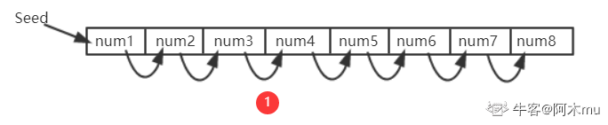

2. 在需要求解`Puzzl`e的时候，按照伪随机顺序，从数组中读取一些数，每次读取位置与前一个数相关。例如：第一次，从A位置读取其中数据，根据A中数据计算获得下一次读取位置B；第二次,从B位置读取其中数据，根据B中数据计算获得下一次读取位置C；

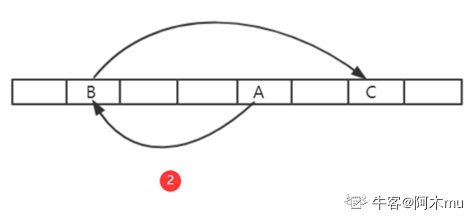
